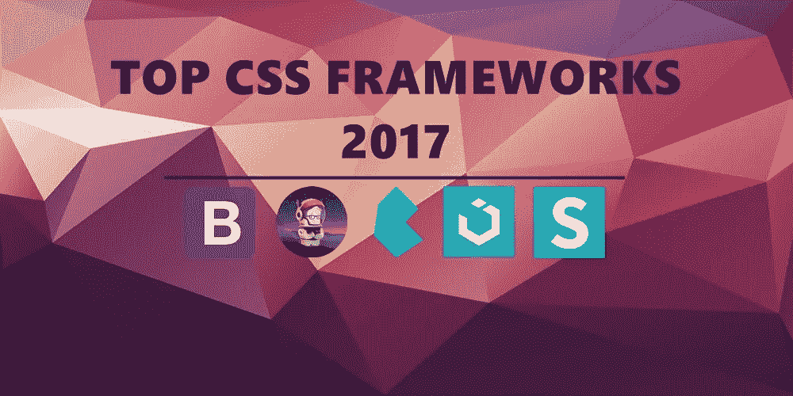
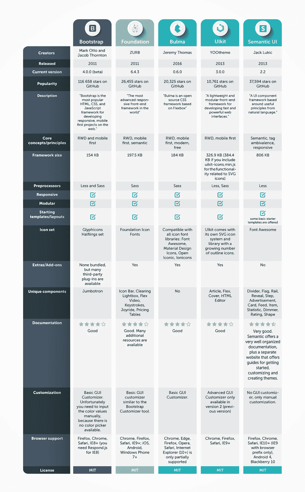

# 2017 年你应该关注的最受欢迎的 5 大 CSS 框架

> 原文：<https://medium.com/hackernoon/top-5-most-popular-css-frameworks-that-you-should-pay-attention-to-in-2017-344a8b67fba1>

CSS 框架现在越来越受欢迎，老实说，很难想象一个网站不使用它们。作为所有的开发工具，CSS 框架处于不断发展和改进的状态，因此我们强烈建议关注现代趋势。为了让你更容易，我们列出了 2017 年最受欢迎的 5 个 CSS 框架，你可能想部署它们(如果你还没有使用它们)。

# 引导程序

这个框架是 GitHub 的明星之一，被认为是响应最好的 CSS 框架。专门为前端开发设计，有助于构建网页设计概念、移动优先项目、网格系统、排版、按钮等。

[**Bootstrap**](http://getbootstrap.com/) 没有任何额外的功能，但有第三方插件可用，除了常规的 HTML 元素，Bootstrap 还有其他常见的 UI 元素。其核心原则是 RWD 和移动优先。

Bootstrap 3 版本支持各种浏览器(它们的最新版本),从 Bootstrap 2 开始，该框架支持响应式 web 设计。Bootstrap 4 版本目前正在开发中。

**结论:** Bootstrap 非常流行，但它可能并不比其他框架更好。然而，大多数人使用它是因为它的流行，也因为如此，有很多可用的资源(比如教程，额外的插件等等)。)这使得使用 Bootstrap 更加容易。

# 基础

[**Foundation**](https://foundation.zurb.com/) 是一个开源项目，也是 CSS 框架世界中另一个非常强大的参与者。它以令人难以置信的流畅和响应速度而闻名，可以用于许多目的:建立网站，创建电子邮件模板，构建移动和网络应用程序。

这个框架也非常方便用户，因为它提供培训、支持和咨询。它有一些独特的组成部分(按键，游乐设施，灵活的视频等)。)和一些附加组件。它的核心原则，除了 RWD 和移动优先，还包括语义。

**结论:** Foundation 以完善的工作流程和对开发者的大力支持自称。这是一个非常专业的框架，有很多可用的教程，你将能够很快学会基础。

# 布尔玛

这个开源和免费的框架在节省你的时间和精力方面是非常棒的，而且它最近越来越受欢迎，因为它非常容易学习和使用。

首先，**包含了很棒的 UI 组件，像标签、导航条、框、面板等等，因为这个框架旨在为你提供清晰而有吸引力的 UI。其次，布尔玛是难以置信的模块化，这意味着你可以只导入那些需要的功能，然后就可以开始工作了。最后，这个框架有可读性很强的类，这对于一些开发人员来说也是一个巨大的优势。**

****结论:**布尔玛易于理解和简单使用，同时它拥有所有必要的功能来帮助您创建伟大和高效的产品。**

# **乌尔基特**

**知道(和使用)这个框架的人不多，但是它和其他类似的框架有着相同的功能，绝对应该引起注意。**

**这个框架是轻量级和模块化的，用于创建快速而强大的 web 界面。Ulkit 基本上是一个易于定制的组件集合，它有 HTML 编辑器、Flex 和其他插件以及独特的组件。它的核心原则是 RWD 和移动优先，Ulkit 在很多 Wordpress 主题中被广泛使用。**

**CSS 框架现在越来越受欢迎，老实说，很难想象一个网站不使用它们。作为所有的开发工具，CSS 框架处于不断发展和改进的状态，因此我们强烈建议关注现代趋势。为了让你更容易，我们列出了 2017 年最受欢迎的 5 个 CSS 框架，你可能想部署它们(如果你还没有使用它们)。**

# **语义用户界面**

**从名字就可以猜到， [**语义 UI**](https://semantic-ui.com/) 旨在让建站过程更加语义化。它的核心特点是利用自然语言原则，从而使代码更具可读性和更容易理解。**

**其核心原则是标签模糊性、语义性和响应性。这个框架将单词和类视为可交换的组件，并以直观的 JS 和简单的调试脱颖而出。**

**语义 UI 的另一个好处是它提供了组织良好的文档和一个网站，上面有如何开始的指南。简而言之，它有 3000 多个主题变量、50 多个 UI 组件和 5000 多个提交。绝对值得一试。**

****结论:**对于那些想要创建漂亮且响应迅速的网站的人来说是个不错的选择。**

# **包装它**

****

**这是我们认为值得使用和尝试的前 5 个 CSS 框架。如果你已经尝试过，或者想提出一些新的建议，请发表评论，并随时关注 DashBouquet 新闻。**

**[*安东·沙列尼科夫*写的](https://www.linkedin.com/in/anton-shaleynikov-45812a1/)**

***想了解更多信息？* [*查看此处*](https://dashbouquet.com/blog)**