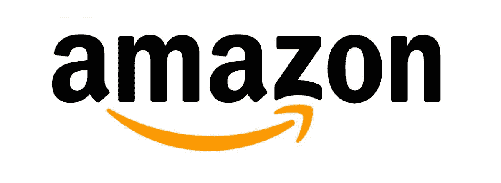
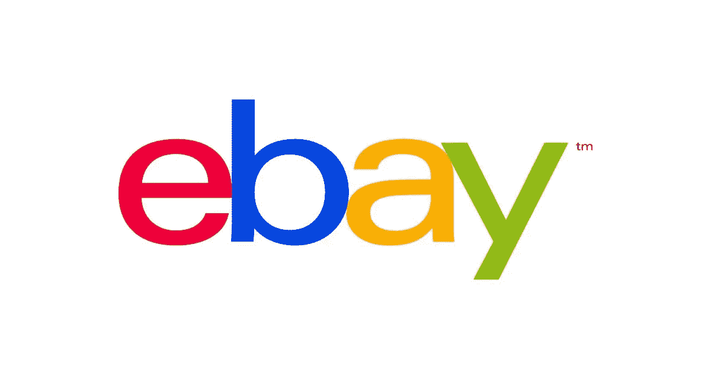
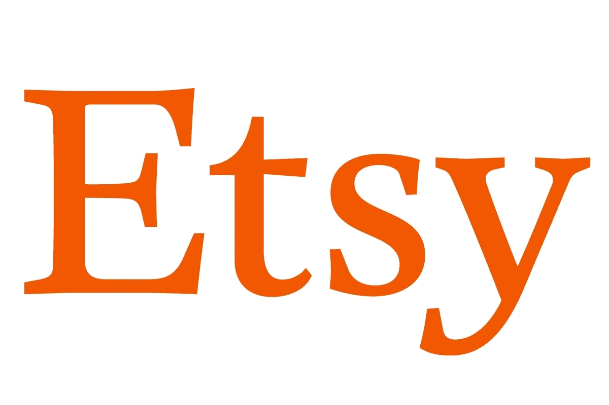

# 五大最受欢迎的在线市场。如何加入欧冠？

> 原文：<https://medium.com/hackernoon/top-5-most-popular-online-marketplaces-how-to-join-the-champions-league-a313dbdfd338>

互联网无疑改变了我们经营企业的方式。如今，在线市场为批发商、零售商和创新爱好者提供了一个全新的机会和标准世界。采取正确的步骤，这些可以成为一个繁荣的商业企业的商人，提供他们的产品销售。电子商务平台让较小的供应商在竞争激烈的零售领域展开竞争，并为较大的卖家提供了一种简单的方式来利用市场平台的众多优势。

eMarketer 估计，2020 年全球零售额将达到 27.7 万亿美元，即使未来几年的年增长率将会放缓。在此期间，亚太地区的销售额预计将翻一番，到 2020 年达到 2.725 万亿美元，仍然是最大的零售电子商务市场(产品和服务市场)。北美仍将是仅次于中国的第二大区域电子商务市场，并在未来几年经历持续的双价值增长，这是由于当前的数字买家、新细分市场的覆盖范围以及移动商务销售额的增长。

发展顶级在线市场的一般关键是:高质量的供应商吸引更多的客户，而不断增长的客户群吸引更多的供应商。然而，如何进入这个循环流的内部呢？成为最好的网上销售市场有什么规则吗？—嗯，其实是有的。

# 热门在线市场的 5 条规则:

1.  **垂直市场往往增长更快**。横向零售平台内部竞争激烈，需要复杂的方法。例如，易贝努力在众多较小的市场领域平衡供需。而优步或 Lyft 的用户访问它们只有一个简单的原因——找个顺风车。
2.  **在国际扩张之前在本地发展**。如今，像脸书、Instagram、Twitter 和其他社交媒体应用程序允许企业使用定向广告和地理标记帖子来推动有效的早期增长。这种方法也可以用来验证你的创业想法。
3.  治疗有助于做出更好的决定。利用数据电子商务企业主可以协调客户的供应，并保证双方更好的质量。策划平台确保供应商设定合理的价格，而消费者从高质量的商家购买。
4.  **想到影子小生**。市场规模不如其潜力重要。不要只考虑显而易见的市场领域，也要考虑其附近的影子市场。例如，Rover.com 是一个狗保姆市场，它将狗父母和当地的宠物保姆联系起来。只有十分之一的狗主人使用狗舍，所以罗孚指的是剩下的九个(潜在)用户。
5.  **成功不应该是终点**。随着你的在线业务开始扩大规模，除了收入增长之外，你还应该受益于提高市场门槛的新机会。像 Etsy 这样的电子商务平台为卖家提供额外的服务，因此有机会每年增加 10%的毛利率。除了经济利益之外，这种方法提高了卖家的忠诚度，增加了公司之间的锁定。

# 五大最受欢迎的在线市场:

## 亚马孙

如今，关于市场的文章/书籍/笔记都不能不提到[亚马逊](https://www.amazon.com/)。今天，它是美国最大的在线市场，销售各种商品，包括食品、玩具、书籍、电子产品、艺术品等等。然而，它走得更远，目前它提供云基础设施服务( [AWS](https://da-14.com/blog/aws-vs-heroku-cloud-platform-comparison) )、软件、分析服务(Alexa)、数字内容和多媒体产品。

亚马逊最初是一家网上书店，现已发展成为一家拥有数十亿资产的公司，在北美、欧洲和亚洲拥有 11 个全球市场。它拥有来自 180 个国家的庞大客户数据库。

**它是如何工作的？**

亚马逊是全球卖家最好的在线市场之一。第三方供应商添加产品，然后将这些产品包含在站点清单中。一旦消费者决定购买，供应商就有责任履行订单。

**是什么让它鹤立鸡群？**

*   可能是最大和最丰富的产品选择；
*   用户友好的设计，智能搜索系统，和方便的过滤器；
*   星级综合评审制度；
*   基于消费者的购物和浏览历史，向消费者提供个性化的报价和推荐；
*   各种免费送货和其他好处的客户忠诚度计划。

## 通过易趣网购买

易贝是网上购物的先驱和推动者之一。目前，它在 190 个市场拥有 1.67 亿活跃买家，因此我们毫不怀疑它是“全世界购物、销售和赠送的地方”。这家全球性企业包括拍卖和零售网站，并在全球 30 多个国家拥有本地市场。

除了 eBay.com，该公司还包括其他商业品牌，如帮助用户在当地社区找到所需物品的易贝分类广告集团，以及全球最大的在线票务平台 StubHub。

它是如何工作的？

销售周期类似于亚马逊。您可以创建列表、编写描述、添加照片、选择类别、提供送货选项等等。该公司为卖家提供有用的提示和工具，比如拼写检查或自动回复。

**是什么让它鹤立鸡群？**

*   由大企业和小企业提供的大量可供销售的商品和服务；
*   广泛的支付选择；
*   全面的教程和提示；
*   各种运输选项(免费/固定费用/计算)。

## Etsy

成立于 2005 年的 [Etsy](https://www.etsy.com/) 是最受欢迎的电子商务网站之一。它专注于手工制作、新奇和复古的物品，从珠宝和服装到玩具和艺术品。目前，其数据库由 4500 万待售商品、170 多万活跃卖家和 2860 万活跃买家组成。

它是如何工作的？

创建一个帐户是免费的，没有绑定的每月付款。像亚马逊或易贝一样，Etsy 对每件列出的商品收取刊登费(0.2 美元)，对销售额收取 3.5%的费用。其卖方的服务包括广告平台、折扣运输标签和支付处理。

**是什么让它鹤立鸡群？**

*   大型列表包括独特的手工制品、难以找到的物品和复古商品；
*   基于买家浏览/购物历史的精选推荐和个性化电子邮件通知；
*   从 Etsy 商家离线购物的精品店和跳蚤市场列表；
*   全面易用的导航系统，带有详细的搜索系统；
*   供应商的促销和营销工具，包括谷歌分析和脸书整合；
*   强大的 Etsy 社区。

## 富矿带

[Bonanza](http://www.bonanza.com/) 于 2007 年推出，并于 2012 年被 About.com 收藏品公司评为“最佳在线销售场所”，2013 年被 eCommerceBytes 评为“最佳易用性”，2014 年被 eCommerceBytes 评为“最佳市场”，2015 年被 Best in Biz Awards 评为“年度公司”，2016 年被 eCommerceBytes 评为“最受推荐的市场”。去年《企业家》杂志将其命名为“美国最佳创业公司”。

这个以卖家为中心的平台通过简单快捷地创建网上商店为小企业和企业家提供了良好的机会。它专注于购买和销售新的和二手的衣服，配饰，珠宝，家居和花园用品，艺术品，收藏品和古董。

**它是如何工作的？**

用户可以免费创建 Bonanza 账户，也可以使用脸书和谷歌登录。创建列表和上传照片是免费的。卖家边卖边付，最终出价(FOV)从 3.5%开始。

是什么让它脱颖而出？

*   与亚马逊或易贝相比，永不过期的免费列表和更低的费用；
*   自动亚马逊/易贝/ Etsy / Shopify / CSV 导入或同步；
*   方便的批处理编辑器，用于编辑项目组；
*   发起客户营销活动的工具；
*   该平台负责广告，每一个房源都直接发布到 Bing、Google、Nextag、Pricegrabber 和其他受欢迎的买家渠道；
*   高评级的客户服务和可定制的集成聊天功能。

## Rover.com

Rover.com 是一家总部位于西雅图的市场，目前在美国 10，000 多个城市提供服务。2014 年，其首席执行官 Aaron Easterly 获得了安永太平洋西北地区“新兴公司”类别的年度青年企业家奖。目前，罗孚的账户总数超过 85，000。

服务清单包括狗寄宿/坐/走，日托，顺便访问，看家。除此之外，该公司还提供保费保险、24/7 支持、背景调查、持续教育、照片更新、兽医咨询和安全的在线支付。

**它是如何工作的？**

养狗者的账户是免费的，而宠物保姆和遛狗者需要支付背景调查费(从 10 美元到 35 美元不等)。业主需支付高达预订总额 5-7%的服务费。而坐者和步行者从每次预订中获得约 75-85%的收入。

是什么让它脱颖而出？

*   连接宠物父母和爱狗人士；
*   美国最大的遛狗者和宠物保姆社区；
*   Android 和 iOS 应用程序可以分享任何更新，如行走总结、照片样张和其他细节；
*   车主和坐者/步行者的保费保险；
*   正在进行的保姆教育；
*   对每个遛狗者/保姆进行一般背景调查；
*   验证审查系统。

# 建立一个市场:需要考虑什么？

在线电子商务网站为初创企业和老牌企业提供了一个扩大业务范围、接触更多本地和国际买家的机会。而买家选择市场的原因有很多，比如更多的产品和服务选择，简单的商品比较，在购买任何东西之前阅读评论和进行研究的能力。

为了开发最好的在线市场，应该考虑以下**主要问题**:

*   先有鸡还是先有蛋的问题:吸引供应商吸引消费者
*   对买卖双方都友好的用户界面
*   安全可靠:合理的价格，负责任的商家，安全的[交易软件](https://da-14.com/blog/stripe-vs-braintree-which-best-solution-your-startup)
*   营销和强大的社区支持

要创建一个网上市场，你应该从利基市场开始。寻找独特的想法和未被发现的影子部门。不要克隆别人，要创新，在独特的想法上投入时间和精力。一个主要的错误是，大多数创业公司过于专注于建立和推出他们的电子商务应用程序，因此他们未能制定营销战略并为此节省预算。结果，这将未来的商业成功置于威胁之下。营销是在线市场开发成本的很大一部分，它包括在线/离线广告，搜索引擎优化，媒体报道，点击付费，社交媒体营销(SMM)，内容营销等等。

> [黑客中午](http://bit.ly/Hackernoon)是黑客如何开始他们的下午。我们是 [@AMI](http://bit.ly/atAMIatAMI) 家庭的一员。我们现在[接受投稿](http://bit.ly/hackernoonsubmission)并乐意[讨论广告&赞助](mailto:partners@amipublications.com)机会。
> 
> 如果你喜欢这个故事，我们推荐你阅读我们的[最新科技故事](http://bit.ly/hackernoonlatestt)和[趋势科技故事](https://hackernoon.com/trending)。直到下一次，不要把世界的现实想当然！

