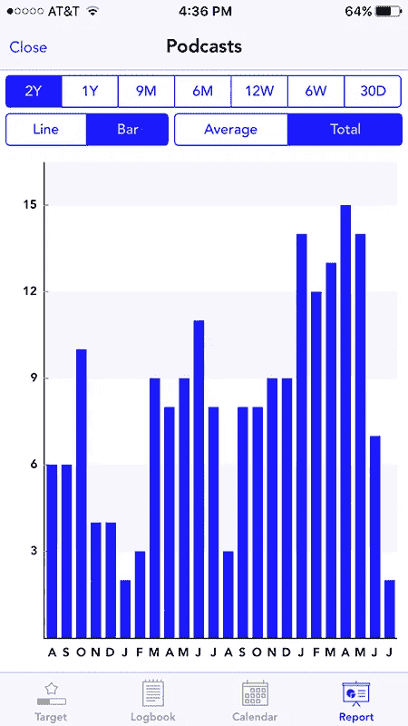
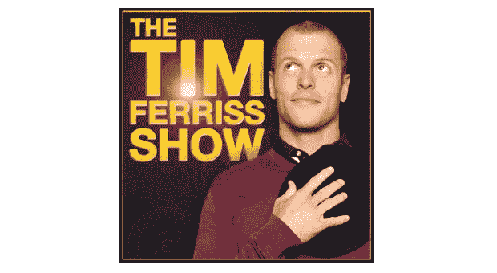
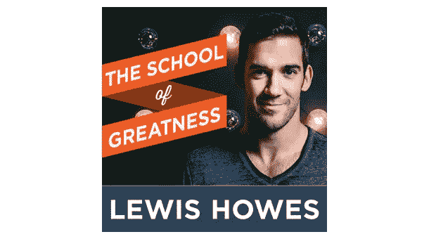
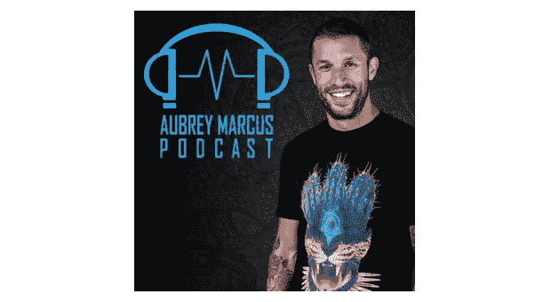
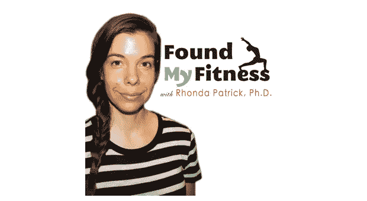
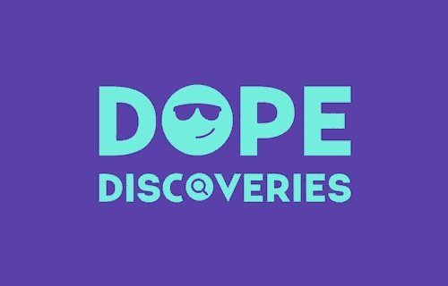

# 五大拓展思维的播客

> 原文：<https://medium.com/hackernoon/top-5-podcasts-to-expand-your-mind-dea1f7cfdc30>

## 在过去的两年里，我听了 198 集播客。以下是我的最爱。

播客与有声读物非常相似，但可能更有趣、更有效。播客是非常有价值的学习渠道，我最喜欢的通常是非正式的采访形式。我喜欢听节目主持人和他/她的嘉宾之间的随意对话。你与“作者”(节目嘉宾)的个人联系比你从有声读物中得到的更深。

当你让双方(主人和客人)在闲暇时进行对话，谈论他们真正热衷的想法和事情，就更容易处理、理解和联系这些想法和事情。我也喜欢播客如何通过介绍客人、闲聊和先浏览客人的简历来让你轻松进入更沉重的话题，这通常是一个轻松背景下的简短自传。一个好的节目主持人也会确保他们的嘉宾用简单的语言解释复杂或不熟悉的想法。

那么我是怎么听了这么多播客的呢？我喜欢在做“平凡”的工作时倾听，比如遛狗、做饭和开车。以下是我最喜欢的节目推荐——请欣赏！

Tracked my progress with [Daily Tracker](https://itunes.apple.com/us/app/daily-tracker-ultimate-habit/id673498415?mt=8)

# **乔·罗根的经历(JRE)**

你可能知道乔是终极格斗锦标赛的评论员/采访者，或者是《T2 恐惧因素》的主持人。你可能知道他是一个喜剧演员，或者你可能根本不认识他，这是一种遗憾，但也是一种祝福。为什么？因为你错过了数百集超级有趣的嘉宾。每一集都是三个小时的非正式谈话，不仅会让你觉得更聪明，还会让你开怀大笑。很多。但是你很幸运，[所有的剧集仍然可以免费获得](http://podcasts.joerogan.net/)。可以听音频版，也可以看视频播客。当乔和他的客人谈论你想亲眼看到的图片、视频或实物时，你应该看看视频版本。

乔才华横溢，聪明风趣，但他一点也不在乎。他是世界上最谦逊、最开明的人之一。乔什么都他妈的实话实说。他给出了他对许多有趣的复杂主题的想法，并与来自各行各业的迷人人士进行了非常有趣的交谈。乔是最棒的。我是你的超级粉丝。他也有这种惊人的能量，我喜欢以此为食。总是积极尝试新事物，走出他的舒适区，努力工作，并且总是保持轻松，从不把生活看得太重。乔知道如何享受旅程。

## 《乔·罗根的经历》中的 5 集精彩片段(来自节目笔记的描述):

**——美国前职业公路自行车赛选手，7 次环法冠军。**

**[**山姆·哈里斯**](http://podcasts.joerogan.net/podcasts/sam-harris-4)——神经科学家，也是《纽约时报》畅销书《信仰的终结》、《给一个基督教国家的信》和《道德景观》的作者。他的播客名为“醒来”，可在 iTunes & Stitcher 上获得。**

**[**丹·比尔泽里安**](http://podcasts.joerogan.net/podcasts/dan-bilzerian) —社交媒体名人和职业扑克玩家**

**[**卡梅隆·哈内斯**](http://podcasts.joerogan.net/podcasts/cameron-hanes-3)——一名弓猎运动员，“每天都在强化训练，以成为终极掠食者。”**

**[**Chris Kresser**](http://podcasts.joerogan.net/podcasts/chris-kresser)——专门从事调查医学的健康侦探、博客作者、播客作者、教师和旧石器饮食和生活方式爱好者。**

# **蒂姆·费里斯秀**

****

**蒂姆·菲利斯被称为“数字时代的印第安纳·琼斯”他是作家、企业家、天使投资人/顾问、公共演说家等等。他写了许多自助书籍，包括《每周 4 小时工作制》。杰米·福克斯说他成了“音频的奥普拉”，纽约时报称他为:**

> **"杰克·韦尔奇和一个和尚的混合体."**

**蒂姆的播客专注于解构世界级的表演者，他采访了地球上最有趣的人。Tim 不仅在许多层面上非常聪明有趣，而且有一种独特的天赋，可以将复杂的想法简化为可消化和可操作的任务，并通过提出与众不同的问题来提取隐藏的宝石。**

## **蒂姆·费里斯秀的 5 集精彩片段:**

**[**杰米·福克斯谈锻炼的常规、成功的习惯，以及说不尽的好莱坞故事**](http://fourhourworkweek.com/2015/12/06/jamie-foxx/)**

**[**【施瓦辛格论心理战】**](http://fourhourworkweek.com/2015/02/02/arnold-schwarzenegger/)**

**[**托尼·罗宾斯上午套路，巅峰表现，掌握金钱**](http://fourhourworkweek.com/2014/10/15/money-master-the-game/)**

**[**专访《连线》杂志联合创始人凯文·凯利，博学，世界上最有趣的人？**](http://fourhourworkweek.com/2014/08/29/kevin-kelly/)**

# ****刘易斯·霍维斯的伟大学派****

****

**路易斯·霍维斯是一名前职业足球运动员，后成为企业家。刘易斯大概是从哪里冒出来的，他成为一名白手起家的企业家，靠的是热情、学习和取得成功的决心。今天，他是《纽约时报》畅销书作家、天使投资人、作家等等。**

**我第一次知道路易斯是在他的播客上，他主持了我的神奇交叉体操教练卡尔·保利 T21。我认为刘易斯通过采访运动员和健身行业的有趣人士开始了他的播客，但随着他变得越来越大，越来越好，成为一台营销机器，他吸引了来自各个行业的客人。我最喜欢刘易斯的是他不懈的努力、激情和感激。他对生活中许多方面的感激一次又一次地激励着我，他的态度很有感染力。**

## **伟大学校播客中的 5 个精彩片段:**

**[**罗布·戴克:从小镇滑板手到媒体大亨帝国**](http://lewishowes.com/podcast/rob-dyrdek/)**

**[**阿兰妮斯·莫利塞特在成名、寻找目标和治愈情感上**](http://lewishowes.com/podcast/alanis-morissette/)**

**[**特拉维斯·帕斯特拉纳以无畏的心态去追求你的激情**](http://lewishowes.com/podcast/travis-pastrana/)**

**[**萨拉·布雷克里:斯潘克斯首席执行官写下你的十亿美元故事**](http://lewishowes.com/podcast/sara-blakely/)**

**[**呼吸的力量让莱尔德·汉密尔顿**](http://lewishowes.com/podcast/laird-hamilton/) 进入状态**

# **奥布里·马库斯播客**

****

**[奥布里·马库斯](https://medium.com/u/25bdf586748c?source=post_page-----dea1f7cfdc30--------------------------------)是 [Onnit](https://www.onnit.com/) 的首席执行官，Onnit 是一家结合了尖端科学、地球生长的营养物质以及顶级运动员和医疗专业人士久经考验的策略的公司，旨在提供补充剂、食物和健身设备，帮助人们实现新水平的福祉和全面的人类优化。奥布里也很有灵性，经常谈论迷幻药，尤其是死藤水。**

> **奥布里的播客是关于将平衡带回一个日益两极分化的世界的想法，以及将部落意识带回一个越来越唯我主义的民族。他的播客忠实于这个概念，将幽默与严肃、轻佻与深度融为一体，我们探索了思维、迷幻、体育、MMA 和性的领域。— [装订机](http://www.stitcher.com/podcast/warrior-poet-project/warriorpoetus)**

**我喜欢奥布里的是他寻找生活真相的独特态度。奥布里是一个现代的野蛮人，他不惧怕任何东西，有勇气真正跳出框框思考，一次又一次地走出自己的舒适区，去寻找大自然母亲隐藏的真理。奥布里定义了自己的生活方式和伦理，而没有对现状给予太多的重视。他是最有趣的思想家之一，将古代哲学与最先进的技术相结合。**

## **Aubrey Marcus 播客中的 5 个精彩片段:**

**[**特别节目:音乐大师汉密尔顿·沙无然——播客+仪式现场录音**](https://www.aubreymarcus.com/special-podcast-live-recording-from-ceremony-with-maestro-hamilton-souther/)**

**[**与惠特尼·米勒一起走非常规道路**](https://www.aubreymarcus.com/walking-the-unconventional-path-with-whitney-miller/)**

**[**转抗为援与瑞安过节**](https://www.aubreymarcus.com/turning-resistance-to-assistance-with-ryan-holiday/)**

**[**科里艾伦**](https://www.aubreymarcus.com/cory-allen-4/)**

**[T5【丹英格博士】T6](https://www.aubreymarcus.com/dr-dan-engle/)**

# **朗达·帕特里克的《发现我的美丽》**

****

**朗达是一个来自湾区的超级有趣的医生。她因对衰老、癌症和营养的广泛研究而闻名。**

> **她经常与公众讨论一些话题，包括微量营养素缺乏在衰老疾病中的作用，遗传学在确定营养素对一个人健康状况的影响中的作用，将身体暴露于激素应激源的好处，如通过锻炼，禁食，桑拿浴或热应激，或各种形式的冷暴露，以及正念，减压和睡眠的重要性。— [FoundMyFitness](https://www.foundmyfitness.com/about-dr-rhonda-patrick)**

**我喜欢朗达的一点是，她将癌症、衰老、营养和遗传等复杂的医学状况分解给好奇的日常人。她的播客技术性更强，比其他播客更需要关注。我有时不得不停下来，用谷歌搜索她谈论的某些术语，以便跟上对话。如果你想更好地了解你的身体是如何工作的，你应该做什么来保持良好的健康，以及当你得到身体测试结果时你应该寻找什么，她的播客真是太棒了。**

**我是通过上面提到的其他播客发现朗达的。她是《乔·罗根体验》的嘉宾，也是《蒂姆·费里斯秀》的嘉宾。一定要检查这些！**

## **FoundMyFitness 的 5 个精彩片段:**

**[**冷冻疗法如何影响大脑、免疫系统、新陈代谢和运动表现**](https://itunes.apple.com/us/podcast/how-cryotherapy-affects-brain/id818198322?i=1000362813680&mt=2)**

**[**桑拿房的使用和建立抗压能力与朗达·帕特里克博士**](https://itunes.apple.com/us/podcast/sauna-use-building-resilience/id818198322?i=1000351949635&mt=2)**

**[**皮尔·卡佩尔博士论心灵的力量&维姆·霍夫的科学**](https://itunes.apple.com/us/podcast/dr.-pierre-capel-on-power/id818198322?i=1000356562914&mt=2)**

**[**达雅博士和凯文·罗斯谈论冥想静修、饮食、时令饮食等等**](https://itunes.apple.com/us/podcast/dr.-darya-kevin-rose-talk/id818198322?i=1000359601540&mt=2)**

**[**彼得·阿提亚医学博士关于长寿的宏量营养素阈值&的表现，癌症&更**](https://itunes.apple.com/us/podcast/peter-attia-m.d.-on-macronutrient/id818198322?i=1000364712026&mt=2)**

**我希望这篇文章对你有用！如果有，请推荐:)**

**我还在尝试一份名为 [**毒品发现**](http://yonishechter.com/dd.html) 的月刊。在下面报名获取将于 2016 年 12 月 1 日发布的第一期。**

**对于每日推荐，请查看 [Dope 播客](https://dopepodcasts.com)。**

**为了便于阅读，详细的表演笔记，请查看[播客分类](https://podcastbreakdown.com)。**

****************

> **黑客中午是黑客如何开始他们的下午。我们是这个家庭的一员。我们现在[接受投稿](http://bit.ly/hackernoonsubmission)并乐意[讨论广告&赞助](mailto:partners@amipublications.com)机会。**
> 
> **如果你喜欢这个故事，我们推荐你阅读我们的[最新科技故事](http://bit.ly/hackernoonlatestt)和[趋势科技故事](https://hackernoon.com/trending)。直到下一次，不要把世界的现实想当然！**

****