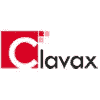
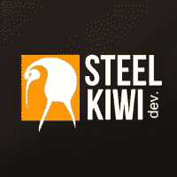
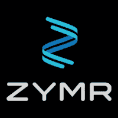

# Top 5 反应。全球 JS 开发公司

> 原文：<https://medium.com/hackernoon/top-5-react-js-development-companies-globally-aa8325c6145f>

[做出反应。JS](https://hackernoon.com/tagged/react-js) 是一个新的 [javascript](https://hackernoon.com/tagged/javascript) 开发框架，它简化了网站的内容维护和数据管理。根据 statista 的说法，做出反应。JS 为互联网上 45%的网站提供支持。许多大品牌，如网飞、脸书、Instagram 等。由 React 提供支持。JS 开发框架。另外，做出反应。借助世界一流的 HTML 网站，JS 可以用来创建动态网站。如今许多企业都想雇佣 React。JS 开发公司，因为这个框架主要用于开发新的网站。

在本帖中，我们将讨论 5 大反应。全球 JS 开发公司。我们根据各种因素列出了这些公司，如关键词分析工具、第三方网站、客户满意度、Glassdoor 评级、员工满意度、公司组合等等。

*   [**Clavax 科技**](http://www.clavax.com/)

Clavax Technologies 成立于 2011 年，以向客户和企业提供最先进的软件而闻名。他们使用最先进的技术来了解各种业务领域，拥有 160 多个客户，成功交付了 500 多个项目。

**公司规模**:100-250 名员工

**行业信息** : Web 和移动应用开发

**网站**:[http://www.clavax.com/](http://www.clavax.com/)

*   [**像素蜡笔**](http://www.pixelcrayons.com/)

PixelCrayons 成立于 2004 年。React 在 12 多个国家拥有 30 多个客户。JS 开发。而且，他们经历过反应。JS 开发团队了解客户的需求，并根据他们的需求提出正确的解决方案。此外，他们还为许多小企业和初创公司提供服务。如果客户不满意，他们还提供 100%退款保证。

公司规模:150-200 名员工

**行业信息** : IT 解决方案和服务

**网站**:[https://www.pixelcrayons.com/](https://www.pixelcrayons.com/)

**3。估价师**

ValueCoders 拥有超过 1500 名满意的客户，客户保留率得分为 96 分(满分 100 分)。此外，ValueCoders 是 ISO 和 CMMI 3 级认证公司。

ValueCoders 有 70 多个专门的 React。提供高质量应用程序并开发与 React 相关的解决方案的 JS 开发人员。为其他公司增加价值的 JS 框架。此外，他们还经营了大约 13 年。

**公司规模**:400-450 名员工

**行业信息** : IT 解决方案和服务

【http://www.valuecoders.com/】网站 : [网站](http://www.valuecoders.com/)

*   [steel kiwi](http://steelkiwi.com/)

SteelKiwi 成立于 2011 年，是一家 IT 开发公司，最初专注于 AngularJS 开发和 Python。他们以按时向客户交付项目而闻名。

SteelKiwi 有 60 多名全职员工，他们一直在为公司的项目工作。他们也传递 React。向其他国家的客户提供 JS 开发项目。此外，他们为任何 IT 开发提供开发人员，也为他们的客户提供专门的开发人员。

**公司规模**:40-50 名员工

**行业信息**:移动和网络应用开发

**网站**:[http://steelkiwi.com/](http://steelkiwi.com/)

*   [**Zymr Inc .**](http://www.zymr.com/)

Zymr Inc 是一家软件开发公司，提供与 web 和移动应用程序相关的各种解决方案。它成立于 2012 年，总部设在美国。此外，他们以创建各种应用程序和网站而闻名。

Zymr Inc .拥有一支由 250 多名高素质 IT 专业人员组成的团队，他们提供基于各种技术的最佳网站和应用程序。此外，他们还根据不同的业务需求解决客户的问题。

公司规模:50-250 名员工

行业信息:移动和网络应用开发

**网站**:[http://www.zymr.com/](http://www.zymr.com/)

**结论**

Ankit Kapoor:来自印度的软件开发顾问。凭借 21 年的领域专业知识，我填补了软件行业的信息空白，并为世界各地的客户协助最好的软件开发公司。我已经根据关键词工具分析、第三方网站、客户满意度、Glassdoor 评级和公司组合等参数筛选出了这 5 家公司。希望你喜欢我的文章。如果你想更多地了解我，请查看我的 LinkedIn 个人资料。