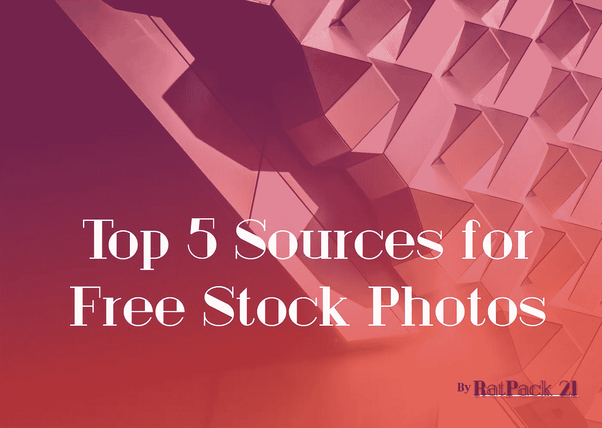

# 免费库存照片的五大来源

> 原文：<https://medium.com/hackernoon/top-5-sources-for-free-stock-photos-79fa297524cd>

我为我的公司 [Pareto Design](http://www.pareto-design.com) 做了很多图像方面的工作。我曾经完全依赖于从所有通常的嫌疑人那里购买库存照片的可靠方法。有一天，我勉强同意帮助一个朋友在 T2 创办一家初创公司(T3)(故事留待以后再说，结局不太好)。他几乎没有给我任何预算方面的工作，所以在廉价创新的时刻，我转向互联网寻求免费的解决方案。原来免费提供的东西是惊人的，我是一个傻瓜曾经支付股票照片。经过不懈的寻找，我找到了年轻的免费[股票摄影](https://hackernoon.com/tagged/stock-photo)班最优秀最聪明的人。下面的五个网站一直为我的项目提供很棒的照片。你会用这巨大的免费照片力量做什么？

[**Unsplash**](https://unsplash.com/)**-**从字面上看，这是您为项目或业务拍摄照片时唯一需要访问的地方。所有照片都可以用于任何目的，包括商业和个人目的。博客、艺术、书籍封面、t 恤等等——付费或不付费——都是许可允许的。

[**NYPL 数字馆藏**](http://digitalcollections.nypl.org/) **-** 超过 180，000 张免费的高质量历史照片和文件。一个伟大的复古资源。

[**新老库存照片**](http://nos.twnsnd.co/) **-** 来自公共档案馆的老照片。没有已知的版权限制。这些照片实在是太旧了，当它们被拍摄的时候版权根本不存在。非常适合前卫的黑白氛围。

[**照片集 IO**](http://photocollections.io/) **-** 类似但不那么广泛的 Unsplash 版本。更加关注风景、自然和建筑。

****-**Ryan McGuire 的照片，一些真正古怪的东西，如人董的国字脸和玩具的彩色照片，但取决于项目和无价的资源。**

************

> **[黑客中午](http://bit.ly/Hackernoon)是黑客如何开始他们的下午。我们是 [@AMI](http://bit.ly/atAMIatAMI) 家庭的一员。我们现在[接受投稿](http://bit.ly/hackernoonsubmission)，并乐意[讨论广告&赞助](mailto:partners@amipublications.com)机会。**
> 
> **如果你喜欢这个故事，我们推荐你阅读我们的[最新科技故事](http://bit.ly/hackernoonlatestt)和[趋势科技故事](https://hackernoon.com/trending)。直到下一次，不要把世界的现实想当然！**

****