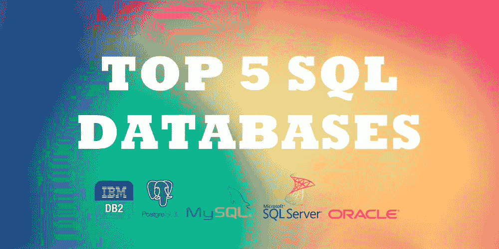
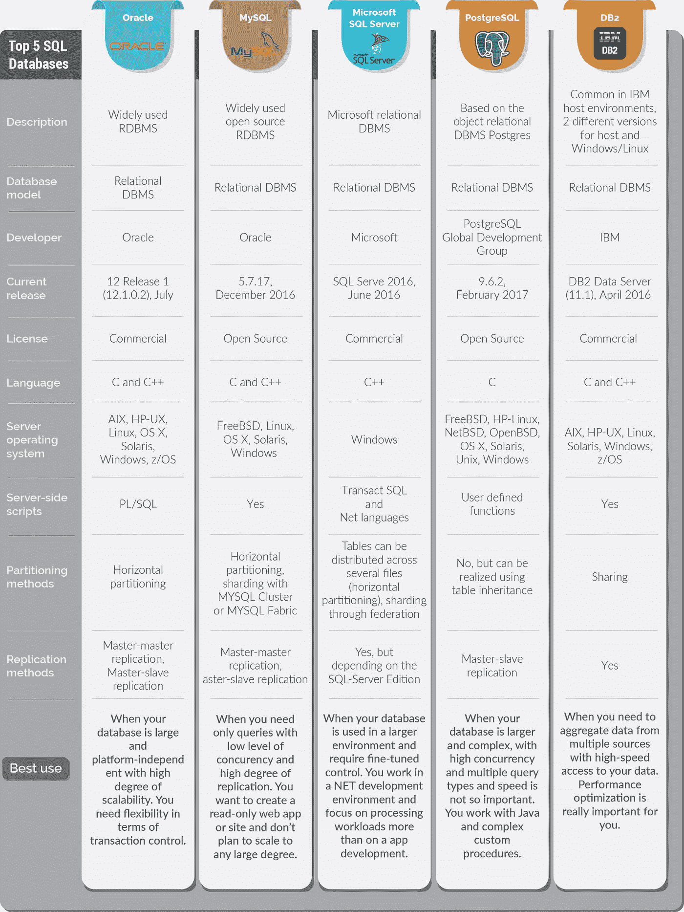

# 前五大 SQL 数据库[信息图]

> 原文：<https://medium.com/hackernoon/top-5-sql-databases-8997c2d02a02>

我们已经讨论过 NoSQL 数据库。这个对 Oracle、MySQL、Microsoft SQL Server、PostgreSQL 和 DB2 的可视化视图从开发人员的角度考虑了这些 SQL 选项。由[dash bounk 团队准备的小观察。](https://dashbouquet.com/)

[*安东·沙利尼科夫*写的](https://www.linkedin.com/in/anton-shaleynikov-45812a1/)

*想了解更多信息？* [*在这里查看*](https://dashbouquet.com/blog)

> [黑客中午](http://bit.ly/Hackernoon)是黑客如何开始他们的下午。我们是阿妹家庭的一员。我们现在[接受投稿](http://bit.ly/hackernoonsubmission)并乐意[讨论广告&赞助](mailto:partners@amipublications.com)的机会。
> 
> 如果你喜欢这个故事，我们推荐你阅读我们的[最新科技故事](http://bit.ly/hackernoonlatestt)和[趋势科技故事](https://hackernoon.com/trending)。直到下一次，不要把世界的现实想当然！

