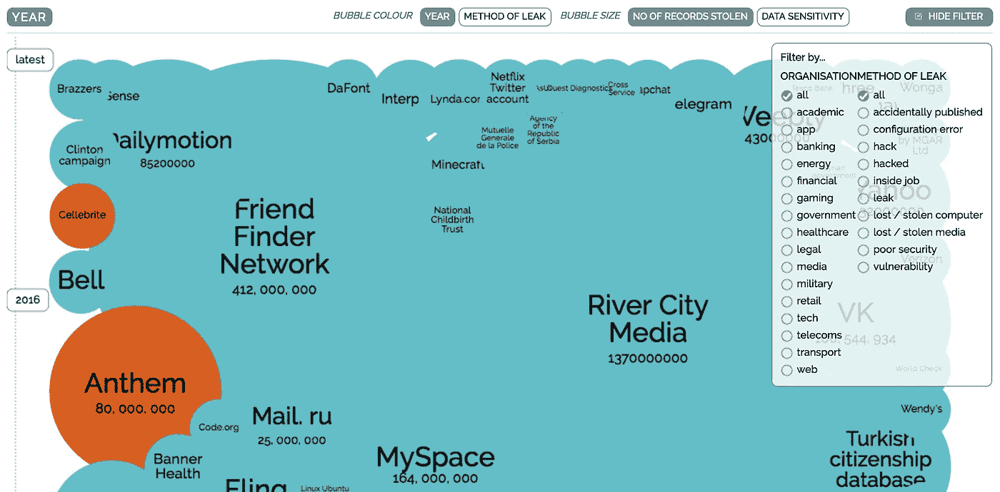

# 2017 年 6 大开源项目

> 原文：<https://medium.com/hackernoon/top-6-open-source-projects-in-2017-db34b9d034a2>

开源是最酷的。让我们看看 2017 年的一些顶级球员。下面这个列表最有趣的一点是，它很好地展示了过去十年开源社区的成熟。这里介绍的所有项目(除了 Lab41)都是在 2014 年或以后发布的，每个项目都已经在各自的社区中发挥了重要作用。

# [张量流](https://www.tensorflow.org/)

谷歌的 [TensorFlow](https://www.tensorflow.org/) 于 2015 年发布，是一个可扩展的基于神经元的机器学习库。有了 TensorFlow，我们可以构建管道来对图像和文本等各种各样的东西进行分类，甚至可以构建复杂的问题场景，如“长得像 X 的用户会购买 Y 吗？”

很多行业只是在摸机器学习的皮毛。尽管当代人认为我们可以“人工智能”任何东西，但机器学习问题总是受到计算资源(即计算机处理器或服务器)和训练数据的限制。未来几年，训练数据仍将是房间里的大象，许多人低估了成功回答复杂问题所需的可靠训练数据的数量。也就是说，机器学习是真实的，很快就会隐藏在我们日常使用的大多数应用程序中。我们还将看到许多有趣的项目和假设，它们源于使用机器学习来创造性地解释公共可用数据的盈余。

如果你对机器学习的理解需要复习，[这篇来自谷歌的博客文章](https://cloud.google.com/blog/big-data/2016/07/understanding-neural-networks-with-tensorflow-playground)将会有所帮助。

# [总账](https://www.hyperledger.org/)

[Hyperledger](https://www.hyperledger.org/) 于 2015 年发布，由 Linux 基金会赞助，旨在促进区块链技术的未来商业应用。Hyperledger 开发了[模块化工具](https://www.hyperledger.org/projects)，可以作为分布式区块链的基础来解决商业问题，包括安全合同、匿名会计和身份管理，以及基于社区的历史交易记录。

Hyperledger 已经引起了 IBM、思科、红帽、VMWare、摩根大通、富国银行和埃森哲等公司的极大兴趣。

# Node.js / [React Native](https://facebook.github.io/react-native/showcase.html)

让我们接受 Node.js 社区获胜的事实。到处都是。Node.js 为新一代程序员民主化了服务器端编码。我们不能在不承认 Node.js 将继续成为软件工程领域的发电站的情况下谈论 [React Native](https://facebook.github.io/react-native/showcase.html) ，特别是对于消费者和移动应用程序。

React Native 于 2015 年推出，浪漫了一个古老的故事:使用单一代码库将应用程序部署到多个平台。例如，使用单一代码库为苹果的 iOS、Android 和 web 编译一个应用程序。

为什么这是一个性感的想法？我们可以使用消费者网络最常用的语言:javascript。我们不需要分散在不同语言专业的团队，比如 javascript、ruby/python/php、java 和 objective C。我们可以快速构建。我们可以利用本地设备组件来处理硬东西，比如图像处理。我们可以围绕一个类似于(尽管不完全是)单一应用的东西，然后将我们的核心应用推出我们想要的每个平台。

React Native 还有什么酷的地方？[很多人都在使用它](https://facebook.github.io/react-native/showcase.html)，比如脸书、特斯拉、Airbnb、Instagram、腾讯、彭博和优步。

# [Kubernetes](http://kubernetes.io)

当谷歌在 2014 年发布 Kubernetes 时，它看起来很有前途。该项目的目标是雄心勃勃的——解决如何跨许多层、组和角色编排一队分布式服务器容器的问题。例如，一家公司可能有 200 多个容器在美国 4 个城市的数据中心运行，具有三个环境层(开发、暂存、生产)。这是一个很难管理的问题。

让我们承认，在过去十年中，对于大型企业的复杂部署来说，虚拟服务器编排一直是房间里的大象。这是亚马逊网络服务如此成功的一个原因。即使像 Docker 这样的虚拟化容器部署的兴起，大象仍然若隐若现。公司不得不依赖脆弱的开源项目、昂贵的专有平台或者广泛的内部工具来管理他们的虚拟集群和容器。

对于大规模容器编排，Kubernetes 似乎明显领先，并获得了纽约时报、高盛、SoundCloud、Box、Comcast 和 Ebay 等用户的支持。

# 实验室 41

> Lab41 是一个“挑战实验室”，美国情报界在这里与学术界和工业界的同行一起应对大数据。

虽然 [Lab41](http://www.lab41.org/about/) 本质上不是一个开源项目，但它提出了一些[有趣的问题](http://www.lab41.org/work/)，导致了开源代码和对社区的贡献。它代表了相当独特的东西，因为它显示了开源原则、风险投资和政府优先事项的交集。

# [跳马](https://www.vaultproject.io/intro/index.html)

> Vault 保护、存储并严格控制对令牌、密码、证书、API 密钥和现代计算中其他机密的访问。

很简单，如果你看一看这张关于全球数据泄露的 [***互动信息图***](http://bit.ly/2sGmtsZ) ，你就会立刻明白为什么保险库很重要。

*关注我* [*推特*](https://twitter.com/wbelk) *。在*[*LinkedIn*](https://www.linkedin.com/in/williambelk/)*上找我。*