# 我最喜欢的 63 部企业家商业电影 2000 →2016

> 原文：<https://medium.com/hackernoon/top-63-business-movies-for-entrepreneurs-from-2000-to-2016-ffc6d28fe609>

# 激情

[**《海蓓娜斯的追求》(2006)**](http://www.imdb.com/title/tt0454921/)

> 一名苦苦挣扎的推销员接管了他儿子的监护权，他准备开始一项改变人生的职业努力。

[**【2015】**](http://www.imdb.com/title/tt2503944/)

> 亚当·琼斯([布莱德利·库珀](http://www.imdb.com/name/nm0177896/?ref_=))是一名厨师，他因吸毒和天后行为毁了自己的职业生涯。他收拾了一下，回到伦敦，决心带领一家能够获得米其林三星的顶级餐厅来救赎自己。

[**Invictus(2009)**](http://www.imdb.com/title/tt1057500/)

> 纳尔逊·曼德拉在他的第一个南非总统任期内，发起了一项独特的冒险行动，以团结被种族隔离撕裂的土地:招募国家橄榄球队，以赢得 1995 年橄榄球世界杯。

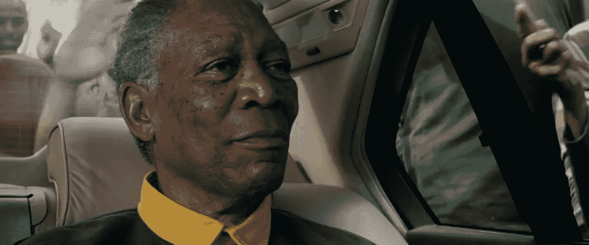

[**脑震荡(2015)**](http://www.imdb.com/title/tt3322364/)

> 在匹兹堡，多才多艺的病理学家 Bennet Omalu 博士揭示了足球运动员脑损伤的真相，这些运动员在正常比赛中反复遭受脑震荡。

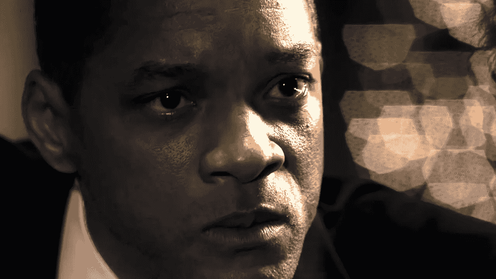

[**拯救班克斯先生(2013)**](http://www.imdb.com/title/tt2140373/)

> 作家帕梅拉·林登·特拉弗斯在不情愿地与寻求将她的《欢乐满人间》改编成电影的华特·迪士尼会面后，回忆了她的童年。

[**《追逐小牛》(2012)**](http://www.imdb.com/title/tt1629757/)

> 当年轻的 Jay Moriarity 发现神话中的 Mavericks surf break，地球上最大的海浪之一，存在于距离他在圣克鲁斯的家只有几英里的地方时，他招募了当地传奇人物 Frosty Hesson 的帮助，训练他在这种情况下生存。

[**百万美元宝贝 2004**](http://www.imdb.com/title/tt0405159/)

> 一个坚定的女人和一个老练的拳击教练一起工作，成为一名职业选手。

[**女权主义者(2015)**](http://www.imdb.com/title/tt3077214/?ref_=fn_al_tt_1)

> 早期女权运动的士卒，被迫转入地下，以日益残酷的状态追求一场危险的猫捉老鼠游戏的女性。

[**【战士 2011】**](http://www.imdb.com/title/tt1291584/?ref_=fn_al_tt_1)

> 一个酗酒的前拳击手的小儿子回到了家，在那里他接受了父亲的训练，参加了一场综合武术锦标赛——这条路让这位拳击手与他疏远的哥哥发生了冲突。

# 视力

[**《社交网络》(2010)**](http://www.imdb.com/title/tt1285016/)

> 哈佛学生马克·扎克伯格创建了后来被称为脸书的社交网站，但后来被两兄弟起诉，声称他窃取了他们的想法，后来被挤出这个行业的共同创始人。

[**乔布斯(2015)**](http://www.imdb.com/title/tt2080374/?ref_=fn_al_tt_1)

> 史蒂夫·乔布斯带我们走进数字革命的幕后，描绘一幅身处其中心的人的肖像。这个故事在三个标志性产品发布会的后台展开，以 1998 年 iMac 的发布结束。

[**阿里(2001)**](http://www.imdb.com/title/tt0248667/?ref_=fn_al_tt_1)

> 体育传奇人物穆罕默德·阿里的传记，从他早年到他在拳击场上的日子。

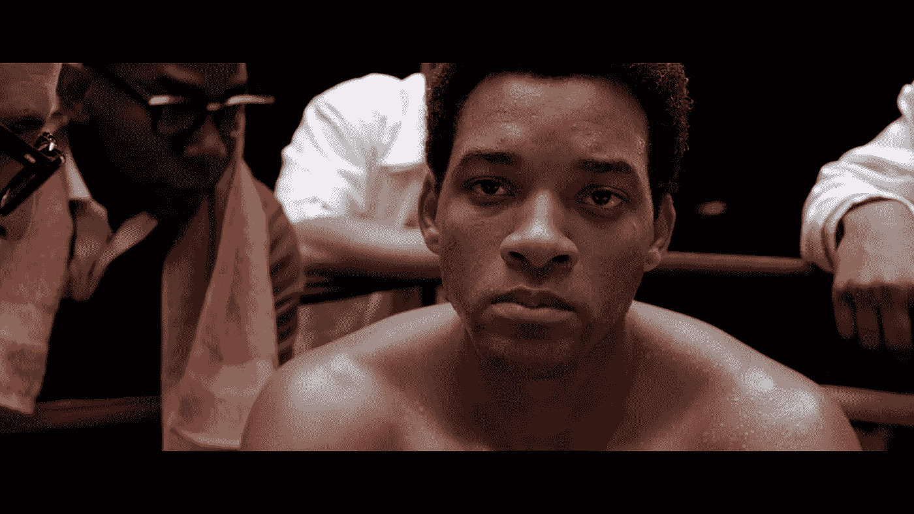

# 创新

[**【T21 2006】**](http://www.imdb.com/title/tt0482571/?ref_=fn_al_tt_1)

> 两个舞台魔术师竞相攀比，试图创造出终极的舞台幻觉。

[**超越(2014)**](http://www.imdb.com/title/tt2209764/?ref_=fn_al_tt_1)

> 当一个科学家的意识被上传到一个这样的程序中时，他对人工智能的驱动力就会产生危险的影响。

[**《幻术师》(2006)**](http://www.imdb.com/title/tt0443543/?ref_=fn_al_tt_1)

> 在世纪之交的维也纳，一个魔术师用他的能力赢得了一个远高于他社会地位的女人的爱。

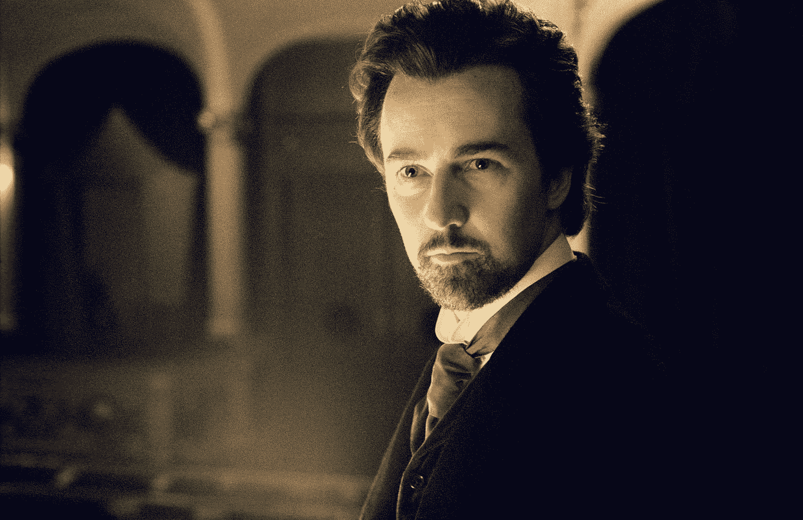

[**她(2013)**](http://www.imdb.com/title/tt1798709/?ref_=fn_al_tt_1)

> 一个孤独的作家与他新买的操作系统建立了一种不太可能的关系，该系统旨在满足他的所有需求。

[**Ex 玛奇纳(2015)**](http://www.imdb.com/title/tt0470752/)

> 一名年轻的程序员被选中参加一项突破性的合成智能实验，评估一个令人惊叹的人形人工智能的人类素质

# 机会/投机

**大空头(2015)**

> **高金融界的四个人预测了 2005 年中期的信贷和房地产泡沫崩溃，并决定挑战大银行的贪婪和缺乏远见。**

****

**[**《华尔街之狼》(2013)**](http://www.imdb.com/title/tt0993846/)**

> **根据乔丹·贝尔福特的真实故事改编，从他成为一名过着奢华生活的富有的股票经纪人，到他卷入犯罪、腐败和联邦政府的堕落。**

****

**[**【融资融券 2011】**](http://www.imdb.com/title/tt1615147/)**

> **在金融危机的早期阶段，在 24 小时内跟踪一家投资银行的关键人物。**

****

**[**赌场杰克(2010)**](http://www.imdb.com/title/tt1194417/)**

> **一个华盛顿 DC 的游说者和他的门徒因为他们兜售影响力的计划导致腐败和谋杀而声名狼藉。**

****

**[**【2007】**](http://www.imdb.com/title/tt0469494/)**

> **这是一个关于家庭、宗教、仇恨、石油和疯狂的故事，聚焦于一个世纪之交的早期探矿者。**

**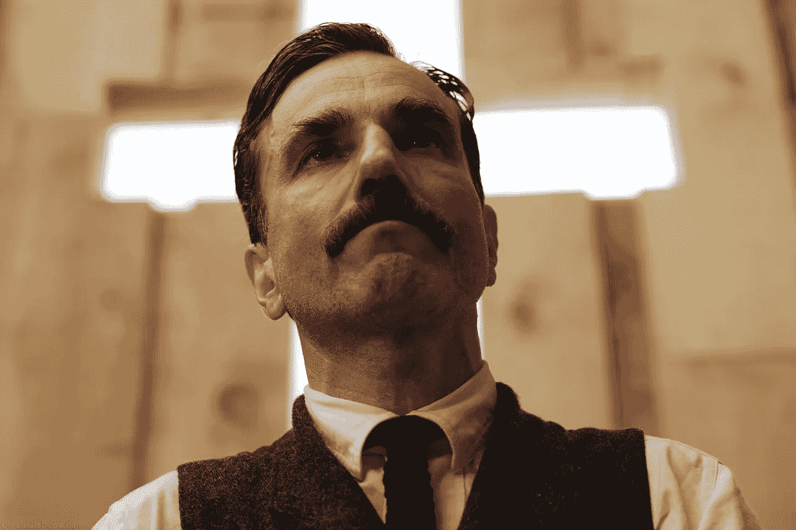**

**[**【2014】**](http://www.imdb.com/title/tt2872718/)**

> **当路易斯·布鲁姆，一个渴望工作的人，强行进入洛杉矶犯罪新闻的世界时，他模糊了观察者和参与者之间的界限，成为自己故事的主角。帮助他的是尼娜，一位电视新闻老手。**

****

**[**无法无天(2012)**](http://www.imdb.com/title/tt1212450/)**

> **故事发生在大萧条时期的弗吉尼亚州富兰克林县，三个贩卖私酒的兄弟受到一名新的特别代表和其他当局的威胁，他们想从他们的利润中提成。**

****

**[**【2005 年两投币】**](http://www.imdb.com/title/tt0417217/)**

> **在遭受了职业生涯结束的伤害后，一名前大学足球明星与体育赌博业最著名的吹捧者之一结盟。**

****

**[**【血钻 2006】**](http://www.imdb.com/title/tt0450259/)**

> **一个渔夫，一个走私者，和一个商人财团为了一颗无价的钻石的所有权斗智斗勇。**

****

# **产品/技能**

**[**《模仿游戏》(2014)**](http://www.imdb.com/title/tt2084970/?ref_=fn_al_tt_1)**

> **第二次世界大战期间，数学家艾伦·图灵试图在其他数学家的帮助下破解英格玛密码。**

****

**[**世界最快的印度(2005)**](http://www.imdb.com/title/tt0412080/)**

> **新西兰人伯特·孟若的故事，他花了几年时间重新组装一辆 1920 年的印度摩托车，这帮助他于 1967 年在犹他州的邦纳维尔盐滩创造了陆地速度世界纪录。**

****

**[**欢乐(2015)**](http://www.imdb.com/title/tt2446980/)**

> **《欢乐》讲述了主人公的故事，他成为了一个强大家族企业王朝的创始人和女家长。**

****

**[**我的出身(2014)**](http://www.imdb.com/title/tt2884206)**

> **一位分子生物学家和他的实验室伙伴发现了可能从根本上改变我们所知的社会的证据。**

****

**[**《飞行家》(2004)**](http://www.imdb.com/title/tt0338751)**

> **这部传记片描述了传奇导演兼飞行员霍华德·休斯早年从 20 世纪 20 年代末到 40 年代中期的职业生涯。**

****

**[**冲(2013)**](http://www.imdb.com/title/tt1979320/)**

> **一级方程式竞争对手詹姆斯·亨特和尼基·劳达之间 20 世纪 70 年代残酷的竞争。**

****

**[**飞行(2012)**](http://www.imdb.com/title/tt1907668)**

> **一名航空公司飞行员在他故障的飞机上救了几乎所有的乘客，飞机最终坠毁，但对事故的调查揭示了一些令人不安的事情。**

**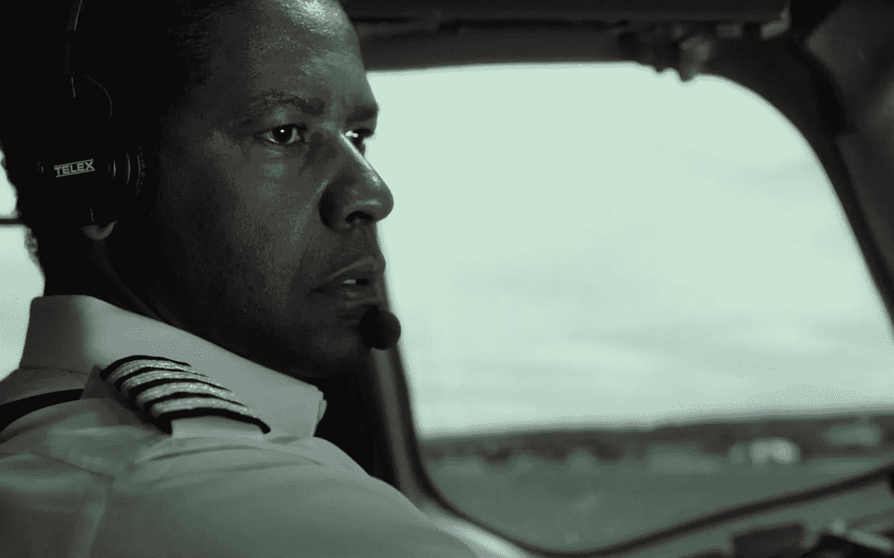**

**[**【有本事就来抓我】(2002)**](http://www.imdb.com/title/tt0264464)**

> **这是一个关于小弗兰克·阿巴内尔的真实故事，他在 19 岁生日之前，作为泛美飞行员、医生和法律检察官，成功骗取了价值数百万美元的支票。**

****

**[**【雷 2004】**](http://www.imdb.com/title/tt0350258)**

> **传奇节奏布鲁斯音乐家雷·查尔斯的生活和职业故事，从他在南方卑微的出身，7 岁时失明，到他在 20 世纪 50 年代和 60 年代迅速成为明星。**

****

**[**【2002】8 英里**](http://www.imdb.com/title/tt0298203)**

**一个年轻的说唱歌手，在生活的各个方面挣扎，想要成名，但他的朋友和敌人让这个说唱的奥德赛，比它看起来更难。**

****

**[**【万物之论】2014**](http://www.imdb.com/title/tt2980516)**

> **看看著名物理学家[斯蒂芬·霍金](http://www.imdb.com/name/nm0370071/?ref_=)和他妻子的关系。**

****

# **集中**

**[**无限(2011)**](http://www.imdb.com/title/tt1219289/)**

> **在一种神秘药丸的帮助下，用户可以使用他 100%的大脑能力，一名苦苦挣扎的作家成为了一名金融奇才，但这也将他置于一个充满危险的新世界。**

****

**[**【焦点 2015】**](http://www.imdb.com/title/tt2381941)**

> **在资深骗子尼基的最新计划中，他过去的一个女人——现在是一个成功的蛇蝎美人——出现了，打乱了他的计划。**

****

**[**【T21 实习生(2015)**](http://www.imdb.com/title/tt2361509/)**

> **70 岁的鳏夫本·惠特克发现退休并不像人们所说的那样美好。抓住一个重返游戏的机会，他成为了一家在线时尚网站的高级实习生，该网站由 Jules Ostin 创建并运营。**

****

**[**成绩(2015)**](http://www.imdb.com/title/tt3824412/)**

> **两个不匹配的私人教练的生活被一个新的富有客户的行为颠覆了。**

****

**[**【2014】**](http://www.imdb.com/title/tt2582802/)**

> **一个有前途的年轻鼓手进入了一所竞争激烈的音乐学院，在那里，他的伟大梦想得到了一位导师的指导，这位导师会不遗余力地发掘学生的潜力。**

****

# **聚会**

**[**《了不起的盖茨比》(2013)**](http://www.imdb.com/title/tt1343092/)**

> **作家兼华尔街交易员尼克发现自己被他的百万富翁邻居杰伊·盖茨比的过去和生活方式所吸引。**

****

**[**【2007 年遗愿清单】**](http://www.imdb.com/title/tt0825232/)**

> **两个身患绝症的男人逃离了癌症病房，带着死前的愿望清单上路了。**

****

# **毅力**

**[**【2013 年实习】**](http://www.imdb.com/title/tt2234155/)**

> **两位职业生涯遭到数字时代破坏的销售人员找到了一份梦寐以求的谷歌实习工作，他们必须与一群年轻的技术天才竞争就业机会。**

**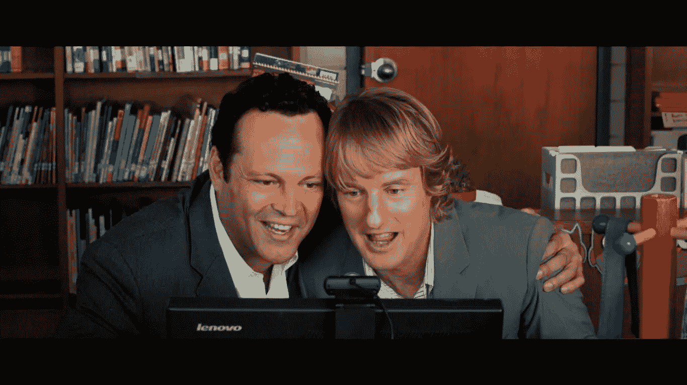**

**[**《斗士》(2010)**](http://www.imdb.com/title/tt0964517/)**

> **回顾拳击运动员“爱尔兰人”米奇·沃德和他的兄弟早年的生活，他们在 20 世纪 80 年代中期成为职业拳击手之前帮助训练他。**

****

**[**《国王的演讲》(2010)**](http://www.imdb.com/title/tt1504320/)**

> **大不列颠及北爱尔兰联合王国的乔治六世国王的故事，他即席登上王位和帮助不自信的君主变得值得拥有的语言治疗师。**

****

**[**《摔跤手》(2008)**](http://www.imdb.com/title/tt1125849/)**

> **一个褪色的职业摔跤手必须退休，但发现他对拳击场外新生活的追求是一场令人沮丧的斗争。**

****

# **幸存**

**[**127 小时(2010)**](http://www.imdb.com/title/tt1542344)**

> **一名喜欢冒险的登山者在犹他州摩押附近独自穿越峡谷时被困在一块巨石下，为了生存不得不采取绝望的措施。**

****

**[**未破(2014)**](http://www.imdb.com/title/tt1809398/)**

> **在第二次世界大战中一次几乎致命的飞机失事后，奥运会选手路易斯·赞佩里尼在被日本海军抓住并送往战俘营之前，与两名同伴在救生筏上度过了痛苦的 47 天。**

****

**[**《灰姑娘的男人》(2005)**](http://www.imdb.com/title/tt0352248/)**

> **詹姆斯·布洛克的故事，一个被认为是过气的拳击手，在 20 世纪 30 年代回来成为冠军和灵感。**

****

**[**《大海的心》(2015)**](http://www.imdb.com/title/tt1390411/)**

> **讲述了 1820 年一艘新英格兰捕鲸船被一头巨鲸击沉的故事，这一经历后来激发了伟大小说《白鲸》的创作。**

****

**[**(2013 年地球之后)**](http://www.imdb.com/title/tt1815862/)**

> **在迫使人类逃离的事件发生一千年后，一次迫降让基泰·莱奇和他的父亲塞弗滞留在地球上。由于塞弗受伤，基泰必须踏上危险的旅程，发出求救信号。**

**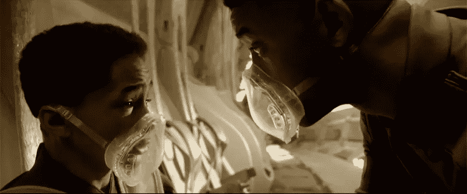**

**[**【2007】**](http://www.imdb.com/title/tt0758758/)**

> **从埃默里大学毕业后，优等生兼运动员克里斯托弗·麦坎德莱斯放弃了他的财产，将他所有的 24000 美元储蓄账户捐给了慈善机构，并搭便车到了阿拉斯加的荒野中生活。一路上，克里斯托弗遇到了一系列塑造他一生的人物。**

****

**[**【移民 2013】**](http://www.imdb.com/title/tt1951181/)**

> **1921.一个无辜的移民妇女被骗进了滑稽戏和歌舞杂耍的生活，直到一个令人眼花缭乱的魔术师试图拯救她，并使她与她被关押在爱丽丝岛的姐姐团聚。**

****

**[**【2011】**](http://www.imdb.com/title/tt1675434/)**

> **在一次滑翔伞事故中变成四肢瘫痪后，一个贵族从项目中雇佣了一个年轻人来照顾他。**

**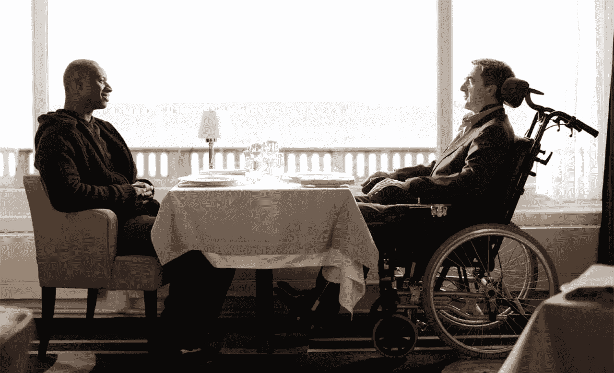**

# **领导力**

**[**《美国黑帮》(2007)**](http://www.imdb.com/title/tt0765429/)**

> **在 20 世纪 70 年代的美国，一名侦探致力于摧毁毒品帝国弗兰克·卢卡斯，一名来自曼哈顿的海洛因毒枭，他从远东走私毒品到美国。**

**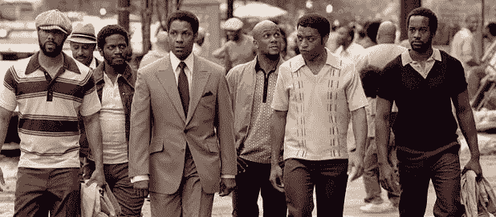**

**[**特洛伊(2004)**](http://www.imdb.com/title/tt0332452/)**

> **这部电影改编自荷马史诗，讲述了希腊联军对特洛伊的进攻，并记录了参战人员的命运。**

****

**[**《角斗士》(2000)**](http://www.imdb.com/title/tt0172495/)**

> **当一个罗马将军被背叛，他的家人被一个皇帝腐败的儿子谋杀，他作为一个角斗士来到罗马寻求报复。**

**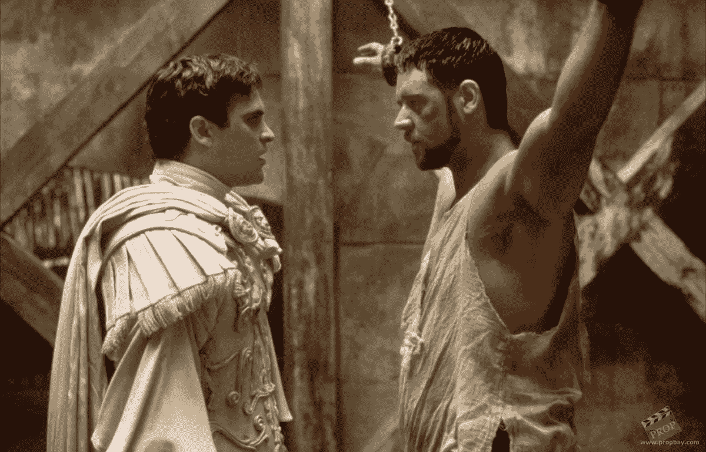**

**[**(2006 年)300**](http://www.imdb.com/title/tt0416449/)**

> **公元前 480 年，斯巴达国王列奥尼达率领 300 人的军队在塞莫皮莱与波斯人作战。**

**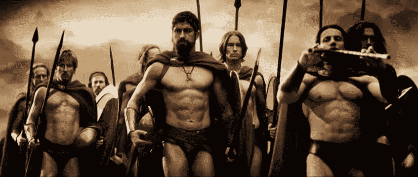**

**[**林肯(2012)**](http://www.imdb.com/title/tt0443272/)**

> **随着内战继续肆虐，美国总统在战场上与持续的大屠杀作斗争，他与自己内阁中的许多人就解放奴隶的决定进行斗争。**

**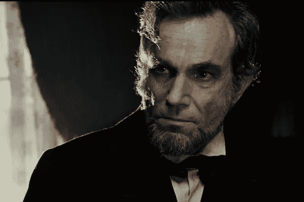**

**[**【2006 年最后的苏格兰国王】**](http://www.imdb.com/title/tt0455590/)**

> **根据他的私人医生在 1970 年代看到的残暴的乌干达独裁者伊迪·阿明政权的事件改编**

****

**[**《蒙古:成吉思汗的崛起》(2007)**](http://www.imdb.com/title/tt0416044/)**

> **这个故事讲述了成吉思汗的早期生活，他在 1206 年征服包括俄罗斯在内的半个世界之前是一名奴隶。**

****************

> **[黑客中午](http://bit.ly/Hackernoon)是黑客如何开始他们的下午。我们是 [@AMI](http://bit.ly/atAMIatAMI) 家庭的一员。我们现在[接受投稿](http://bit.ly/hackernoonsubmission)并乐意[讨论广告&赞助](mailto:partners@amipublications.com)机会。**
> 
> **如果你喜欢这个故事，我们推荐你阅读我们的[最新科技故事](http://bit.ly/hackernoonlatestt)和[趋势科技故事](https://hackernoon.com/trending)。直到下一次，不要把世界的现实想当然！**

****