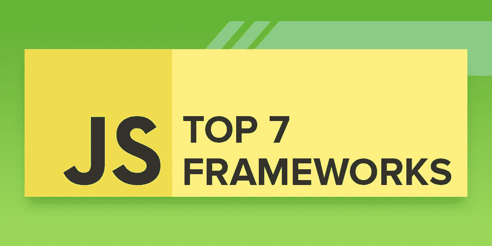
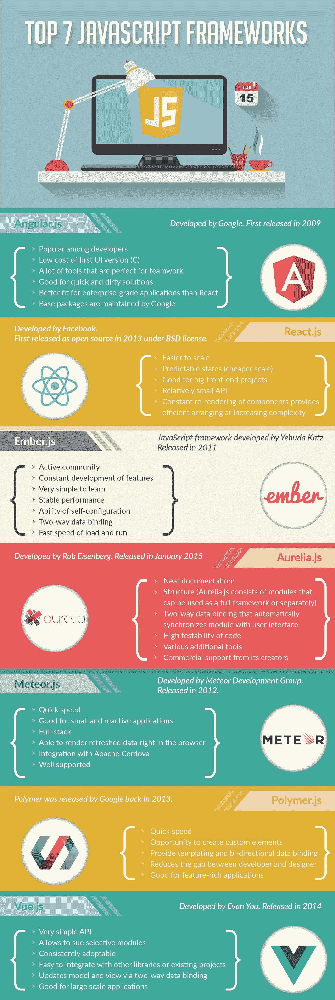

# 7 大 JavaScript 框架

> 原文：<https://medium.com/hackernoon/top-7-javascript-frameworks-c8db6b85f1d0>

这里有一个快速、易读的信息图，它列出了目前最好的 7 种 JavaScript 框架。

[*安东·沙列尼科夫*写的](https://www.linkedin.com/in/anton-shaleynikov-45812a1/)

*想了解更多？* [*点击这里查看*](https://dashbouquet.com/blog)

> [黑客中午](http://bit.ly/Hackernoon)是黑客如何开始他们的下午。我们是阿妹家庭的一员。我们现在[接受投稿](http://bit.ly/hackernoonsubmission)并乐意[讨论广告&赞助](mailto:partners@amipublications.com)机会。
> 
> 如果你喜欢这个故事，我们推荐你阅读我们的[最新科技故事](http://bit.ly/hackernoonlatestt)和[趋势科技故事](https://hackernoon.com/trending)。直到下一次，不要把世界的现实想当然！

