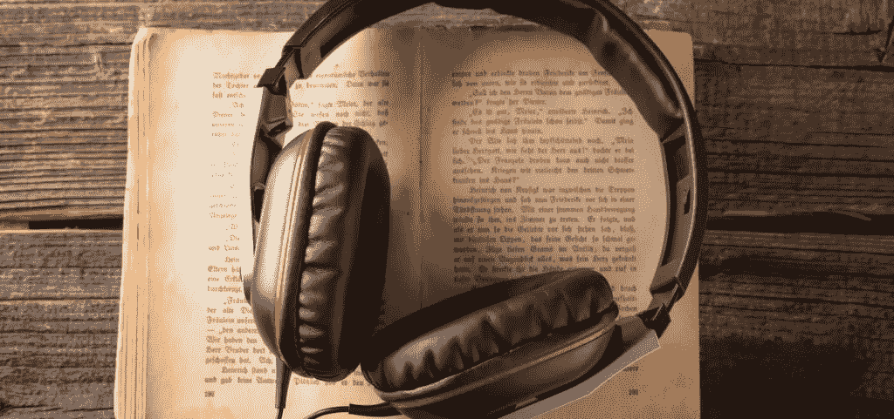

# 创业创始人最佳有声读物

> 原文：<https://medium.com/hackernoon/top-audiobooks-for-startup-founders-59bb3745b5ff>

受到最近 HN 帖子的启发，我决定分享一组我最喜欢的有声读物和播客，我想 HN 的读者会喜欢的。这是我在过去 3-4 年中发现的最好的东西，我相信你们会喜欢这些书，所以如果你还没有读过其中的一些，我强烈建议你去看看。

## 优秀的有声读物

 [## 修订

### 来自开创性软件公司 37signals 的创始人，这里有一个…

www.audible.com](https://www.audible.com/pd/Rework-Audiobook/B0036FLXLQ)  [## 创造力公司。

### 来自皮克斯的联合创始人艾德·卡姆尔(史蒂夫·乔布斯和约翰·拉塞特)

www.audible.com](https://www.audible.com/pd/Creativity-Inc-Part-1-Overcoming-the-Unseen-Forces-That-Stand-in-the-Way-of-True-Inspiration-Audiobook/B00IPK3BWQ)  [## 火星人

### 看看 Audible.com 的这个伟大的听众。2015 年奥迪奖获得者，科幻 2015 年奥迪奖决赛入围者，独唱…

www.audible.com](https://www.audible.com/pd/The-Martian-Part-1-Audiobook/B00B5HZGUG)  [## 艰难事物的艰难之处在于

### 看看 Audible.com 的这个伟大的听众。本·霍洛维茨，安德森·霍洛维茨基金的联合创始人，硅谷的创始人之一…

www.audible.com](https://www.audible.com/pd/The-Hard-Thing-About-Hard-Things-Building-a-Business-When-There-Are-No-Easy-Answers-Audiobook/B00I0AJC2Y)  [## 零比一

### 看看 Audible.com 的这个伟大的听众。商业中的每一刻都只会发生一次。下一个比尔·盖茨不会…

www.audible.com](https://www.audible.com/pd/Zero-to-One-Notes-on-Startups-or-How-to-Build-the-Future-Audiobook/B00M27LBU2)  [## 论智力

### 看看 Audible.com 的这个伟大的听众。杰夫·霍金斯，创造了掌上电脑、Treo 智能手机和…

www.audible.com](https://www.audible.com/pd/B002V8LKTE)  [## 日常用品的设计

### 看看 Audible.com 的这个伟大的听众。首先，企业发现质量是一个关键的竞争优势；接下来是…

www.audible.com](https://www.audible.com/pd/The-Design-of-Everyday-Things-Audiobook/B005I5MDGQ)  [## 你肯定是在开玩笑，费曼先生！

### 看看 Audible.com 的这个伟大的听众。理查德·p·费曼有一次用他特有的扬眉动作…

www.audible.com](https://www.audible.com/pd/Surely-Youre-Joking-Mr-Feynman-Audiobook/B002V5D7IE)  [## 德乌斯人

### 看看 Audible.com 的这个伟大的听众。尤瓦尔·诺亚·哈拉里是广受好评的《纽约时报》最佳…

www.audible.com](https://www.audible.com/pd/Homo-Deus-Part-1-A-Brief-History-of-Tomorrow-Audiobook/B01N4DCBK6)  [## 阿特拉斯耸耸肩

### 看看 Audible.com 的这个伟大的听众。《阿特拉斯耸耸肩》是“当今对美国人第二有影响力的书…

www.audible.com](https://www.audible.com/pd/Atlas-Shrugged-Part-1-Audiobook/B002VA3KG8)  [## 测绘创新

### 看看 Audible.com 的这个伟大的听众。绘制创新空间图-开辟一条通向利润和增长的道路…

www.audible.com](https://www.audible.com/pd/Mapping-Innovation-A-Playbook-for-Navigating-a-Disruptive-Age-Audiobook/B074CPC2YT)  [## 隐形的艺术

### 看看 Audible.com 的这个伟大的听众。世界最著名的黑客凯文·米特尼克教你轻松隐身…

www.audible.com](https://www.audible.com/pd/The-Art-of-Invisibility-The-Worlds-Most-Famous-Hacker-Teaches-You-How-to-Be-Safe-in-the-Age-of-Big-Brother-and-Big-Data-Audiobook/B01N80UK3J)  [## 可操作游戏化

### 看看 Audible.com 的这个伟大的听众。游戏化和人性化设计的新时代为…

www.audible.com](https://www.audible.com/pd/Actionable-Gamification-Part-1-Beyond-Points-Badges-and-Leaderboards-Audiobook/B06XSWX5NM)  [## 赖以生存的算法

### 看看 Audible.com 的这个伟大的听众。关于计算机算法如何应用于我们的…

www.audible.com](https://www.audible.com/pd/Algorithms-to-Live-By-The-Computer-Science-of-Human-Decisions-Audiobook/B01D24NLWO)  [## 天使

### 看看 Audible.com 的这个伟大的听众。硅谷最成功的天使投资人之一分享他的规则…

www.audible.com](https://www.audible.com/pd/Angel-How-to-Invest-in-Technology-Startups-Timeless-Advice-from-an-Angel-Investor-Who-Turned-100000-into-100000000-Audiobook/B06ZXZ3B3W)  [## iWoz

### 看看 Audible.com 的这个伟大的听众。苹果电脑背后的策划者抛却了他的低调和步骤…

www.audible.com](https://www.audible.com/pd/iWoz-Part-1-How-I-Invented-the-Personal-Computer-and-Had-Fun-Along-the-Way-Audiobook/B002V8LA1W)  [## 牵引力

### 看看 Audible.com 的这个伟大的听众。大多数创业公司不会因为造不出一个产品而失败。大多数创业公司…

www.audible.com](https://www.audible.com/pd/Traction-How-Any-Startup-Can-Achieve-Explosive-Customer-Growth-Audiobook/B01705KJRQ) 

## 优秀的播客

*   y 组合
    [https://soundcloud.com/akharris](https://soundcloud.com/akharris)
*   独立黑客
    https://www.indiehackers.com/podcast T4
*   语法(React 和 web dev)
    [https://syntax.fm/](https://syntax.fm/)
*   理性地写作
    [http://alexanderwales.com/rationally-writing/](http://alexanderwales.com/rationally-writing/)
*   《哈利·波特与理性的方法》音频版[http://www.hpmorpodcast.com/](http://www.hpmorpodcast.com/)
*   理性的音频版:从 AI 到僵尸
    https://from-ai-to-zombies.eu/