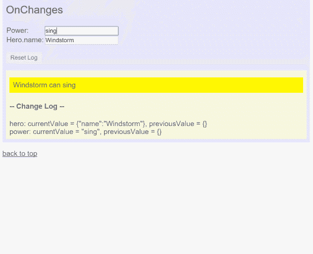

# Angular 开发人员的常见错误

> 原文：<https://medium.com/hackernoon/top-common-mistakes-of-angular-developers-2a36524f2c21>

## 失败是成功的关键；每个错误都教会我们一些东西

Image credit for theconversation.com

***这篇*文章** ***原本出现在***[***dormoshe . io***](https://dormoshe.io/articles/top-common-mistakes-of-angular-developers-17)

Angular 是一个新的平台。我们学习如何使用它，如何优化应用程序以及如何改进我们的代码。作为团队成员的一部分，我们进行代码审查，并努力提高彼此的技能。作为代码评审和阅读 web 上代码示例的一部分，我注意到 Angular 开发人员的一些常见错误。**可以是初级开发人员，也可以是专家开发人员，我们都会在代码中犯错误**。

在这篇文章中，我们将涵盖最常见的错误，我们将了解如何修复它们。每一个都可以成为整篇文章的灵感来源。我们将简要但详尽地讨论它们。

# 先说术语——角度对角度 2 对角度 4 对角度 x+😅

新 Angular 不仅仅是 Angular 的新版本。这是对框架的改写。所以现在我们有旧的 Angular 1 和 Angular 2 和 Angular 4，在不久的将来还有 Angular 5。但是角度 2 和角度 4 之间的变化不如角度 1 和角度 2 之间的变化。Angular 4 不是重写。这是 Angular 2 的新版本，有错误修复和新功能。实际上，在语义版本化方法中，每六个月我们就会得到 Angular 的新版本。所以，在所有的新版本中，术语是混乱的。在 Google 里搜索学习资料，Stack Overflow 里的问题或者只是和伙伴聊聊，都不太方便。为了解决这个令人沮丧的问题，Angular 团队决定了名称术语。**旧的 Angular，Angular 1，叫 AngularJS，新的 Angular 2/2+/4/5 叫 Angular** ，就叫 Angular。

另一个术语变化是第三方库名称。有时，一个库被称为前缀`ng-`。当 Angular 版本 2 发布时，库开始使用前缀`ng2-`。Angular 版本 4 发布时，出现了新的术语趋势。术语是使用`ngx-`前缀，因为 Angular 使用语义版本化，每六个月就会发布一个新版本。所以，比如说，`ng2-bootstrap`的名字，改成了`ngx-bootstrap`，以后也没有理由再改了。

# ngOnChanges vs ngDoCheck

AngularJS 具有*手表*功能，可在数值变化时发出通知。Angular 放弃了监视和范围，现在我们有了作为属性的组件输入。此外，Angular 给了我们`ngOnChanges`生命周期钩子。为了提高更新的运行时间，当输入属性的深度字段改变时，**`**OnChanges**`**事件不会发出。**在这种情况下，输入的值是对象的**引用**。**

****

**The log entries appear as the string value of the *power* property changes. But the `ngOnChanges` does not catch changes to `hero.name`**

**很多开发者不知道这一点，陷入了这个陷阱。要解决这个问题，有各种解决方案:**

*   **使用`ngDoCheck`**
*   **使用不可变值作为输入**
*   **将输入值拆分为多个输入**
*   **使用订阅**

**`ngDoCheck`生命周期挂钩是解决这个问题的常用方法。这个钩子在变化检测过程运行时被调用。您需要小心使用这个钩子，因为更改检测通常每分钟运行很多次。**

# **僵尸订阅——缺乏退订**

**当你在 JavaScript 中订阅一个可观察的 or 事件时，当你用完它时，需要取消订阅来释放系统中的内存。否则，**就会出现内存泄漏**。**

**Example for unsubscribing in a component’s ngOnDestroy hook**

**大多数情况下，当你订阅一个组件时，更好的退订位置是在`OnDestroy`生命周期钩子中。当你订阅一项服务时，没有生命周期挂钩，所以你需要自己启动它。**

**缺少退订是因为开发人员不知道他们需要这样做，或者因为他们忘记退订。为了帮助我们解决这个问题，开发了[库和](https://www.npmjs.com/package/ngx-auto-unsubscribe)方法。**

# **超额退订**

**除了僵尸订阅的错误，还有退订操作是 Angular 自动完成的情况。使用异步管道就是这种情况的一个例子。**

**Over unsubscription operation example**

**另一个例子可以是像`Observable.timer(1000).subscribe(…)`和`http.get(‘http://medium.com’).subscribe(…)`这样的有限订阅。**

**有 Rxjs 的方法可以自行取消订阅。比如 take(n)，takeWhile(谓词)，first()和 first(谓词)就是其中的一些。所以，**你需要小心退订的任务，知道这些方法是可行的，可以正确地完成这个任务。****

# **@ component . providers vs @ ng module . providers**

**作为 Angular 新机制的一部分，分层依赖注入，我们可以多次实例化一个服务，这与 AngularJS 不同。在旧的 AngularJS 中，服务是单件的。**

**假设我们有一个英雄服务来获取我们可爱的英雄:**

**Hero service**

**正如我们所看到的，服务在构造函数中获取数据。还有，有一个方法`getHeroes`可以获得英雄。一切都很好。**

**现在是英雄成分:**

**Wrong use of provider**

**`HeroComponent`在`@Component.providers`数组中声明`HeroesService`提供者，并将其注入构造函数中。这段代码的问题在于**的每个** `**HeroComponent**` **实例都会实例化** `**HeroesService**`的一个新实例。因此，由于分层的 DI，服务将通过 HTTP 请求多次获取数据。**

**这个问题的解决方案是在`@NgModule.providers`中声明服务:**

**Correct use of provider**

**现在，对于所有的`HeroComponent`实例，提供者将只被实例化一次。发生这种情况是因为，**当一个提供者在** `**NgModule**` **中声明时，它将是单例的，所有其他模块都将能够使用它**。不需要在`@NgModule.exports`数组中导出一个提供者。它会自动完成。**

# **直接变异 dom**

**Angular 不再是网络的框架。**有角是一个平台。**它的优势之一是允许我们将应用程序代码从渲染器中分离出来，这反过来使得编写可以在浏览器、服务器上执行的应用程序成为可能，甚至可以作为原生应用程序来执行。**

**解耦也给了我们更多的能力，比如使用 AOT(提前编译)或 web workers。提前编译意味着在服务器构建时编译应用程序模板。可以使用 AOT 来代替浏览器中运行的标准 JIT 编译。当我们使用 AoT 时，不需要在我们的包中包含大的`@angular/compiler`包，所以包的大小和加载时间更短。所以这是至关重要的。**

**如果我们现在或将来想要使用这种能力，我们需要保持一些约束。其中之一就是不要直接使用 jQuery、document object 或者`ElementRef.nativeElement`对 DOM 进行变异。**

**Mutate the dom directly — the bad way**

**如您所见，`doBadThings`方法有三行代码，演示了直接改变 DOM 的三种方法。第一行是 jQuery。第二个是由`ElementRef.nativeElement`，第三个是由全局`document`对象。**

**改变 DOM 的角度方法是通过`[Renderer2](https://angular.io/api/core/Renderer2)`服务(在 v4 中是 Renderer，在 v2 中是 Renderer)。**

**Mutate the dom via Renderer — the recommended way**

**这样，我们用三个参数调用渲染器的`setElementProperty`。这个函数的目标是改变/增加一个元素的属性。三个参数是`elementRef`实例、属性名和属性值。`Renderer`是视图突变层的包装器。当我们在浏览器中时，将使用默认的渲染器。当应用程序在另一个平台上运行时，如电话，**呈现器将被另一个合适的呈现器替换**。这个渲染器需要实现渲染器类接口，并被 DI 机制作为默认渲染器类加入。**

****

**“Don’t ever never” touch the DOM directly**

# **多次声明一个组件**

**组件是角度应用程序中的常见构建块。每个组件都需要在`NgModule`中声明，以便对视图可用。要指定一个组件是一个`NgModule`的成员，您应该在`@NgModule.declarations`数组中列出它。**

****不可能在多个** `**NgModule**`中声明一个组件。如果一个组件在多个`NgModule`中声明，Angular 编译器将`throw an error`。例如:**

**如你所见，该组件在*heroes 模块*和*another 模块*中声明。在**多个模块中需要相同的组件是可以的**。当这种情况发生时，我们应该思考**模块**之间有什么关系。如果一个模块是另一个模块的子模块，解决方案将是:**

*   **通过子模块的`NgModule.declaration`声明子模块中的 HeroComponent**
*   **通过子级的`NgModule.exports`数组导出 HeroComponent**
*   **通过父模块的`NgModule.imports`数组导入子模块**

**Parent-child modules relation**

**如果不是这样，我们需要声明另一个`NgModule`，它将是共享材料的**模块。解决方案将是:****

*   **在共享模块中声明并导出 HeroComponent**
*   **在两个模块中导入共享模块**

**Shared module solution**

# **结论**

**犯错没关系。我们所有人都这样做。即使我们写了一堆代码，后来看了，有时候也不明白为什么代码是那样写的。**

> **视而不见是致命的错误——从错误中学习**

****大错特错就是看到了错误而视而不见。**作为开发人员，我们总是需要提高我们的技能。犯错是成为更强更好的开发者的最好方法之一。我们需要把错误作为旁注写下来，也许写在一个检查表中，我们应该确保在下一次中**，代码将被正确地编写。****

****

*****您可以关注我的***[***dormo she . io***](https://www.dormoshe.io)***或***[***Twitter***](https://twitter.com/DorMoshe)***阅读更多关于 Angular、JavaScript 和 web 开发的内容。*****