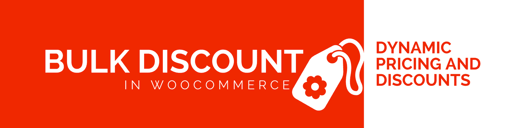
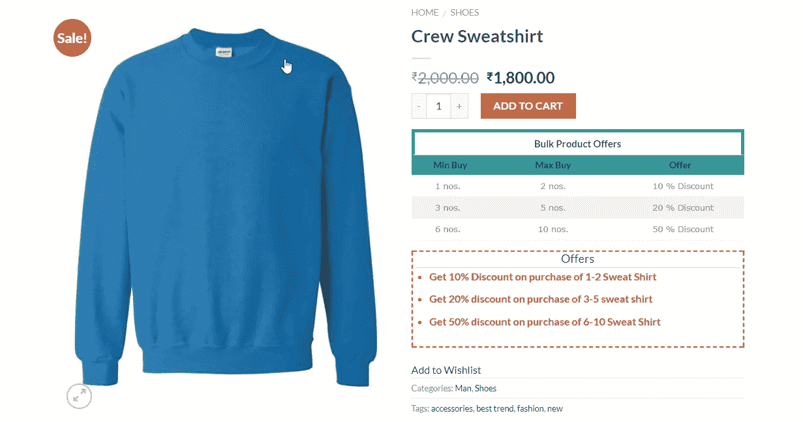
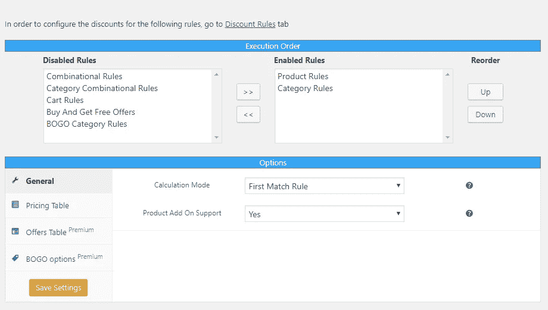
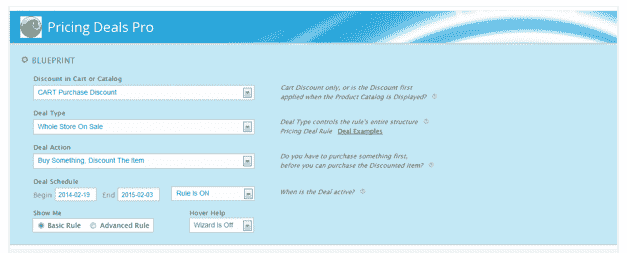

# WooCommerce 的顶级免费动态定价和折扣插件

> 原文：<https://medium.com/hackernoon/top-free-dynamic-pricing-and-discounts-plugins-for-woocommerce-945e9daeb6dd>

Top Free Dynamic Pricing and Discounts plugins for WooCommerce

虽然 WooCommerce 本身不需要任何成本，但它的基本扩展却需要。尽管这是一项不错的投资，但有时，对不确定性的恐惧可能会让你对为你的商店购买插件产生怀疑。

如果你是 WooCommerce 的初学者，仍然不确定你的商店需要哪些插件，那么你来对地方了。

我们已经策划了一系列令人惊叹的动态定价和折扣插件，这些插件对于所有基本的定价需求都非常有用，而且是免费的！

1.  [**x adapter**](https://wordpress.org/plugins/dynamic-pricing-and-discounts-for-woocommerce-basic-version/)对 WooCommerce 的动态定价和折扣

XAdapter’s Dynamic Pricing and Discounts for WooCommerce

它简单明了，设置清晰可辨。而且，对于一个基础插件来说，它的特性列表是相当广泛的。插件作者也为免费版本提供了强大的支持。

**优点**—

*   产品规则也支持变化。因此，可以在变化级别设置规则。
*   可以设置基于产品和基于类别的规则。
*   基于类别的规则类型可以以多种方式使用，例如当一起购买两件或更多物品时给予折扣。
*   基于**用户角色**的折扣规则。
*   日期选择器可用。使用此功能，可以在需要时禁用折扣。
*   提供了向客户显示所有可用折扣列表的报价表。
*   定制**报价表**的位置。
*   **价格表**可根据主题需求定制。

Pricing Table of Dynamic Pricing and Discounts plugin

*   可以为不同的规则设置不同的折扣类型。可用的折扣类型有—“百分比折扣”、“固定折扣”和“固定价格”。
*   可以根据**属性**、**发货方式**、**付款选项给予折扣。**
*   与 [WooCommerce 产品附加组件](https://woocommerce.com/products/product-add-ons/)配合良好。通过插件的设置页面，你可以选择只在普通价格上打折，或者甚至在附加价格上打折。

Product Addon support for Dynamic Pricing and Discounts

*   可以为“购物车”和“类别”设置产品折扣。
*   可以从“设置”页面为每个规则启用重复规则。
*   隐藏或显示“销售”标签的代码段。
*   删除“删除线”价格的代码段。

**缺点**—

*   没有设置全局折扣规则的选项。
*   如果应用了优惠券代码，则没有删除折扣的选项。
*   如果没有文档的帮助，设置起来有点困难。

**2。**

****

**Beeketing for WooCommerce**

**是一个 WordPress 插件，它为你的电子商务网站提供了强大的功能——这是你需要的最全面的电子商务营销工具包。有了这个工具，你可以创建许多折扣选项，并以多种不同的方式在你的网站上做广告。**

## **优点–**

*   **可以创建所有免费礼品/免费送货/折扣优惠，以提高结账率**
*   **可以添加倒计时器，为您的报价营造一种紧迫感**

****

**Beeketing for WooCommerce**

*   **提供百分比折扣和固定折扣**
*   **可以设置购物车级别的折扣。例如:消费超过 100 美元，享受 5%的折扣**
*   **购买捆绑产品时提供折扣**

****

**Beeketing for WooCommerce**

*   **选择在购买前或购买后显示优惠**
*   **选择在退出意向时或特定条件合格后显示报价**
*   **请顾客在脸书/推特上分享他们的购物车，以获得折扣代码/免费送货/免费礼品**
*   **设计美观、现代，并针对高转换率进行了优化**

## **缺点——**

*   **无法在变化级别设置折扣规则**
*   **免费开始，但一些高级功能需要付费帐户才能访问**

**[**2。Rene Puchinger 的 WooCommerce 批量折扣**](https://wordpress.org/plugins/woocommerce-bulk-discount/)**

****

**WooCommerce Bulk Discount**

**看到 10，000+的活跃安装数字后，我们进行了尝试。以下是我们对此的看法——**

****优点**—**

*   **他们有办法为所有可用的产品建立一个全球折扣规则，虽然这个过程有点复杂，但尽管如此，它是存在的。**
*   **折扣显示方面的定制。**
*   **如果应用了优惠券代码，则删除折扣的选项。**
*   **简洁的界面。设置插件时不需要任何文档帮助。**

****缺点**—**

*   **不能在变体标签上设置不同的规则。变化必须遵循产品规则。**
*   **每个产品最多可以有 5 个规则。**
*   **仅基于“数量”的折扣是可用的。**
*   **在“百分比折扣”、“统一折扣”和“固定价格”中的选择在设置标签中完成。因此，一种折扣应该适用于所有产品。**
*   **基于类别的折扣(我们必须从我们的免费版本中删除它)**
*   **调整(我们可以讨论是否也应该删除)**
*   **他们没有对数量进行“最大”检查。**
*   **他们没有检查折扣的“最大值”。**
*   **从支持论坛看，它不提供支持。**

**[**4。瓦尔克为 WooCommerce 定价**](https://wordpress.org/plugins/pricing-deals-for-woocommerce/)**

****

**Pricing Deals for WooCommerce**

**这个插件有大量的功能，这解释了它的 7000+活跃安装。**

****优点**—**

*   **基本版中有许多可用的功能。**
*   **就像其他一些插件一样，如果应用了优惠券代码，你可以选择禁用折扣。**

****缺点**—**

*   **高度混乱的设置页面。**
*   **你可以看到所有的高级功能，其中一些只是不可点击。**
*   **界面差。工具提示部分的显示非常不专业。**
*   **在你可以设置插件来满足你的需求之前，它需要一段时间。**
*   **尽你所能知道哪个特性是基本版本中没有的，这是非常令人困惑的**

**[**5。Woocommerce 所有折扣 Lite By Orion**](https://wordpress.org/plugins/woo-advanced-discounts/)**

****

**WooCommerce All Discounts**

**拥有所有的基本功能，它有一个用户友好的界面**

****优点**—**

*   **简洁的界面。**
*   **一些高级功能，如购物车规则是可用的。**
*   **插件中对每个字段都有很好的解释。**
*   **设置规则时条件的“与”或“或”功能。**
*   **在“步长规则”和“间隔规则”之间选择。“步骤规则”。此功能是为重复规则功能添加的。**

****缺点**—**

*   **仅基于“数量”的折扣。**
*   **只有“固定折扣”和“百分比折扣”。“固定价格”不可用。**
*   **无法在变体级别设置规则。**
*   **没有选择计算模式的选项。**

**希望我们的列表能帮助你的商店选择正确的动态定价和折扣插件！**