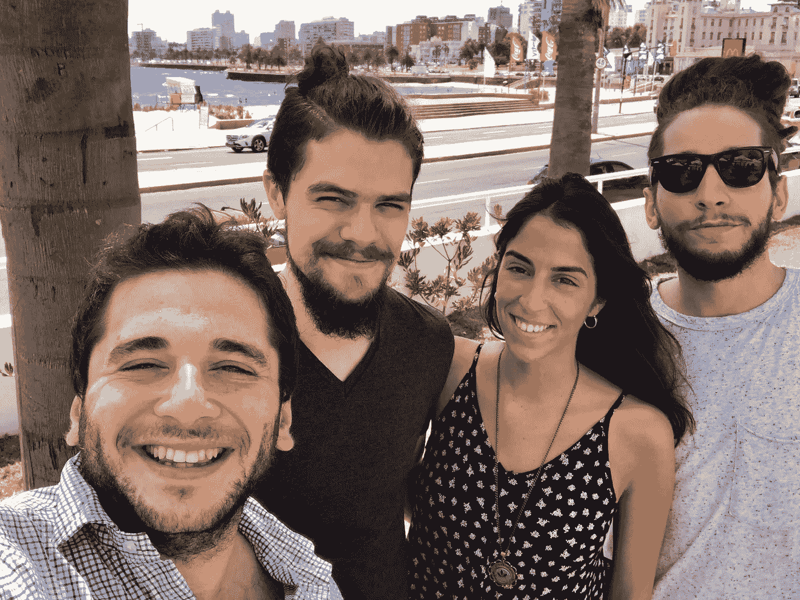

# 任何技术项目的九大经验

> 原文：<https://medium.com/hackernoon/top-nine-learnings-for-any-tech-project-df4804fcfc1>

## 如果你在 2018 年开始一个项目，这个清单可能会派上用场。

像世界上数百万人一样，在离 NYE 还有三天的时候，我花了一些时间来反思和分析我们这一年的成就和失败。我认为它们也可能对任何从事数字项目的人有用，或者对任何想在 2018 年这样做的人有用。

我相信这些经验适用于各种复杂的项目，从简单的网站到耗时数月开发的应用程序。创业？Shopify 商店？你的加密货币咨询网站？有咨询网站吗？任何网站？把这个列表放在手边并避免许多错误是很好的，所以也许它们会在 2018 年帮助你的项目。

# 1-专注是关键，学会说不。

> “你可以做任何事，但不是一切”

我不知道这句话是谁说的，但我认为它总结了第一个关键的学习。你的时间是有限的，你需要 100%的时间来实现你的目标，如果你把时间投资在别的事情上，你会更慢地实现目标。你还会面临许多与你对最终目标缺乏关注相关的问题。

很容易被机会分散注意力。我们被教导要对机会说“是”，然后去想办法让它们发生。最有可能的是，这需要你从你曾经称之为专注的事情中拿出资源。在我不得不忙于未完成的工作，几天后回复邮件，不注意我应该注意的细节之后，我个人学到了这个教训。

我认为说“不”是你需要学习的技能之一，不仅仅是为了兼职项目，也是为了给你带来的许多机会。如果你不能给对方增加价值，就对会议请求说“不”,反之亦然。加密货币投资？听起来很棒，但是投资并不等同于每天交易。

无论如何，如果你说“不”，要有礼貌！永远不要低估任何人，只是没有时间对一切说“是”。

# 2-短期项目短期内无利可图。

虽然学会说“不”是关键，但明智地选择何时说“是”也很有挑战性。如果你不知道怎么做，那就是你会想出办法的时候了。

辅助项目和短期项目让你尝试新事物，它们也能在战略上帮助你关注当前的焦点。我们在副业项目上投资很多，只要它们是我们长期战略的一部分。

我们也预先决定如何衡量成功，因为成功可以用许多不同的方式来衡量。可能是获得了一项新技能，发现了一种需求，或者只是享受了一段很酷的时光。然而，如果你从盈利的角度来衡量成功，要明白短期项目(从零开始)不一定在短期内盈利。

互联网充满了机会，但没有一个是快速致富的。它们都需要研究、开发、改进和时间。搜索引擎对那些经常更新的旧网站和应用程序的排名更高是有原因的。从应用到电子商务商店，我们在建立许多“短期”项目后了解到这一点。只有那些我们投入时间优化和改进的应用程序才是最终盈利的应用程序，比如当我们将 iMessage 应用程序添加到 neural 应用程序中并传播开来时。

 [## 我们是第二名！🎉

### 两个月前，我们写了这篇文章:

blog.beta.uy](https://blog.beta.uy/we-are-2-9a7318391630) 

有些机会真的是一生只有一次，但有些机会是季节性的，每年都会出现一次，所以每次成功都需要在趋势之上增加一点创新和价值。无论是在电子商务、应用程序开发、内容页面，还是任何在线项目中，一定会有你可以利用的季节性趋势。

举个例子，你会在一月份开始看到健康和饮食相关产品的广告，正好赶上你纽约决心的饮食。二月，情人节的礼物会开始出现，然后夏天就要来了。每个月都会有许多你可以利用的趋势，直到圣诞节，数百万人会买他们的丑毛衣。

# 3-全力以赴，但要验证。

专注于一个长期目标并不意味着你需要从一开始就冒所有资源的风险。很多时候，我们太天真了，以至于无法构建出不像我们想象的那样吸引人的产品，完全低估了验证阶段。

验证需要潜在用户的反馈和输入，而实现这一点的唯一方法是创建一个对你所构建的感兴趣的追随者社区。我认为[瑞安·胡佛](https://medium.com/u/c2146664c8e4?source=post_page-----df4804fcfc1--------------------------------)在这篇文章中解释得再好不过了:

 [## 创业？首先，建立一个观众群。

### 几天前，我收到了一封电子邮件，有人向我咨询如何为自己的初创公司找到一名技术联合创始人…

medium.com](/@rrhoover/building-a-startup-build-an-audience-first-9fbba4f1fa15) 

产品搜寻是项目初始阶段最好的工具。我在之前的帖子中写道:

> 产品搜寻团队和社区在我们的旅程中给了我们很大的帮助。从非常诚实的反馈到建议和支持。
> 
> 我相信产品搜索是一个制造商应该在构建任何东西的过程中使用的第一资源，无论目标受众是否是产品搜索社区，它都将帮助你获得可见性和反馈。

如果你在应用程序开发领域，有一个最近宣布的重要工具你应该接受:苹果预购。

 [## 苹果的应用商店现在允许你在 iOS 应用和游戏发布前预购

### 苹果已经悄悄地允许开发者提供他们的应用程序供预购。这是一个基本功能-作为 Android…

techcrunch.com](https://techcrunch.com/2017/12/12/apple-app-store-ios-pre-order-apps/) 

但是不要太担心工具，我相信尼基塔的建议值得一听，毕竟，他做对了几件事:)

# 4-为增长而设计。

今年，我写了一篇关于为增长而设计的重要性的文章:

 [## 大多数人在 TBH 看不到的是，一款售价约 1 亿美元、仅在 9 周前推出的应用

### 为急于一夜成名的产品制造商提供的关于 TBH 的三大见解

hackernoon.com](https://hackernoon.com/what-most-dont-see-in-tbh-an-app-sold-for-100m-and-launched-only-9-weeks-ago-f15edd11505f) 

如果你看不懂，以下是关键要点:

**如果你做了一些对某些用户真正有价值的东西，他们会愿意分享。然而，如果你不鼓励它，提供可笑的简单机制，病毒式增长就不会发生。**

为增长而设计不仅仅是实现增长技巧，它是关于在产品中深度整合传播信息的体验。这是产品设计师需要融入的心态。

# 首先想出你的营销策略。

如果你预先知道你的营销策略，你会为你要做的受众、获取渠道和活动量身定制体验。许多人低估了整合营销策略和产品的重要性。

例如，如果你要使用社交媒体影响者，确保有一个让他们展示自己的用例。如果你的主要获取渠道是 ASO，确保你的关键词排名靠前，设计一个清晰的品牌和名称。

几个月前，我写了一篇关于应用程序开发者营销策略的文章，但是这些见解并不仅限于应用程序:

 [## 我们如何在 App Store 上取得成功并获得 400 万用户

### 一年多前，我们成立了 Beta Labs，目标是创建吸引人的移动应用程序，为年轻人量身定制…

hackernoon.com](https://hackernoon.com/our-legacy-to-app-makers-how-we-succeeded-on-the-app-store-and-acquired-4-000-000-users-a66a9e01253d) 

# 6-成长是伟大产品的结果，而不是前驱。

来自 [Y Combinator](https://medium.com/u/cb8adc841a29?source=post_page-----df4804fcfc1--------------------------------) 的基本建议袖珍指南中的一点就是这一点。你可以在这里阅读:

 [## YC 对创业的重要建议

### 我们给初创公司的很多建议都是战术性的；意味着每天或每周都有帮助。但是有些…

blog.ycombinator.com](https://blog.ycombinator.com/ycs-essential-startup-advice/) 

我希望这份指南能早点出版。我们获得了数百万用户，这些用户利用了让我们的应用程序像病毒一样传播的趋势，但随着时间的推移，我们失去了大部分用户。你可以有一个高转换率和有吸引力的营销策略，但如果你的产品没有附加值，你会烧掉花在增长努力上的每一分钱。

准确而深入地了解用户的能力是聪明工作和努力做无用工作的区别。

这就是为什么没有一夜成功的原因。如果你想做一些有用的东西，反馈循环没有捷径可走。

# 7 人团队就是一切。

用合适的人组建一个团队是最困难的任务。我非常感谢团队中的每个人在我们参与的每个项目中付出的努力、承诺和才华。我们是一个拥有不同技能的团队，但我们都有相同的价值观。这就是为什么我真的相信这句话:

> “不要容忍聪明的混蛋。团队合作的成本太高了。”—雷德·哈斯汀斯，首席执行官网飞

当你 20 多岁的时候，不仅仅是钱的问题。这是关于投资你的时间在其他事情上的机会成本。现在还不是安定下来的时候。每天都是在享受美好时光的同时体验和学习新东西的时候。如果你和一个拥有相同价值观的人才团队一起工作，你就能实现这个目标。

和你一起工作的团队不仅限于公司内部。没有一家公司是在真空中建立的，所以你需要与其他有才华的人和公司合作。

无论如何，避免与那些不认同你的个人价值观或对项目没有相同承诺的人一起工作，不管那个人有多聪明。

# 8-透明沟通。

在参与了许多不同的项目后，我们了解到一些项目没有成功的关键原因之一是缺乏清晰的沟通。包括内部和外部。

交流有助于设定期望值。缺乏沟通会改变他们，让期望和接受之间产生距离。这适用于期待不同产品的客户，期待更好结果的投资者，或者等待任务完成的队友。我想你明白了。

对沟通给予详细的关注对于以更好的方式说出真相也很重要。在创业公司的世界里，有很多坏消息要说。说实话是保持团队信任的关键。

[安德森·霍洛维茨](https://medium.com/u/df45fd4a749d?source=post_page-----df4804fcfc1--------------------------------)写了一篇关于说实话的重要性的文章。这里有一个摘要:

> 如果你领导一个组织，不诚实可能是致命的，因为该组织的执行质量是其沟通质量的函数，而沟通的关键是信任。
> 
> 说实话的事实是，对任何人来说都不容易。不是天然的，也不是有机的。自然的做法是告诉人们他们想听的。这让每个人都感觉很好。。。至少目前是这样。另一方面，说实话是一项艰苦的工作，需要技巧。

以下是完整的帖子:

 [## 如何说出真相

### "我的抽屉都裂开了，我只是实话实说。"-未来，你是一个诚实的人吗？我敢打赌你的回答是“是的”。…

a16z.com](https://a16z.com/2017/07/27/how-to-tell-the-truth/) 

# 9-分享你的进步。

这是我们今年的主要收获之一。它帮助我们与我们从未想过会联系的人联系起来。我们在一月份开始了 [Beta Labs 博客](http://blog.beta.uy)，从那以后我们一直在分享重要的学习和见解。

我们将这九大知识应用到我们 2017 年的最后一个项目中:[九大](http://topnine.co)。你可以在这里了解更多！

 [## 前九名正在走红！

### 宣布网络版

blog.beta.uy](https://blog.beta.uy/top-nine-is-going-viral-1cef13033635) 

我们的帖子已经被数千人阅读，我们非常感谢每一位关注者和读者对我们的支持，但是有一点我们需要特别提及:[大卫·斯穆克](https://medium.com/u/7f91547ce9c9?source=post_page-----df4804fcfc1--------------------------------)和[黑客月](https://medium.com/u/4a8a924edf41?source=post_page-----df4804fcfc1--------------------------------)团队。

Hackernoon 是第一家选择给予我们发言权的出版物，将我们展示给他们的读者。如果你在写作中付出了努力，我推荐你在这里发表它们。很少有其他出版物在能够快速发布文章的同时，做了如此多的内容管理工作。

还有 3 天就要去 NYE 了，唯一要说的就是祝你新年快乐！今年，鞭策自己，启动你一直在思考的项目。如果我或测试实验室的任何人能帮忙，请告诉我。我们将很高兴在 hey@beta.uy 收到您的来信。

这篇文章有帮助吗？分享一下！我真的很感激。