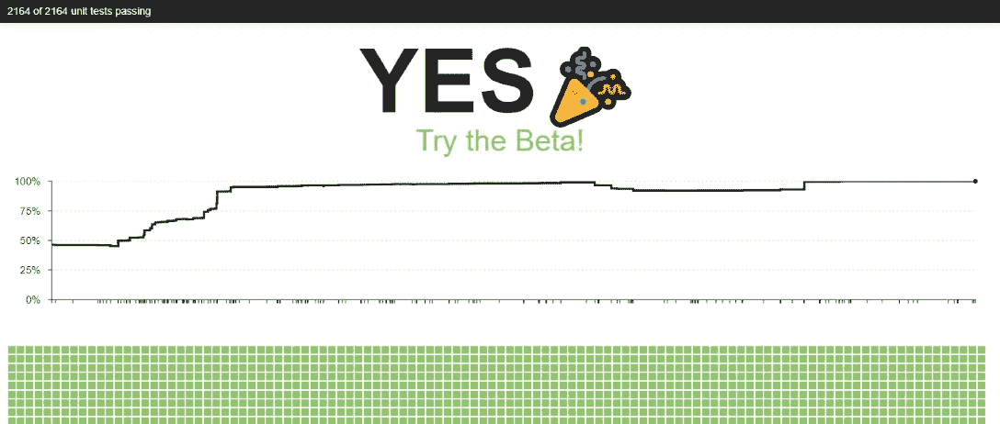

# 探索 React 纤维的顶级资源

> 原文：<https://medium.com/hackernoon/top-resources-to-explore-react-fiber-9a2b19114520>

## 新 React 的版本发布了；探索创新，保持更新

The answer of [isfiberreadyyet.com](http://isfiberreadyyet.com/) is now YES!

***本*条** ***原本出现在***[***dormoshe . io***](https://dormoshe.io/articles/top-resources-to-explore-react-fiber-18)

***(26.09)更新:*******正式发布了！****

***React Fiber (beta)，React 的新版本，出来了！**🎉*

*2014 年，脸书提到其团队正在开发 React 的新版本。最后，在[走廊上的一次对话](https://hackernoon.com/10-hallway-conversations-in-2017-about-web-development-6db77ade3c18)是关于渴望的 React 版本——v 16。在过去的三年里，脸书的一个开发团队一直致力于此，为我们带来前端开发的全新事物。Fiber 不仅仅是 React 的新版本。**纤程是对核心算法**的改写。与 Angular 的[重写不同，Fiber 通过一些小的突破性变化向后兼容“旧”的 React，但它可以很容易地取代旧的 React。](https://hackernoon.com/top-8-resources-to-explore-angular-4-ff2c1b42020a)*

> *React Fiber 是对 React 内核 Adam Wolf 的完全、向后兼容的重写*

*具有大量组件和动画的 SPA 的渲染有时很慢。**Fiber 的重大** **改进是渲染速度更快，并且能够区分元素渲染的优先级**。有了这种能力，任务调度使应用程序看起来更好。*

> *光纤提高了复杂反应应用的感知性能和响应能力— Lin Clark*

*在本文中，我们将回顾关于新 React 的最新资源，探索 Fiber 的亮点，介绍它的架构，并深入研究这些变化的代码基础。*

# *React 16 beta 发行说明和错误处理变更*

*随着 React Fiber 的发布，核心团队发布了两个新帖子。第一个是 Brian Vaughan 发布的 Github，这是关于发布的官方说明。这篇文章包含安装说明，JavaScript 环境要求，一些新概念，突破性的变化和已知问题。*

*第二篇文章发表在脸书 Github 网页上，作者是丹·阿布拉莫夫。这篇文章是关于错误处理的。React 的错误处理机制有一些变化。这篇文章包含了 React 处理组件内部 JavaScript 错误的一些变化。这些变化包含在 React 16 beta 版本中，并将成为 React 16 的一部分。Abramov 展示了 React 15 中的错误处理状态，介绍了错误边界和针对未捕获错误的新行为，而不是 try/catch。此外，还包括现场演示。*

* [## React 16 测试版第 10294 期 facebook/react

### 第一款 React 16 beta 现已公开测试。🎉试用版的入门安装说明…

github.com](https://github.com/facebook/react/issues/10294)  [## React 16 - React 博客中的错误处理

### 随着 React 16 发布的临近，我们想宣布 React 处理 JavaScript 错误的一些变化…

facebook.github.io](https://facebook.github.io/react/blog/2017/07/26/error-handling-in-react-16.html) 

# 脸书首次发布反应纤维

这有点尴尬，但脸书直到现在才开始谈论纤维。去年四月，F8 [会议](https://hackernoon.com/tour-to-my-favorite-javascript-conferences-stack-62b7e4ec7c58)在加州召开。F8 是脸书开发者大会，也是**脸书首次宣布关于光纤**的消息。

> 旧的代码库不一定是坏的，但我们希望从一个新的基础开始，它可以推动我们未来所做的一切——Ben Alpert

这篇文章是关于脸书的声明及其对新技术的严肃意图。脸书已经开始使用光纤，这是一个好消息，向我们展示了光纤的成熟。此外，他们解释了为什么他们决定重写 React 的核心，以及他们的指导方针是什么。

 [## 脸书发布 React Fiber，这是对其 React 框架的重写

### 脸书已经完全重写了 React，它是一个流行的用于构建用户界面的 JavaScript 库。公司还没有…

techcrunch.com](https://techcrunch.com/2017/04/18/facebook-announces-react-fiber-a-rewrite-of-its-react-framework/) 

# 纤维的卡通介绍

[林克拉克](https://medium.com/u/d3391efe481a?source=post_page-----9a2b19114520--------------------------------)的这段对话来自 ReactConf 2017 [大会](https://hackernoon.com/tour-to-my-favorite-javascript-conferences-stack-62b7e4ec7c58)。这次谈话发生在去年三月的加利福尼亚。新的 React 算法提高了复杂页面的响应速度和感知性能。但是要做到这一点，必须从头开始重新考虑架构。

在这个流行的演讲中，克拉克分解了这些新概念，并解释了是什么让它看起来更快。克拉克使用了大量的漫画使其更容易理解。卡通通过可视化的解释使介绍更有吸引力。

Lin Clark’s talk from ReactConf 2017

# React 官方文档中的协调

了解一项新技术的最佳途径之一就是阅读官方文档。大多数情况下，这是准确可靠地阅读创新的最新地方。在这种情况下，React 的文档详细解释了协调算法。

React 提供了一个声明式 API，因此您不必担心每次更新时会发生什么变化。这使得编写应用程序更加容易，但是在 React 中如何实现这一点可能并不明显。**这篇文章解释了脸书在 React 的“区分”算法中所做的选择，**以便组件更新是可预测的，同时对高性能应用程序来说足够快。

 [## 和解-反应

### 用于构建用户界面的 JavaScript 库

facebook.github.io](https://facebook.github.io/react/docs/reconciliation.html) 

# 反应纤维结构

该资源的目标是，在阅读完它之后，您将对 Fiber 有足够的了解，从而能够理解 Fiber 的核心特性实现，最终甚至能够做出反馈。您可以了解协调和渲染之间的差异，以及为什么将它们分开是可行的。

此外，它还介绍了确定何时应该执行任务的过程——调度、什么是纤程及其结构。由来自脸书的核心团队和 Redux 的共同创造者 [Andrew Clark](https://medium.com/u/6025bd347b9a?source=post_page-----9a2b19114520--------------------------------) 解释架构。

 [## acdlite/react 纤维架构

### React-Fiber-architecture——React 新核心算法 React Fiber 的描述

github.com](https://github.com/acdlite/react-fiber-architecture) 

# 微型纤维渲染器

Dustan Kasten 的这个演讲来自 React London 2017 [会议](https://hackernoon.com/tour-to-my-favorite-javascript-conferences-stack-62b7e4ec7c58)。React 能够渲染比浏览器更多的环境。React 实际上是两个独立的部分:核心和渲染器。ReactDOM、ReactNative、ReactVR 只是现有的几种呈现器。随着纤程调解器重写而来的是一个官方的渲染器 API。在这次演讲中，Dustan 将研究一些已经存在的渲染器，并实现自己的 React 渲染器。

Dustan Kasten’s talk from React London 2017

# 看看反应纤维的内部——工作是如何完成的

Korneliusz Caputa 发表的这篇文章是关于这些变化的最新非官方资源。它潜进纤维的内部。它为我们提供了一种通过探索代码流和算法来理解它们的方法。作者专注于这些过程是如何从头开始工作的。这篇文章的目标之一是回顾一些缺乏“新闻报道”的话题。

> 异步工作调度是 Fiber 的核心

每个 React 组件实例都有一个更新器，它还负责组件和核心进程之间的通信。**本文涵盖了更新程序的四个主要职责及其与调度程序的关系**。此外，本文通过展示代码示例，深入到其他领域，如异步工作调度，以及 React 中纤程代码库中使用的一些重要类型和常量。

 [## 看看反应纤维的内部——工作是如何完成的。

### 描述 React Fiber 如何一步一步地操作，从调用客户端 JS 中的“render”函数开始…

makersden.io](http://makersden.io/blog/look-inside-fiber/) 

# 反应纤维:立即尝试

React 是一个开源软件。我们可以通过 Github(或通过 npm)获得它。所以我们只需要从 Github 中克隆出 [react](https://github.com/facebook/react/) 库。对于某些类型的开发人员来说，阅读产品的代码实现是一种很好的洞察力，但是您不需要全部阅读。React 的源代码中散布了许多错误处理、开发日志和性能测量调用。您可以简单地浏览代码，自己探索感兴趣的部分，或者只是浏览代码。

本文帮助您在 React 的存储库中进行克隆、设置和修复错误的初始操作。此外，还有关于如何在光纤和旧实现之间切换的说明。

 [## 反应纤维:立即尝试

### 在您的项目中尝试新的 React 纤维

blog.revathskumar.com](http://blog.revathskumar.com/2017/01/react-fiber-try-it-now.html) 

# 结论

脸书直到现在才开始谈论光纤，但是它的团队正在努力研发改变世界的新技术。社区中围绕 React Fiber 有一场**炒作，现在是时候让它更上一层楼，投入到 Fiber 带给我们的创新中去了。关于它在实践中如何运作仍有许多问题。显然，实现中的许多事情会随着时间而改变。React Fiber 带给我们的创新对于我们的应用程序、用户参与度以及 web 开发的发展至关重要**。它将影响其他框架，以及我们如何设计我们的页面和管理它们的生命周期。****

***您可以关注我的***[***dormo she . io***](https://www.dormoshe.io)***或***[***Twitter***](https://twitter.com/DorMoshe)***阅读更多关于 Angular、JavaScript 和 web 开发的内容。****