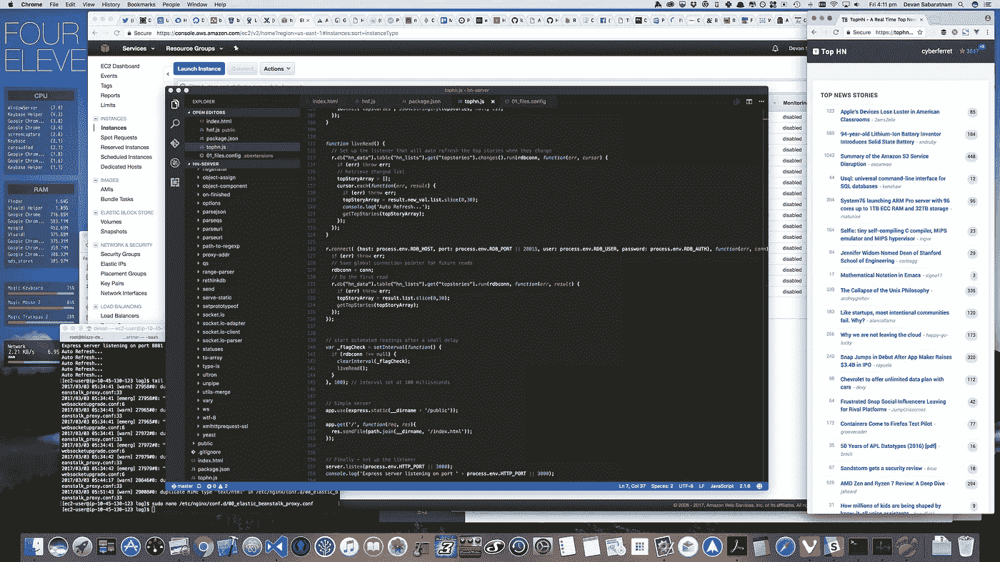
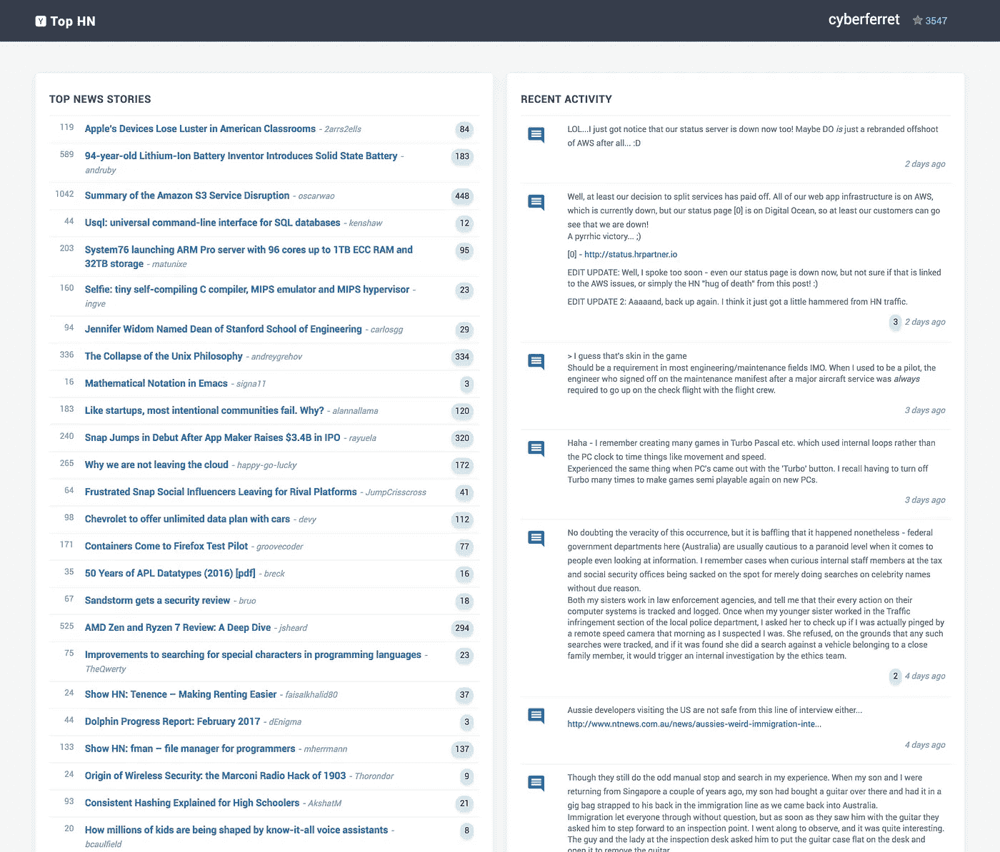
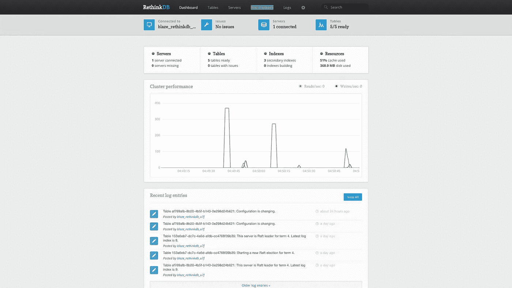
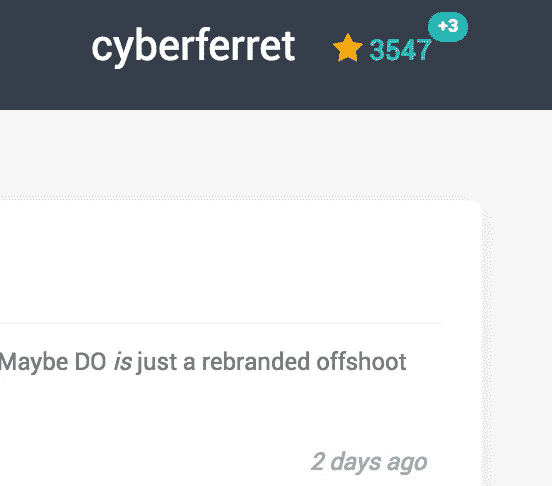

# top HN——一个用 Vue.js 和 RethinkDB 构建的有趣的附带项目

> 原文：<https://medium.com/hackernoon/tophn-a-fun-side-project-built-with-vue-js-and-rethinkdb-f22159641c1b>

TopHN running in a side window so I can see news bubbling up and down in real time while I work away… (Yes, what you see is some actual code from the project — don’t laugh!).

在过去的几年里，我一直试图不断推动我老化的大脑，我发现最好的方法之一就是每个月左右尝试学习一种新的编程语言、框架或方法，只是为了保持技能的敏锐。

我一直对 NoSQL 数据库又爱又恨，我已经在纯 SQL 系统上工作了几十年，所以我想尝试一下。我也努力学习了一下 [Javascript](https://hackernoon.com/tagged/javascript) 前端框架，并希望提高我在该领域的技能。

所以在刚刚过去的这个周末，我决定和 [Vue.js](https://vuejs.org/) 以及 [RethinkDB](https://rethinkdb.com/) 一起“堕落和肮脏”。程序员之间有很多关于 React vs Vue vs Angular 等的善意玩笑。我想亲自看看哪个更适合我的编程风格。我已经在 Angular v1 和我的移动应用程序开发中做了很多工作(使用 Cordova 和 [Ionic](https://ionicframework.com/) )，并且想看看 Angular v2 和我提到的其他框架是否会是一个简单的过渡。

长话短说，我对 Angular v2 的理解和反应有点困难。在一天结束时，Vue.js 似乎更自然，对我来说可能更接近 Angular v1，我发现自己能够理解概念，并在短时间内开始组装一个基本的应用程序。

RethinkDB 最近也出现在新闻中，他们的[母公司关闭了](https://rethinkdb.com/blog/rethinkdb-shutdown/)，尽管数据库本身看起来将作为开源继续存在。我一直很喜欢 RethinkDB 管理控制台的外观，以及在各种平台上安装的方便性，所以我决定在我的开发 Mac 上安装它并尝试一下。

# 该项目

最大的问题是——建造什么？我想做一些真正有用的东西，而不是又一个一次性的项目。然后，上周的一天，当我正在浏览[黑客新闻](https://news.ycombinator.com/news)时，我突然想到。

现在，我喜欢浏览黑客新闻，了解最新的技术文章，但我发现自己经常做的事情之一是(a)每隔几分钟刷新主“头条新闻”屏幕，看看人们在谈论什么，以及什么进入了前 30 名，以及(b)检查我最近亲自发布的消息，看看是否有任何回复。 并且经常在屏幕上方查看我的因果平衡，看看我发布的任何内容是否有大量的支持或反对。

这三件事似乎是我在网站上的主要活动(除了阅读文章)，所以我决定看看我是否可以建立一个小的辅助项目来使它更容易。于是[拓丰](https://tophn.info/)诞生了！

拓丰简单来说是什么？嗯，它基本上是在你的网络屏幕上实时显示头条新闻。公平地说，现在已经有很多其他的黑客实时新闻了，很多都比我的好得多——但是我希望我的解决方案非常具体。其他大多数显示评论和其他细节，但我希望我的解决方案只是一个“仪表板”风格的视图，显示与我相关的重要内容(希望其他大多数用户也是如此)。

首先，我决定看看[的 HackerNews API](https://github.com/HackerNews/API) 。我很兴奋地看到这是基于谷歌的 [Firebase](https://firebase.google.com/) 。两年前，我在几个移动编程工作中使用过 Firebase，非常喜欢他们用来发布变更的异步“推送”系统。我考虑过是否直接使用 Firebase feed，但最终决定不使用，因为我将进行一些其他的数据操作和轮询，我不想让更多的轮询请求直接扰乱 Firebase feed，而是尝试在 RethinkDB 中复制 HN 数据集。

所以我继续在云中设置了一个专用的 RethinkDB 服务器。按照他们的指示，这是小菜一碟。在同一台服务器上，我构建了一个小的 Node.js 应用程序(只有大约 30 行代码)，它的唯一目的是侦听来自 Firebase 的 HN API 提要，获取当前数据，并将其快照保存在我的 RethinkDB 数据库中。

《黑客新闻》实际上发布了一些非常酷的内容——大约每 30 秒，一份排名前 500 的文章列表就会以 JSON 字符串的形式发布出去。此外，他们有一个专门的 feed，每 20 到 30 秒就会推出一个变更列表。这包括已经被改变或输入到他们的系统中的文章和评论 id 的列表，以及已经改变了他们的状态的任何用户的用户 id(即，进行了简档改变，或者他们的因果报应被某人增加/减少，或者张贴了评论等)。).

我决定使用这两个提要作为构建复制数据集的基础。每次推出“前 500 名”提要时，我都会获取文章的 id，在 RethinkDB 中快速查看它们是否已经存在，如果不存在，我会单独询问缺失的文章，并将它们放在 RethinkDB 中。这样做了几天后，我的数据库里就有了数万篇文章。

我还会嗅出“变化”提要，扫描那里的文章，看看我是否已经有了它们，如果没有就复制它们。用户也一样。每次在“更改”提要中提到某个用户时，我都会抓取他们更新后的个人资料并保存在 RethinkDB 中。

上面的屏幕截图显示了 RethinkDB 管理控制台，这是一个非常酷的工具，用于检查服务器性能，以及测试查询和管理数据表和碎片。

到目前为止一切顺利。复制的数据库每隔几秒钟就会被数据填满。现在的问题是——如何处理它？

我很高兴看到 RethinkDB 也有一个“[变更()](https://rethinkdb.com/docs/changefeeds/javascript/)”特性，可以在数据变更发生时发布。但与 Firebase 工具不同的是，这些不仅仅是客户端工具，还需要某种服务器平台来实现这些功能。所以我决定使用另一个 Node.js 应用程序作为服务器后端，使用 Vue.js 作为界面元素的前端。

我还需要使用 [socket.io](https://github.com/socketio/socket.io) 在两者之间建立一个连接。我有点失望，如果没有它，似乎没有任何本机方法可以将更改从服务器推/拉到客户端，但是嘿——我们都在学习新的东西，构建一个套接字驱动的应用程序肯定是我以前没有做过的事情(至少不是从头开始)。

所以，一天结束时，第二个 Node.js 应用程序将位于不同的服务器上，并等待用户访问该站点。现在，用户可以做几件事。他们可以简单地访问网站的顶级 URL，并实时查看排名前 30 的提要。我的意思是几乎实时。随着新文章的发表，或者它们在前 30 名中上下移动，页面视图会上下显示它们，并显示最新的分数和评论计数器。

如果用户选择输入他们的 HN 用户名，该页面还会额外实时显示用户的 Karma 余额，以及在过去几分钟内发生了多少变化的符号。没有什么比虚荣指标更能让人兴奋了！

此外，如果输入他们的用户名，页面将显示他们最近发表的 10 条左右的评论和故事，因此他们可以关注对评论的任何回复等。

第二个 Node.js 服务器本质上是一个推/拉服务器。它会悄悄地将前 30 个列表更改推送到与其连接的所有 web 浏览器。它还将为用户指定了用户名的任何浏览器设置一个自定义的推送事件处理程序。如你所料，这需要一点管理和服务器资源，所以我希望我永远不会经历 HackerNews 的“死亡拥抱”,一群人同时登录，因为我真的不知道在它尖叫着停止之前它会扩展到什么程度。

Vue.js 组件纯粹坐在那里，监听来自服务器推送的 JSON 数据包，然后相应地格式化它们，并在网页上显示它们，而不必刷新。

我还没有进入我如何在这里建立它的疯狂的细节，但是如果有任何兴趣并且我得到许多请求，那么我将公开发布一些代码片段并且进入我如何建立各种组件的更深的细节。

总而言之，我对 4 到 5 天的兼职编码感到非常满意。我认为这是一个有用的工具，正如你从标题图片中看到的，我倾向于在旁边开一个窄的 Chrome 窗口，这样我就可以关注新闻事件，看它们上下浮动。网页也是完全响应的，并且为了可移植性，应该可以在大多数移动浏览器上工作。

你是黑客新闻成员吗？何不看看 [https://tophn.info](https://tophn.info) 让我知道你的想法？

> [黑客中午](http://bit.ly/Hackernoon)是黑客如何开始他们的下午。我们是 [@AMI](http://bit.ly/atAMIatAMI) 家庭的一员。我们现在[接受投稿](http://bit.ly/hackernoonsubmission)，并乐意[讨论广告&赞助](mailto:partners@amipublications.com)机会。
> 
> 如果你喜欢这个故事，我们推荐你阅读我们的[最新科技故事](http://bit.ly/hackernoonlatestt)和[趋势科技故事](https://hackernoon.com/trending)。直到下一次，不要把世界的现实想当然！

