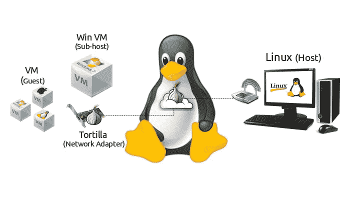

# 安全地存放 Linux 上的所有东西

> 原文：<https://medium.com/hackernoon/tor-all-the-things-on-linux-269d7a5e3b4f>

> 通过 GNU/Linux 机器上的 Tor 透明地路由所有数据包。

网络安全公司 [CrowdStrike](http://www.crowdstrike.com/) 发布了一款名为 Tortilla 的伟大工具。Tortilla 的作用是通过 Tor 网络路由所有数据包，在虚拟机(VM)和互联网之间创建一个安全隧道。它的工作方式基本上是通过将虚拟机的虚拟网卡连接到 Tortilla 的…