# 游览我最喜欢的 JavaScript 会议堆栈

> 原文：<https://medium.com/hackernoon/tour-to-my-favorite-javascript-conferences-stack-62b7e4ec7c58>

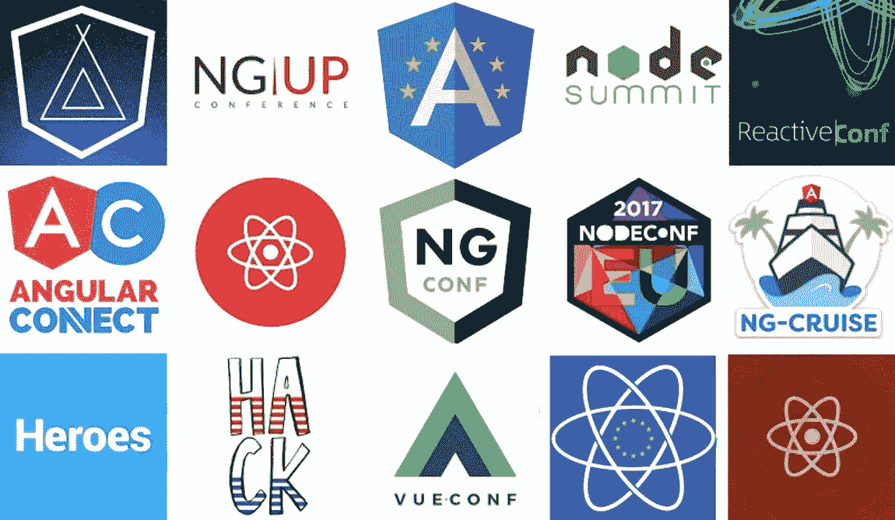

***本*条** ***原本出现在***[***dormoshe . io***](https://dormoshe.io/articles/tour-to-my-favorite-javascript-conferences-stack-11)

JavaScript 专区充斥着世界各地举行的数百场会议。这些会议涵盖了许多主题。像 Angular 和 React 这样的领域在会议领域非常稳定，许多会议都有大型赞助商的支持。此外，**还有像 Vue.js 这样的领域，非常新颖，具有开创性**。

在过去的几年里，围绕着会议的讨论是惊人的。它们变得越来越大，越来越普遍。赞助商和主办方比较多。通常，组织者会为会议建立一个吸引人的网站。此外，更多的开发者希望作为演讲人之一参与其中。富裕的旅游是围绕女主人所在国家的会议日建立的。相关的研讨会和黑客马拉松，我们都从中受益。

在本文中，我们将讨论我最喜欢的各种主题的会议。我们将学习新的东西，如什么是“多元化支持票”，哪个会议在一年假期后回来，以及哪个“历史事件”将在不久的将来发生。文末有**惊人奖金**😍

# 有角的

## ng-cruise——第一届角度巡航会议

[@ ng cruise](https://twitter.com/ngcruise)
2017 年 5 月 29 日—6 月 2 日| Oceana(迈阿密到巴哈马)
30 位演讲人| 17 场讲座| 1 条路径| > 810 美元
[ngcruise.com](https://ngcruise.com/)|[博客](/@ngcruise)

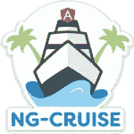

这是一个为期 3.5 天的会议，包括演讲、游览、研讨会等。本次会议由 ng-conf 主办。计划在三个不同的热带景点进行三次奇妙的短途旅行。这艘船叫做[海洋之魅](https://www.royalcaribbean.co.uk/our-ships/enchantment-of-the-seas/activities/)。它是皇家加勒比英国游轮公司的一部分。这里有几个游泳池和按摩池(适合家庭和成人)、一个全套水疗中心、攀岩、一条跑道、蹦极蹦床、商店、一流的餐厅，甚至还有一个中庭。哇！
赛道:佛罗里达州迈阿密|巴哈马拿骚|巴哈马可可岛|佛罗里达州基韦斯特🐳。

## 以色列国际角度会议

[@ angular up](http://twitter.com/angularup)
2017 年 6 月 25 日|以色列特拉维夫
18 位演讲者| ~22 场会议| 2 条路径| 105–280€
angular-up.com

AngularUp 大会让我们有机会聆听来自世界各地的顶级演讲者，了解 Angular 及其生态系统、打字稿、工具等的现在和未来。会议的网站建议我们参加一个以色列的角度之旅，漂浮在死海，漫步在耶路撒冷的街道上，品尝美味的鹰嘴豆泥🤣。

## 角坎普

[@ angular camp](http://twitter.com/AngularCamp)
2017 年 7 月 6 日–7 日|西班牙巴塞罗那
> 20 位演讲嘉宾| > 20 场讲座| 2 条路径| 260–400€
[angularcamp.org](http://angularcamp.org)|[博客](https://angularcamp.org/blog/)

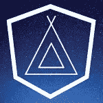

AngularCamp 是一个协作性的社区活动，面向所有有兴趣的人，以协作的方式分享他们最近的工作。
在活动开始时，参与者提出关于讲座、研讨会和演示的想法，这些想法将被整理并放入会议中。此外，组织者已经收到了一些建议，这些建议将成为今年活动的固定部分。在不久的将来，我们将在日程表页面上找到它们。
为了说服你的老板，读读[这篇文章](/@AngularCamp/how-to-convince-your-boss-to-send-you-to-angularcamp-2017-a0ba29cc75e5)。

## 角顶点

[# angular summit](https://twitter.com/hashtag/angularsummit)
2017 年 9 月 25-27 日|马萨诸塞州波士顿
10 位演讲人| 29 场讲座| 1050 美元
[angularsummit.com](https://angularsummit.com)|[博客](https://angularsummit.com/blog/list)

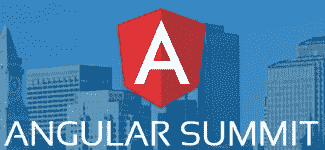

Angular Summit 是一个为使用 Angular 和现代 web 开发工具的开发人员举办的会议。这是一个为期两天的会议，可选择全天培训。Angular Summit 包含了最新的技术和见解，可以帮助您构建一些伟大的东西。Angular Summit 是唯一一个提供 90 分钟深度技术会议的 Angular 会议。此外，它还提供五个全天可选研讨会。

## Angular connect——欧洲最大的角度会议

[@ angular connect](https://twitter.com/angularconnect)
2017 年 11 月 7-8 日|英国伦敦
> 50 位演讲人| 2 条路径| 490-790€
[angularconnect.com](https://www.angularconnect.com/)|[博客](https://www.angularconnect.com/2017/blog/)

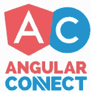

AngularConnect 是一个为期两天的多轨道会议，汇集了世界领先的角度专家，包括谷歌的核心角度团队。

## ng-Europe——最初的欧洲角度会议

[@ ngEurope](https://twitter.com/ngEurope)
2018 年 2 月 1 日–2 日|法国巴黎
> 30 位演讲嘉宾| > 30 场
[ngeurope.org](http://ngeurope.org)

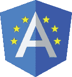

ng-europe，原欧洲角度大会，**休假一年后回来**。2018 版将为我们带来 Angular 社区最牛逼的人。第一轮的门票将很快提供，以及呼吁纸🗣.

## ng-conf——世界原创角度会议

[@ ng conf](https://twitter.com/ngconf)
2017 年 4 月 5 日–7 日|犹他州盐湖城
~80 位演讲人| ~90 场讲座|多路
[ng-conf.org](http://ng-conf.org)|[直播](https://www.ng-conf.org/livestream/)

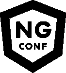

今年，ng-conf 充满了有趣的谈话。这些演讲既有创造性又有艺术性，这让它们变得非常棒。此外，一个 360 度摄像机安装在会议的前排，直播两天的会议。ng-conf 提供了一个应用程序，包括完整的会议日程、所有研讨会、讲座和课外活动。

***你可以在正规的***[***Angular . io***](http://angular.io/events)***网站查看角事件列表。***

# 反应

## 连锁反应——反应本地会议

[@ ChainReactConf](https://twitter.com/chainreactconf)
2017 年 7 月 10 日— 11 日|俄勒冈州波特兰
26 位演讲者| 20 场会议| 1 条路径| 450 美元
[infinite.red/ChainReactConf](http://infinite.red/ChainReactConf)|[Slack](https://chainreactconf.herokuapp.com/)

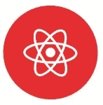

React Native 会议将由脸书、Airbnb 和其他公司的移动软件工程师就 React Native 进行多次演讲组成，涉及从初学者到专家的各种主题。

## 反击反弹

[@ ReactRally](https://twitter.com/ReactRally)
2017 年 8 月 24 日–25 日|犹他州盐湖城
20 位演讲者| 1 条路径| 300–400 美元
reactrally.com

React Rally 是一个为期两天的单轨会议，面向使用脸书 React.js、React Native 和相关工具的所有背景的开发者。演讲者将涉及 React Native、Flux、ES6、同构通用 JavaScript 等主题。

## 反应日

[@ reactjsday](http://twitter.com/reactjsday)
2017 年 10 月 6 日|意大利维罗纳
20 位演讲者| 1 条路径| 45–55€
[2017 . reactjsday . it](http://2017.reactjsday.it/)

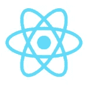

它向前端引入了新的开发范例和最佳实践，聚集了大量活跃的开发人员社区。
本次会议由 jsDay 的组织者 GrUSP 与 FEVR 合作举办。

## ReactEurope —最初的欧洲 React.js & Native 2 会议

[@ ReactEurope](https://twitter.com/ReactEurope)
2017 年 5 月 18 日— 19 日|法国巴黎
22 位演讲嘉宾| > 20 场| 1 条路径|黑客马拉松
[react-europe.org](http://react-europe.org)

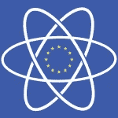

ReactEurope 将核心团队中最优秀、最有激情的人带到我们所热爱的社区中最酷的人面前。该会议旨在发表演讲，激发和探索新的未来主义想法，涉及我们从 React 生态系统中享受的所有技术，如 React.js、React Native、GraphQL、Relay、Universal apps、Webpack、inline CSS 等。

***你可以在正式*** [***脸书的***](https://facebook.github.io/react/community/conferences.html) ***页面查看 React 事件列表。***

# 结节

## 节点峰会

[@ node summit](https://twitter.com/NodeSummit)
2017 年 7 月 25 日–27 日|加州三藩市
> 20 场| 545–645 $
[nodesummit.com](http://nodesummit.com)

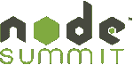

Node Summit 是专注于 Node.js 和“**Node**的生态系统”的最大会议。加入我们，聆听商业领袖和技术专家讨论 Node.js 在未来计算中的变革角色。
Day Zero 为有限的受邀与会者提供了参加更多讲座、研讨会和教育会议的机会，以及更多与 Node.js 社区和思想领袖交流的机会。

## NodeConfEU

[@ nodecaffeu](https://twitter.com/NodeConfEU)
2017 年 11 月 5 日–8 日|爱尔兰基尔肯尼
> 20 位演讲者| 700$
[nodeconf.eu](http://nodeconf.eu)

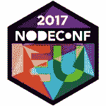

NodeConf EU 是欧洲主要的 Node.js 活动，为 Node.js 社区提供论坛。这是一次非正式的思想聚会。它为与会者提供了一个在轻松、热情、友好、最重要的是尊重的环境中与朋友、同事和演讲者会面的机会。
这个会议涉及一个同行社区，**没有 VIP，每个人都是平等的**并公开回答有关节点或技术的问题，一起交流和解决问题。

***你可以关注正规***[***Node . js***](https://nodejs.org/en/get-involved/events/)***网站中的节点事件列表。***

# 更多会议

## js heroes——一个开源社区会议

[@ js heroes](http://twitter.com/jsheroes)2017 年 6 月 8 日–9 日|罗马尼亚克卢日-纳波卡
20 位演讲人| 24 场会议| 2 条路径| 140–170€
[js heroes . io](http://jsheroes.io/)

> JSHeroes 是我们的梦想之一，也是一个活跃社区的高点。我们真的很想看到它成真。我们知道这是一个挑战，组织这样一个国际规模的活动可能看起来很疯狂。我们已经考虑了所有的风险，我们每个人都决定为它承担个人责任，这样我们本地的 Cluj JavaScripters 社区就会发展成为一个全球性的 JSHeroes 社区。

在为期两天的会议中，英雄们将谈论 JavaScript 和 Web 开发领域的最新趋势。有一种特殊的票证类型，称为“多样性支持票证”。购买这个可以为您获得一张 JSHeroes 门票，以及一张 JSHeroes 门票给**社区中无法前来**的人，通过他们的多样性门票申请进行选择。太棒了。

## vue-conf——全球第一个**官方 Vue.js 会议**

[@ vue conf](https://twitter.com/vueconf)
2017 年 6 月 21 日–23 日|波兰弗罗茨瓦夫
15 位演讲嘉宾| 14 场会议| 1 条路径| 300—600€
conf.vuejs.org

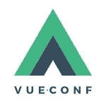

围绕 vue-conf 有很多议论。这是全球**第一次**官方 Vue.js 发布会！很刺激。想起 5 年前 AngularJS 的第一次会议。对于 Vue 和 JavaScript 社区来说，这是一个历史性的时刻。该会议由[anglebrackets.org](https://medium.com/u/4f198f5f1f12#!/)|[宣传册](https://devintxcontent.blob.core.windows.net/showcontent/Brochure%20and%20Cover%20Letters/DEVint_Spring17_brochure.pdf)

Anglebrackets 集合了 Angular、HTML 5、ASP.net、bootstrap、Node.js 等开源合作者——这是开放网络爱好者的大会。

## 半堆栈

[@ London _ Ajax](https://twitter.com/london_ajax)
2017 年 11 月 17 日|英国伦敦
1 路径| 80(~ 92€)
[halfstackconf.com](http://halfstackconf.com)

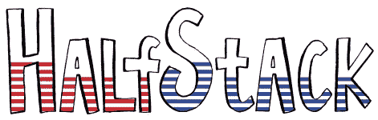

HalfStack 是在 Shoreditch 酒吧举行的为期一天的单场趣味 JS 会议。演讲将包括各种现代前端开发主题——ES6、Typescript、React、Dojo 2、WebGL 等等——主要来自伦敦的主要演讲者💂。

# 额外收获:如何保持更新？

你可以在社交网络会议的页面上关注每一个会议，但是还有很多。
**在[一个互动页面](http://lanyrd.com/topics/javascript/)中向我们建议这些事件的列表。您可以按主题、国家或城市过滤活动。此外，您可以将日历 保存到您的 iCal、Outlook、Google 或 Yahoo 日历中👏。**

# **结论**

**在当今快节奏的世界中，技术日新月异，在掌握基础知识的同时保持领先是一项挑战。会议是学习你感兴趣领域新事物的最好方式之一。组织者和演讲者严格要求打造创新、有趣、吸引人、更新和精确的讲座。在许多情况下，新的声明和消息是由像谷歌和脸书这样的女主人公司说的。所以，如果你不去那里，就看他们的视频…**

****

*****您可以关注我的***[***dormo she . io***](https://www.dormoshe.io)***或***[***Twitter***](https://twitter.com/DorMoshe)***阅读更多关于 Angular、JavaScript 和 web 开发的内容。*****