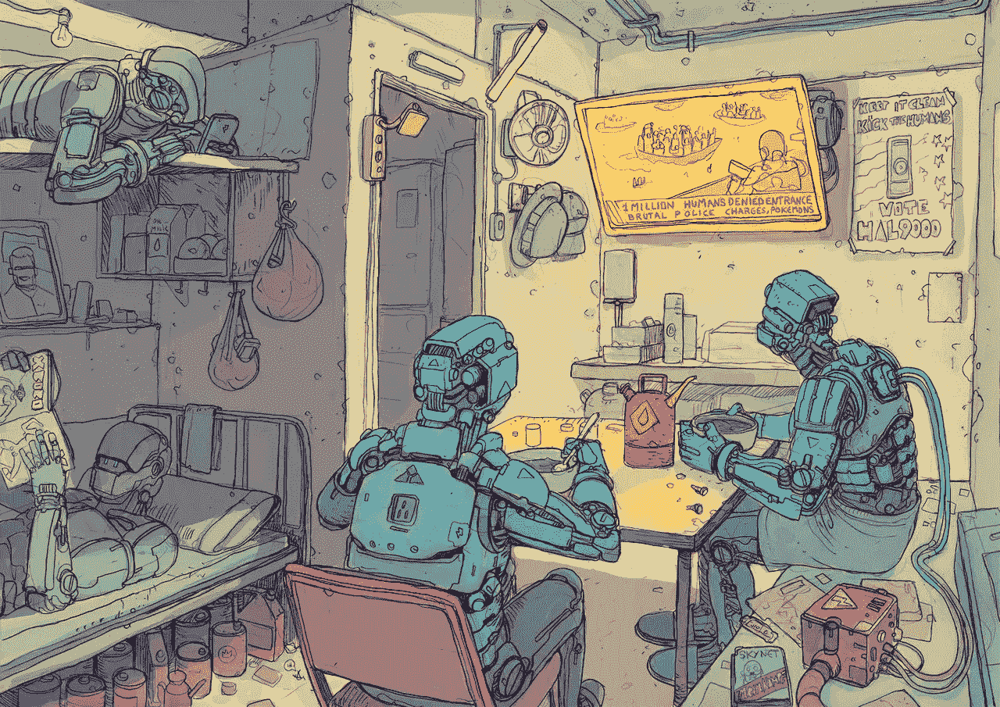

# 迈向更好的代码，关于改进的想法

> 原文：<https://medium.com/hackernoon/towards-better-code-9b7f35cca99e>

面对现实吧，我们现在写软件已经几十年了。我们不能再声称自己是一个新的领域，并以淫秽作为发布草率代码的借口。

我们大多数人都能区分好代码和坏代码，但是我们如何去创造漂亮的软件而不仅仅是阅读它呢？

好吧，让我们在这里做一个尝试。

*still some time left before the machines replace us, so why not code better? Illustration by* [*IX Citadel.*](https://ixcitadel.com/)

这篇文章不会教你软件维护的禅。相反，它只是一个来自内存的转储，按照[伪随机](https://hackernoon.com/tagged/pseudo-random)顺序排序，以确保数据的持久性。希望在这个过程中能实现一些价值。

## **通过代码感同身受**

> 说让别人听…写让别人读

简洁中有优雅。代码高尔夫可能会帮助你赢得 [JS1k](http://js1k.com/about) ，但是*行-未编写的*将总是丢失。与最长的混淆障碍相比，空白的鸿沟是合作的更大障碍。

即使在为数据检索编写简单的包装器时，我也总是发现留下注释作为标记很有用。一些恰当的注释可以节省大量的回溯和探索的工时，尤其是在高度协作的团队中。

当涉及的开发人员数量超过一个时，对于大型项目来说，清晰的需求就变得不可协商了。问题是 *n* 不是一个瞬时测量值。即使是同一个人在几个月后评审代码， *n* 变得大于 1，规则仍然适用。

## (不)重写以更新

忽视包容性需求的项目很少得到更新。相反，功能更新甚至小的修复都是通过系统重写来实现的。

像许多程序员一样，我有时会跳起来写新代码，而不是读旧代码。这可以理解为没有遵循前面章节的副作用，但在开发软件时，这仍然是一个不合标准的决定。

旧的代码可能有很多保证，而你的新解决方案没有。首先，现有的代码可以工作，而你的代码仍然处于理论上更快的领域。我们有版本控制软件是有原因的，使用它们。

## 删除你的完美之路

> 每一块石头都有一座雕像……雕刻家的任务就是去发现它。可能是米开朗基罗

以删除代码行为荣。我期待有一天我的`git`提交显示更多的红色而不是绿色。为了清晰起见，详细程度不是必需的依赖项。事实上，清除*不再相关的*决策路径和修剪迂回的执行周期提高了可读性，并减少了未来 bug 出现时的搜索空间。

如果你的经理问你在一个项目中添加了多少行代码，我只有一条建议——运行；*快速而反方向的*。

## 抽象不是永恒的

我们都喜欢抽象，它们让我们免于重复，让我们站在巨人的肩膀上，是成为 10 倍摇滚明星忍者的秘密。好吧，玩笑归玩笑，我不得不承认，抽象真的是很有价值的工具。它们允许我们利用现有的代码作为假设，在编写更高级别的代码时可以*抽象掉*。

然而，你可能也听说过[泄漏抽象法则](https://www.joelonsoftware.com/2002/11/11/the-law-of-leaky-abstractions/)。如果没有，链接就在那里，我会等，乔尔是一个比我好得多的作家。

理解抽象的成本是开发人员旅程中至关重要的一步。学习寻找隐藏成本是成长为程序员的关键一步。越早实现，就越容易从欺骗性的幻想中醒来。

对于彼得·泰尔的逆势问题，我的一个回答是，指导实践的原始积累与天生的天赋变得难以区分。

通过共同努力，每天都写出更好的代码，我的希望是开发软件从思想到芯片有一个更紧密的执行步骤。

**在你离开**之前，请注意，我在 [Semantics3](https://www.semantics3.com/) 工作，通常会写博客[关于我在为电子商务公司构建数据驱动的人工智能方面的](https://engineering.semantics3.com/an-unexpected-journey-a-dbas-tale-7a0273e685c9) [技术](https://engineering.semantics3.com/real-time-analytics-using-postgres-702e3796f71c) [冒险](https://engineering.semantics3.com/moving-machine-learning-from-practice-to-production-9c462eeef9fa)。

要了解更多，请查看我们的博客，或关注我的媒体。