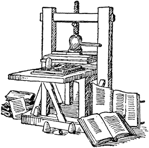
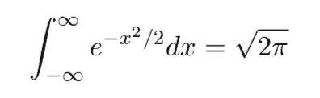

# 浏览器中的 LaTeX

> 原文：<https://medium.com/hackernoon/towards-latex-in-the-browser-2ff4d94a0c08>



The way we used to do it.

TeX(希腊语中的/ˈtɛx/ tekh)

[MiniLatex Live](https://jxxcarlson.github.io/app/miniLatexLive/index.html)[试玩 App 二](https://jxxcarlson.github.io/app/meenylatexdemo2/index.html)

[近期新闻](https://minilatex.com/)

著名的计算机科学家唐纳德·克努特对他的《计算机编程的艺术》第二卷的校样的外观和美学感到失望，他开始为设置数学文本制作合适的工具，他觉得这项工作需要大约六个月的时间。这是 1977 年。到 1978 年，他有了工作程序，命名为 *TeX，*并于 [1989 年](https://en.wikipedia.org/wiki/TeX)以最终形式发布。从那以后，它一直是数学排版的基础。因此，为了产生公式



一个人写了咒语

```
$$
  \int_{-\infty}^\infty e^{-x^2/2} dx = \sqrt{2\pi}
$$
```

Knuth 的程序扮演了魔术师大师的角色，将咒语变成了上面显示的美丽公式。写这样一个神秘的符号序列来获得想要的艺术效果似乎是倒退，或者仅仅是复古。在鼠标和触摸屏的时代，肯定有更好的东西！也许吧，但是那些日复一日做数学的人是这样做的，不是出于无知或固执，而是因为这是更好的方法:更快，一旦你知道你在做什么，保证给你一个漂亮的结果而不浪费时间，并且能够处理你可能发现或发明的最古怪的数学。

## MathJax

TeX、LaTeX 和 Postscript 一起解决了为打印而编写数学文本的问题。将 PDF 加入其中，以电子方式分发整个数学文本的问题也就解决了。但是万维网呢？可以在浏览器中编辑和显示 LaTeX 吗？

MathJax(见[mathjax.org](http://www.mathjax.org))解决了浏览器问题的一半——数学文本本身的显示，它被美元符号或双美元符号隔开，就像上面的例子。结果非常漂亮，这是对 MathJax 团队技术和工艺的致敬。MathJax 是你在互联网上找到的处理数学文本的博客。

尽管如此，还是有差距，因为 LaTeX 不仅仅是显示公式——还有自动编号的部分和子部分、由方便的标签系统交叉引用的公式、定理的特殊“环境”、逐项列表、逐字文本等。等。那么问题来了:对于美元符号之外的乳胶部分能做什么呢？

## 微小胶乳

在浏览器中复制所有的 LaTeX 是一个过分的要求，但不过分的是定义一个合理的子集，可以用常用工具或一些新的基于浏览器的工具来处理。做到这一点是微型乳胶项目的目标。虽然仍处于实验阶段，但该项目显示出了希望——例如，看看这些文件和草案: [MiniLaTeX](http://www.knode.io/#@public/445) 、 [Infinity](http://www.knode.io/#@public/378) 、[量子场论笔记](http://www.knode.io/#@public/424)和 [Elm by Example](http://www.knode.io/#@public/480) 。它们是使用 MiniLatex 使用编辑工具编写的，因此提供了一个原始的概念证明。

您可以使用 [**MiniLaTeX 演示应用**](https://jxxcarlson.github.io/app/minilatex/src/index.html) 来试验 MiniLaTeX。要用 MiniLaTeX 写文档，试试 [**www.knode.io** 。由于这个项目处于非常不稳定的发展阶段，我欢迎(也需要)评论、批评和错误报告。](http://www.knode.io.)

## 具体细节

MiniLaTeX 项目采用分而治之的策略，使用 MathJax 呈现所有用美元符号隔开的文本。为了处理 LaTeX 在围栏之外的部分，我们使用了一个*解析器*——一个专门的程序——它读取 LaTeX 源文本并将其转换为一种称为抽象语法树(AST)的中间形式。AST“知道”LaTeX 的语法，并以这样一种方式对这种知识进行编码，使得第二个程序 *renderer* 可以很容易地将其转换成 HTML，HTML 是编写网页的语言。简言之，就是把一种语言翻译成另一种语言。

## 变得技术化

现在让我们来谈技术，或者至少谈一点技术。真实交易见[微小胶乳技术说明和进度报告](http://www.knode.io/#@public/525)。

建立语言翻译工具链的第一步是定义要翻译的语言。为此，从一门表达能力足够强的*编程*语言开始是一个好主意，它可以让编写解析器变得容易(更不用说可能了)。我选择的是最近的一种语言， [Elm](http://elm-lang.org) ，由 Evan Czaplicki 创造和开发，他将其作为 2012 年哈佛大学毕业论文的一部分。Elm 是一种用于构建前端 web 应用程序的纯函数式语言。它编译成 [Javascript](https://hackernoon.com/tagged/javascript) 并且有许多显著的特性:(1)没有运行时异常，(2)编译器给出了这个星球上最好的错误消息，把它从一个烦人的唠叨变成了一个非常友好和有帮助的助手，(3)重构，即使是最激烈的那种，也很容易；因此，长期维护代码也是如此。哦——还有一件事。它很快。然而，这个项目的决定性因素是有[优秀的解析器编写工具](http://package.elm-lang.org/packages/elm-tools/parser/latest/Parser)，类似于 Haskell 的 parsec 中的解析器组合子。

现在的 MiniLaTeX 语言定义非常小，只有九行代码:

```
type LatexExpression
    = LXString String
    | Comment String
    | Item Int LatexExpression
    | InlineMath String
    | DisplayMath String
    | Macro String (List LatexExpression)
    | Environment String LatexExpression
    | LatexList (List LatexExpression)
```

解析器也很小——目前只有 304 行。(参见 [GitHub 库](https://github.com/jxxcarlson/koko_elm_client/blob/master/src/MiniLatex/Parser.elm))。当然，还有更多，因为一旦一段 MiniLaTeX 源文本被解析成 AST，它就必须被呈现成 HTML。渲染器更大(548 行)。然而，写起来要容易得多，实际上几乎是例行公事。更多详情，请参见 [MiniLaTeX 技术说明和进度报告](http://www.knode.io/#@public/525)。

## 在引擎盖下偷窥

对于那些想在引擎盖下窥视更多一点的人来说，请考虑这段奇特的乳胶文本:

```
This is MiniLaTeX:
\begin{theorem} 
  This is a test: $\alpha^2 = 7$ \foo{1}
  \begin{a} 
    la di dah 
  \end{a} 
\end{theorem}
```

实验性解析器 1.0 版将它转换成以下 AST:

```
Ok (LatexList (
  LXString "This is MiniLaTeX:", 
  [Environment "theorem" (
    LatexList ([
         LXString "This is a test:",
         InlineMath "\alpha^2 = 7",
         Macro "foo" ["1"],
         Environment "a" (
              LatexList ([LXString "la di dah"])
     )]))]))
```

下面是 AST 的呈现方式:

```
This is MiniLaTeX:
<div class="environment">
   <strong>Theorem</strong>
   <div class="italic">
      This is a test: $\alpha^2 = 7$ \foo{1}
      <div class="environment">
         <strong>A</strong>
         <div class="italic">
            la di dah
         </div>
      </div>
   </div>
</div>
```

## 渲染意见

你可能会问，“这是怎么回事？”它是按原样传递的。事实证明这是个好策略。如果 MiniLaTeX 理解一个 TeX 宏，它会相应地执行。例如，在案例`\emph{Wow!}`中，文本“哇！”是斜体的。但是如果 MiniLaTeX 不知道这个宏，它只是传递它。如果宏出现在类似方程式环境的东西中，那么 MathJax 可能知道如何处理它，所以按原样传递它是正确的做法。如果 MiniLaTeX 和 MathJax 都不知道如何处理它，作者就可以看出有问题，并采取纠正措施。

你可能还会问:“`\begin{a}`是怎么回事？”LaTeX 中没有名为“a”的环境。当然是真的。这里的想法是用一种默认的方式来处理 MiniLaTeX 不知道的环境，这样它们就“正常工作”当通过传统工具如`pdflatex`运行 MiniLaTeX 文档时，用户可以定制这些环境，或者使用定义它们的宏包。例如，出庭律师可能希望使用“反对”环境，或者灵媒可能希望拥有“预测”环境。随便啦。与此同时，律师和灵媒都可以在 MiniLaTeX 中使用这些环境。因此，即使预测环境没有连接到 MiniLaTeX 中，文本

```
\begin{prediction} MiniLaTeX will be a big success. \end{prediction}
\begin{prediction} You will win the lottery. \end{prediction}
```

渲染为

**预测 1** *MiniLaTeX 会大获成功。* **预测 2** *你会中彩票。*

是啊！

## **注意事项**

1.  我们正在探索让用户在浏览器中定义非默认环境行为的方法。这同样适用于在美元和双美元围栏之外使用的宏。
2.  使用 [www.knode.io](http://www.knode.io) 的作者可以为 MiniLaTeX 文档的 MathJax 部分使用他们需要的任何宏定义。一种方法是将它们的定义放在文档文本中的双美元符号内。另一种方法是建立一个包含在其他 MiniLatex 文档中的宏定义文档。
3.  MiniLatex 语法 —草稿，但是给出了正在发生的事情的想法。语法是 LL(*)，因为它必须任意向前看以识别 begin-end 块。由于被解析的最大单元是一个逻辑段落，所以应该将其视为 LL(N)，其中 N 是要被解析的段落中的字符数。一个逻辑段落或者是一个普通的段落，或者是一个外部的开始-结束块。
4.  knode.io 似乎在 Firefox 中比在 Chrome 中运行得更好——至少对我来说是这样。

## 信用

我希望感谢在整个项目工作过程中，我在[elmlang.slack.com](https://elmlang.slack.com)从社区获得的慷慨帮助，特别感谢 Ilias van Peer。

— [吉姆·卡尔森](http://jxxcarlson.github,io)