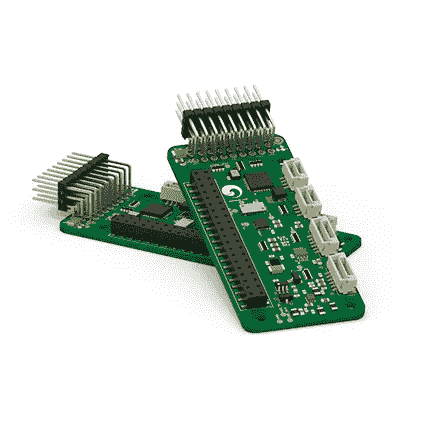
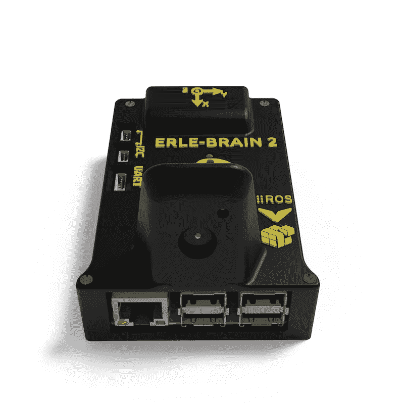

# 走向 ROS-原生无人机

> 原文：<https://medium.com/hackernoon/towards-ros-native-drones-1502de5e2bc8>

## 宣布 alpha 支持 PX4 飞行堆栈，这是一条通向无人机的道路。

无人机领域是一个从机器人角度分析的有趣领域。虽然有能力的飞行机器人是相当新的，但遥控爱好者已经在更长的时间里围绕所谓的*飞行栈*或*软件自动驾驶仪*建立飞行机器开发社区。

[PXFmini](http://erlerobotics.com/blog/pxfmini/) autopilot daughter-board for the Raspberry Pi

其中，有受欢迎的选项，如狗仔队、 [APM](https://hackernoon.com/tagged/amp) (俗称 *ardupilot* )或 PX4。这些自动驾驶仪成熟到获得自主能力，并将这些飞行器变成真正的*无人机*。许多这些开源飞行栈为构建基本的无人机行为提供了通用的[代码库](https://hackernoon.com/tagged/codebase)，然而当人们打算解决机器人学中的传统问题时，通常需要**修改，例如导航、地图绘制、避障等等。当直接在自动驾驶仪代码中执行时，这些修改并不简单，因此，为了增强(或有时只是简化)自动驾驶仪的能力，抽象层如 [DroneKit](http://dronekit.io/) 开始出现。**

> 然而，对于机器人专家来说，通用语言是机器人操作系统。让 ROS 与这些飞行栈进行本地对话需要相当多的资源和努力，因此，一般来说，机器人专家使用像 [*mavros*](http://wiki.ros.org/mavros) ROS 包这样的桥来与飞行栈对话。

我们乐儿机器人公司一直在提供使用这种架构的飞行机器人服务，但我们一直想知道 ROS-native 无人机的发展道路是什么。为了探索这种可能性，我们增加了对 PX4 Pro 飞行堆栈的支持。

# 支持 PX4 Pro 飞行堆栈

PX4 pro autopilot official logo from [http://px4.io/](http://px4.io/)

[PX4 Pro](https://github.com/px4/firmware) 无人机自动驾驶仪是一款开源的无人机飞行控制解决方案，可以“*飞行任何东西，从赛车到货运无人机——无论是多直升机、飞机还是垂直起降*”。PX4 采用类似于 ROS 的理念构建，由不同的软件块组成，其中每个模块都使用发布/订阅架构进行通信(目前，简化的发布/订阅中间件称为 [uORB](https://github.com/PX4/Firmware/tree/master/src/modules/uORB) )。

[Erle-Brain 2](http://erlerobotics.com/blog/erle-brain-2/) Linux brain for robots and drones

在内部尝试研究获得 ROS 原生飞行堆栈的途径并向社区开放这项工作时，我很高兴地宣布**官方 *alpha* 在我们所有面向开发者的产品**中支持 PX4 Pro，例如 [PXFmini](http://erlerobotics.com/blog/pxfmini/) 、[乐儿-大脑 2](http://erlerobotics.com/blog/erle-brain-2/) 或[乐儿-直升机](http://erlerobotics.com/blog/erle-copter/)。我们的团队为我们的产品整合了一套新的[操作系统映像](http://erlerobotics.com/docs/Artificial_Brains_and_Autopilots/Operating_System_images/Debian.html)，将帮助您轻松地在飞行堆栈之间切换。

要安装 PX4 Pro，只需键入以下内容:

> **须藤** apt-get purge -y apm-* #例如:apm-copter-erlebrain
> **须藤** apt-get 更新
> **须藤** apt-get 安装 px4-乐儿-机器人

# 原生飞行栈

使用 PX4 Pro flight stack 作为起点，我们的团队将投入资源来原型化无人机自动驾驶仪的概念，这种无人机自动驾驶仪本身会说话，即使用 ROS 节点来抽象自动驾驶仪逻辑(姿态估计器、位置控制、导航器等)中的每个子模块和 ROS 主题/服务，以与自动驾驶仪中的其余模块进行通信。

最终，这项倡议应该提供一个软件自动驾驶仪，能够创建各种各样的无人机，与机器人专家十多年来一直在构建的所有传统 ROS 界面完美融合。

如果您有兴趣参与这项计划，[联系我们](http://erlerobotics.com/blog/contact/)。

> [黑客中午](http://bit.ly/Hackernoon)是黑客如何开始他们的下午。我们是 [@AMI](http://bit.ly/atAMIatAMI) 家庭的一员。我们现在[接受投稿](http://bit.ly/hackernoonsubmission)，并乐意[讨论广告&赞助](mailto:partners@amipublications.com)机会。
> 
> 如果你喜欢这个故事，我们推荐你阅读我们的[最新科技故事](http://bit.ly/hackernoonlatestt)和[趋势科技故事](https://hackernoon.com/trending)。直到下一次，不要把世界的现实想当然！

