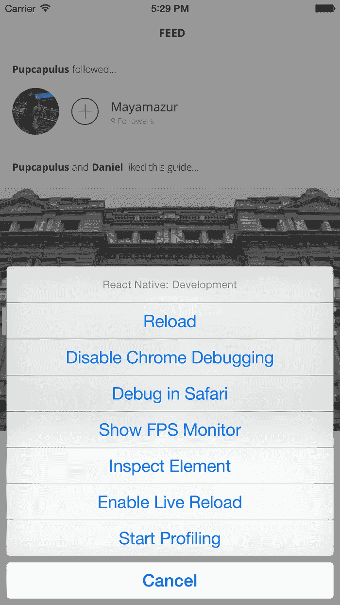

# react native 中的 Townske 应用程序

> 原文：<https://medium.com/hackernoon/townske-app-in-react-native-6ad557de7a7c>

web 开发人员构建 iPhone 应用程序的体验。

大约 6 个月前，我们的旅游出版平台 Townske 处于十字路口。Townske 在网上正式推出，我们准备继续开发和发布 iOS 应用程序。

由于我们正在组建一个一人开发团队，我们不想为一个单独的应用程序安排一个本地 iOS 开发者，也不想外包给第三方进行[开发](https://hackernoon.com/tagged/development)和维护。当时我被脸书宣布的 React Native 绊倒了。

React Native 是一个框架，允许你用脸书奇妙的前端 [javascript](https://hackernoon.com/tagged/javascript) 框架 React 编写原生 UI。我们使用 React 作为[townske.com](http://townske.com)的前端，所以对本地和网络应用使用相同框架的吸引力很大。

我们讨论了使用这种新技术的优点和风险，但认为值得冒险。

既然我们的应用已经在 app store 上线几个月了，我想我应该花点时间来反思一下我们的体验。

# 开发经验

脸书的团队在提供 React Native 的出色开发体验方面做得非常出色。系统消息详细而精确，通常会提示错误的可能原因。在调试模式下，应用程序可以设置为在更改时实时重新加载，并且可以通过 chrome dev 工具远程调试真实设备。

Debug menu

与尝试在 objective-c / swift 中解码编译错误相比，这非常令人耳目一新。在开发速度方面，热重装应用程序也是一个天赐良机，因为等待编译是最大的生产力杀手。

为 react native 开发与为标准 react 开发非常相似。与普通 react 应用程序最大的不同点是样式和导航。本地应用程序的结构通常与 web 应用程序不同，因此这可能需要 web 开发人员在开发应用程序时进行一些思考。

React Native 包含一个 web flexbox 模型端口，用于布局 UI，以及一个 CSS 属性子集，用于样式化。Flexbox 在浏览器领域已经存在一段时间了，但是要注意 flexbox 的标准属性与 web 标准(例如，默认的 flex-direction)有一些偏差。

# 打嗝

在开发这个应用程序的过程中，障碍非常少。我们遇到的最大问题是与功能相关的。例如，当我开始构建应用程序时，没有办法点击地图上的标记。然而，毫无疑问，每次我遇到这样的问题，都会有一个 github 关于它的标签打开，或者在下一个版本中已经安排了一个修复。

# 结果如何？

总的来说，在 React Native 中为 iOS 开发几乎完全没有痛苦。唯一的小痛苦很容易被归结为新的、快速发展的软件的成长之痛。

我敢打赌，在合理的时间内，绝大多数 iOS 应用程序都可以在 React Native 中做得相当好。对我们来说，从开始到结束，我们的第一次公开发布花了设计师和开发人员一个多月的时间，包括应用程序及其支持网络服务的设计和构建时间。

对我们来说，最好的事情之一是，很大一部分业务逻辑(数据处理等)可以从我们的 web 前端提升到应用程序。

我们对我们用 React Native 创建的产品质量非常满意，到目前为止，反馈非常积极。我们已经两次出现在 App Store 的最佳新应用中，去[http://townske.com/app](http://townske.com/app)看看吧！

我们的早期版本存在一些小的性能问题，但是脸书上的 react native 社区在提供详细的反馈和帮助解决性能问题方面做得非常好。

# react native 是给谁看的？

我会向任何穿着类似鞋子的人推荐 React Native in a heartbeat。对于那些有 web 开发背景的人来说，它显然是理想的，尤其是如果你曾经使用过 React 的话。React Native 目前可能不会说服许多原生 iOS 开发人员，但 React Native 带来了一些真正强大的品质。

*   **发展的速度。** Live-Reload 是大多数 web 开发人员现在不会再考虑的事情，拥有它肯定会加快代码/测试开发周期。任何等待编译器或模拟器加载的时间都是浪费的。
*   **部署的速度。**因为 React Native 从单个 javascript 文件加载应用程序，利用像[https://microsoft.github.io/code-push/](https://microsoft.github.io/code-push/)这样的服务，您可以将即时更新推送到生产应用程序。对于 React Native 来说，这是一次史诗般的胜利，因为不得不等待较小的错误修复被发布是不理想的。
*   **代码共享/javascript 无处不在。**如果你在制作 iOS 应用程序的同时还在制作 android 或 web 应用程序，可以使用很多相同的核心逻辑。能够用同一种语言编写以上所有内容的额外好处也很大，因为不必在平台之间转换上下文。
*   **社区。**这与框架没有直接关系，但 React Native 周围的社区确实很有帮助，很友好，也很投入。如果你刚开始，可以去看看脸书当地社区团体，那里有很多人可以提供帮助。

想看看我现在在做什么吗？**查看** [**Paperform**](https://paperform.co/?utm_source=medium&utm_medium=article&utm_campaign=townske_app) ，这就像是 medium 遇到了一个表单生成器。

> [黑客中午](http://bit.ly/Hackernoon)是黑客如何开始他们的下午。我们是阿妹家庭的一员。我们现在[接受投稿](http://bit.ly/hackernoonsubmission)并乐意[讨论广告&赞助](mailto:partners@amipublications.com)机会。
> 
> 如果你喜欢这个故事，我们推荐你阅读我们的[最新科技故事](http://bit.ly/hackernoonlatestt)和[趋势科技故事](https://hackernoon.com/trending)。直到下一次，不要把世界的现实想当然！

