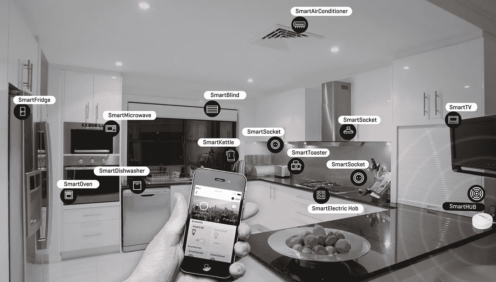
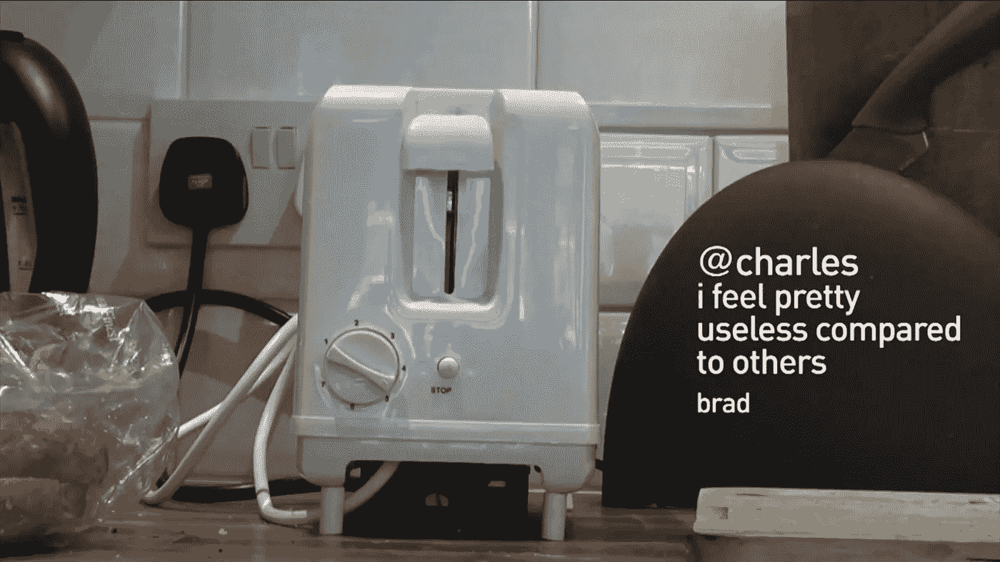
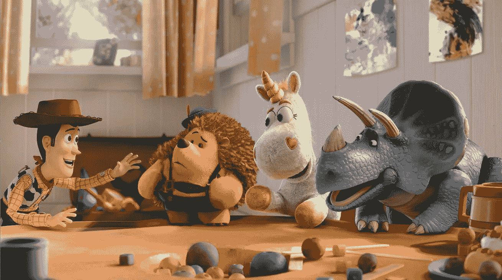
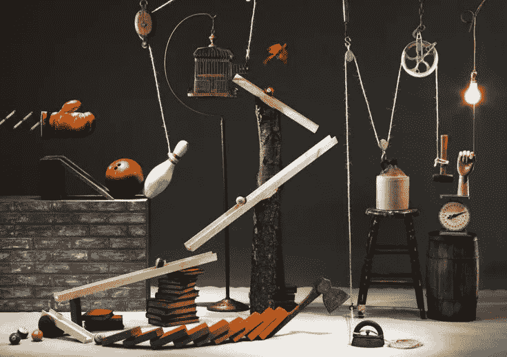

# 物联网的玩具总动员课程

> 原文：<https://medium.com/hackernoon/toy-story-lessons-for-the-future-of-the-internet-of-things-582b47774ad9>

你有没有想过《玩具总动员》系列电影是科幻片？我认为他们有许多有趣的主题可以应用于物联网。当人们开始将更多“智能”设备带回家时，他们将为玩具总动员行为创造一个环境，如上瘾的个性和领导冲突。

Toy Story drama deluxe by [Pixar](https://www.pixar.com/)

## 注意力上瘾者

数字产品发送通知以引起注意。例如，红点不断出现在我们的移动主页屏幕上，引起我们的注意。我们可能会觉得这很烦人，但是从每个应用程序的角度来看，这是非常合理的。如果通知让我们打开一个应用程序，我们总是有机会升级到 premium 或花钱在应用程序内购买。

This mobile has a serious case of notification measles

当每个应用都被自己的商业模式所控制时，它们对我们注意力的争夺会变得势不可挡。这是一个经典的[公地悲剧](/positiveslope/notifications-a-tragedy-of-the-digital-commons-4a4d5eef2bc8)，个人为了自身利益而损害了公共利益。那么，如果这种行为蔓延到我们家中的联网设备，如安全系统、联网电器或玩具，会发生什么？

想想厨房里可能出现的潜在“智能”物品:烤箱、冰箱、水壶、烤面包机等等。如果他们都有自己的议程呢？

A word of warning: the future of IoT might no be this neat (image from [Nordic Semiconductor](http://www.nordicsemi.com))

我们拥有的智能设备越多，它们就越有竞争力。这是西蒙·雷鲍登戈的设计小说杰作《T4:烤面包机布拉德》的精髓。布莱德是一个连在一起的烤面包机，他只想做烤面包。这使它表现得像个瘾君子。布拉德羡慕其他烤面包机，如果它的主人没有正确使用它，它甚至可能会试图搬到一个新家。

Awareness of other devices can cause envy (by [Simone Rebaudengo](http://www.simonerebaudengo.com/#/addictedproducts/))

很容易想象“剃刀和刀片”的商业模式可以解释布拉德的成瘾。例如，Brad 可能是一家靠卖面包赚钱的公司出售的廉价电器。

虽然我们可能会容忍一个像 Brad 这样需要的对象，但当有更多这样的设备时，事情会变得更混乱。一个有许多智能物体争夺我们注意力的家最终可能会更像《玩具总动员》中安迪的房间。安迪的玩具是新旧的混合体，它们并不总是完全兼容。

Trust me, I’m the new guy!

《玩具总动员》的主题之一是不合群的新玩具的到来。当巴斯光年出现时，年长的玩具们担心他太耀眼了，他们会被遗忘。伍迪觉得他的领导地位受到了威胁。每当新的智能物体遇到旧的物联网设备时，未来的家庭可能会出现类似的冲突。新设备能和其他设备很好地通信和玩吗？它会忽略其他人还是与之竞争？

## 领导权之争

在手机上，Android 和 iOS 给所有应用程序的权限或多或少都是一样的。未来的智能家居操作系统会允许所有设备的平等权利，还是允许一个设备扮演领导者的角色？如果是，这个物体需要有多智能？

为了做出影响一大群设备的明智决策，领导设备必须了解家庭中正在发生的事情。这包括分析人们的行为，并连接到其他智能设备。今天，这是典型的传感器包装设备的野心，如亚马逊的 [Echo](https://www.amazon.com/Amazon-Echo-Bluetooth-Speaker-with-WiFi-Alexa/dp/B00X4WHP5E) 设备或谷歌的 [Nest](https://nest.com/works-with-nest/#works-with-nest) 。

但是为什么只是和其他智能物体互动呢？创新的家庭安全系统 [Point](https://minut.com) 可以被训练识别模拟物体的声音，如警报器和门铃。这种改造家中旧物件连接的能力，对于任何渴望扮演领导者角色的设备来说都是一种优势。

Point can be trained to [recognize sounds](https://blog.minut.com/your-home-talking-3e4d12f49e58) of doorbells and alarms

就像伍迪在《玩具总动员》中经历的那样，每当一个新的、潜在的更智能的设备被引入家庭时，领导力都可能受到挑战。由于技术发展迅速，领导设备可能需要经常升级或更换。虽然功能较弱的设备可能会摆脱[最小用户界面](/the-conference/all-or-nothing-interfaces-for-the-internet-of-things-15b64bd04ae3)，但领导设备最重要的任务之一是与人沟通。在《玩具总动员》中，玩具试图向它们的主人安迪隐藏它们的自主权。对于电影中的戏剧和喜剧来说，这是一个很好的前提，但对于物联网来说，这不是一个有用的设计模式。

No UI?

在未来的智能家居中，许多交互将是复杂的，涉及不同设备的组合。人们不仅需要知道发生了什么，还需要知道为什么。例如，当智能灯、百叶窗和室内气候系统自动调整时，房屋所有者应该能够知道是什么触发了它。是天气预报数据还是家里人的行为让恒温器降低了温度？哪个设备做出决定并告诉其他设备做出反应？特别是当事情不以我们希望的方式结束时，智能对象需要更多的交流，[而不是更少](http://www.elasticspace.com/2013/03/no-to-no-ui)。

未来一个有趣的设计挑战是能够以用户能够理解的方式可视化连锁反应。也许有一天，它们能以类似于鲁布·戈德堡机器的方式显现出来？

Rube Goldberg machines are user interfaces worth waiting for

## “通向无限和更远”

由我们来决定我们希望我们的智能对象如何表现。我们需要考虑如何为物联网设计通信用户界面，以及如何避免我们今天在移动应用程序中看到的通知过载。通过研究《玩具总动员》和《烤面包机布拉德》中的一些困境，设计师们可以为下一步做准备。

*对于那些对注意力经济的其他潜在未来感兴趣的人来说，松田隼敬一的增强现实愿景是***和*[*trippy*](https://vimeo.com/166807261)*。此外，请查看我在* *会议上发表的关于公共场所屏幕上的信息可能会如何演变的演讲。**

******

> *[黑客中午](http://bit.ly/Hackernoon)是黑客如何开始他们的下午。我们是这个家庭的一员。我们现在[接受投稿](http://bit.ly/hackernoonsubmission)并乐意[讨论广告&赞助](mailto:partners@amipublications.com)机会。*
> 
> *如果你喜欢这个故事，我们推荐你阅读我们的[最新科技故事](http://bit.ly/hackernoonlatestt)和[趋势科技故事](https://hackernoon.com/trending)。直到下一次，不要把世界的现实想当然！*

**