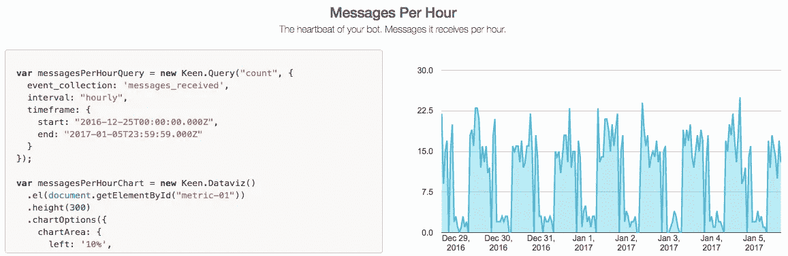

# 使用僵尸工具和 Keen IO 跟踪对话

> 原文：<https://medium.com/hackernoon/tracking-conversations-with-botkit-and-keen-io-63a9209a12da>

Botkit analytics, powered by Keen IO

使用 Keen IO 跟踪机器人指标的开源中间件—[点击这里查看](https://keen.github.io/keen-botkit/)并阅读下面的动机🚀

这篇文章是我将在接下来发布的一系列开源项目的一部分，正如之前在这里描述的[。](https://serverless.zone/shipping-quickly-how-we-test-ideas-using-microservices-and-stdlib-9e8143cee403#.ed3mzowug)

# 机器人分析

当我们构建 [Suto](https://asksuto.com) 时，我们不得不处理的一件事是，传统的基于“会话”的分析系统(如谷歌分析)并不真正起作用。即使是纯粹的基于“事件”的分析系统(比如 Mixpanel ),对于像聊天界面这样的新媒体来说也是过于规范了。

我们想回答一些稍微复杂的问题，比如“这些用户问的是什么类型的问题？”或者“这些用户开始与我们对话的次数是多少？”而不必做太多的工作来在仪表板上得到这些答案。

我们肯定不想建立自己的分析堆栈，因为根据我在 Taplytics 的经验，我知道这需要一个小村庄才能做好。

所以我们决定将这项任务外包给 Keen IO，这是一个我以前用过的灵活且可扩展的分析平台。结果证明效果非常好——我们能够在大约一天的时间内将一个很棒的仪表板组合在一起，随着我们发展到其他渠道(如电子邮件和 Facebook Messenger ),我们能够在一个地方跟踪所有事情。

所以今天，我开源了一个小库，我最初构建它是为了将数据从[僵尸工具](https://github.com/howdyai/botkit)传递到 Keen IO。它使我们能够对我们的机器人(几周前我们决定关闭它，这是另一个故事)的使用有一个体面的看法，希望它能帮助别人:)

# Keen IO 僵尸工具中间件

我已经成为 Howdy 的[僵尸工具](https://github.com/howdyai/botkit)框架的忠实粉丝。这是对创建机器人的不同方式的一个很好的抽象，并为您提供了足够的定制能力，使事情变得更容易。

一个很好的例子是他们的[中间件](https://github.com/howdyai/botkit#middleware)功能，可以让你监听(和/或修改)传入和传出的消息。这正是我用来跟踪进出我们机器人的信息。

我在一个名为 [keen-botkit](https://github.com/keen/keen-botkit) 的开源库中对此进行了抽象。

自从我们不再致力于我们的机器人，我就一直犹豫要不要分享它，但 Keen 大方地提出要维护这个项目(这就是为什么它现在在他们的 Github 上)，所以让其他人使用它并利用他们的机器人有更好的分析，我感到很舒服。

如果你已经有了一个机器人或者正准备开发一个，请查看 Keen IO for Botkit 并立即开始跟踪它的使用情况，⚒️

如果你想在接下来的时间里跟上我的开源版本，一定要关注我的帖子或者订阅这里的。

> [黑客中午](http://bit.ly/Hackernoon)是黑客如何开始他们的下午。我们是 [@AMI](http://bit.ly/atAMIatAMI) 家庭的一员。我们现在[接受投稿](http://bit.ly/hackernoonsubmission)并乐意[讨论广告&赞助](mailto:partners@amipublications.com)机会。
> 
> 如果你喜欢这个故事，我们推荐你阅读我们的[最新科技故事](http://bit.ly/hackernoonlatestt)和[趋势科技故事](https://hackernoon.com/trending)。直到下一次，不要把世界的现实想当然！

