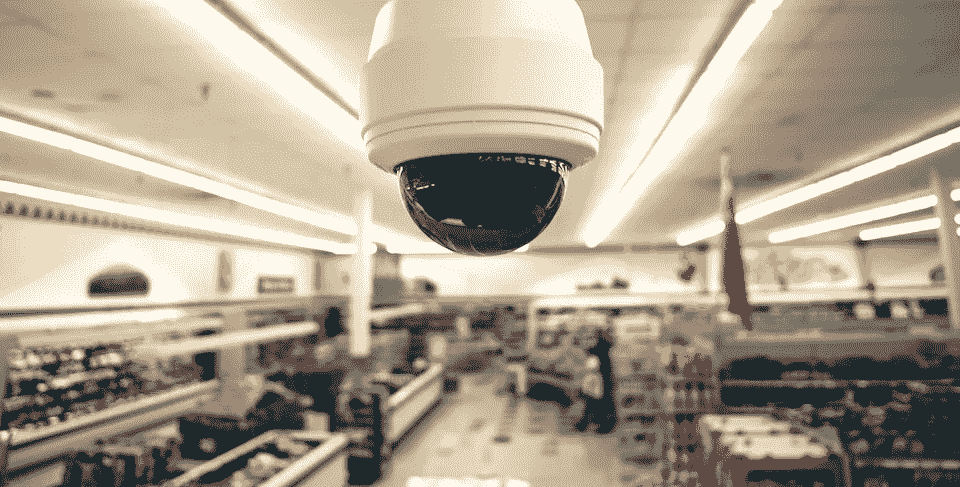

# 商店中的脚步追踪:新技术带来新的机遇和危险

> 原文：<https://medium.com/hackernoon/tracking-customers-every-step-much-more-than-security-cameras-333177dfd1a5>

由于你口袋里的手机，商店可能会记录下你浏览过道时的确切位置。

毛骨悚然？

…也许吧

耐人寻味？

如果做得好，对顾客和商店来说都是双赢的(想想《得分》一书中描述的乐购)。也可能是一场巨大的隐私灾难。

《经济学人》圣诞版包含一篇有趣的文章，描述了零售商店越来越多地使用客户跟踪[技术](https://hackernoon.com/tagged/technology)(2016 年 12 月 24 日版的“追随时尚”)。作者描述了在过道里跟随你的手机的技术(*除外:这只是冰山一角*)，并提出了一个问题，即零售商可能从收集如此详细的顾客店内活动数据中获得什么。

那个问题对我来说似乎有点太基础了。实体店内这种逐步跟踪的竞争优势(和隐私问题)与电子商务网站上跟踪在线浏览行为的竞争优势非常相似。如果他们这样选择，零售店只需要查看无数的电子商务用例来获得这种客户路径数据。

> 零售店只需查看无数电子商务用例中的这类客户路径数据

正如在线公司多年来所知道的那样，记录一步一步的移动可以更深入地了解营销效果和产品关联，以及成千上万匿名客户的意图、偏好和习惯。这种大数据洞察比那些仅仅通过分析销售点数据收集的信息要丰富得多。

但是实体零售商还有另外一个锦囊妙计。添加隐藏的商店摄像头和麦克风，再加上机器学习算法，零售商可以将客流量与购物者和任何购物同伴的年龄、性别、种族和方言等细节联系起来，**包括未成年人**。

所有这些都将很快在欧盟受到《通用数据隐私条例》的更严格控制，该条例将于 2018 年 5 月生效。从那一天起，拥有欧盟客户的公司在收集和使用个人数据方面将受到更多限制，包括可以与智能手机关联的数据。事实上，侵犯隐私的罚款可能会达到该公司全球年营业额的 4%。(参见我的文章[数据科学和隐私法规:即将来临的风暴](http://dsianalytics.com/data-science-and-privacy-regulations-a-storm-on-the-horizon-full/))

客流量数据的分析仍然会带来丰富的附加值，理想情况下对客户和零售商都有利，但收集和分析此类[数据](https://hackernoon.com/tagged/data)的方式越来越有必要，既要尊重客户的隐私，又要保护零售商免受法律和声誉风险的影响。

这篇文章的完整版本出现在我的[数据科学博客](http://dsianalytics.com/insights)上。

我很想在下面的评论中听到人们的想法和经历。

> [黑客中午](http://bit.ly/Hackernoon)是黑客如何开始他们的下午。我们是 [@AMI](http://bit.ly/atAMIatAMI) 家庭的一员。我们现在[接受投稿](http://bit.ly/hackernoonsubmission)并乐意[讨论广告&赞助](mailto:partners@amipublications.com)机会。
> 
> 如果你喜欢这个故事，我们推荐你阅读我们的[最新科技故事](http://bit.ly/hackernoonlatestt)和[趋势科技故事](https://hackernoon.com/trending)。直到下一次，不要把世界的现实想当然！

