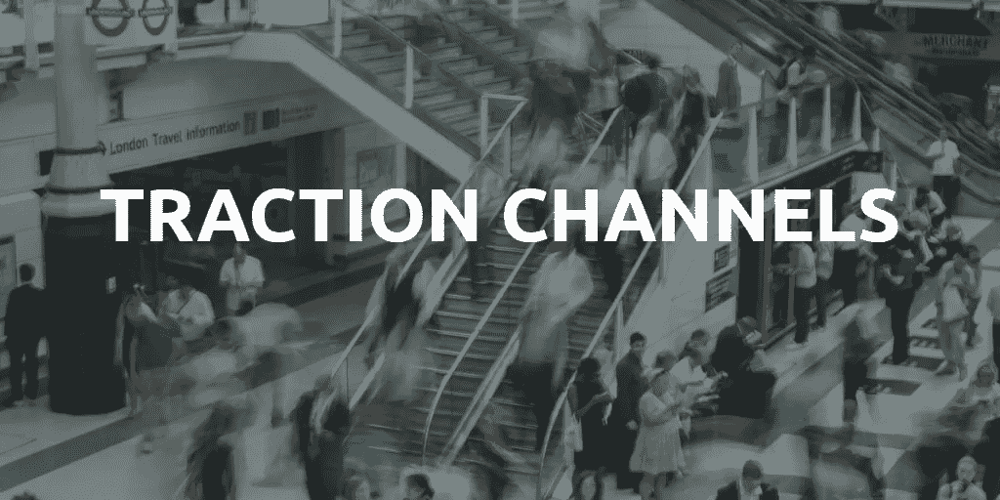

# 我为我们的旅游创业公司尝试过的渠道

> 原文：<https://medium.com/hackernoon/traction-channels-ive-tried-for-our-travel-startup-ac1fded4f74e>

6 个月前，我们共同创立了一家[旅游](https://hackernoon.com/tagged/travel) [创业公司](https://hackernoon.com/tagged/startup)，我只是困惑于如何找到最好的牵引渠道。

这些天我在读**【牵引】**加布里埃尔·温伯格和**贾斯汀·马雷斯**写的书。这本书确实是理解基础知识的好向导。

我尝试了几个渠道来吸引人，并达到了一个点，但现在我们需要一些更强大的渠道。

**让我简单地告诉你我们是做什么的，这样会更容易了解情况。**

我们是一个市场，通过独特的本地体验和由城市本地人主持的旅游将游客和本地人联系起来。(可以去看看。[www.localguddy.com](http://www.localguddy.com)

很简单，当地人创造他们自己的旅游和体验，并在空闲时间通过成为旅行者的半向导半朋友来赚钱。

他们在创建旅程时选择以下 guddy 类型之一:

本地指南:向您展示这座城市及其所有隐藏的景点、风景、花园和必看的地方。

美食行者:在几个小时内展示城市中品尝当地美食的最佳地点

酒吧爬虫:展示了这个城市的夜生活，那里有最好的酒吧和俱乐部。

Hommy 厨师:在家里烹饪当地自制的食物，并招待游客一顿晚餐或早餐。

到目前为止，我们已经在 40 多个国家进行了+400 次巡演。

对于牵引渠道而言，主要挑战是接触正在旅行和计划不久旅行的人群:

我会列出我尝试过的吸引渠道，并评论它们对我是否有效。请评价您在旅游行业尝试过的渠道或您会推荐的渠道。

**1-)脸书广告:**

*   形象真的很重要。(例如，如果我在图片中使用一个漂亮的女孩，点击费低于 0.10 美元，具有讽刺意味。)
*   右侧广告比新闻提要广告便宜得多(目前我只使用右侧广告。)
*   Auidience 网络和即时文章广告根本不起作用。浪费钱。关于 audience network 的一件有趣的事情是:脸书广告经理说那一周通过 audience network 有 1700 次点击我的网站，但是 google analytics 说那一周总共只有 1500 次点击 LOL:)audience network 的人甚至在 Google analytics 标签加载之前就离开了网站:)
*   一开始，让 facebook 自动安排你广告的出价。在达到 500-1000 人后，如果你的相关性得分低于 6-7，关闭广告，用不同的图片或目标重新打开。
*   在广告中明确你的信息，不要误导访问者。因为不要忘记你的目的不是让人们访问你的网站，你的目的是将你的访问者转化为客户。

**2-)谷歌 Adwords:**

*   我仍然在 google adwords 上烧钱，但迄今为止我学到的是:
*   为搜索网络和显示广告单独创建活动**。**
*   **到目前为止，展示广告对我来说并不奏效，但我仍会尝试。**
*   **与展示广告相比，搜索网络是一个更好的选择，可以接触到要去某地旅游的人。因为如果人们对伦敦之旅感兴趣，他们会搜索“伦敦当地导游”。不要一开始就因为有人会误点你的链接而心烦意乱，所以你需要烧些钱，用更高的点击量来看看是否有效。**
*   **视频广告对我不起作用，但我会在接下来的几周内用我们在柏林录制的新视频再次尝试。这次我将针对一些特定的旅游频道(您可以针对这些频道，甚至是带有名称的视频)**
*   **一定要使用“关键词>搜索词”,并把那些与你的广告无关或耗费大量金钱的关键词添加到“负面关键词”中**

****3-)旅游博主:****

**仍在努力，我认为建立联盟伙伴关系可以在这个市场上是一个黑客。**

**会看到并随时通知你。如果你有联系人或想法请让我知道！**

****4-)旅游网站、平台:****

**与其他旅游网站合作，如住宿、交通等。)对你们俩都有帮助。多与一个平台合作不会有任何损失，所以继续建立合作关系:)**

**例如，最近我们与 Erasmusinn 合作，我们设法从那里获得了很好的吸引力，因为大多数用户与我们的目标受众相匹配。**

****5-)现有平台，如脸书、Instagram..****

*   **脸书团体完美地工作！(不是垃圾邮件，只是一条消息通知相关组中的人)**
*   **每天至少在 facebook、instagram、twitter 和 pinterest 上发布一次。**
*   **昨天，我在 Instagram 上搜索了巴塞罗那机场，问一些人是否对巴塞罗那的旅游感兴趣。我只是试了一下，过几天就会看到结果:)**
*   **也许为其他网站写博客，问他们是否可以提及你的新网站。(写这篇文章的时候我突然想到，这周我会尝试一下)**

****6-)影响者营销:****

**我想试一试。和一个有影响力的人一起工作。我不想花很多钱。我找了几个平台( [Influanza](http://influanza.com/) ， [famebit](http://famebit.com/) 等等。)在那里你可以接触到已经愿意和你一起工作的有影响力的人。作为回报，我们给了一位 instagram 有影响力的人一次免费参观，她在她的 instagram 账户上提到了我们。嗯，对我们来说没什么用:/但我认为问题是 instagram 上有很多虚假粉丝，所以下次我会尝试与博客或视频博客作者合作，也会尝试与多个微影响力人士合作。我会随时通知你。**

****7-)病毒式营销:****

**在新年前夕，我们已经为我们的一些 guddies 拍摄了大约 170 个个人视频来庆祝他们的新年。每个视频的长度大约为 50-60 秒。我们花了很长时间来录制每个视频(你可以在我们的 youtube 频道上看到)**

**我把它们发布在 facebook、twitter 上，并给我们的用户加了标签。我们也通过电子邮件发送。我们的一些用户分享了视频，并给我们发来了非常好的信息。我们重新获得了一些老用户。但是这些视频并没有达到我们的预期。我们认为这将是我们创业值得纪念的一天，我们将像病毒一样成长，我们将获得成千上万的用户..我们当然没有:)**

**我会推荐任何创业公司做这种项目来让你的社区快乐，但不要期望有大的改变。**

**不管你使用哪种渠道，你都会设法让访问者进入你的网站。不要忘记跟踪你网站的用户:**

*   **一开始使用网站访问者记录工具。稍后，您可以切换到热图。**
*   **使用 UTM 建设者为您的广告链接。**
*   **使用类似[谷歌分析](https://www.google.com/analytics/)、[振幅](http://amplitude.com/)、 [Rakam](http://rakam.io/) 等分析工具。**

****分享你在旅游市场获得关注的经验，以便我们交流想法。
请告诉我你是否有兴趣与 www.localguddy.com****合作****

****你可以通过 emre@localguddy.com 找到我****

************************

> ****[黑客中午](http://bit.ly/Hackernoon)是黑客如何开始他们的下午。我们是 [@AMI](http://bit.ly/atAMIatAMI) 家庭的一员。我们现在[接受投稿](http://bit.ly/hackernoonsubmission)，并乐意[讨论广告&赞助](mailto:partners@amipublications.com)机会。****
> 
> ****如果你喜欢这个故事，我们推荐你阅读我们的[最新科技故事](http://bit.ly/hackernoonlatestt)和[趋势科技故事](https://hackernoon.com/trending)。直到下一次，不要把世界的现实想当然！****

********