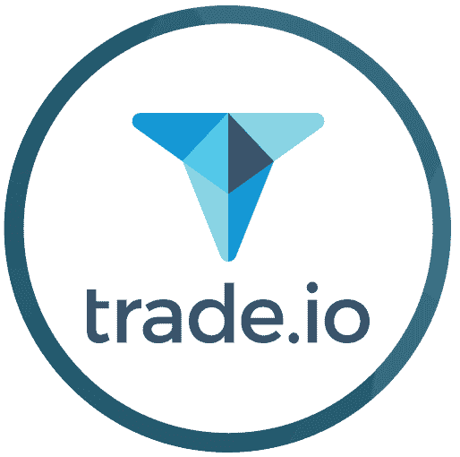
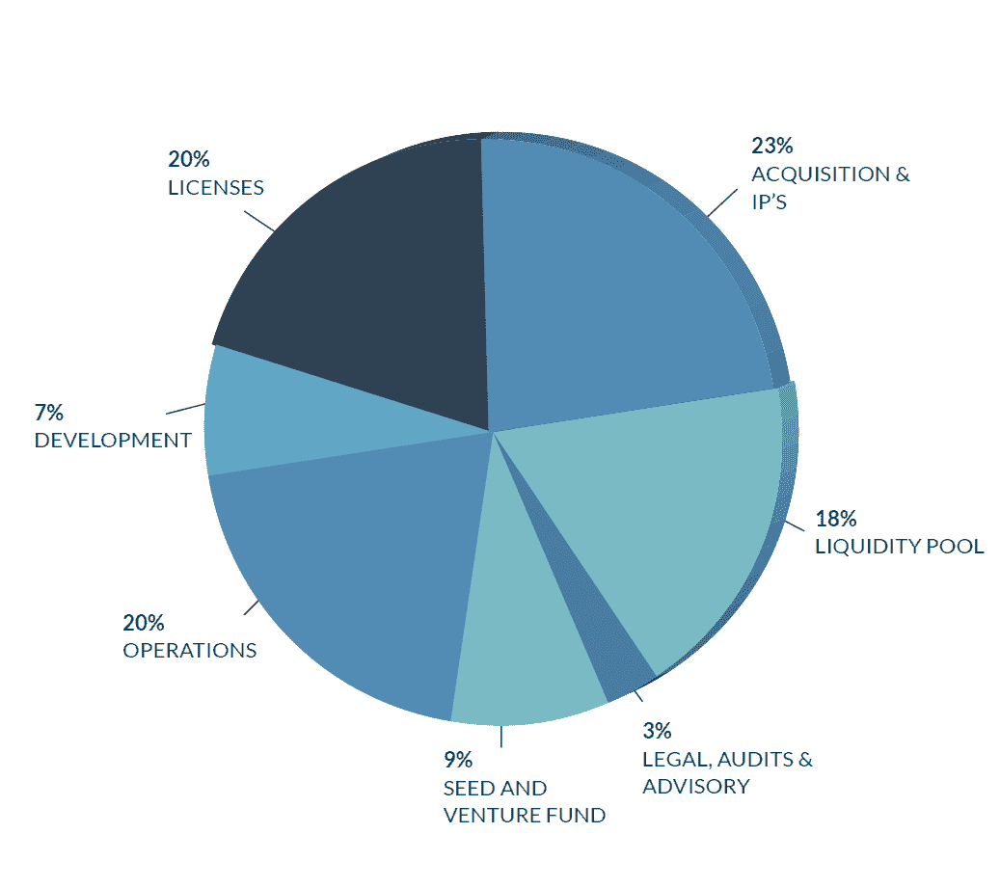
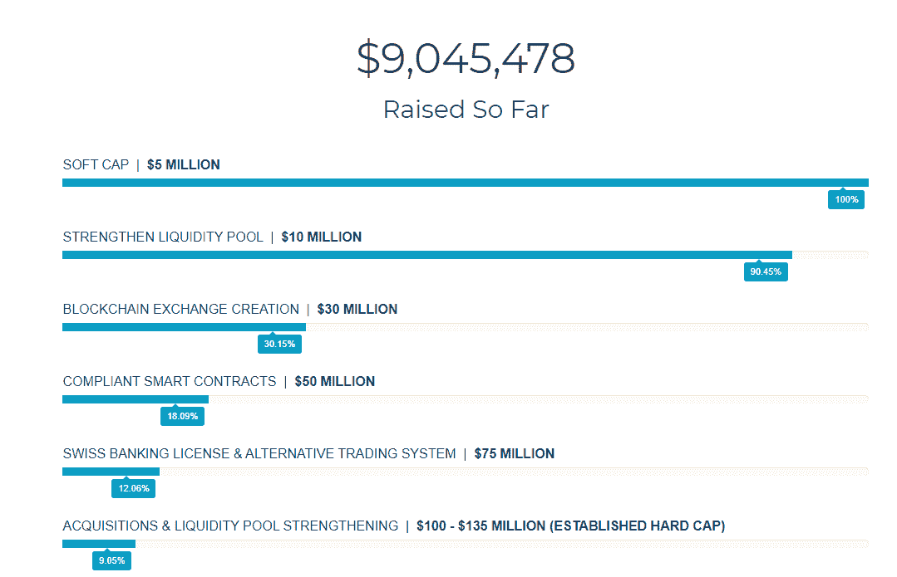
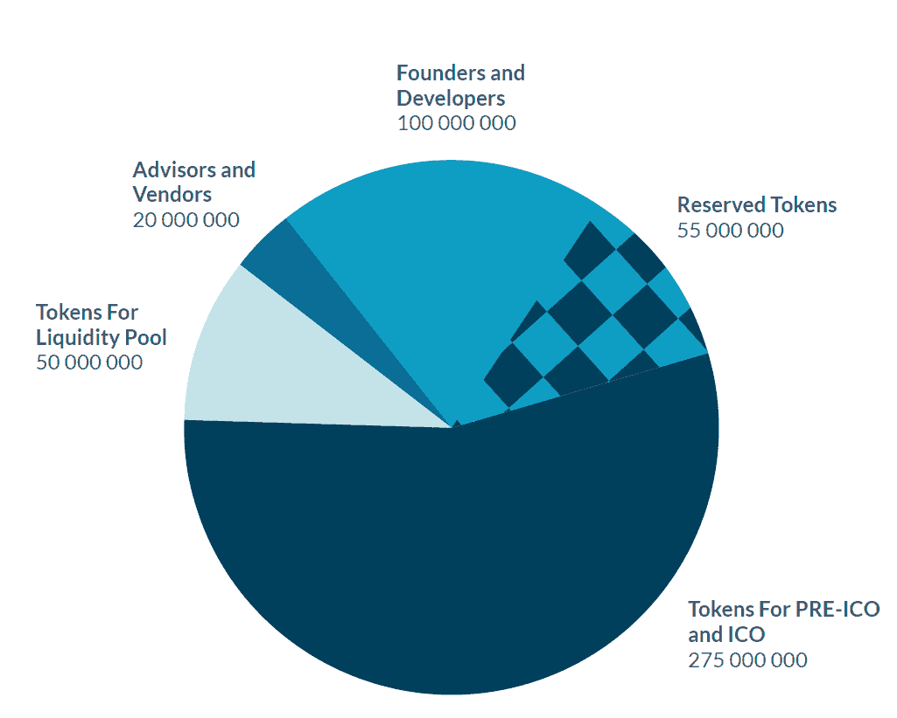

# Trade.io 白皮书评论

> 原文：<https://medium.com/hackernoon/trade-io-white-paper-review-e0a5e7eec587>

## 金融代币和交易平台

Image Caption: Before reading this article, please read our full disclaimer found [here](https://thebestoficos.com/disclaimer.html) and at the bottom of this page. This Paid Story is brought to you by trade.io

# 介绍

[Trade.io](https://trade.io) 是一家瑞士公司，希望通过一个分散的、可追踪的、透明的平台来革新交易所交易系统，使其用户能够通过区块链进行交易。该平台最终希望让用户能够交易数字和实物资产，如加密货币、贵金属、石油和其他商品。

这个团队在交易方面有很长的历史。trade.io 的顾问已经建立了成功的经纪公司，如 [FXPRIMUS](http://www.fxprimus.com/en/vu-home) 和英国 Primus Capital Markets。前者始于 9 年前，是一个受监管的外汇和 CFD 交易平台，每年交易价值超过 1800 亿美元。

在撰写本文时，Trade.io 正在经历其前 ICO 阶段。该公司希望筹集 20 万吨 ETH，以换取 2 亿吨 TIO(他们的交易令牌)，或大约 1 亿美元。前 ICO+7500 万未售出的令牌将被添加到 ICO 中，计划于 12 月 5 日推出，总价值可能超过**1 亿美元**。

注意:该公司的白皮书与他们网站上的数字相差甚远。经过一次采访，我们证实了网站号码是最新的，并且在代币定价和数量方面是准确的。

# 这个想法

白皮书中介绍了 Trade.io 作为现有系统的替代交易平台。它旨在通过利用像区块链这样的分散网络来提高效率和透明度。

该系统正在建立一个共享的流动性池，用户可以通过他们的 trade.io 会员资格(通过使用令牌)投资他们的资产，作为回报，trade.io 将分享该池产生的 50%的利润，但也将分担损失。加入该网络需要用户拥有 2，500 个 TIO 交易令牌(ICO 前约 875 美元或 ICO 后约 1200 美元)。

该公司正在寻求为初创公司提供大量投资和交易选择，包括通过该平台使公司能够进行 ICO 和 IPO 的可能性。几乎没有关于公司将如何处理从这些活动中收到的佣金的信息，或者在通过该平台进行 IPO 或 ico 的认证中的当前状态是什么。

该公司希望提供多种交易和投资功能，包括:

*   **交易**:他们的交易令牌作为会员使用交易平台，为了进行交易，用户必须持有 2500 个交易令牌
*   **流动性池**:交易活动的盈亏由交易者共同承担
*   **投资银行**:平台为用户投资，50%分配盈亏
*   **每日分配**:平台每天会在拥有会员资格的用户中分配投资结果
*   **合规**:公司声称遵守(或将遵守)多个司法管辖区的证券规则和法规，以及了解您的客户和反洗钱法规

目前还没有太多关于利润如何产生的信息。该公司还将能够通过自己的令牌在网络上虚拟化实物资产，从而进行交易。这与我们在[稳定令牌](https://hackernoon.com/a-crash-course-in-stable-tokens-3d9e32760f2b)和资产支持加密货币上讨论的实践非常相似。

# 代币

前 ICO 启动交易令牌，这是一个 ERC 20 令牌，并遵循以太坊客户端所需的标准规范。在 trade.io 平台上执行交易和投资操作时，它被用作内部货币。Trade.io 通过为交易代币投资提供优于其他加密货币或法定货币的优惠支付，推动了交易代币的使用。

这个令牌下面的智能契约是使用 Majoolr 系统编写的。Majoolr 的团队精通去中心化的应用程序，并且对事物的技术方面有很好的理解。然而，由于这个项目的雄心勃勃的性质，仅仅四个开发人员不可能根据 trade.io 给出的时间表生产出所需的平台。

也不清楚他们是否有计划吸引必要的区块链工程师在平台上工作。由于技术人才在这个行业非常受欢迎，这是一个非常重要的问题，必须优先解决。

# 资金用途

这个 ICO 最复杂的一个方面是，筹集的资金完全取决于用户何时购买代币。在 ICO 之前，交易令牌的价格是固定的，而在 ICO 期间，价格将根据用户购买令牌的时间而变化。

这并不罕见，奇怪的是白皮书和网站之间似乎存在巨大的脱节。白皮书指出，每个 ETH 将向用户提供 1000 个 1000Trade Tokens。在他们的网站上，trade.io 在 ICO 之前提供每 1000 个交易令牌，在 ICO 期间提供每 ETH 625 个交易令牌。

这种复杂而不清晰的系统迫使 trade.io 根据筹集资金的百分比而不是金额来估算资金的使用情况。这个系统之所以困难，是因为公司不按百分比调整预算。拥有两倍的资金并不意味着你需要在法律、审计或咨询方面花两倍的钱。我们希望公司有 3-5 个不同的场景，每个场景的资金使用，比如说，一个筹集 500-1000 万美元，另一个筹集 5000-9900 万美元，一个筹集>2 亿美元。

以下是平台资金的估计使用情况:

Image Caption: Image from: Page 26 of trade.io White Paper

自白皮书发布以来，trade.io 通过其网站扩大了资金的使用范围。随着资金的增加，网站现在显示了一系列达到的目标或里程碑。

Image Caption: Image from: trade.io website as of November 22nd, 2017

# 令牌分发

此 ICO 的令牌将根据下图进行分配:

Image Caption: Image from: Page 23 of trade.io White Paper

该公司有一个有趣的策略，在预 ICO 和 ICO 期间分发代币。他们的计划是在预 ICO 期间推出 2 亿枚代币，如果有任何未售出的代币，他们将继续将剩余的代币添加到 ICO 中并提高价格，这是一种非常常见的做法。

ICO 本身将拥有 7500 万枚代币，加上前 ICO 的剩余部分。任何非通过 ICO 购买的代币(截止到 2017 年 12 月 15 日)都将被销毁。确保平台具有稳定的令牌供应。

# ICO 之前的详细信息

token.io 的前 ICO 期为 2017 年 11 月 7 日至 11 月 25 日。在此期间，他们已经筹集了 900 多万美元。根据他们的网站声明，每个 1 ETH = 1,000 个交易代币。价格为 360 美元，这意味着在可能的 2 亿个交易代币中，已售出超过 2500 万个。

# ICO 详细信息

如前所述，所有剩余的前 ICO+7500 万的贸易代币将在 12 月 5 日 ICO 期间出售。按照现在的情况，应该有大约 1.75 亿个前 ICO 剩余的交易令牌加上另外 7500 万个，或者大约 2.5 亿个交易令牌将可供出售。

# 区块链测试

[当然](https://techburst.io/who-needs-the-blockchain-anyway-7c146e820d75)交易的分散化允许信任从一个中心组织(如银行)转移到整个节点网络，这是区块链的主要用途。交易平台也可以从相同的信任转移中受益，并可以避免由于交易平台(如 Mt. Gox)的黑客攻击或不当资产管理而导致大量资金损失的危险情况。

Trade.io 的交易平台无疑是对区块链的一个非常好的利用，并最大限度地利用了其去中心化的本质。然而，他们将如何执行某些经典的交易功能，如边际交易和止损，还有待观察。(分散式交易所目前没有边际交易的实现)。

然而，与此相反的是 Trade.io 的流动性池，它要求将流动资产(交易代币)委托给交易平台(这完全否定了分散的方面)，虽然交易仍可以以分散的方式发生，但共享流动性池的存储仍会受到流动性池(即平台)的签名密钥持有者的攻击和任意消耗。

# 牵引力

trade.io 白皮书中最薄弱的部分之一是缺乏关于牵引力的信息。从该公司的时间表来看，其意图是在 2018 年 4 月之前推出 trade.io exchange。只剩下 5 个月了，我们希望看到一个成熟的 MVP 或者一些技术更新。

# 组

显然，trade.io 的团队已经在交易行业工作了多年。经纪公司 FXPRIMUS 和 Primus Capital Markets UK 是由他们的一些顾问创办的。这意味着创始人很好地理解交易需要什么，以及他们可能面临的监管和尽职调查。

白皮书提到了管理团队和董事会的 15 名成员。以及 10 名顾问。他们的一些团队成员在欧盟的塞浦路斯工作。

# 透明度

该公司声称使用区块链技术来增加交易的透明度。然而，我们对他们所声称的没有幕后交易的完全透明有一定的怀疑。雷电网络(以及任何链外网络)支持幕后交易，尽管它们将最终交易发布给区块链，但仍允许一些操纵发生。

然而，我们认识到，要在区块链混合环境中实现数以千计的交易，离链支付渠道是必要的。展望未来，该平台可以展示他们计划如何实现这一目标，或者他们正在采取哪些措施来提高透明度。

# 结论

trade.io 白皮书是我们见过的最雄心勃勃的 ico 之一。该文件在法规、令牌和平台的当前状态以及他们如何计划减轻风险和延迟的明确计划方面留下了许多问题。此外，目前存在分散的交易所，平台已经建成，因此这一类别的竞争相当激烈，trade.io 的商业计划未能解决当它们上市较晚时如何保持市场份额的问题。

还有一些关于监管和地位的问题，虽然 trade.io 白皮书解释了代币为何是一种工具而不是证券，但我们仍然建议由证券监管机构做出这一决定，或者至少从证券律师那里获得一些信息。

此外，雷电网络目前尚未经过测试，需要进行大量开发才能在 trade.io 提供的时间表内推出。

该公司还计划在 12 个月后上市。这大约是他们推出后的 8 个月，比预期的瑞士银行执照少 6 个月，在 MetaTrader 4 平台成立后的 6 个月内。我们担心的是，如果平台在 12 个月内没有完全推出，公开市场上的投资者将很难确定公司的价格和销售预期。

目前还不清楚如果该公司在 2018 年 12 月 IPO 会发生什么，代币会发生什么，代币持有者会如何获得奖励？如果代币被认为是一种证券呢？如果他们没有获得瑞士银行执照怎么办？或者 MT4 平台连接是否存在安全漏洞，比如上周价值 3 亿美元的以太坊黑客攻击。

如果该平台获得成功，这将是金融系统的一个巨大发展，因为创建一个物理/虚拟令牌系统可能会彻底改变人们交易、众筹和支持公司的方式。

想帮忙吗？
**在 Bountey 上支持我们！**[【https://www.bountey.com/bestoficos】](https://www.bountey.com/bestoficos)

*想在 ICOs 中保持最新？* ***访问我们在***[***https://thebestoficos.com***](http://thebestoficos.com/)

*有一个有趣的故事？* ***写我们在 info@bestoficos.com 的***

# 放弃

本网站由加拿大公司 Durata Inc .(" Durata " " Best of ICOs " " we " " us " " our ")运营，该公司在安大略省注册成立。通过阅读并继续使用我们的网站和博客(统称和单独称为“网站”)，您保证您已经阅读、理解并同意我们的免责声明。

我们对免责声明所做的任何更改将在我们在网站上发布修改后的免责声明后立即生效。

## 做你的研究

本网站的内容旨在用于且必须仅用于一般信息目的。这是非常重要的，你要考虑到你的个人情况，并进行自己的分析，然后再进行任何投资。此外，在进行金融投资或决策之前，您应该向合格的专业人士寻求独立的金融建议。您或您的合格金融专业人士应采取措施，在做出任何投资决定或其他决定之前，独立研究和核实您在我们网站上发现的或希望依赖的任何信息。

## 没有投资建议

该网站是一个金融数据和新闻门户、博客和内容聚合器。最好的 ICOs 不是一个经纪人/交易商，我们不是一个投资顾问，我们不能访问公开上市公司的非公开信息。本网站不是一个给予或接受金融建议或投资决策建议的地方。我们不受安大略省证券委员会、美国证券交易委员会或任何其他类型的监管金融机构或当局的监管。

我们是一个教育论坛，用于分析、学习和讨论与加密货币、加密货币投资和投资策略相关的一般信息。本网站上的任何内容均不构成(或不应被理解为构成)投资建议，也不作为进行任何证券交易或参与任何投资策略的建议。对于 ICO 或任何特定投资方法是否适合特定个人的金融需求，我们不提供个性化的建议或观点。

## 不是法律或税务建议

我们不是会计师。我们不是律师。本网站上的任何内容或信息都不构成或不应被理解为构成法律或税务建议。你应该聘请有执照的专业人士来提供这些方面的建议。

## 个人赋权

虽然我们展示了我们已经筛选和研究过的投资，但研究结果只能作为进一步研究的候选，而不能作为“买入”名单或一组建议。筛选可能有助于缩小基于预定义标准的搜索范围，但它不能替代反映您个人投资/交易标准的独立研究和验证。

在我们提供估价工具的地方，这些工具仅用于信息和教育目的，以便用户可以轻松地运行他们自己的估价。任何预定义的值都只是基于我们在整个市场应用的全球假设的一个起点，用户应该修改他们认为合适的数字，而不是将其视为自己判断或自己研究和验证的替代品。任何由此产生的估价结果都必须是通用的，并没有得到 Best of ICOs 对给定股票的认可。

## 投资警告

加密货币的价值、加密货币投资以及从中获得的收入可以下降，也可以上升。新商业模式的出现可以为用户和投资者创造机会，但由于缺乏新项目的质量评估标准、可靠性和透明度，任何年轻的市场都对其所有参与者带来重大风险。过去的业绩不是未来业绩的可靠指标，投资者可能无法收回全部投资。

## 不依赖

无论是在合同、侵权行为(包括疏忽)还是其他方面，对于您因访问本网站上的信息或材料或您可能依赖此类信息或材料而遭受的任何损害、费用或其他损失，我们都不承担责任。我们不对任何错误或遗漏负责，也不对使用本网站中的任何信息、内容或材料所产生的结果负责。本网站中的所有信息均按“原样”提供，不保证完整性、准确性或及时性。虽然我们努力保持我们的信息没有错误和完整，但并不保证它会如此，我们可以，但没有义务，纠正任何此类错误或补充任何不完整的信息。

## 对第三方网站不承担责任

本网站可能包含其他网站的链接。这些链接网站不受 Best of ICOs 的控制，我们不对任何链接网站的内容负责，包括但不限于链接网站中包含的任何链接，或链接网站的任何更改或更新。我们向您提供这些链接只是为了方便，包含任何链接并不意味着认可链接的网站或与其运营商有任何关联。