# 基于卷积神经网络的交通标志识别

> 原文：<https://medium.com/hackernoon/traffic-sign-recognition-using-convolutional-neural-network-8a1f90e8fb24>

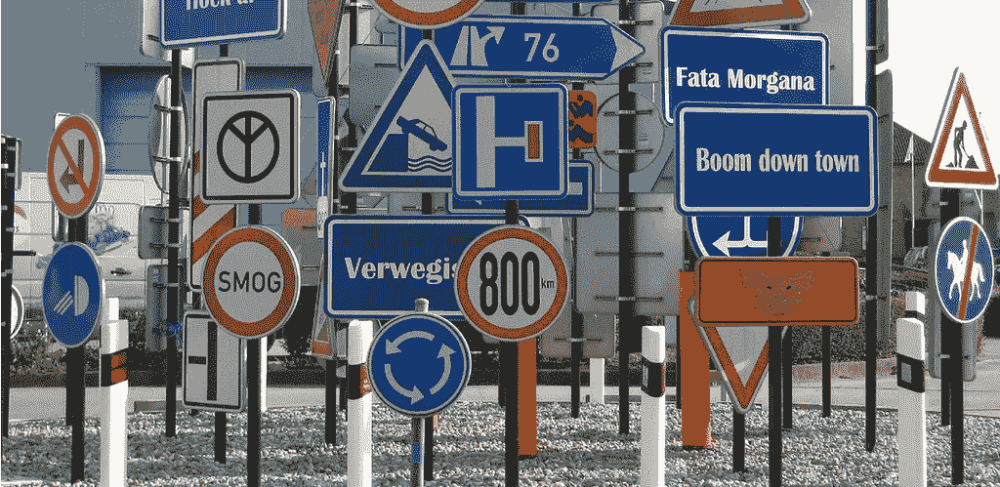

我将描述在 [Udacity 课程](https://www.udacity.com/course/self-driving-car-engineer-nanodegree--nd013)“自动驾驶汽车工程师”中提出的**交通标志识别**问题的完整流程。交通标志识别是自动驾驶汽车一项基本的日常任务。这就是为什么它必须包含在关于自动驾驶汽车的[系列](http://tomaszkacmajor.pl/index.php/2017/05/07/self-driving-cars-in-python/)中，在那里我展示了与该领域相关的不同项目。识别系统处理从道路场景中提取的交通标志图像。最终，它应该将该标志归入 43 个类别中的一个。为了做到这一点，应用了一个**卷积神经网络**，预先用 50，000 幅图像对其进行训练。

# 项目的目标

交通标志识别项目的目标是建立一个**深度神经网络** (DNN)，用于对交通标志进行分类。我们应该训练模型，以便它可以使用德国交通标志数据集[从自然图像中解码交通标志。为了最大化模型性能，应该首先预处理这些数据。在选择模型架构、微调和训练之后，该模型将在网上找到的新交通标志图像上进行测试。因为我们处理图像分类，所以选择卷积神经网络作为一种 DNN，这是这类问题的常见选择。代码用 **Python** 编写，使用 **TensorFlow** 库。这对于在我们的模型架构中进行快速、高层次的改变是非常好的。此外，TensorFlow 支持 GPU 上的计算，可以真正加快所需的计算。最后，为了进行所有计算，我启动了 Amazon Web Services EC2 GPU 实例，以获得比我的笔记本电脑更大的优势。](http://benchmark.ini.rub.de/?section=gtsrb&subsection=dataset)

# 项目管道

我的管道由 7 个步骤组成，这在分类问题中很常见:

1.  加载数据
2.  数据集探索和可视化
3.  数据预处理
4.  数据扩充
5.  设计、训练和测试 CNN 模型
6.  在新图像上使用模型
7.  分析软最大概率

> *你可以在* [*github*](https://github.com/tomaszkacmajor/CarND-Traffic-Sign-Classifier-P2/blob/master/Traffic_Sign_Classifier.ipynb) *上找到该项目的完整代码。使用****Jupyter Notebook****以一种方便的方式呈现，其中在每个代码块之后显示即时结果。*

# 资料组

数据集分为训练集(34.799 个样本)、验证集(4.410 个样本)和测试集(12.630 个样本)。每个样本代表一个标记为 43 个类别之一的交通标志。例如，它可以是停车标志、让行、30 公里/小时限速等。交通标志图像的形状以 3 通道 RGB 表示法(32x32x3)缩放为 32x32 像素。下面是数据集中的一些随机样本:

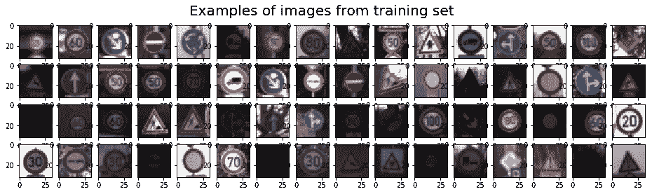

我们应该首先探索数据集，针对要解决的问题理解它。让我们看看每个交通标志类别有多少个样本。我们不希望这个模型偏向任何一个班级。下面是每个标签在训练集中出现的样本的直方图。

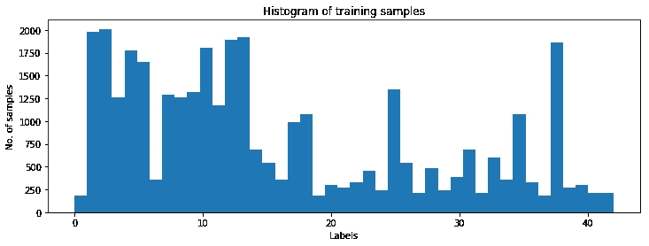

现在，我们可以看到，一些标签在数据集中的代表性非常低，而其他标签则有相当多的代表性。我们是否应该忽略后两者来均衡直方图？让我们首先画出属于同一类的图像的子集。

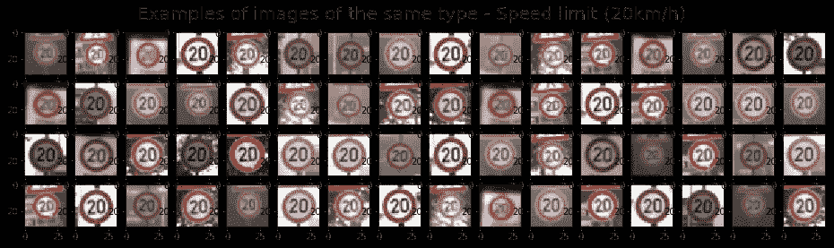

我们可以观察到，来自同一类的图像可以在数据集中以非常不同的方式表示。一般可以有不同的**光照条件**，图像可以**模糊**、**旋转**或**缩放**。事实上，这些是从真实世界图像中提取的样本。我们的模型必须处理所有这些情况。因此，为了获得数据平衡，最好不要截断我们的数据集。让我们“生产”一些新的样本，主要是代表不足的迹象。

# 数据预处理

为了生成所谓的**增强数据**，我随机选择了要复制的图像。为了给模型提供额外的信息，我随机旋转了这个副本并改变了它的亮度。所有这些操作都使用了 OpenCV 库。我执行这些操作，直到每个标签有 3200 个样本。这将训练集增加到 139.148 个样本。作为一个例子，这里有一个带有生成图像(旋转和不同亮度)的样本交通标志的绘图。

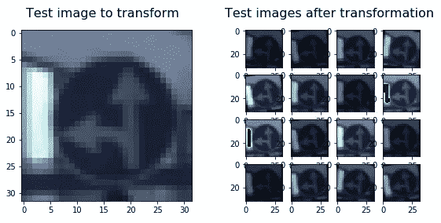

接下来，我决定将图像从 RGB 转换成灰度。因此，我们要处理的数据减少了三分之一，这极大地影响了训练时间。此外，在处理交通标志识别的[论文](http://yann.lecun.com/exdb/publis/pdf/sermanet-ijcnn-11.pdf)中，作者发现拒绝颜色信息甚至可以提高最终结果。为了进行实验，在我的模型架构的早期阶段，我使用 RGB、YUV 颜色空间和灰度图像对模型进行了 20 个时期的训练。同样，最新的变化最终得到了最好的结果。最后，我还归一化了图像数据，使每个像素位于-1 和 1 之间。它防止了当数据远离零值时可能发生的数值不稳定性。

以下是灰度化和规范化前后的交通标志图像示例。还描绘了两幅图像的直方图。

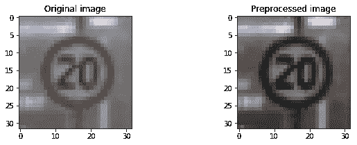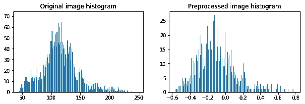

# 设计深度神经网络模型

现在，终于到了将数据输入神经网络的时候了。选择[网络](https://hackernoon.com/tagged/network)架构，一次又一次地调整不同的参数可能是最苛刻的任务。模型优化没有明确的规则。除了一些已被证实的经验法则之外，我们的经验也起着很大的作用。此外，当处理深度神经网络时，你必须等待每个测试模型的结果相对较长的时间。当然，这取决于可用的处理能力。对于这个项目，我使用了内置 Nvidia GPU 的 [AWS EC2 实例](https://www.cloudar.be/awsblog/how-to-use-aws-ec2-gpu-instances/)，与运行 i7 CPU 内核的笔记本电脑相比，速度提高了约 6 倍。

为了简要概述模型的复杂性，我将列出最重要的模型参数。由于这是对交通标志识别项目的概述，我不打算详细解释它们。这些参数有时被称为“超参数”，它们是:[批量大小、时期数](/towards-data-science/epoch-vs-iterations-vs-batch-size-4dfb9c7ce9c9)、[学习率](https://datascience.stackexchange.com/questions/410/choosing-a-learning-rate)、[损失规则化](https://chatbotslife.com/regularization-in-deep-learning-f649a45d6e0)、[退出率](/@amarbudhiraja/https-medium-com-amarbudhiraja-learning-less-to-learn-better-dropout-in-deep-machine-learning-74334da4bfc5)或池类型。他们经常被研究人员讨论和衡量。但是，类型和模型结构本身的选择也同样重要。卷积神经网络，这里很好地介绍了，非常适合我们的任务。但 CNN 有许多成熟的子类型，如[LeNet](http://yann.lecun.com/exdb/publis/pdf/lecun-98.pdf)(20 世纪 90 年代)、 [AlexNet](https://papers.nips.cc/paper/4824-imagenet-classification-with-deep-convolutional-neural-networks.pdf) (2012 年)、 [GoogLeNet](https://arxiv.org/abs/1409.4842) (2014 年)或 [VGGNet](http://www.robots.ox.ac.uk/~vgg/research/very_deep/) (2014 年)。它们因神经元层数(模型深度)、神经元之间的连接、运算次数或每次迭代更新的参数而异。最流行的架构的比较可以在[这里](/towards-data-science/neural-network-architectures-156e5bad51ba)找到。

## 卷积神经网络

让我们简单讨论一下卷积神经网络的概念。他们在图像识别方面非常成功。CNN 区别于传统神经网络的关键部分是**卷积**运算。在输入端有一个图像，CNN 对其进行多次扫描，寻找某些**特征**。这种扫描(卷积)可以用两个主要参数设置:步幅和填充类型。正如我们在下图中看到的，第一次卷积的过程给了我们一组新的帧，显示在第二列(层)。每一帧包含关于一个特征及其在扫描图像中的存在的信息。在某个特征非常明显的地方，生成的帧将具有较大的值，而在没有或很少有此类特征的地方，生成的帧将具有较低的值。此后，对每个获得的帧重复该过程选定的次数。在这个项目中，我选择了一个经典的 [LeNet](http://yann.lecun.com/exdb/publis/pdf/lecun-98.pdf) 模型，它只包含两个卷积层。

from [https://adeshpande3.github.io/adeshpande3.github.io/A-Beginner%27s-Guide-To-Understanding-Convolutional-Neural-Networks/](https://adeshpande3.github.io/adeshpande3.github.io/A-Beginner%27s-Guide-To-Understanding-Convolutional-Neural-Networks/)

我们正在卷积的后一层，正在搜索更高级的特征。它的工作原理类似于人的感知。举一个例子，下面是一个很有描述性的图片，上面有在不同 CNN 层搜索到的特征。可以看到，这个模型的应用是人脸识别。您可能会问，模型如何知道要寻找哪些特性。如果你从头开始构建 CNN，搜索到的特征是随机的。然后，在训练过程中，神经元之间的权重被调整，慢慢地，CNN 开始找到能够满足预定目标的特征，即，从训练集中成功地识别图像。

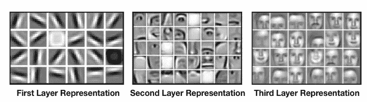

from [from: https://devblogs.nvidia.com/parallelforall/deep-learning-nutshell-core-concepts/](https://devblogs.nvidia.com/parallelforall/deep-learning-nutshell-core-concepts/)

在所描述的层之间还有**汇集**(子采样)操作，其减少了最终帧的尺寸。此外，在每次卷积后，我们将一个非线性函数(称为 **ReLU** )应用于结果帧，以将非线性引入模型。

最终，在网络的末端还有**全连接层**。卷积运算得到的最后一组帧被展平，得到神经元的一维向量。从这一点上，我们把一个标准的，完全连接的神经网络。在最末端，对于分类问题，有一个 **softmax** 层。它将模型的结果转换为每个类别的正确猜测概率，这里是交通标志指数。

下面是我选择的模型的总结，并对每一层的标注尺寸进行了微调。

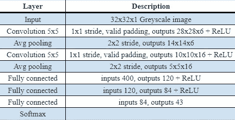

## 调整模型

我遵循一个简单的迭代过程来寻找最佳的模型架构。在更改其中一个模型参数后，我只运行了 20 个时期的训练，并观察到试图将其设置为最低水平的验证错误。在调整模型时，主要考虑验证误差是非常重要的。仅最小化基于训练数据的误差很容易导致不想要的模型[过拟合](https://en.wikipedia.org/wiki/Overfitting)。

下面是我采取的中间步骤的细节，以及在 20 个时期的训练后相应的验证准确性。有时，两种给定方法之间的差异似乎很大，很难在它们之间做出选择。但是注意，对于每个训练过程，存在影响最终误差的随机权重初始化。尤其是当历元数量很小时。这就是为什么在最终的模型调整过程中，我使用了 20 多个历元——大约 100 个。

*   初始 LeNet 模型，选择输入图像颜色表示— 91 %
*   输入图像标准化— ~91 %
*   训练集扩充— 93 %
*   学习速率优化，从这个阶段开始，我测试了 100 个时期— 95 %
*   在训练集扩充过程中寻找最佳图像变换— 96 %
*   尝试不同的池方法，尝试辍学，选择 L2 损失，再次调整学习率-96.8

我的**最终模型结果**如下:

*   **的训练集准确率为 99.5 %**
*   **的验证设定准确率为 96.8 %**
*   **的测试设定准确率为 94.6 %**

我对这些结果相当满意。早先引用的[论文](http://yann.lecun.com/exdb/publis/pdf/sermanet-ijcnn-11.pdf)的作者(Sermanet 和 LeCun)达到了等于 99.17%的准确度水平。它被认为是高于人类的表现是 98.81%！

# 在新图像上测试模型

最后，我们想在完全看不见的标志图像上测试我们的交通标志识别系统。当然，在测试集上获得的精度也是模型性能的一个很好的指示。但是，让我们找到一些新的图像，这些图像不是来自我们的德国交通标志数据集。在图像下，有模型预测、预测是否正确的指示和模型确定性。

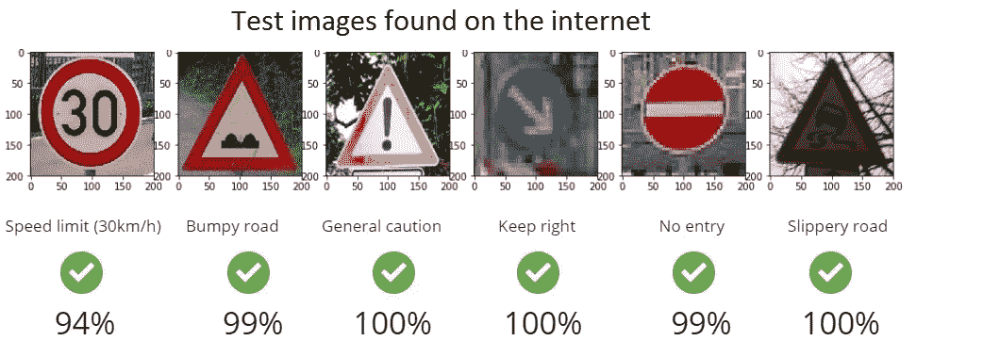

我们可以看到效果确实不错。我还从格但斯克的波兰道路上收集了图像，并提取了一些交通标志来测试我的模型。

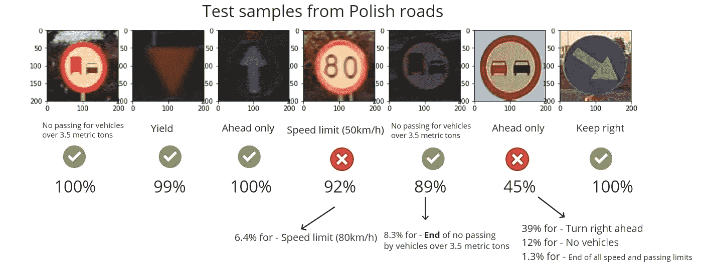

虽然我选择了与德国标志相同的标志，但结果要糟糕得多。一个例外是黄色而不是白色的让行标志。因此，这是一个积极的惊喜，模型预测正确。不幸的是，有两个标志根本没有被识别出来。到目前为止，我没有做更多的研究为什么会发生这种情况。

# 结论

我成功地实现了一个卷积神经网络的交通标志识别任务。这是使用 Python 的开源 Tensorflow 库完成的。我选择了一个流行简单的 LeNet CNN 架构。我看到了最大的改进空间。许多现代深度学习系统使用更新更复杂的架构，如 GoogLeNet 或 ResNet。另一方面，这会带来更多的计算成本。[在这里](https://www.analyticsvidhya.com/blog/2017/08/10-advanced-deep-learning-architectures-data-scientists/)你可以找到最流行的架构的简要对比。这个项目最困难的部分是微调 CNN 的模型参数。有时这很麻烦，因为我不确定我应该朝哪个方向走。但这是机器学习的艺术。我研究了类似的项目，并试图在我的模型中引入一些想法。有趣的部分也是数据增加与图像旋转和改变亮度，这也是许多人做这个项目的建议。

更多细节和完整代码可以在 [github](https://github.com/tomaszkacmajor/CarND-Traffic-Sign-Classifier-P2) 上找到。

*最初发表于*[*ProggBlogg*](http://tomaszkacmajor.pl/index.php/2017/10/15/traffic-sign-recognition-using-cnn/)*。*