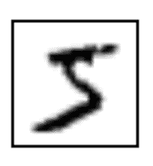
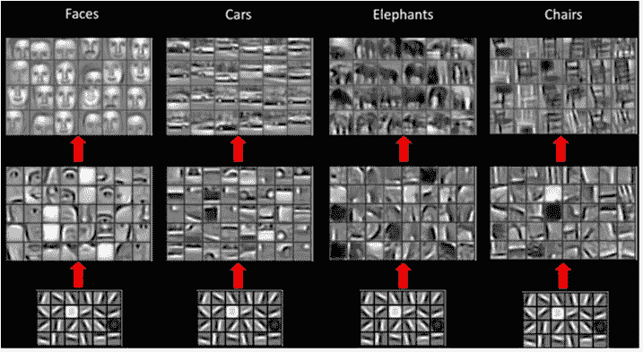
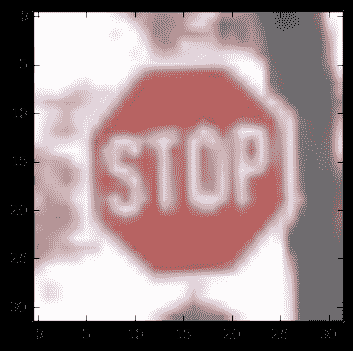
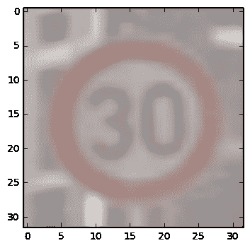
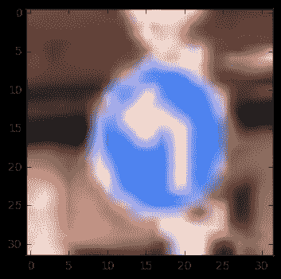
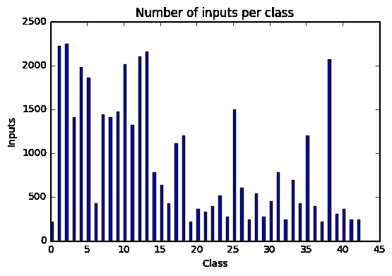
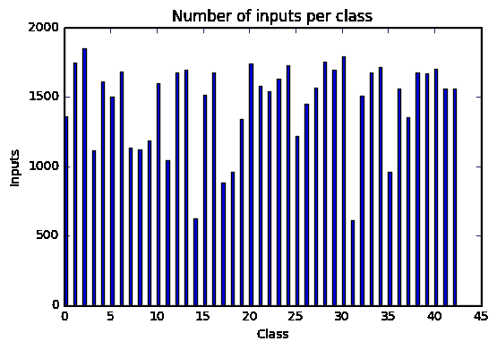
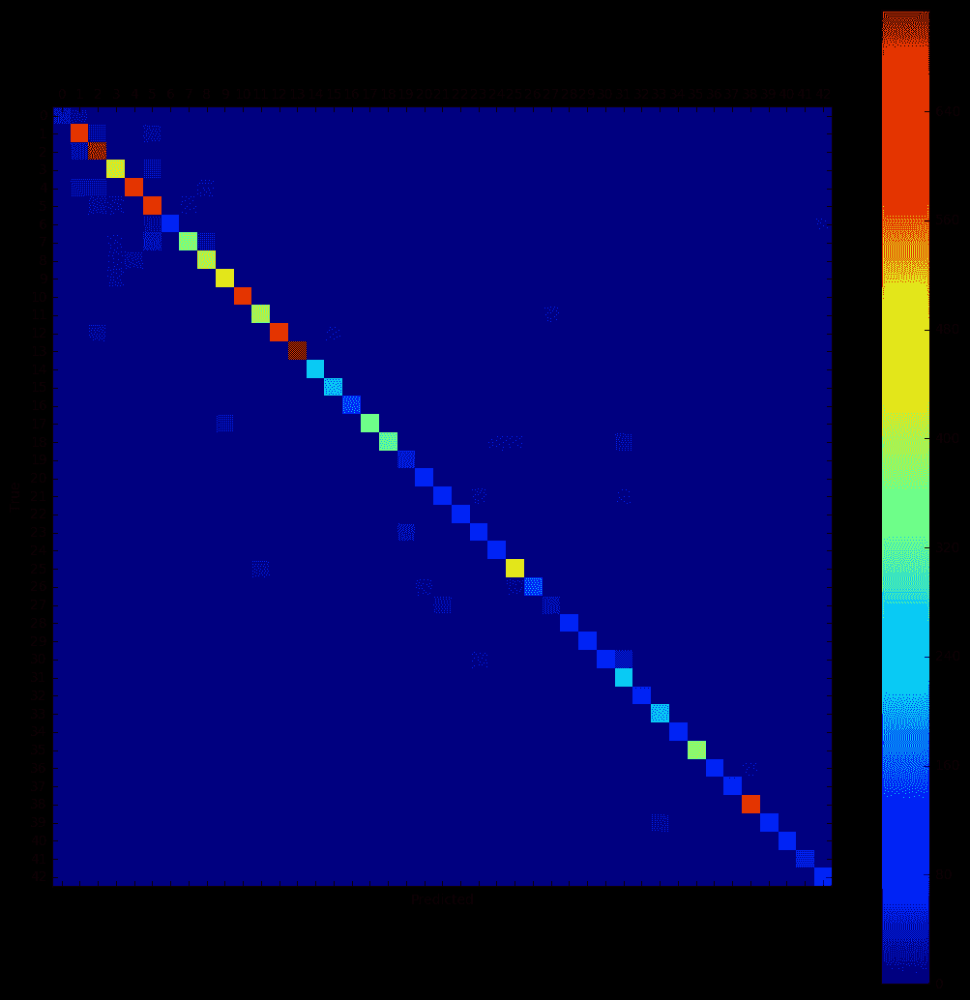
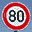

# 基于深度学习的交通标志分类。

> 原文：<https://medium.com/hackernoon/traffic-signs-classification-with-deep-learning-b0cb03e23efb>

*你可以在这里* *找到我的代号* [*。它可能比文章更新；).*](https://github.com/MehdiSv/TrafficSignsRecognition/)

# 介绍

这是自动驾驶汽车系列的第二篇文章。如果你想知道我为什么分享这个和更多关于我的旅程，请阅读[这个](/@MSqalli/self-driving-car-journey-to-build-one-5413ad0e4115)。

# 目标

使用简单的卷积神经网络对交通标志进行分类。

# 机器学习

想象一下，你需要建立一个程序来识别书写的数字。

Image from the MNIST database.

这是一个 5。但也可能是 3。

从 3 分到 5 分，你会使用什么截止/规则？

研究人员决定向计算机展示数以千计的例子，让它根据经验尝试解决问题，而不是试图精选所有的规则并构建一个非常复杂的程序。这是机器[学习](https://hackernoon.com/tagged/learning)的开始。

机器学习的主要问题之一是特征提取。即使我们向计算机展示了成千上万的例子，我们仍然需要告诉他应该关注什么特性。对于复杂的问题，这还不够好。

深度学习模型避开了这一点。他们自己学习应该关注什么特性。

# 深度学习

为了简洁起见，我不打算深入研究深度学习如何工作的数学解释。我花了大约 20 个小时来理解这些概念并使用它们。相反，我将尝试解释深度学习背后的直觉。如果你想更深入的话，我会贴一些我用过的视频和讲座。没有双关的意思。

作为人类，识别一个物体似乎是一件非常简单的任务。我们几乎没有付出任何努力，至少没有意识到。但是实际上在我们真正理解我们正在看的东西之前，我们的大脑已经做了很多工作。

20 世纪 50 年代末，两位著名的神经生理学家大卫·胡贝尔和托尔斯滕·威塞尔在一只猫身上做了实验，以展示视觉皮层中的神经元是如何工作的。

首先，他们表明附近的细胞处理来自附近视野的信息，形成地形图。此外，他们的工作确定了具有相似功能的神经元被组织成列，这些列是微小的计算机器，将信息传递到大脑的更高区域，在那里视觉图像逐渐形成。

大脑基本上结合了低层次的特征，如基本形状、曲线，并从中构建出更复杂的形状。

一个深度学习卷积神经[网络](https://hackernoon.com/tagged/network)类似。它首先识别低级特征，然后学习识别和组合这些特征，以学习更复杂的模式。这些不同级别的功能来自网络的不同层。

深度学习是一个令人着迷的领域，我希望我给了你足够清楚的介绍。我鼓励你们观看关于这个主题的的[精彩的斯坦福课堂。](https://www.youtube.com/playlist?list=PLLvH2FwAQhnpj1WEB-jHmPuUeQ8mX-XXG)

如果你喜欢阅读，我会推荐你古德菲勒、本吉奥和库维尔的[书](http://www.deeplearningbook.org)。

# 交通标志项目

如果我们想要自动驾驶汽车，检测和分类交通标志是一个必须解决的问题。

我们将使用的数据集是在线提供的德国交通标志数据集。

它总共包含 50，000 多张图片，分为 43 个不同的类别:限速、危险弯道、湿滑路面……这里是其中的一些。

这个数据集在几年前的一次比赛中使用过。竞赛的最佳结果是正确猜中 99.46%的符号。相比之下，人的表现为 98.84%。是的，机器比人更有效率，因为它更擅长处理最困难的情况，比如限速标志的模糊图像可能会被误认为是不同的限速。

# 数据扩充

在我们开始建立我们的深度学习网络之前，让我们分析一下数据。

以下是不同类别的分布情况:

正如你所看到的，这两个职业有太多的不同。我们将创建一些数据来平衡输入的数量，并减少网络可能对某些类产生的偏差。它还将帮助我们向网络提供更多数据。

一个简单的方法是把图像旋转几度。通过增加 5 度、-5 度、10 度和-10 度，我们已经可以将某些类别的输入增加五倍。

这是这次手术后我们得到的分布。

数据更均衡，每个班至少有 500 张图片。

# 网络体系结构

*文章的这一部分详细描述了网络架构。如果不熟悉深度学习，可以跳到结果部分。*

第一层是具有 3*3 的面片大小、1 的步幅、相同的填充和 64 的深度的 CNN。

第二层和第三层是完全连接的层，宽度为 512。

最后一层是全连通层，宽度为 43(类的数量)。

我使用 Adam 优化器及其默认参数，因为它目前被认为是最有效的。

我使用了 250 和 100 个训练时期的批量大小。

我尝试添加更多的卷积网络，但它们并没有改善结果，并增加了大量的计算时间。我们觉得没有必要添加它们，因为我们处理的图片之间的统计不变性很低。它们中的大多数已经被居中并围绕标志被裁剪。

我使用了一个中等大小的网络，因为标志的形状和颜色总体上非常简单，但是由于标志的形状、颜色和整体外观有一些变化，所以我使用了宽的完全连接的层。

我没有使用超过 100 个历元，因为从那以后精度没有提高。我还想保持网络轻便，这样在 AWS 上训练它就不会花太多时间，结果也令人满意。

# 结果

到目前为止，我只授权自己查看验证的准确性。当我超过 99%并且对结果满意时，我决定根据测试集进行计算。

*最终验证精度:0.9938*

*最终测试精度:0.9110*

验证集和测试集之间 8%的下降表明我过度拟合了我的模型。

以下是我可以尽量避免的一些事情:

*   L2 正规化。
*   提前停车。
*   辍学。

查看混淆矩阵也有助于我们了解哪里出现了最多的错误:

如您所见，大多数错误位于左上角。这些都是速度限制。这个模型似乎可以检测出限速，但在识别标志值之间的差异时有困难。

# 额外的

我测试了一些从网上下载的随机标志，看看模型会有什么反应:

最后两个符号不在我们的数据集中。

前三个信号以 99%以上的置信度被正确识别

第四个标志(显然)被错误地识别为“禁止进入”标志，置信度为 80%。

第五个标志(显然)被错误地识别为限速标志，其可信度为 99%。模型应该做得更好。

# 思想

从深度学习的 0 知识到能够实现一个简单的小型网络，我花了大约 20 个小时。几个小时后，我得到了令人满意的结果。

深度学习真的让人印象深刻。我迫不及待地想看看在这个领域我还能学到多少东西，取得多少进步。

下次我们将讨论行为克隆。我们将在模拟器中驾驶汽车，并看看我们的深度学习模型可以从其中学习到如何自动驾驶。听起来很刺激，对吧？！**敬请期待！**

此外，请随时评论，提问，并给出建议。

*感谢* [*埃里克*](https://medium.com/u/d8603e818394?source=post_page-----b0cb03e23efb--------------------------------) *，* [阿布德](https://medium.com/u/e027d96f8057?source=post_page-----b0cb03e23efb--------------------------------) *，* [哈姆里赛义德](https://medium.com/u/1574406fd15?source=post_page-----b0cb03e23efb--------------------------------)，[哈姆扎](https://medium.com/u/288af6ec97d0?source=post_page-----b0cb03e23efb--------------------------------) *对本帖的反馈。*

