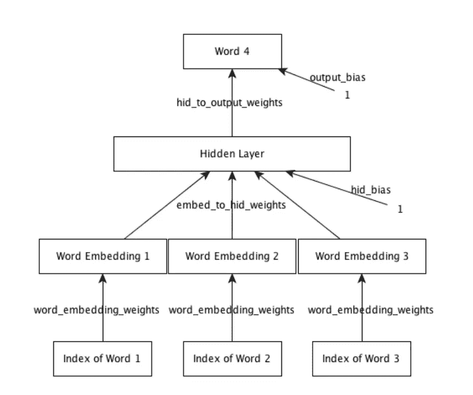
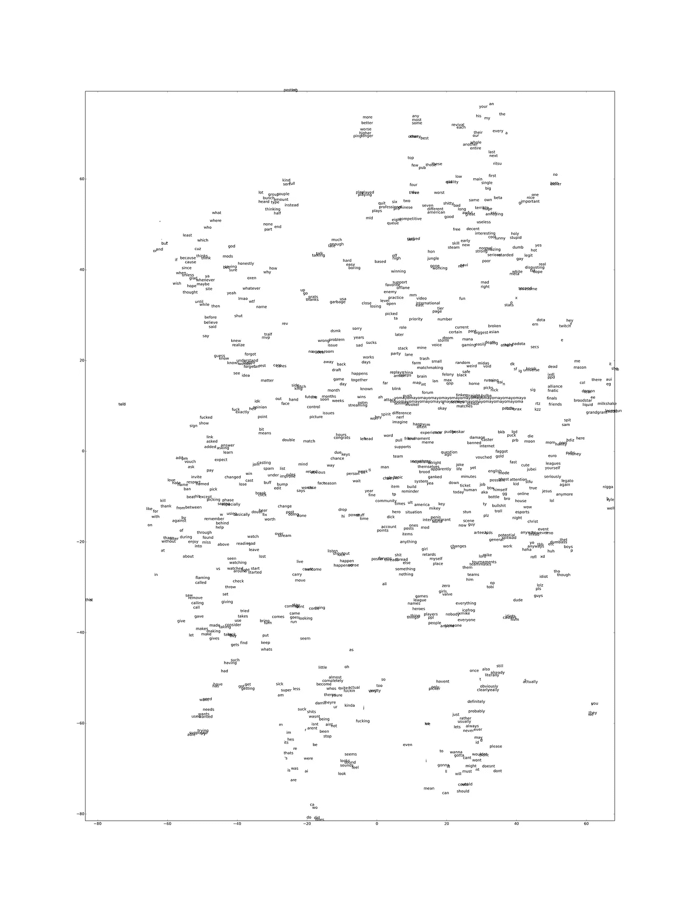
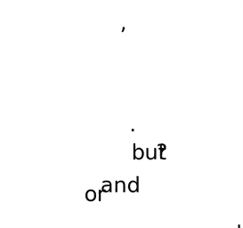
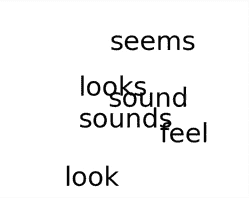
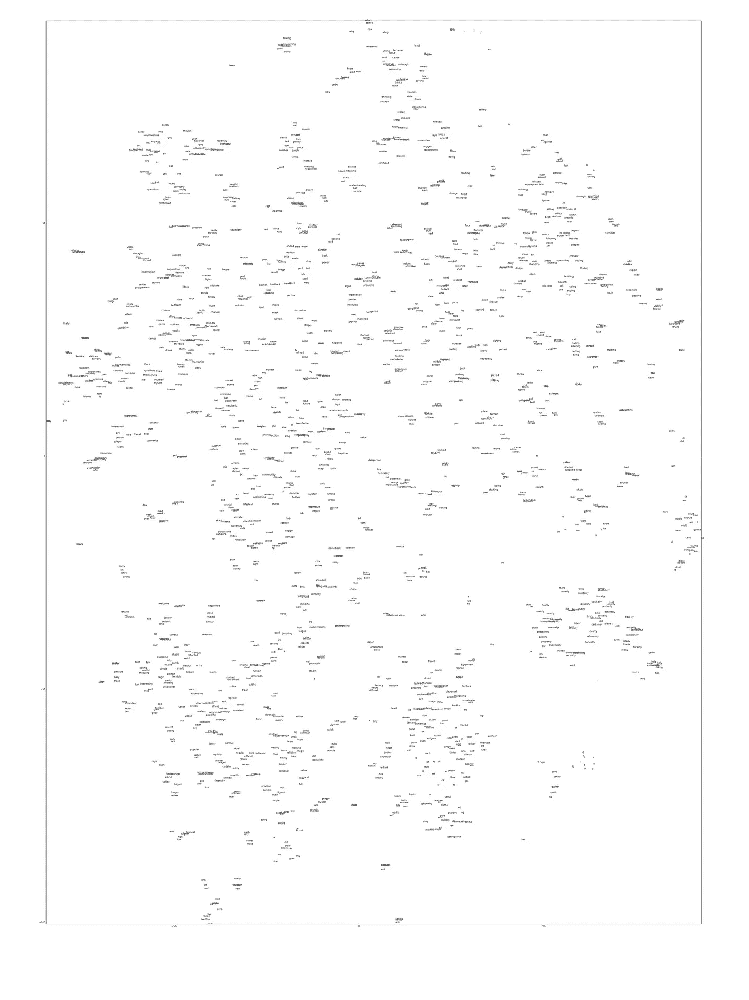
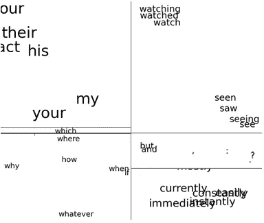
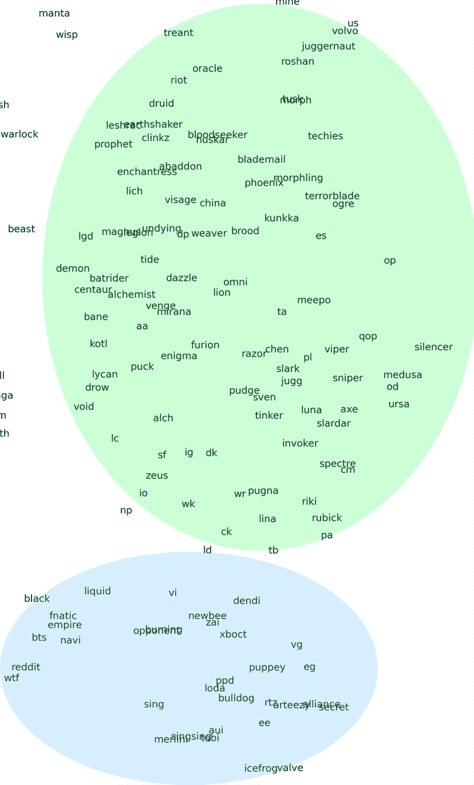
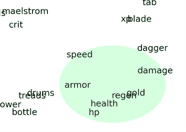

# 当你训练一个关于电子游戏俚语的神经网络时会发生什么。

> 原文：<https://medium.com/hackernoon/training-a-word-prediction-model-on-videogame-forum-comments-d00dc16d06b0>


‘Middle Lane’ — Dota2— Image [credit](http://dota2.gamepedia.com/Mid_Lane_%28Loading_Screen%29)

一个被设计用来做简单单词预测的神经网络[在从在线论坛收集的帖子上接受训练时会有怎样的表现？如果我们选择一个特定主题的来源(例如:一个特定的视频游戏)，模型将如何处理特定主题的单词(例如:角色和拼写名称)和俚语？是来自非正式英语(俚语、拼写错误、混合语法等)的“噪音”。)重要到可以忽略使用这种类型的数据进行](https://hackernoon.com/tagged/network)[学习](https://hackernoon.com/tagged/learning)练习？在这个练习中，我们为在线游戏“DoTA2”搜集讨论板，并看看结果与使用经典的精选数据集相比如何。

`This is a personal project I worked on to learn more about deep learning. If you just want to see the code, check it out on [Github](https://github.com/daendinam/dota-nn). The slides from [**this course**](https://www.coursera.org/course/neuralnets) were very helpful in learning the core concepts.`

# 模型

神经网络取自多伦多大学的一个神经网络课程作业，我当时是由 Geoffrey Hinton 教授的(课程的最新版本可以在这里找到[](https://www.cs.toronto.edu/~rgrosse/csc321)**)。**

> ***“它接收 3 个连续单词作为输入，其目的是预测下一个单词(目标单词)的分布。我们使用交叉熵准则来训练模型，这相当于最大化它分配给训练集中的目标的概率。希望它也能学会对以前从未见过的序列做出明智的预测。”— G .辛顿***

****

**[Source](http://www.cs.toronto.edu/~guerzhoy/321/)**

# **收集数据**

***选择的数据来源是两个讨论热门多人游戏《DoTA2》的活跃论坛:* [***reddit.com/r/dota2***](https://www.reddit.com/r/dota2)*和*[***nadota.com***](https://www.nadota.com/)*。***

**python 框架“Scrapy”用于从两个网站收集个人评论和帖子。对于这两个网站，scraper 从尽可能多的线程收集了所有评论。对于 nadota 来说，整个 Dota 聊天’论坛都被刮了(大约 500 页的内容)。Reddit 的内容要多得多，所以经过近 3 天的搜索，不到 2 年的内容就被删除了(超过 1000 万条个人评论)。如果我不限制刮刀的速度以免影响网站的服务器，这可能会快一点，但两年已经足够了。**

# **消毒**

**论坛帖子的问题是语法和标点符号没有被强制执行(甚至很少被鼓励)，从一个词的评论到巨型 ASCII 艺术杰作，任何东西都可以在收集的数据中。为了最大限度地减少噪音，刮出的数据被净化，看起来尽可能“简洁”。特殊字符和键盘垃圾被丢弃，过多的标点符号被缩短为 1 个字符，句号被附加到没有它们的句子中，等等。因为目标是看看在没有严格完善的训练数据的情况下学习有多容易，所以净化仅限于不改变数据意义的生活质量变化。**

**消毒后，每个评论被分成单独的句子，然后再分成三元模型(3 个单词的集合)，作为我们模型的输入。三元模型的顺序是随机的，以避免训练中的偏差。为了将数据降低到一个具有合理词汇量的工作集，任何包含出现次数不超过设定阈值的单词的句子都将被丢弃。**

***你可以通过*[***sanitize . py***](https://github.com/daendinam/dota-nn/blob/master/scraped-data/sanitize.py)*中的代码查看更多细节。***

**下面是数据在分割成三元模型并序列化之前的预览:**

```
It 's been a pub thing for a long time .
I have done this , a lot .
Glad Im not the only one .
I have done this a lot too you are not alone .
I must ask , which match was this ?
By spamming meepo .
```

***感谢 nadota.com ch0p 允许刮。***

# **结果**

## *****1。****NADota.com***

> ****总评论刮掉:** ~49 万
> **单词出现阈值:** 500
> **总词汇量:** 946
> **总训练输入:**16.99 万(50%)
> **总验证和训练集规模:**8.49 万(25%，25%)
> **训练设置**:1**

**因为这个数据集与 Reddit 相比相当小，所以它主要用作概念验证，以便有信心迁移到更大的数据集。**

**判断性能的一种方法是给模型一个输入，然后看看输出有多合理。当我们给模型一个输入，继续取最大概率输出。尽管在当前输入之前它没有任何上下文，我们仍然生成看起来可信的句子:**

```
"I think that" -> " 's a good player."
"You are definitely" -> "the best."
"He plays a" -> "game."
"Why does nadota" -> "play dota two./?"
"Do you even" -> "know what he did./?"
"You should pick" -> "me."
"I like when" -> "I m not sure if it was a good player."
```

**为了更直观地了解我们的模型是如何学习的，我们可以看看使用一种叫做 t-SNE 的算法绘制的分布式表示空间的二维图。该算法试图将 16 维空间中靠近的点映射为 2 维空间中靠近的点。你可以在这里 阅读关于 t-SNE 如何运作 [**。**](https://en.wikipedia.org/wiki/T-distributed_stochastic_neighbor_embedding)**

**完整剧情如下。
*(注:词汇包括显性语言。)***

****

**[Click for full resolution](https://daendinam.github.io/projects/images/nadota-freq500-(16-128)-tsne.png)**

**我们可以看到一些例子，表明我们的模型已经学习了语法和语义特征。**

****

**在这里，我们看到嵌入将语义不同但语法相似的单词紧密地组合在一起，用于分隔独立的分句。**

****

**证据学习能够将替换拼法和俚语与它们的词根联系起来。**

****

**一串语义相关的单词。**

**所以我们有很好的证据证明训练数据不需要是完美的英语。接下来，我们来看看更大的数据集的结果。**

## ****2。** Reddit**

> ****总评论刮:**~ 1000 万
> **单词出现阈值:** 4000
> **总词汇量:**1780
> **总训练输入:**837.14 万(80%)
> **总验证和训练集规模:**104.64 万(10%，10%)
> **训练设置:】****

**这个数据集要大得多，所以希望我们能看到有趣的结果。**

**给模型一个前所未见的输入会产生相当合理的输出:**

```
>>> model.predict_next_word('correctly','learning','to')
correctly learning to do Prob: 0.06963
correctly learning to play Prob: 0.05980
correctly learning to be Prob: 0.05595
correctly learning to get Prob: 0.03048
correctly learning to see Prob: 0.02387
correctly learning to go Prob: 0.02322
correctly learning to watch Prob: 0.02066
correctly learning to win Prob: 0.01970
correctly learning to pick Prob: 0.01947
correctly learning to make Prob: 0.01940
```

**该模型不仅正确地预测了一个最符合语法的动词，而且它的最佳选择对于学习环境都非常适用。**

**从 SNE 霸王龙的图中我们能学到什么？**

****

**[Click for full resolution](https://daendinam.github.io/projects/images/reddit-full.png)**

**我们可以再次看到该模型将语法和语义相似的单词紧密联系起来的好例子:**

****

**最后一个非常有趣，当你注意到模型将副词聚集在一起，以及聚集那些意思相似的副词——图中的副词都与时间有一些关系。**

**针对论坛(DoTA2)主题的词汇呢？**

****

**从上面我们可以看到，该模型有一个区域包含许多 DoTA2 特有的代词，特别是有两个不同的集群将英雄(游戏角色)姓名与真实的玩家和组织名称分开。也就是说，绿色泡泡中的几乎所有东西都是指游戏中的虚构角色，而蓝色泡泡中的所有东西都是指真实的人或组织(即团队、品牌)。**

****

**在另一个区域，我们看到了一串单词，它们都与游戏环境的特定属性相关。**

***(例如:* ***速度:*** *你的角色或者法术移动的速度有多快。* ***护甲:*** *用于计算人物抗伤害的统计。* ***【Regen:****再生的简称，一种使角色随时间再生生命值的属性。)***

**这让我们了解到该模型能够很好地适应训练数据的上下文，包括特定于方言或社区的独特词汇和词义。**

## **这是什么意思？**

**使用在网上找到的数据可以是一种合理的方法来开发一个特定环境的学习模型。人们可以通过一种非常有趣的方式来洞察语言在不同社区之间的进化和变形。一个有趣的练习可能是用不同年份的数据集训练两个聊天机器人，看看俚语和情绪的差异是否明显。**

**非常酷的是，我们已经证明了从不完整的数据(拼写错误、垃圾邮件等)中学习是可能的。)，并且仍然提出一个对语法有合理把握的模型，所有这些都不需要手动挖掘数据来清理。如果你熟悉深度学习，这可能对你来说并不令人震惊，但作为一个刚接触这个主题的人来说，这是一次非常有趣的学习经历！**

# **博学的**

**抓取和处理大量数据会比预期花费更多的时间！在未来的日子里，我希望我能更多地关注时间安排(以及问题出现时的重新安排)。**

**关于扩展的一些想法:在游戏世界中还有哪些其他形式的可用数据？多人游戏的比赛统计数据可以用来可靠地预测玩家技能吗？游戏内聊天记录呢？**

***所有代码都是* [*在 Github*](https://github.com/daendinam/dota-nn) *上可用并免费使用。请尽可能说明。***

**[](http://bit.ly/HackernoonFB)****[](https://goo.gl/k7XYbx)****[](https://goo.gl/4ofytp)**

> **[黑客中午](http://bit.ly/Hackernoon)是黑客如何开始他们的下午。我们是 [@AMI](http://bit.ly/atAMIatAMI) 家庭的一员。我们现在[接受投稿](http://bit.ly/hackernoonsubmission)，并乐意[讨论广告&赞助](mailto:partners@amipublications.com)机会。**
> 
> **如果你喜欢这个故事，我们推荐你阅读我们的[最新科技故事](http://bit.ly/hackernoonlatestt)和[趋势科技故事](https://hackernoon.com/trending)。直到下一次，不要把世界的现实想当然！**

****