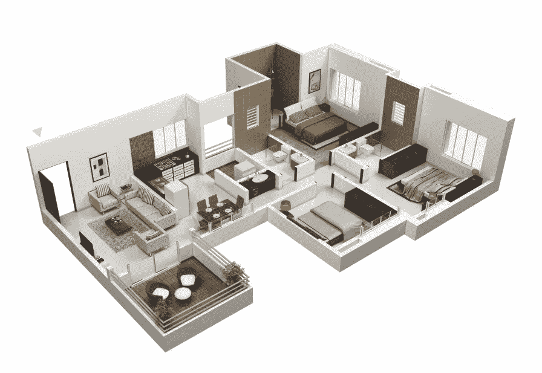
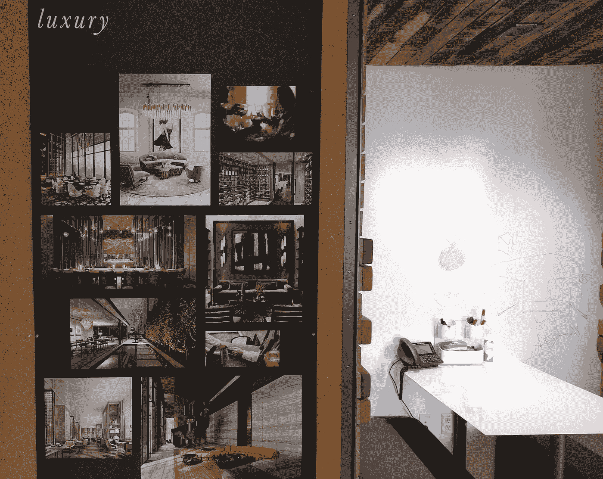
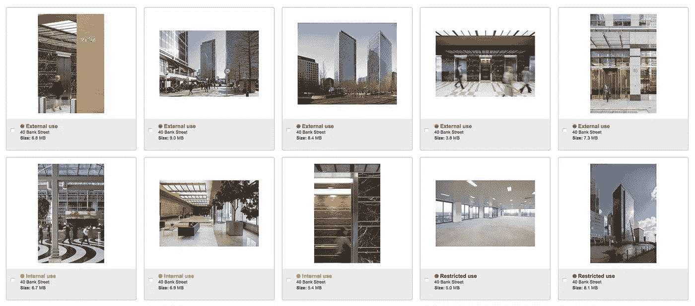
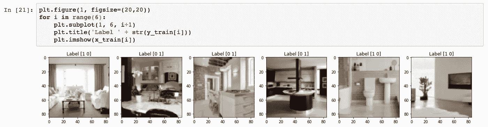

# 训练架构分类器

> 原文：<https://medium.com/hackernoon/training-an-architectural-classifier-5f1b4f512368>

## 动机

How do we recognize a room? source[[1](http://home-designing.com)]

> 计算机能学会区分家里不同的“地方”吗？

*在这一系列文章中，我将先后经历更复杂的机器学习模型进行图像分类，最终用深度卷积神经* [*网络*](https://hackernoon.com/tagged/network) *达到 92%的准确率。*

尽管长期以来一直有一种趋势，那就是让我们的空间更加灵活，但这些空间的最终用途(尤其是在我们的家中)会创造出可识别的艺术品，无论是在设计上还是在最终产品上。不管它有多现代和稀疏，当你走进一个厨房，你知道这是一个厨房。据推测，我们可以训练一个机器学习模型来区分这些文物。

从实验设计的角度来看，这很有趣，探索已经学会这项任务的网络的激活可以提供有用的，甚至鼓舞人心的例子，说明在我们的设计中*视觉上* *重要的*。此外，当收到成千上万特定类型地点的图像时，网络的深层将开始[提取并编码实例之间的潜在差异](https://arxiv.org/abs/1606.05908)，从而洞察可能不会立即显现的风格关联。

作为设计师，我们利用丰富的图像，创建一个可从中提取数据的自然池，同时也是改进我们运营的机会:

## 机遇:先例意象

Precedents , sketches, ideas — we love imagery. photo credit: Matt Carter

当充实一个设计概念时，设计师进行的第一步是先例研究，搜索谷歌、pintrest、杂志等，寻找与概念相关的图像。我们想用这些来填满墙壁，这样我们就能沉浸在令人回味的图像中，并以此为基础进行创作。我们还想用它们向他人传达早期的设计理念。

当然，对于你发现要挂在墙上的每一张图片，有几十张甚至几百张是不相关的，或者没有捕捉到你感兴趣的风格。这可能是一个低效的过程。

为了帮助这一点，我们维护了一个我们常年喜爱的数据库，按照描述性的分组进行分类，如“卧室”、“入口”和“大厅”。这可以大大加快研究过程，因为我们已经缩小了我们认为符合我们风格的图像的范围，并且可以从相关类别中快速抓取它们。

Our web based precedent database

然而，如果设计是进化的，这个数据库不能保持静止。必须不断添加新的图像，数据库已经有数万张图像。这引入了两个问题:

1.  必须有人手动对图像进行分类和标记，以便保持适当的类别。
2.  *随着风格的演变，设计师可能会留下一大堆不太相关的图片来费力浏览，这比使用谷歌图片搜索好不了多少。*

解决第一个问题(我将称之为“分类分类”)是最简单的，我将在这篇文章中解决这个问题，然后通过训练一个深度神经网络来识别不同类别的场景并对其进行分类。

第二个问题是“风格分类”，这个问题有点棘手，需要一种方法来适应类别之间的重叠，但是可以使用一些相同的技术来攻击它。事实上，经过一些修改，在类别上训练的分类器最终可能有助于输出软“风格”预测，这些预测可以开始响应类似“*给我看看更像这样的东西……*”的查询。

## 数据集

最初的数据集由大约 2000 张建筑内部的图像组成；这绝对是深度学习方法的一小部分，后来被扩大到 5000 个独特的图像加上随机变化。这些图像都被标准化为 244 像素乘 244 像素的大小，然后进一步缩小到 85 像素乘 85 像素，以便模型可以在桌面硬件上进行训练。后来，在 amazon p2.xlarge 实例(Tesla K80s)上使用了全尺寸图像。

由于我们数据集的特殊性，我选择首先探索这个作为**二元分类**的问题，类别“厨房”作为正面的例子，其他的都是负面的(我们有很多厨房的图片…不要问为什么)。数据集的构建经历了几次迭代，值得拥有自己的笔记本。

A few examples of images in the dataset with their one-hot labels

我将从天真地探索简单模型开始，逐渐转向更复杂的卷积架构，这导致**我们的最终模型通过迁移学习**达到 92%的准确率**。**

[接下来:训练一个架构分类器——soft max 回归](/@mcculloughrt/training-an-architectural-classifier-ii-bf29eca3cfa6)

或者转到:

1.  [*训练一个架构分类器:动机*](/@mcculloughrt/training-an-architectural-classifier-5f1b4f512368)
2.  [*训练一个架构分类器:Softmax 回归*](/@mcculloughrt/training-an-architectural-classifier-ii-bf29eca3cfa6)
3.  [*训练一个架构分类器:深度神经网络*](/@mcculloughrt/training-an-architectural-classifier-iii-84dd5f3cf51c)
4.  [*训练一个架构分类器:卷积网络*](/@mcculloughrt/training-an-architectural-classifier-iv-4f76bc6844bc)
5.  [*训练一个架构分类器:迁移学习*](/@mcculloughrt/training-an-architectural-classifier-v-fe82e83e94ec)