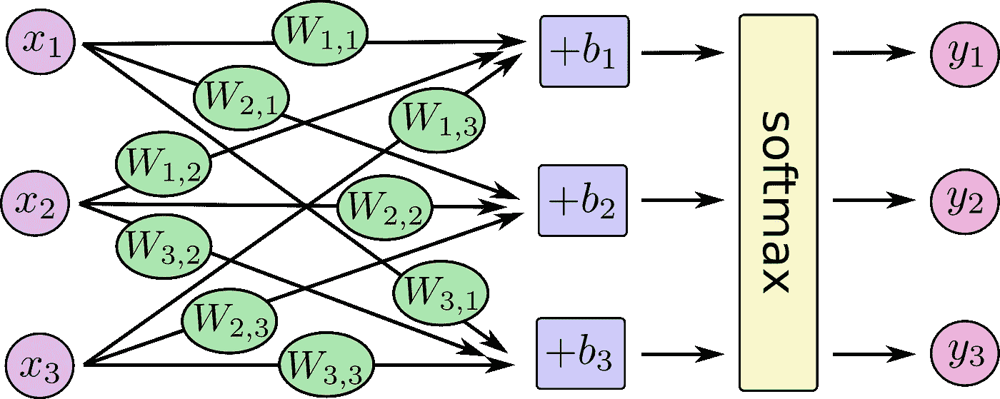
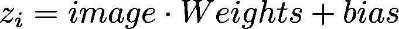
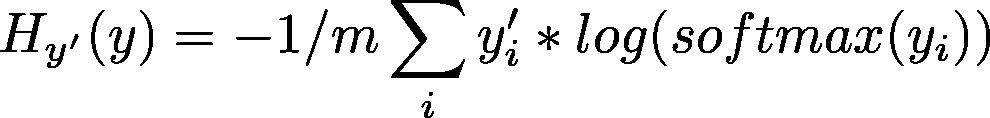
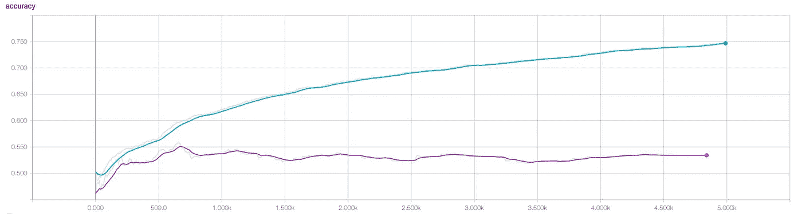

# 训练建筑分类器— II

> 原文：<https://medium.com/hackernoon/training-an-architectural-classifier-ii-bf29eca3cfa6>

## Softmax 回归

*这是 5 篇文章系列的第 2 部分:*

1.  [*训练一个架构分类器:动机*](/@mcculloughrt/training-an-architectural-classifier-5f1b4f512368)
2.  [*训练一个架构分类器:Softmax 回归*](/@mcculloughrt/training-an-architectural-classifier-ii-bf29eca3cfa6)
3.  [*训练一个架构分类器:深度神经网络*](/@mcculloughrt/training-an-architectural-classifier-iii-84dd5f3cf51c)
4.  [*训练一个架构分类器:卷积网络*](/@mcculloughrt/training-an-architectural-classifier-iv-4f76bc6844bc)
5.  [*训练一个架构分类器:迁移学习*](/@mcculloughrt/training-an-architectural-classifier-v-fe82e83e94ec)

*这个项目的一个个人目标是随着深入的* [*学习*](https://hackernoon.com/tagged/learning) *框架而变得越来越有质量，所以尽管 sklearn 之类的可能有一个逻辑回归模块，但我将在 TensorFlow 中更多地手动完成这项工作。你还会看到 tf.slim 和 Keras。*

我们认为最好从一个**更简单、更容易解释的模型**开始，只有在[必要时](https://hackernoon.com/tagged/nessecary)才增加复杂性，我将从尝试简单的逻辑/softmax 回归开始。简而言之，逻辑回归的目标是通过获取输入图像，将其所有特征(本例中为像素)乘以一组正或负权重，然后添加一点偏差来进行预测。

这对于任何有一些数学经验的人来说应该很熟悉，这是一条线的方程: [y=mx+b](http://mathworld.wolfram.com/LinearEquation.html) ，除了在这种情况下，我们的线存在于非常高维的空间中(m、x 和 b 是高维矩阵，而不是你在学校中使用的标量)。当你考虑到我们试图做的是通过空间画一条线，或[超平面](https://en.wikipedia.org/wiki/Hyperplane)，可以将一个类别的图像与另一个类别的图像分开时，这就有了一些直观的意义。

The basic formula for making a prediction — or drawing a line.

这些权重表示像素在某一类别中对整体图像做出积极或消极贡献的学习可能性。因此，像素值乘以学习的权重，给出了对最终结果的一种“投票”。使用 softmax 函数，这些投票然后被转换成图像属于给定类别的概率。虽然我互换使用了术语逻辑和 softmax，但这是逻辑和 softmax 回归之间的主要区别，softmax 将完成逻辑所做的事情，但跨越多个类。

softmax function, converts linear inputs to probabilities

权重通过称为*梯度下降*和*反向传播*的迭代过程来学习，由此误差被归因于每次预测的特定权重，该权重被向上或向下修改，然后再次尝试。在这种情况下，我们使用一种称为交叉熵的误差度量，它收集真实类别乘以预测类别的负对数的乘积的平均值。

cross-entropy loss, collects the incorrect predictions into a single metric

这是一个简单的模型，所以我将让笔记本来完成这里的其余部分:

总之，我们可以做得更好。即使经过更长时间的训练，最好的情况准确率大约是 **57%** 。这是超过 5000 个时期的精确度的张量图:

Accuracy over training epochs. Blue: training accuracy, Purple: validation accuracy

即使在训练数据上，该模型的准确性也远低于人类的准确性，这表明该模型可能不够复杂，无法从提供给它的大量特征中提取有意义的信息。训练和验证准确性之间的巨大差异也表明模型**过度适应**它*能够*提取的信息。

那么如果我们把这个单神经元分类器扩展成深度神经网络呢？这将在我的下一篇文章中发表:

[接下来:架构分类器——深度神经网络](/@mcculloughrt/training-an-architectural-classifier-iii-84dd5f3cf51c)

[https://upscri.be/hackernoon/](https://upscri.be/hackernoon/)