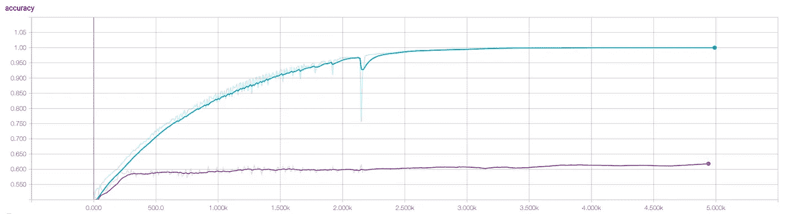

# 训练建筑分类器— III

> 原文：<https://medium.com/hackernoon/training-an-architectural-classifier-iii-84dd5f3cf51c>

## 深度神经网络

*这是 5 篇文章系列的第 3 部分:*

1.  [*训练一个架构分类器:动机*](/@mcculloughrt/training-an-architectural-classifier-5f1b4f512368)
2.  [*训练一个架构分类器:Softmax 回归*](/@mcculloughrt/training-an-architectural-classifier-ii-bf29eca3cfa6)
3.  [*训练一个架构分类器:深度神经网络*](/@mcculloughrt/training-an-architectural-classifier-iii-84dd5f3cf51c)
4.  [*训练一个架构分类器:卷积网络*](/@mcculloughrt/training-an-architectural-classifier-iv-4f76bc6844bc)
5.  [*训练一个架构分类器:迁移学习*](/@mcculloughrt/training-an-architectural-classifier-v-fe82e83e94ec)

在这篇文章中，我将在 TensorFlow 中构建一个深度神经[网络](https://hackernoon.com/tagged/network)，试图击败我们在上一篇文章中构建的 softmax 分类器的准确性。

回顾上一篇文章，我们用 softmax 训练了 5000 个时期，达到了 75%的最大训练准确率，这促使我们寻找更复杂的模型。在测试集上，验证准确率达到了大约 60%，而只有 55%，这表明过度拟合也将是一个问题。

tensorboard accuracy summary for softmax regression

## 深度神经网络的直觉

页面顶部的图表说明了深度神经网络的概念。输入层的每个节点代表图像中要分类的一个像素，与逻辑回归类似，这些像素中的每个都连接到下一层中的一个神经元，该神经元本身就是逻辑分类器。现在的区别是，我们在下一层中有许多神经元，每个像素都与每个神经元相连，我们在多层中复制这一点。

虽然逻辑模型允许像素值给出类成员资格的证据，但是这种密集连接的模型允许神经元找到给出成员资格证据的像素 之间的 ***关系。随着越来越多的层叠加起来，甚至可以发现具有预测能力的更深层次的关系。这个过程被称为“特征工程”，通常在其他机器学习方法中人工完成，但深度神经网络可以自行完成。***

从数学上来说，与我们上一个模型相比，深度网络中没有什么可怕的新东西，只是更多。我们将输入乘以各自的权重，但现在是对每个神经元进行。

类似地，乘法的输出将通过每个神经元的非线性函数，这次使用“整流线性单元”或 ReLU，而不是 [softmax](https://hackernoon.com/tagged/softmax) 非线性。

你可以在这里阅读更多关于 ReLUs [的内容](http://ryantm.io)，但可以说，它们只是另一种非线性，已被证明在深度神经网络中是有用的。它们可以与 tanh 或 sigmoid 等其他函数自由互换。

## 实验笔记本

这给了我们一个更好的测试精度 **65%** ！以及 5000 个时代的张量板总结:

tensorboard summary for training. Blue: training accuracy, Purple: validation accuracy.

看起来我们在训练精度上有了很大的提高，在验证方面也有了一点进步，但是我们有一个更大的过度拟合问题。这是有意义的，因为我们已经建立了一个模型，它可以更好地从看到的图像中提取数据，但图像包含大量无关数据，我们没有向它显示足够的图像来区分概化数据和无关数据。

我们发现的被称为 [' *维度诅咒* '](https://en.wikipedia.org/wiki/Curse_of_dimensionality) 。随着输入维数的增加，您需要更多的示例来防止过度拟合。寻找更多数据的另一种方法是降低输入的维数。简单地减小图像大小并不理想，因为您可能会破坏有价值的数据，所以我们将转向一种称为卷积的技术，这种技术实际上将成为我们网络架构的一个组成部分。

请阅读我的下一篇文章“卷积神经网络”

[下一个:卷积神经网络](/@mcculloughrt/training-an-architectural-classifier-iv-4f76bc6844bc)