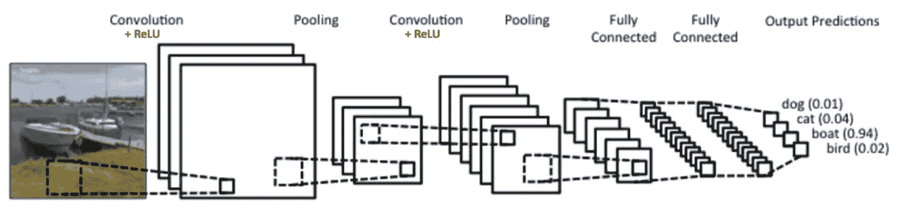
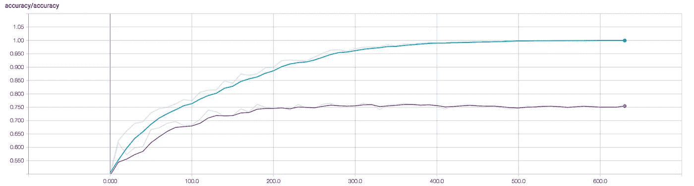

# 训练建筑分类器— IV

> 原文：<https://medium.com/hackernoon/training-an-architectural-classifier-iv-4f76bc6844bc>

## 卷积神经网络



The basic architecture of a convolutional network. source[[4](https://www.clarifai.com/technology)]

*这是 5 篇文章系列的第 4 部分:*

1.  [*训练一个架构分类器:动机*](/@mcculloughrt/training-an-architectural-classifier-5f1b4f512368)
2.  [*训练一个架构分类器:Softmax 回归*](/@mcculloughrt/training-an-architectural-classifier-ii-bf29eca3cfa6)
3.  [*训练一个架构分类器:深度神经网络*](/@mcculloughrt/training-an-architectural-classifier-iii-84dd5f3cf51c)
4.  [*训练一个架构分类器:卷积网络*](/@mcculloughrt/training-an-architectural-classifier-iv-4f76bc6844bc)
5.  [*训练一个架构分类器:迁移学习*](/@mcculloughrt/training-an-architectural-classifier-v-fe82e83e94ec)

在之前的文章中，我探索了深度神经网络来解决我们的厨房分类问题。虽然他们改进了简单的逻辑回归模型，但他们表现出非常强的过度拟合，即使在剔除正则化的情况下也是如此。我假设这至少部分是由于维度的诅咒；我们有少量非常高维的数据，这降低了网络找到泛化能力良好的权重的概率。

解决这个问题的一个办法是降低数据的维度，但我们希望以一种智能的方式来实现这一点。如果我们简单地缩小图像尺寸，我们很可能会丢掉重要的信息。相反，我们将转向一种叫做卷积的深度学习架构，首先挑选出最重要的细节，然后在将其传递给分类层之前去掉其余的。

## 卷积架构

卷积实际上在概念上很容易理解。卷积将采用一个非常小的图像(通常小于 5px 乘以 5px ),称为滤波器，并在输入图像上滑动该滤波器。空间关系得到了维护，因为我们没有像以前那样将输入扁平化。为了形象化这一点，考虑下面的动画:


Convolution being applied. source[[1](http://deeplearning.stanford.edu/wiki/index.php/Feature_extraction_using_convolution)]

黄色滤镜在绿色输入图像上一次滑动 1 个像素，将它们的值(红色)组合成粉红色输出“卷积特征”。对于一个给定的卷积层，我们可以用许多不同的过滤器来完成，产生多个输出图像。那么这在实际图像上是什么样的呢？这是一个使用滤镜生成边缘的动画:


Convolution producing two feature maps. source[[2](http://cs.nyu.edu/~fergus/tutorials/deep_learning_cvpr12/)]

您可以看到，根据使用的过滤器，从输入图像中“发现”了不同的特征。在早期阶段，应用在大图像上的小过滤器会发现非常小的尺度特征，比如边缘。如果我们在这些之上堆积更多的回旋，就可以发现越来越复杂和大规模的特征；从边缘，到角落，到眼睛，到脸，到人。

## 空间池

卷积的第二个重要步骤是减少这些特征图的维数，去掉不太重要的信息。这通常是通过一个称为空间池的函数来完成的。空间池的概念是定义一些空间窗口，如 2px 乘 2px，并将该窗口中的值组合成一个值。2px 乘 2px 池会将特征地图的大小减半。


Max Pooling reducing an image by half. source[[3](http://cs231n.github.io/convolutional-networks/)]

上面显示的是 max pooling，我们从窗口中取出最大的数值，丢弃其余的。这是最常见的池形式，也是我将在笔记本中使用的形式。

## 《恋恋笔记本》

出于两个原因，本笔记本中的一些代码结构看起来会有些不同:

1.  在这个实验中，慢速训练让我通过队列跑步者输入数据，在这篇文章底部的旁注中可以读到更多。
2.  由于架构定义变得非常冗长，我开始使用 Tensorflow 的 Slim 模块。

TensorFlow Slim 只是一个用于定义层和变量的更简洁的语法。例如，TensorFlow 中的全连接图层:

```
W_one = tf.get_variable('weights_1', [85 * 85 * 3, 1000], initializer=xavier())
b_one = tf.get_variable('bias_1', [1000], initializer=zeros())
logits_one = tf.add(tf.matmul(inputs, W1), b1)
layer_one = tf.nn.relu(logits1)
```

在 TensorFlow Slim 中变得更小:

```
layer_one = slim.fully_connected(inputs, 1000)
```

记住这些概念，下面是将卷积网络应用于厨房分类问题的实验笔记本:

更加成功！验证准确率现在已经高达 70%左右，接近 77%。随着更多的架构实验，低 80 应该是可以实现的。像往常一样，下面是 tensorboard 总结:



tensorboard summary for training. Blue: training accuracy, Purple: validation accuracy.

在最后一本笔记本中，我将尝试一些稍微不同的东西，一种被称为*迁移学习的技术。*快来看看！

[接下来:转移学习](/@mcculloughrt/training-an-architectural-classifier-v-fe82e83e94ec)

*顺便说一句，我在上次培训中注意到 GPU 没有得到充分利用。以下是 nvidia-smi 工具在训练时的输出:*


nvidia-smi output on starved GPU

*您可以看到，尽管培训时间很长，但我们的利用率只有 9%左右，而且这一数字波动很大。这表明 GPU 急需数据。训练示例不能足够快地从 CPU 内存中移出并移到 GPU 上，以跟上 GPU 通过计算燃烧的速度。因此，当 GPU 等待数据输入时，我们看到了低利用率。其原因和解决方案确实值得他们自己写一篇文章，但简单来说:TensorFlow 的 feed_dict 输入系统实际上是为了在小数据集上进行测试和玩具示例。合适的饲养数据生产方式是使用* [*队列跑者*](https://www.tensorflow.org/programmers_guide/threading_and_queues) *。运行者将利用多线程从磁盘或内存中读取数据，并保持 GPU 运行良好。缺点是它增加了一些代码复杂性。我不会详细描述它们的实现，但希望你能跟上笔记本上发生的事情。*