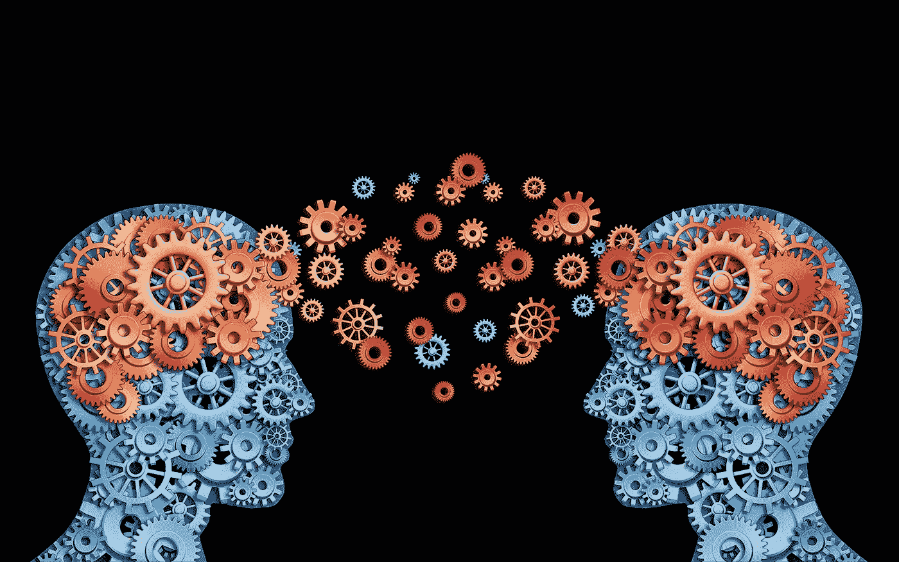

# 训练架构分类器— V

> 原文：<https://medium.com/hackernoon/training-an-architectural-classifier-v-fe82e83e94ec>

## 迁移学习

Transferring knowlege gained by one model, into another. source[[1](https://commons.wikimedia.org/wiki/File:Knowledge-sharing.jpg)]

*这是 5 篇文章系列的第 5 部分:*

1.  [*训练一个架构分类器:动机*](/@mcculloughrt/training-an-architectural-classifier-5f1b4f512368)
2.  [*训练一个架构分类器:Softmax 回归*](/@mcculloughrt/training-an-architectural-classifier-ii-bf29eca3cfa6)
3.  [*训练一个架构分类器:深度神经网络*](/@mcculloughrt/training-an-architectural-classifier-iii-84dd5f3cf51c)
4.  [*训练一个架构分类器:卷积网络*](/@mcculloughrt/training-an-architectural-classifier-iv-4f76bc6844bc)
5.  [*训练一个架构分类器:迁移学习*](/@mcculloughrt/training-an-architectural-classifier-v-fe82e83e94ec)

在本系列的最后一篇文章中，我将尝试使用一种叫做*迁移学习*的技术来提高我们之前使用卷积网络的模型的准确性。

## 迁移学习

简而言之，迁移学习背后的想法是采用一个已经为不同的任务训练过的模型，并将其作为你的任务的起点。

一个模型基本上有两个组成部分:

1.  它执行的数学运算(它的体系结构)。
2.  通过训练获得的体重。

人们通常会选择一个已知的公共架构，该架构在与他们的问题领域相关的基准测试中表现良好。图像识别的一个基准是 ILSVRC(通常简称为 ImageNet)。ImageNet 涵盖了超过 1000 个类别的非常广泛的训练数据集。这使得在 it 上表现良好的模型非常适合迁移学习，因为它们往往能够很好地概括。因此，如果您选择一个在 ImageNet 上得到验证的架构，它很可能对您的问题也有很高的准确性。

如果您从 ImageNet 获得该架构的副本，并且该架构的所有训练权重都是从 ImageNet 获得的，那么您可以从比随机初始化更准确的位置开始自己的训练。这意味着训练时间将比你从头开始训练要短得多。

唯一要做的工作是为您的特定任务和输出类重新训练模型，或者它的一部分。

## 履行

在几乎所有的深层架构中，最后一层将是一个分类器，其神经元数量等于它可以预测的类别数量。要调整一个[网络](https://hackernoon.com/tagged/network)来传输[学习](https://hackernoon.com/tagged/learning)，只需切断最后一层，用你自己的、适合你任务的层来替换它(和它的权重)。

一旦你既有建筑又有重量，你也有一些选择可以做。如果您自己的数据集足够大，并且您有足够的计算资源在您完全选择的架构上运行训练，您可以简单地使用预训练的权重作为初始值，并继续正常训练模型。如果你缺少这两者中的任何一个，那么值得探索冻结网络早期层的权重(至少在卷积网络中这些更一般化)，并且只允许后面的层或者甚至只是输出层经历梯度下降。这可以显著降低计算成本，因为您不必通过整个网络反向传播误差，并且通常会产生非常好的精度。

绝对最快的方法是将数据集中的每个影像向前传播到要保留的最后一个图层，然后保存从该图层生成的激活值(有时称为“瓶颈”值)。这些值成为您的新的预处理“图像”，您可以在其上训练一个非常简单的分类器。这样，前向推进步骤的计算成本仅对每个图像收取一次，而不是在每个训练时期收取一次。

您还可以简单地在您喜欢的地方分割预训练的网络，然后在其上连接新的输出层。

## 克拉斯

特别是一个深度学习框架， [Keras](https://keras.io) ，让这变得非常简单，这也是我将在下面的笔记本中使用的。您还会注意到 Keras 在无数其他方面使生活变得更加容易，从数据加载到图像增强，到架构定义和培训；这是一个非常棒的图书馆。

为了在 Keras 中完成迁移学习，

1.  我们将从它的库中导入一个模型(我将使用 VGG16)。
2.  砍掉分类层和倒数第二个全连接层(您实际上可以将其指定为导入选项)。
3.  通过网络向前运行所有图像示例，将来自最后卷积的激活值存储为一组新的“图像”特征。
4.  建立一个简单的 2 层全连接模型，具有 2 个神经元的 softmax 输出。
5.  使用预先计算的 VGG 特征作为分类器的输入进行训练。

只有我们创建的最后 2 层将被训练，但是它们被馈送的特征将经历 ImageNet 训练的 VGG16 网络的全部提取能力。代码见笔记本:

我们最终获得了 91.9 **%** 的准确率，只需要很少的调整或训练时间，这比我们最初使用 softmax 回归获得的 57%的准确率有了巨大的提高，随着更多的训练、数据和实验，准确率只会继续提高。