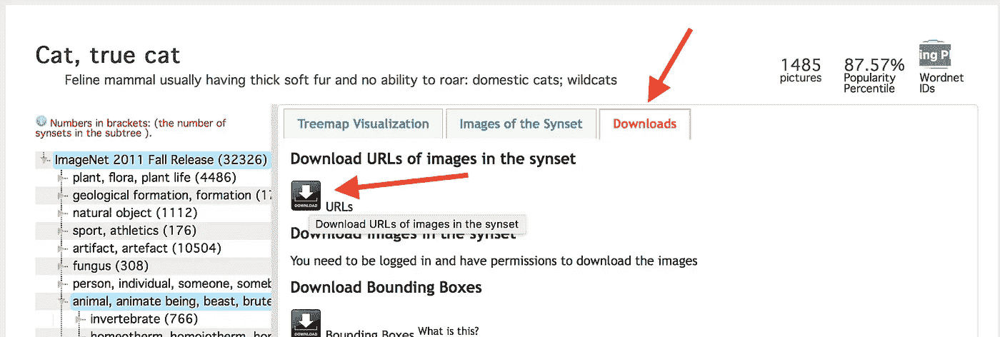
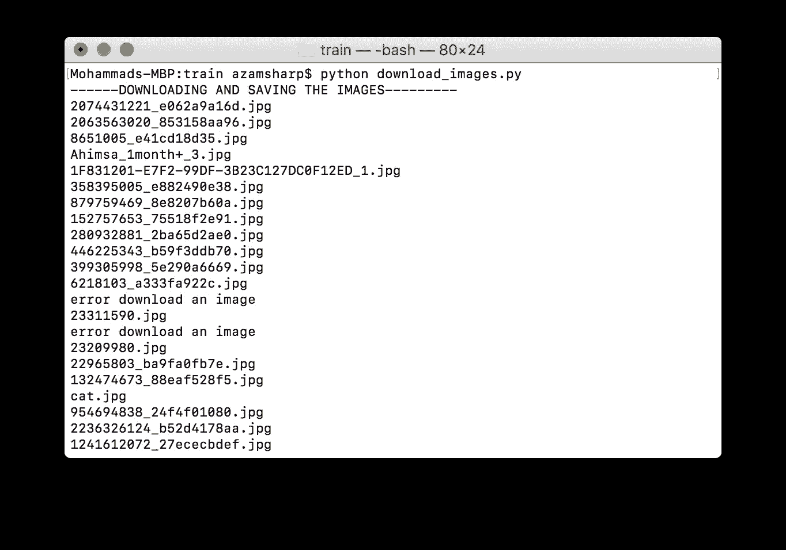
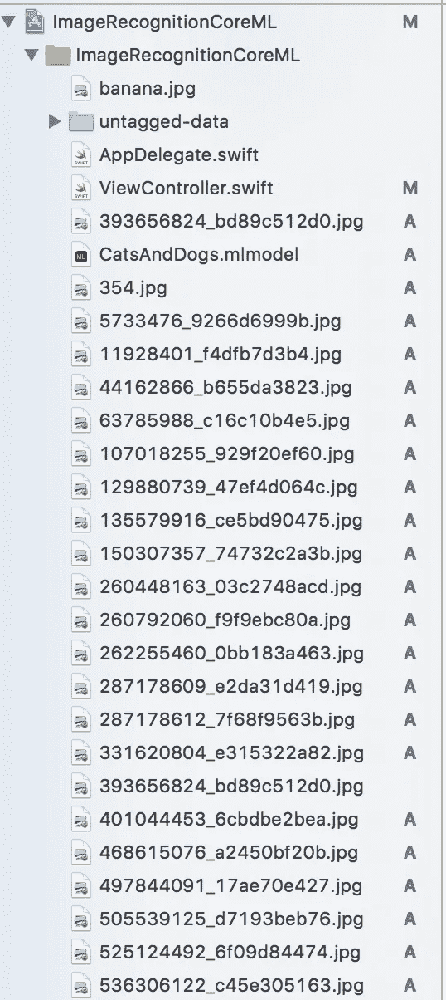

# 使用 Turi Create 训练自定义模型

> 原文：<https://medium.com/hackernoon/training-custom-models-using-turi-create-94fcc218fd6b>


[https://tctechcrunch2011.files.wordpress.com/2015/02/shutterstock_175625024.jpg](https://tctechcrunch2011.files.wordpress.com/2015/02/shutterstock_175625024.jpg)

在我的上一篇文章中，我谈到了将 TensorFlow 模型集成到 iOS 应用程序中。我们使用了 **tfcoreml** [工具](https://hackernoon.com/tagged/tool)来执行模型之间的转换。虽然 tfcoreml 工具是一个强大的工具，但它不是非常友好的开发者。文档的缺乏和寻找正确的操作符来使你的模型工作需要大量的时间和精力。

最近，苹果发布了一款名为 [**Turi Create**](https://github.com/apple/turicreate) 的工具，能够训练定制的[机器学习](https://hackernoon.com/tagged/machine-learning)模型。这意味着你可以开发出可以识别你家庭不同成员的模型，只要你用大量的图像训练这个模型……大量的。

我将把重点放在猫和狗上，而不是确定家庭成员，它们也被称为大家庭的成员。我们将建立一个自定义模型，可以识别图像是猫还是狗。

## 下载猫和狗的图片

第一步，下载大量的猫狗图片。这是必要的，因为我们将使用这些图像来训练我们的定制模型。我们可以利用 ImageNet 之类的服务，而不是从 Google Images 下载图片，这可能需要很长时间。转到 [ImageNet](http://image-net.org) 并搜索 cat。这会带来很多不同的结果。我们选择了“**真实的猫**”，这将带你到一个新的页面，在那里你可以下载所有猫图片的网址。

**注意**:即使您可以在 ImageNet 上成功创建一个帐户，但您仍然无法获得下载实际图像的许可。你必须下载网址。



继续下载猫狗数据集的网址。现在，您已经有了数据集的 URL，我们需要下载与每个 URL 相关联的图像。

我编写了一个简单的 Python 脚本，它从文件中读取 URL，然后将图像下载到脚本中变量指定的文件夹中，如下所示。我不是 Python 语言的专家，但是下面的脚本现在可以用了！

Downloading and Saving Images Using Python

转到终端并执行脚本。

```
python download_images.py
```

这将开始将图像下载到指定的文件夹中，如下所示:



下载所有图像的过程需要一段时间！老实说，5-8 分钟后，我强行停止了脚本。对狗的网址重复同样的过程，确保你把图片放在它们各自的文件夹中，即猫的图片放在“**猫**文件夹中，狗的图片放在“**狗**文件夹中。

一旦图像被下载，我们就可以标记和训练我们的定制模型来识别狗和猫。

## 标记和训练模型

在我们开始训练我们的模型之前，我们首先需要标记这些图片是“**猫**还是“**狗**”。幸运的是，Turi Create 文档包含了所有必要的代码，可以基于不同的文件夹成功地标记图像。

最后一行 data.explore()甚至会打开一个 Turi Create Image Visualizer，您可以在其中看到图像及其标签。现在我们已经标记了我们的图像，是时候训练它们了。

幸运的是，所有训练模型的代码都在 Turi Create 文档中提供。非常感谢！:)

在训练模型之后，我们将其导出为核心 ML 格式，这允许我们将其集成到我们的 iOS 应用程序中。

## 将模型集成到 iOS 应用程序中

我已经有一个应用程序设置，它通过一个图像列表，并预测每个图像。简单地，拖放模型和一些未标记的图片，你就可以开始了。我回到 ImageNet，下载了一个单独的数据集，里面有狗和猫的图片。我这样做是因为我不想使用用于训练模型的相同数据集。下面是为了测试新模型而添加到 Xcode 项目中的几张图片的截图。



结果如下所示:

我希望你喜欢这篇文章！

## 参考

*   [用 Turi Create 和 Core ML 在一个下午打造不一样的热狗](https://hackernoon.com/building-not-hotdog-with-turi-create-and-core-ml-in-an-afternoon-231b14738edf)
*   [Turi 创建](https://github.com/apple/turicreate)

如果你想支持我的文章，请查看我在 www.azamsharp.com 的 Udemy 课程。所有 Udemy 课程都附有一张 10 美元的优惠券。我希望你喜欢这些课程。