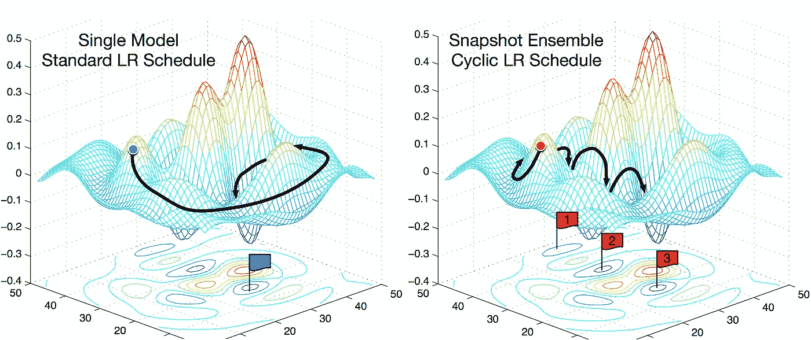
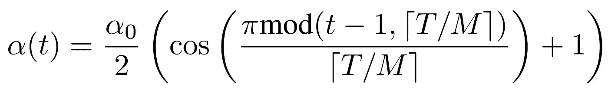
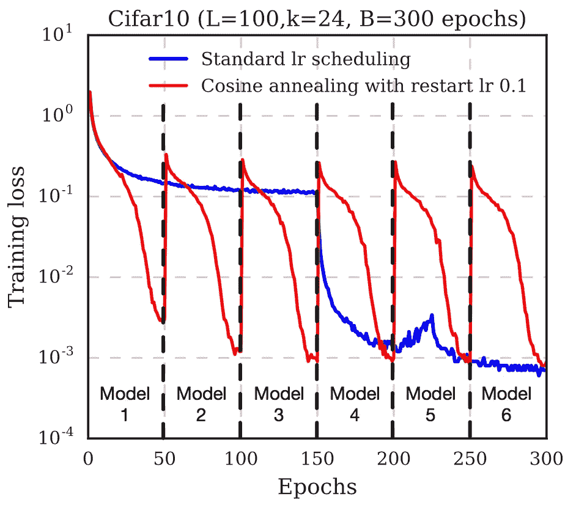
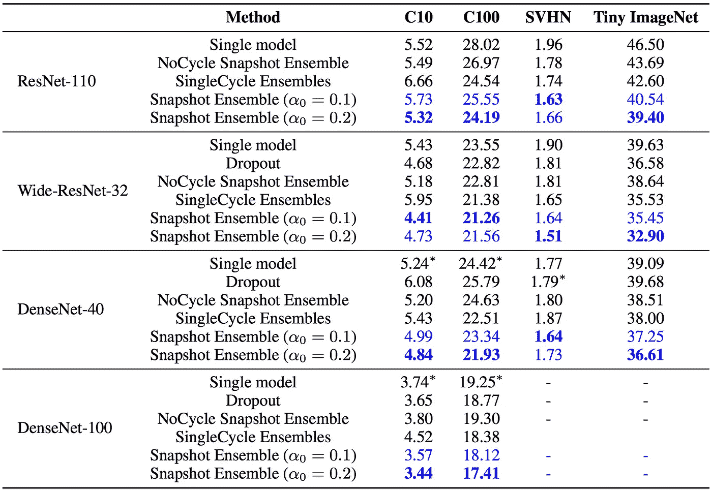
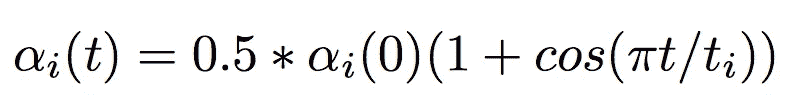
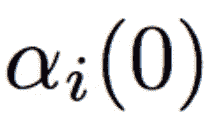
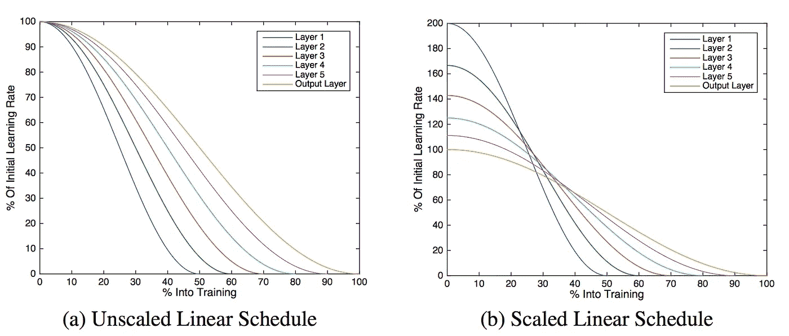
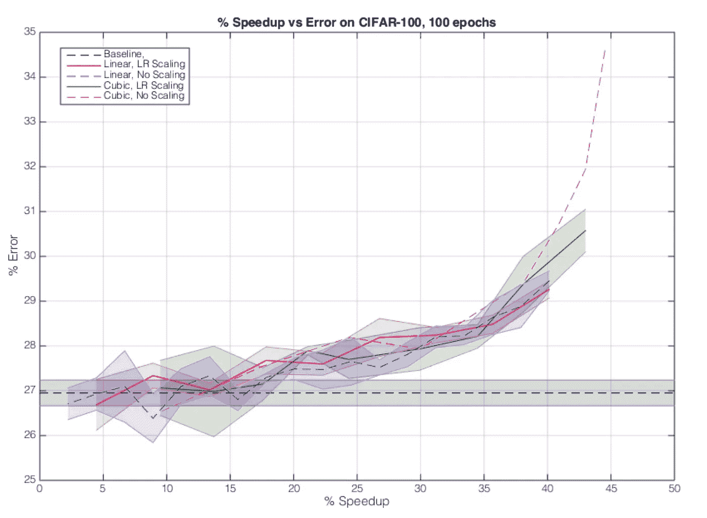

# 更快更清晰地训练你的深度模型——两种新颖的技术

> 原文：<https://medium.com/hackernoon/training-your-deep-model-faster-and-sharper-e85076c3b047>

eep 神经网络有许多许多可学习的参数，用于进行推理。通常，这从两个方面提出了一个问题:有时，模型不能做出非常准确的预测。训练他们也需要很长时间。这篇文章谈到了使用两种非常新颖的方法来提高准确性，同时减少训练时间。

## 编辑:

> 这篇文章获得了 2017 年 8 月由 [KDNuggets](http://www.kdnuggets.com/2017/08/train-deep-learning-faster-snapshot-ensembling.html) 颁发的第二大最受欢迎博文奖。

原文可以在[这里](https://arxiv.org/abs/1704.00109) ( **快照合集**)和[这里](https://arxiv.org/abs/1706.04983) ( **冻结**)。

*本文假设对神经网络有一些熟悉，包括类似****SGD****，****minima****，****optimization****等方面。*

# 这篇文章的结构

我将谈论两份不同的论文，它们的目的是做不同的事情。
注意，即使有两种不同的想法，它们也不是互斥的，可以同时使用。

*这是一篇很长的帖子，但是分为两个互相排斥的部分*

# 1.[快照组装—成本为 1 的 M 个模型](https://arxiv.org/pdf/1704.00109.pdf)

## 正则系综模型

集合模型是一组模型，它们共同工作来获得预测。这个想法很简单:**使用不同的超参数训练几个模型**，然后**对所有这些模型的预测**进行平均。这项技术大大提高了准确性，因为它不依赖于单一的预测模型。大多数高调的机器学习竞赛的获奖作品都使用了合奏。

## 那么问题出在哪里？

训练 N 个不同的模型将需要 N 倍于训练单个模型所需的时间。大多数没有拥有多个 GPU 的人通常需要等待很长时间才能测试出这些模型。因此，它使得实验慢了很多。

## SGD 机械

在我告诉你“新颖”的方法之前，你必须先了解随机梯度下降(SGD)的本质。SGD 是贪婪的，它会寻找最陡的下降。但是，有一个非常关键的**参数****支配** SGD — **学习******速率**。**

**如果**学习率**过高， **SGD** 会**忽略**非常**狭窄** **缝隙**(最小值)，大步走(想想路上一辆坦克不受坑洼影响)。**

**另一方面，如果**学习率**为**小**，则 **SGD** 将**落入这些**局部最小值**中的一个**中，并且不能出来。然而，通过**增加**学习率**，有可能**使 SGD 从局部最小值返回**。****

## **诀窍？**

**论文作者利用 SGD 落入和爬出局部极小值的这个**可控性质**。**不同的局部极小值**可能有非常**相似的错误率**，但是他们会犯的**错误**将会**不同**彼此。**

**他们提供了一个非常有用的图表来解释这个概念:**

****

***Figure 1.0*: **Left:** standard SGD trying to find the best local minima. **Right:** SGD is made to fall into a local minima, then brought back up, and the process is repeated. This way you get 3(which are labelled 1,2,3) local minima, each with similar error rates, but with different error characteristics**

## **什么是集合，也叫快照？**

**作者利用局部极小值对其预测具有不同“观点”的特性来创建多个模型。每当 SGD 达到一个**局部最小值**时，该模型的一个**快照**被**保存**，这将是最终网络集合的一部分。**

## ****循环余弦退火****

**作者使用一个函数来自动化这个过程，而不是手动试图找出何时陷入局部最小值或何时跳出局部最小值。**

**他们使用具有以下功能的学习速率退火:**

****

**Figure1.0**

# **简化了的**

**这个公式看起来可能很复杂，但其实很简单。他们使用了一个单调递减的 T2 函数。 *α* 这里是新的学习率，α0 是旧的学习率。 **T** 是你要使用的训练**迭代**的总**数**(T 应该等于 batchsize *历元数)。 **M** 是您想要在合奏中使用的**快照**的**号**。**

****

*****Figure1.1*** M=6 , and Budget=300 epochs. The vertical dotted lines indicate a model snapshot. After 300 epochs a total of 6 models were added to the ensemble.**

**请注意，在每次拍摄快照之前，丢失量是如何快速下降的。这是因为学习率**持续下降****。快照后，学习率为**重新启动**返回(他们使用的值为 0.1)。这导致梯度路径被带出局部最小值(并且新的局部最小值搜索再次开始)。****

## ****给我看看数字****

****我已经包括了作者用来证明他们方法有效性的数字****

********

*******Figure1.2*** *Error Rates(%) on Cifar10,Cifar100,SVHN and Tiny ImageNet. Blue indicates the authors’ work, and bold indicates the best error rate for that category*****

## ****结论****

****这是一个有用的策略，可以在不增加额外培训成本的情况下略微提高准确度。该论文讨论了改变不同的参数，例如 M 和 T，以及它如何影响性能。****

# ****[2。冻结-通过逐渐冻结层来训练加速度](https://arxiv.org/pdf/1706.04983.pdf)****

****本文作者提出了一种通过冻结层数来提高训练速度的方法。他们试验了几种不同的冻结层的方法，并证明了训练速度的提高对精度几乎没有(或没有)影响。****

## ****冻结一层是什么意思？****

****冻结层可防止其权重被修改。这种技术经常用在**迁移学习中，**基础模型(在一些其他数据集上训练)被冻结。****

## ******冷冻是如何影响模型的速度的？******

****如果你不想修改一个层的权重，那么到那个层的**向后传递**可以被**完全避免**，导致**速度显著提升**。例如，如果您的模型有一半是冻结的，并且您尝试训练该模型，与完全可训练的模型相比，这将花费大约一半的时间。****

****另一方面，你**还需要** **来**训练****的**型号，所以如果你过早**冻结**，就会给**不准确的** **预测**。******

## **什么是“新颖”的方法？**

**作者演示了一种**方式**到**冻结**一层一层**尽快**，导致回传球越来越少，进而降低训练时间。**

**首先，整个模型是可训练的(与常规模型完全一样)。经过几次迭代后，第一层被冻结，模型的其余部分继续训练。再迭代几次后，下一层冻结，依此类推。**

## ****学习速率退火****

**作者使用学习率退火来控制模型的学习率。他们使用的**显著不同的技术**是他们**逐层**改变**学习速率**而不是整个模型。他们使用了以下等式:**

****

**Equation 2.0: **α** is the learning rate. **t** is the iteration number. **i** denotes the ith layer of the model**

## **等式 2.0 解释**

**子 *i* 表示第 I 层。因此 *α* sub *i* 表示第 I 层的学习速率。类似地， *t sub i* 表示第 I 层被训练的迭代次数。 *t* 表示整个模型的总迭代次数。**

****

**Equation 2.1**

**这表示第 I 层的初始学习速率。**

**作者试验了方程 2.1 的不同值**

## **等式 2.1 的初始学习率**

**作者尝试调整最初的学习速度，这样每一层的训练时间都是相等的。**

**请记住，因为模型的第一层将首先停止，否则它的训练时间将最少。为了解决这个问题，他们调整了每一层的学习速度。**

****

**Figure2.0**

**进行缩放以确保所有层的权重在权重空间中相等地移动，即被训练最长的层(后面的层)具有较低的学习率。**

**作者还玩了**立方缩放**，其中 t sub i 的值被它自己的立方代替。**

****

**Figure2.1: Performance vs Error on DenseNet**

**作者包括了更多的基准，他们的方法在精度仅下降**3%****的情况下增加了大约 **20%** 的训练加速，在精度没有下降的情况下增加了 **15%** 。****

****他们的方法对于不使用跳跃连接的模型(如 VGG-16)效果不是很好。在这样的网络中，无论是精度还是加速都没有明显的不同。****

# ****我的奖励戏法****

****作者逐渐停止训练每一层，然后他们不计算向后传递。他们似乎已经**错过了**来利用**预计算** **图层** **激活**。这样做，你甚至可以防止**计算**向前传球。****

## ******什么是预计算******

****这是迁移学习中使用的一个技巧。这是一般的工作流程。****

1.  ****冻结不想修改的图层****
2.  ****从冻结层中计算最后一层的激活(针对整个数据集)****
3.  ****将这些激活保存到磁盘****
4.  ****使用这些激活作为可训练层的输入****

****由于各层被逐步冻结，新模型现在可以被视为一个独立的模型(一个较小的模型)，它只接受最后一层输出的输入。当每一层都冻结时，这可以反复进行。****

****与**冻结**一起做这件事将导致训练时间的进一步大幅减少，而不会以任何方式影响其他指标(如准确性)。****

# ****结论****

****我演示了两个(和我自己的一半)非常新的技术，通过微调学习率来提高准确性和减少训练时间。通过尽可能地添加预先计算，使用我自己提出的方法可以实现显著的速度提升。****

# ****附注(也代表请分享)****

****如果您注意到任何错误或有任何疑问，请评论它们。我会更新我的帖子或尝试解释得更好。****

****另外，如果你喜欢我的文章，请点击❤.推荐它它让我知道我对你有帮助。****

************************

> ****[黑客中午](http://bit.ly/Hackernoon)是黑客如何开始他们的下午。我们是 [@AMI](http://bit.ly/atAMIatAMI) 家庭的一员。我们现在[接受投稿](http://bit.ly/hackernoonsubmission)并乐意[讨论广告&赞助](mailto:partners@amipublications.com)机会。****
> 
> ****如果你喜欢这个故事，我们推荐你阅读我们的[最新科技故事](http://bit.ly/hackernoonlatestt)和[趋势科技故事](https://hackernoon.com/trending)。直到下一次，不要把世界的现实想当然！****

********