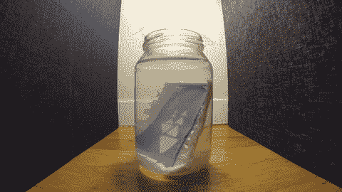
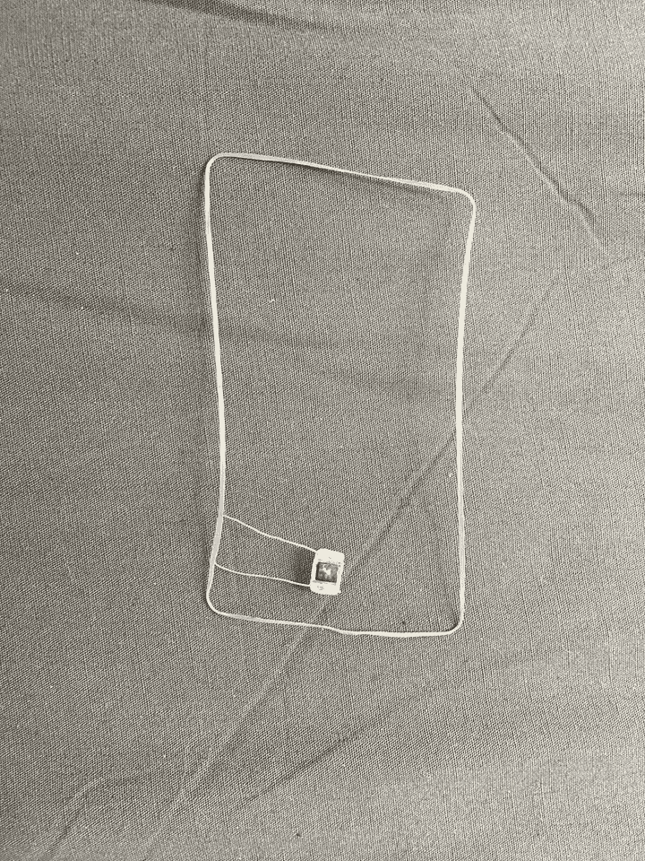
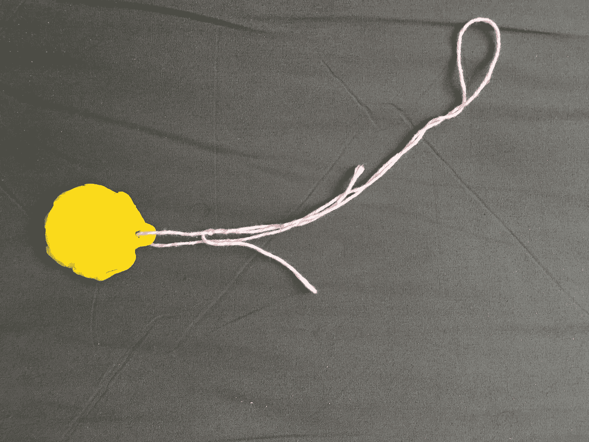
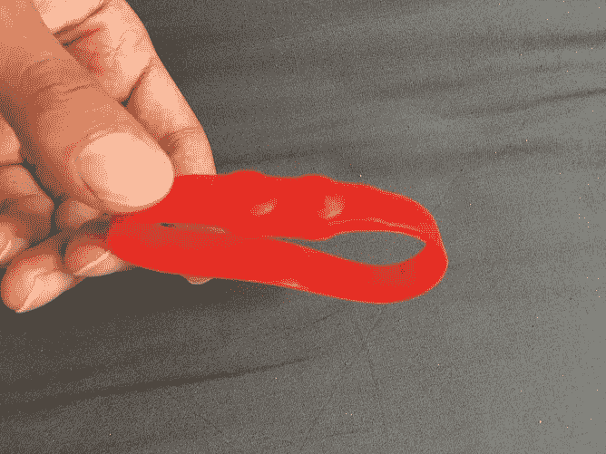
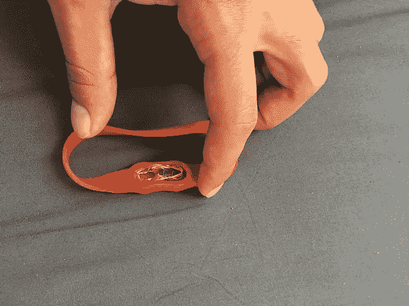
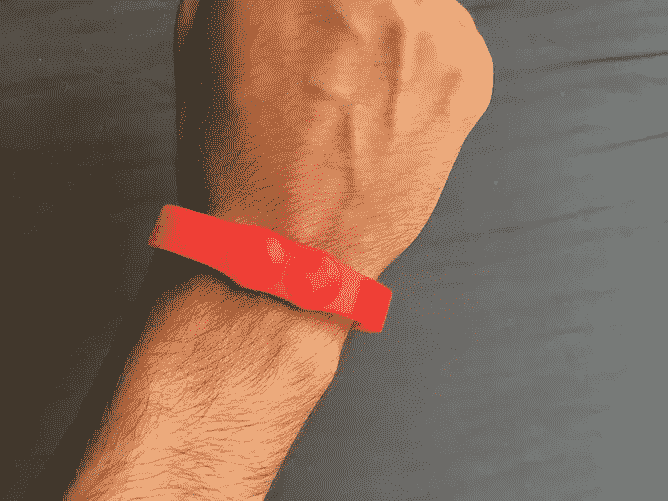
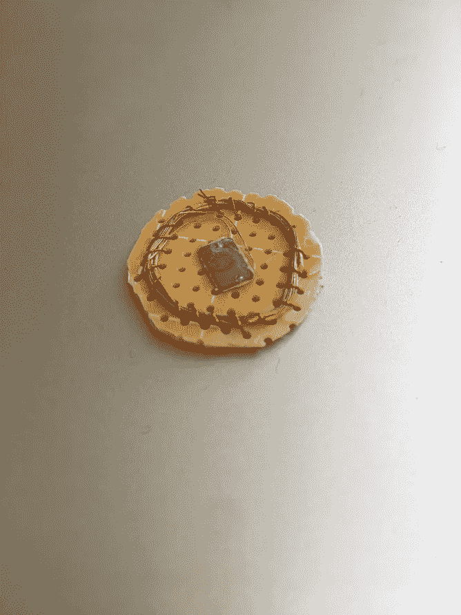
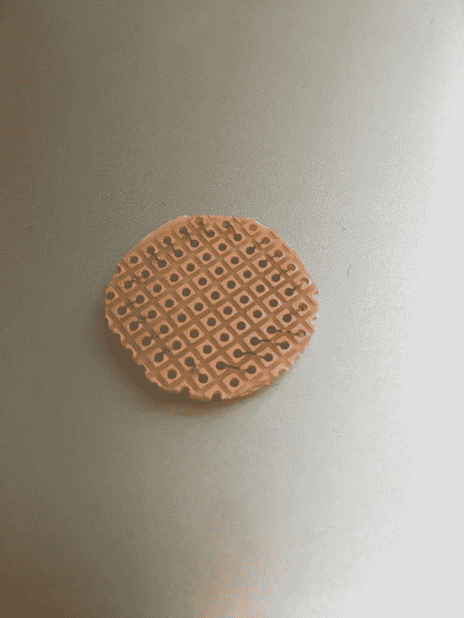
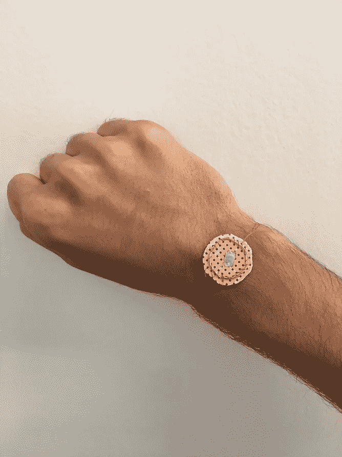

# 将 SF Transit Clipper 卡改造成可佩戴的

> 原文：<https://medium.com/hackernoon/transform-the-sf-transit-clipper-card-into-a-wearable-2f32b59e40ae>

如你所知，[我是一个铁杆极简主义者](https://hackernoon.com/how-i-live-my-115-things-53558259575b)。我厌倦了在钱包里放这么多卡片，想尝试将我的卡片转换成不同的形状。幸运的是，只需要一个罐子和一些洗甲水就能溶解剪卡。之后，[克里斯和我尝试了三种不同的外形:](https://medium.com/u/dba14badec93?source=post_page-----2f32b59e40ae--------------------------------)

## 1.将 NFC 芯片嵌入 [Sugru](http://amzn.to/2sl1TK4)

After coiling up the NFC chip and antenna on the left, I embedded it into Sugru

## 2.将 NFC 芯片装入一个[防水硅胶腕带](http://amzn.to/2qAf9Kw)

## 3.用一块[印刷电路板](http://amzn.to/2qR8LTx)和电线制作一个手镯

我很想看看你们有没有其他很棒的外形！你可以在这里查看完整的 Instructables 帖子:[https://www . Instructables . com/id/Transform-the-SF-Clipper-Card-Into-a-Wearable](https://www.instructables.com/id/Transform-the-SF-Clipper-Card-Into-a-Wearable)

快船卡溶解的全延时视频如下:

请在下面的表格中关注我的帖子，如果你觉得这篇文章有趣，请鼓掌分享👏！

> [黑客中午](http://bit.ly/Hackernoon)是黑客如何开始他们的下午。我们是 AMI 家庭的一员。我们现在[接受投稿](http://bit.ly/hackernoonsubmission)并乐意[讨论广告&赞助](mailto:partners@amipublications.com)机会。
> 
> 如果你喜欢这个故事，我们推荐你阅读我们的[最新科技故事](http://bit.ly/hackernoonlatestt)和[趋势科技故事](https://hackernoon.com/trending)。直到下一次，不要把世界的现实想当然！

