# 使用 React Studio 将基于草图的设计系统转换为真实代码

> 原文：<https://medium.com/hackernoon/transform-your-sketch-based-design-system-into-real-code-using-react-studio-35b89e67ce79>

**更新 2021**

**React Studio 不再支持草图导入器。草图设计往往被矢量形状所膨胀，这在实际应用中不能很好地转化为有意义的完整元素。通常，在工作室中使用真实元素比矢量图更好。**

> Sketch 的符号和覆盖使得创建复杂的 UI 设计库成为可能。有了免费的 [React Studio](https://reactstudio.com) 和它的草图传输插件，你可以把那些草图符号变成真正的 UI 组件(不用写代码！)并从您的草图设计中获得实际的 React 项目。这是一个渐进的过程:你不必扔掉任何东西，甚至是已经实现的代码。这篇文章展示了它是如何工作的。

在本教程中，我们将从这个手机应用的草图设计开始:

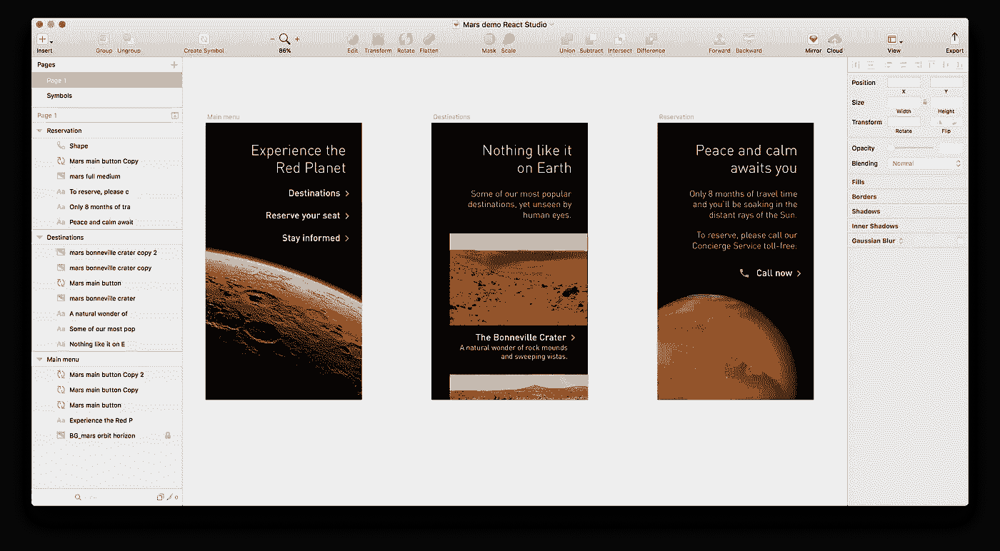

最终结果将是这款移动第一 ReactJS web 应用程序，并提供完整源代码:

[*体验火星【React Studio 发布的演示网站*](https://neonto.cloud/u/marsdemo/)

当设计从 Sketch 转换到 React Studio 时，它会做出响应，因此要了解成品与原始草图设计的关系，请尝试调整浏览器窗口的大小，或者更好的是，查看手机上的链接。

这个草图设计有一个有趣的特点，它本身并不显著，但却是更伟大的东西的“种子”。每个画板上都有一个按钮符号(=每个应用程序屏幕)。我们想把这个符号变成一个可重用的 React 组件。草图中的覆盖已用于配置符号，以便每个按钮都有不同的标签；我们还希望将这些覆盖自动转换成代码中的 React 属性。有了这两个强大的概念——React 组件中的符号，React 属性中的覆盖——我们就有了一个工作流的起点，可以将您的设计系统带到一个全新的水平。

你可以在这里下载草图文档:[火星体验资料](https://s3.amazonaws.com/sc.neonto.com/ExperienceMars_ReactStudio_demo_materials.zip)。(这个 zip 也包括完成的 React Studio 项目。)

为了跟进，您还需要 React Studio 应用程序和用于 Sketch 的“Transfer to React Studio”插件。

React Studio 是苹果 macOS 的[免费下载。(抱歉，目前没有 Windows 或 Linux 版本。)你可以在同一个页面找到 Sketch 插件。](https://reactstudio.com)

React Studio 的项目地图视图中已完成的项目如下所示:

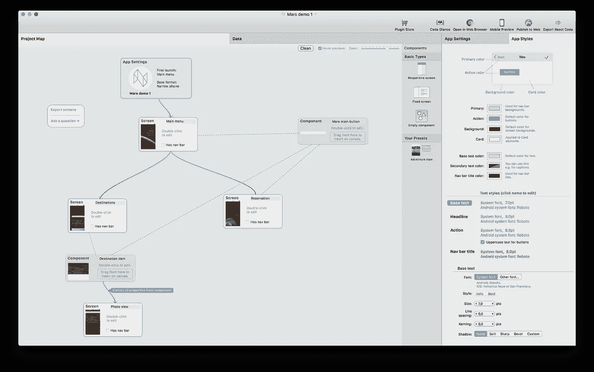

作为额外的奖励，您还将看到如何在 React Studio 中创建动态列表(用于应用程序的“目的地”页面)。

> 旁注:Sketch 文档和 React Studio 项目使用的字体与你在截图中看到的字体不同，这仅仅是因为许可的原因——我们不能分发那种字体。

# 从草图首次导入:映射符号

为了获得正确的符号到组件的映射，我们需要用“Transfer to React Studio”插件进行两次处理。在第一遍中，我们将只关注按钮符号，并确保其属性设置正确。

在 React Studio 中，确保打开了一个空文档。一个新创建的项目将有一个名为“开始”的默认屏幕——你可以删除它。

在草图中，选择“主菜单”画板。在插件菜单中，选择*转移到 React Studio >选择的画板*。

在 React Studio 中，您将看到以下内容:

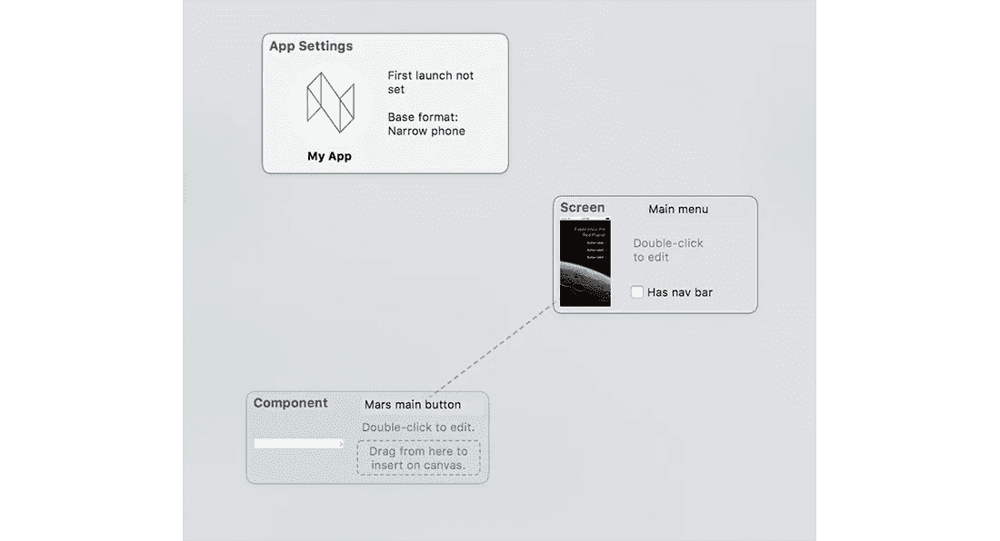

名为“Mars main button”的草图符号被作为一个组件传输，“Main menu”画板成为一个包含该组件引用的屏幕。

双击主菜单屏幕，打开它进行编辑。您会发现缺少了一些东西—我们在草图端的覆盖没有成功，所以按钮的每个实例都有相同的标签:

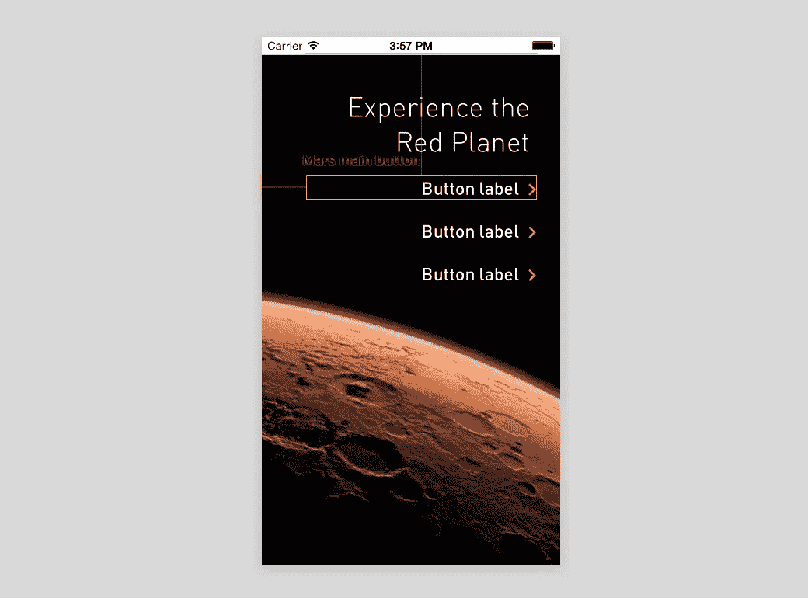

为了解决这个问题，我们需要在导入的“火星主按钮”组件中添加一个*属性*。

双击三个按钮中的任何一个。组件打开以供编辑:

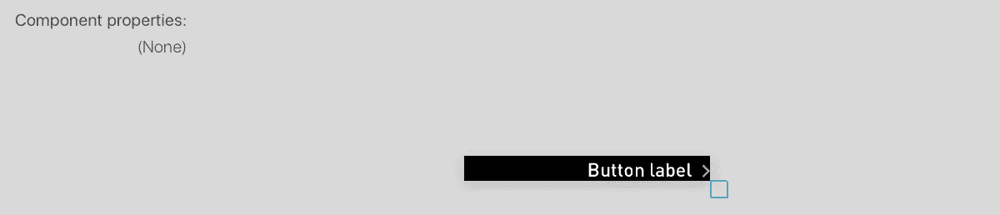

点击文本标签将其选中，然后在检查器中打开*数据*标签(在 React Studio 窗口的右侧)。点击“文本”标签旁边的按钮，并选择“新建”:

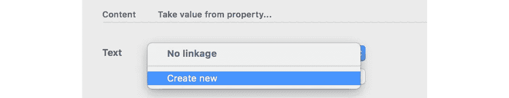

现在会提示您为这个新属性选择一个名称。输入“标签”并按确定。你现在会看到这个:

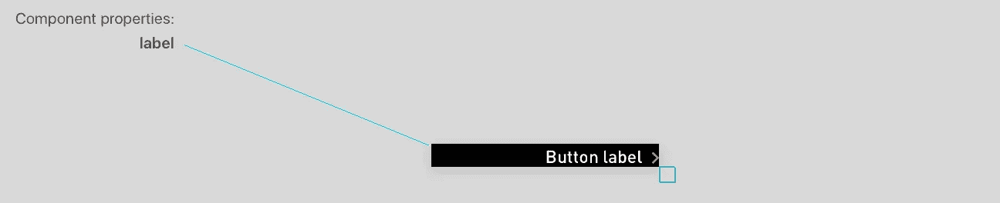

在画布区域的左侧，React Studio 向您显示了该组件的所有属性。蓝线是一个可视的帮助器，它连接到与属性链接的元素，也就是说，当使用这个组件时，它将根据分配给属性的任何值来获取它的值。

现在在项目图中选择“Mars main button”组件。在检查器中查找名为“符号 id”的设置，并在那里输入“Mars 主按钮”:

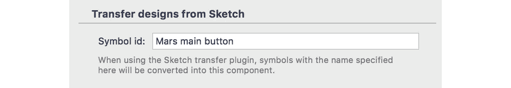

这将告诉草图导入器，以此名称命名的任何符号实例都应替换为该元件。

我们的组件现在可以使用了，我们可以重新导入画板。

# 从草图第二次导入:工作替代

该插件提供了一个强大的同步功能，可以让你更新已经导入过一次的屏幕或组件中的元素。(同步功能足够智能，可以保留您在 React Studio 中定义的任何交互或关键线对齐，因此它非常适合您想要开始构建应用程序但不断更新草图侧设计的情况。)

我们将使用同步来更新屏幕。

在 Sketch 中，选择所有三个画板，然后将*插件>转移到 React Studio >同步选择的画板*。

现在，您将在 React Studio 中看到以下内容:

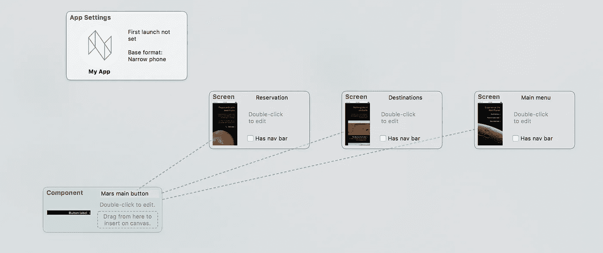

打开主菜单屏幕进行编辑，并点击任何一个按钮。

您会看到草图文档中的覆盖，就像这样…

在 React Studio 中被转换为组件属性值，如下所示:

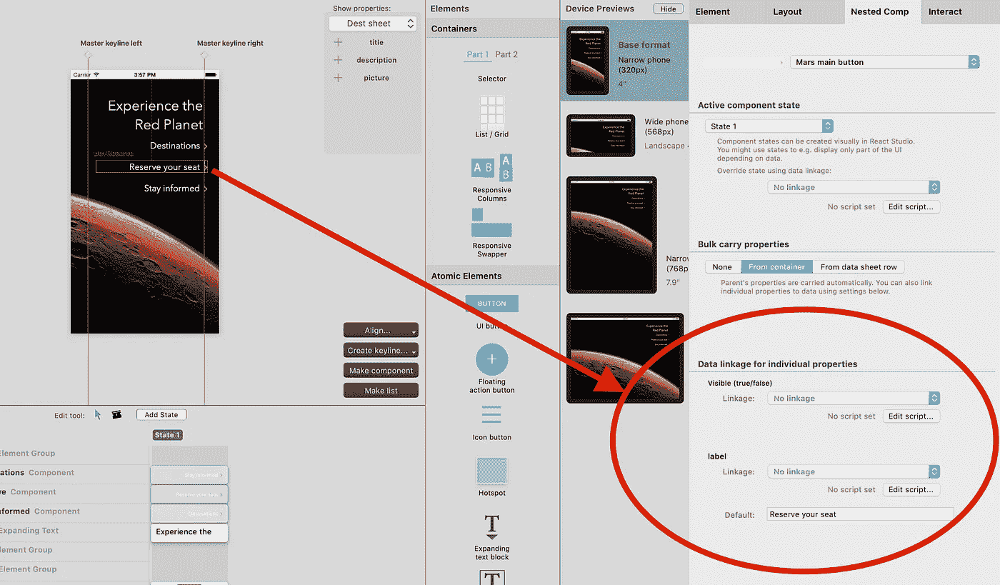

现在，您可以在 Sketch 中配置符号，并自动将其转换为 React 组件属性。你的设计系统正在变成活生生的代码！

想看看生成的 React 代码(JavaScript/JSX)是什么样子的吗？在 React Studio 中，打开“Mars main button”组件进行编辑，然后点击工具栏中的 Code Glance 按钮。这将让您对组件的代码有一个瞬间的了解:

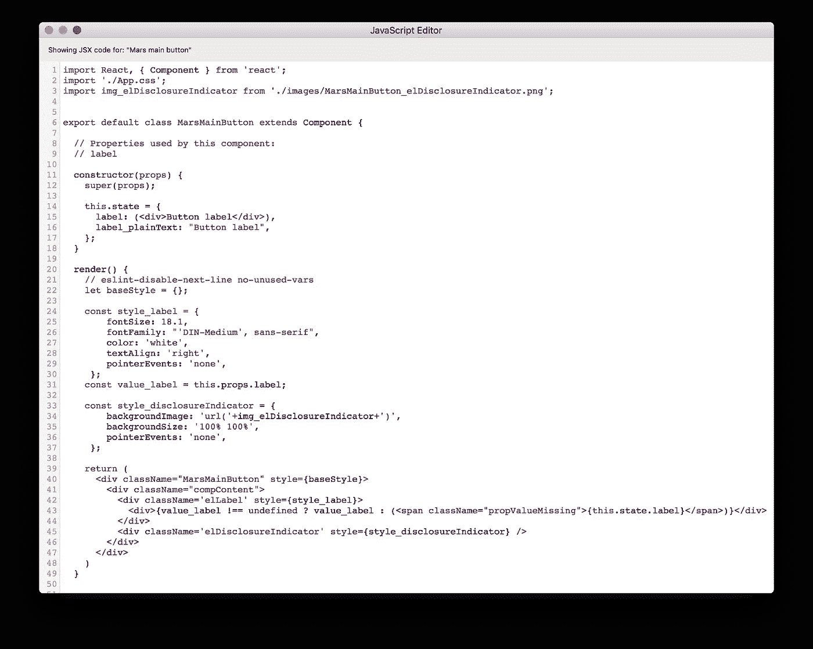

您在这里看到的内容直接来自草图文档:有两个元素，一个文本标签和一个“disclosure indicator”图形(React Studio 将其转换为代码中引用的 PNG 资产，Webpack 最终将整齐地内联该图形以节省带宽)。这里显示的文本标签使用了内联 CSS 样式，因为这是我们从 Sketch 中获得的——但是您可以在 React Studio 中编辑元素，以使用应用程序范围的样式。

(如果要修改生成的代码呢？有一个解决方案——在本教程结尾的标题*高级组件*下讨论。)

接下来，我们将看看完整的 React 项目——但首先我们需要让这个应用程序实际上，你知道，*做*一些事情。

# 添加基本导航

在 React Studio 的项目图中，选择 *App Settings* 块。在检查器中，在“首次启动”下，选择“主菜单”。这将设置应用程序启动的屏幕。

点击项目地图中的 *Clean* 按钮，可以更整齐地查看 app 流程:

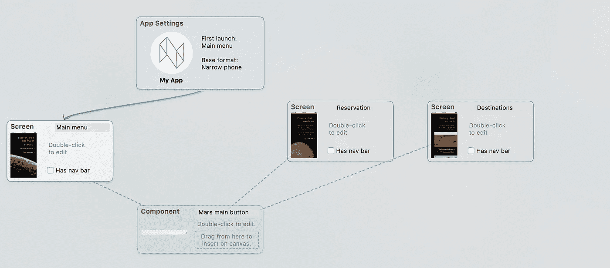

我们还需要连接“目的地”和“预订”屏幕。

双击“主菜单”，然后选择“目的地”按钮。在检查器中，打开*交互*选项卡。然后启用“用户点击时”，选择“转到”，并将*导航目标*设置为“目的地”屏幕:

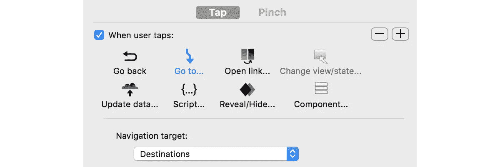

对另一个标有“预订座位”的按钮做同样的操作，并将其指向“预订”屏幕。

在项目地图的背景上单击一次以放大它。再次按下 *Clean* ，你会看到应用的基本流程已经就绪:

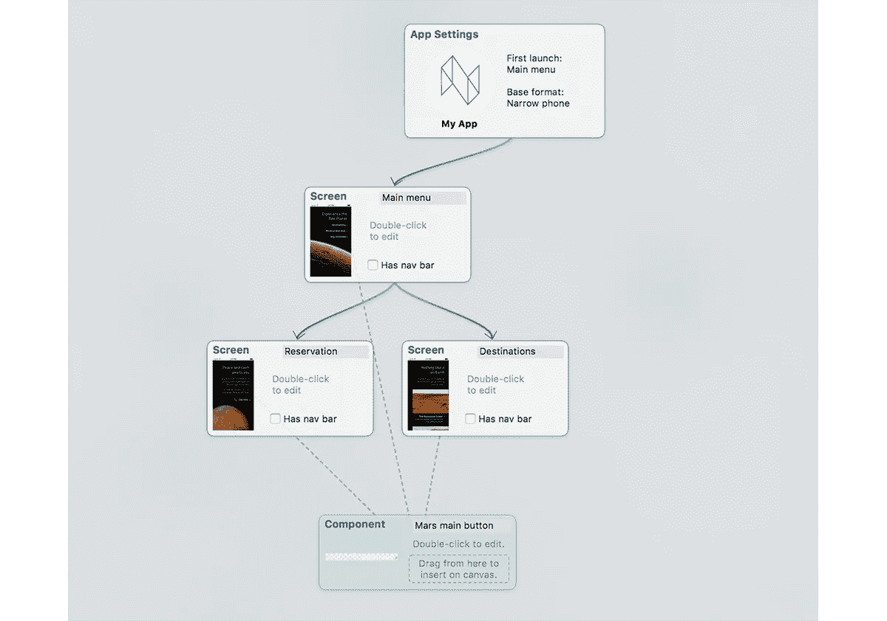

您现在可以运行应用程序:单击工具栏中的*在网络浏览器中打开*。

React Studio 为您生成一个完整的 Webpack 项目，启动一个本地 web 服务器，并在您的 web 浏览器中打开站点。(React Studio 生成的项目使用 [create-react-app](https://reactjs.org/blog/2016/07/22/create-apps-with-no-configuration.html) 脚手架，这是脸书官方支持的开发单页面 React web 应用的方式。如果您想查看此时的代码输出，这很容易 React Studio 中的 Dev Server 窗口显示了项目在 Mac 上的位置。)

少了点什么，只要你点击其中一个按钮进入另一个屏幕，你就会发现:你的火星体验应用程序没有提供返回上一个屏幕的方法。[完成的演示](https://neonto.cloud/u/marsdemo/)通过在两个屏幕上添加一个后退按钮解决了这个问题。

您可以为此重新绘制草图，但在 React Studio 中也很容易做到。只需抓取一个“图标按钮”元素，并将其放在屏幕上。在*按钮图标*下的元素检查器中，将其模板更改为“左箭头”。在“互动”标签中，给它一个“返回”动作。就是这样。

默认情况下，新元素被放置在*滚动流*组中。为了使布局工作正常，您需要将新元素移动到*前景*组中。将列表中的元素拖放到前景下:

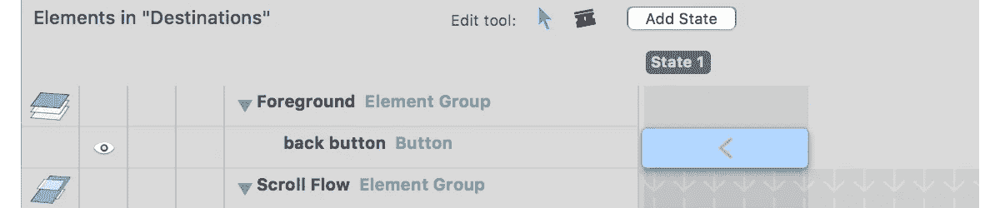

(另一种将元素直接放入前景的方法是在将它们拖到画布上时按住 Alt 键。)

# 增加响应能力

我们从 Sketch 导入的设计不知道如何缩放到不同的屏幕尺寸。要解决这个问题，可以在 React Studio 中将布局设置添加到元素中。

这个主题太大，不适合本教程，但我们有一个单独的帖子:

[在 React Studio 中设计响应式网页布局](https://hackernoon.com/designing-responsive-web-layouts-in-react-studio-2e1d796704d5)

如果您查看已完成的 React Studio 项目，您会发现所做的修改非常简单。添加了两条关键线，以按比例对齐元素。关键线被设定为“主”(因此它们在所有屏幕上都可见)，并且所有按钮都与这些关键线对齐。对于背景图像，左+右屏幕边缘对齐用于确保图像总是充满屏幕。

# 创建动态列表

草图文档的另一个主要变化是在 Destinations 屏幕中添加了一个动态列表。草图原件只显示了一个列表项和它下面的另一个提示，而完成的演示[有一个真正的可滚动列表项。](https://neonto.cloud/u/marsdemo/)

同样由于空间的限制，我们必须引导你到另一个帖子来获得更多关于列表如何工作的细节:

[在 React Studio 中创建列表和使用实时数据→](/@reactstudio/list-live-data-and-data-plugin-for-json-c3bd0b626b46)

从草图导入制作列表的基本部分非常简单。只需选择构成“列表项”的元素(即列表中每行将重复出现的组件)，然后点击 React Studio 编辑画布右下角出现的*制作列表*快捷按钮。

列表需要数据表来提供其内容。完整的 Mars 演示中使用的数据表如下所示:

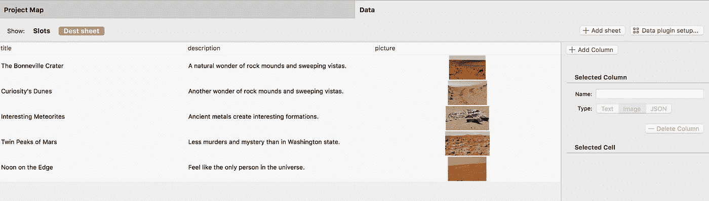

这个模型数据是在 React Studio 中手动输入的——但是您也可以轻松地使用数据插件从其他地方获取数据。特别是，Google Sheets 插件对于这种事情非常有用。(您甚至可以在 Google 表单中包含图片:任何名称带有前缀“img-”的列都将被解释为包含图片链接。)

如果您已经在一个带有 API 的系统中拥有数据，那么可以使用通用 JSON 数据插件将数据导入 React Studio。请注意，数据插件既可以在 Studio 内部工作，也可以在生成的应用程序中工作:插件实际上将必要的 JavaScript 代码写入 React 项目，该项目将动态加载数据。

# 高级组件:修改和重用现有的 React 代码

在本教程中，我们引入了一个草图符号，并将其转换为 React 组件，然后我们创建了映射，该映射允许我们获取草图覆盖，并将其自动转换为 React 中的属性值。React 组件的代码由 React Studio 生成。

如果您想修改生成的 React 组件的代码，该怎么办？或者，您的设计系统中已经有了 UI 组件的 React 代码，而您真正想要的是将草图符号映射到这些组件中？

React Studio 以*元素插件*的形式给出了这些问题的答案。如果您对这个主题感兴趣，在继续之前，我建议您阅读 React Studio 核心工作方式的概述:

[认识设计编译器→](/@reactstudio/meet-the-design-compiler-17ae89f985bb)

这篇文章全面概述了什么是插件，以及插件如何与设计编译器交互，设计编译器实际上生成了从 React Studio 获得的 React 项目。

如果您有一个现有的 React 组件，并且希望将其用作草图映射的目标，首先将该组件包装到 React Studio element 插件中，然后将该插件的一个实例放置在一个组件中，该组件具有为草图设计传输设置的“符号 id”属性。就这么简单。然后你可以创建属性并将它们连接到你的插件中，这些属性将依次映射到 Sketch 中的覆盖。(React Studio 也可以处理 npm 依赖关系，所以插件代码实际上可能来自那里——详情见上面的链接。)

如果要修改 React Studio 生成的组件代码，有两个选项。第一个是外挂路线，如上所述。第二个是您对生成的项目进行代码修改，并使用版本控制来确保您的手动代码更改和从 React Studio 生成的更改被正确合并。这比听起来容易，因为 reactstudio 具有内置的 git 版本支持:默认情况下，它导出的所有内容都放在“React Studio”分支中，并且它会在导出时检测未提交的手动更改，从而为您提供一定程度的工作流安全性。

# 下一步怎么样

我们已经在与一些客户合作，逐步将他们的草图设计系统带入真实的 React 代码世界。如果这是你可能感兴趣的事情，我们很乐意帮助你解决——不要犹豫，与 hello@neonto.com 联系。

同样，如果您有想法或功能要求，请按上述地址给我们发电子邮件，或在此留下评论。

非常感谢你读到这里，希望它值得你去读。愿进步的网络应用与你同在！