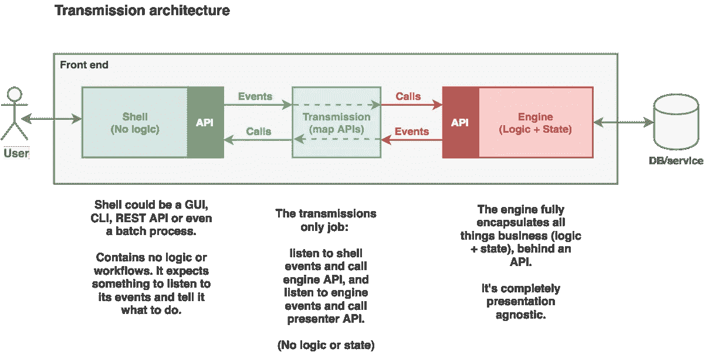

# 传输架构(TX)—通量替代方案

> 原文：<https://medium.com/hackernoon/transmission-tx-a-flux-alternative-fe0630eed2a3>



“Transmission” in a nutshell

[Flux architecture](https://github.com/facebook/flux/tree/master/examples/flux-concepts) 旨在使前端开发的复杂性更易于管理。虽然 Flux(及其变体，如 [Redux](https://redux.js.org/) )似乎在消除双向数据绑定的陷阱方面做了很大的工作，但我不禁想知道它是否实际上使事情变得更糟:**许多开发人员花更多的时间试图找出粘合代码(动作、动作创建者、调度器、存储、减少器)，而不是编写实际完成工作的代码**。

在这里，我提出了 Flux 和 MVC 的替代方案。在某种程度上，你可以认为它是两者的混合体。考虑具有以下三个元素的架构:

1.  一个完全独立于用户界面的“应用程序引擎”,它封装了所有的业务逻辑和状态，包装在一个 API 中
2.  一个薄的、无逻辑的“外壳”或接口，公开一个 API 来控制 UI(图形或其他)
3.  引擎和外壳之间的“传输”层，通过将*外壳事件映射到引擎 API 调用*，将*引擎事件映射到外壳 API 调用*来连接两者

如果您看不出 MVC 和 TX 之间的区别，下面的示例代码可能会有所帮助。

## 例子

这里我将只实现一个简单的待办事项应用程序的“创建待办事项”部分。为了证明引擎必须完全独立于用户界面，本例中的用户界面将是一个命令行界面。

首先，让我们看看 *TodoEngine* 。它将 API 实现为简单的函数，这些函数完成它们的任务并发出事件。

todo-engine.js

TodoShell(或 UI)通过简单地发出事件来对用户交互做出反应(Shell 本身什么也不做)。还需要其他东西来监听这些事件，做出决定，并使用其 API 告诉 shell 下一步做什么(例如，导航到不同的屏幕，显示错误，向列表中添加项目等)。)

注意，在这个例子中，为了简单起见，API 函数名与引擎名相同——不一定是这样。传输可以按照您想要的任何方式映射这两个 API。

todo-shell.js

下面是传输层如何连接引擎和外壳。它只包含连接——完全没有逻辑、状态或视图问题。 *onShellEvent()* 监听 shell 事件并调用引擎 API 作为响应。 *onEngineEvent()* 监听引擎事件并调用 shell API 作为响应。

todo-tx.js

下面是运行该应用程序的方法:

index.js

完整的源代码:

```
git clone [git@github.com](mailto:git@github.com):hliyan/epc-test.git
cd epc-test
npm install
npm install -g jest
npm test # run unit testsnpm start # run the command line app
todo> add hello # how to add a new todo item from the app prompt
```

## 设计目标

1.  防止 UI 代码中对逻辑函数的任何直接引用，这样 UI 就可以像逻辑模块(引擎)一样独立开发和测试。UI 测试甚至不需要 Selenium(因为您有 API 来驱动它)。
2.  具有最少语义的架构——没有动作、存储、减少器、中间件等。只有 API 函数和事件。
3.  代码中相对较短、平坦、外观一致的路径。我们选择事件发射来支持异步操作的承诺或回调；使用类似 Flux 的 switch-case 语句。
4.  可组合性:对于具有复杂 ui 和业务逻辑的系统，我们可以并行设置多个 Shell-TX-Engine 链。

## 与 React.js 一起使用

我还没有一个例子，但基于 React 的 shell 相当简单:只需在 onClick 上触发事件，在界面元素上触发 onKey*事件(例如*shell . events . todo _ TEXT _ ENTER _ KEY*，并公开一个最终改变组件属性的 API(例如*addtotototolist(todo)*，*filter list(‘completed’)*)。我希望很快能创造出一个 [TodoMVC](http://todomvc.com/) 的例子。

## 真实世界的应用

我已经有七个开发人员在三个不同的前端应用程序上使用了这个架构的一个更基本的版本。每一个都比以前的 Redux 实现更成功(编码更容易、更快、更不容易出错、更容易调试)。对于我的下一个项目，我计划完全使用传输架构。当然，我会汇报我的观察和更多的收获。

鸣谢:感谢[Pasindu Rumal Perera](https://medium.com/u/88498c0c40e4?source=post_page-----fe0630eed2a3--------------------------------)(@ udnisap)对我的工作进行复查并提出改进建议。