# 旅行哲学

> 原文：<https://medium.com/hackernoon/travel-philosophy-dbca09fc5eb4>

## 《在路上的 18 个月》汇编

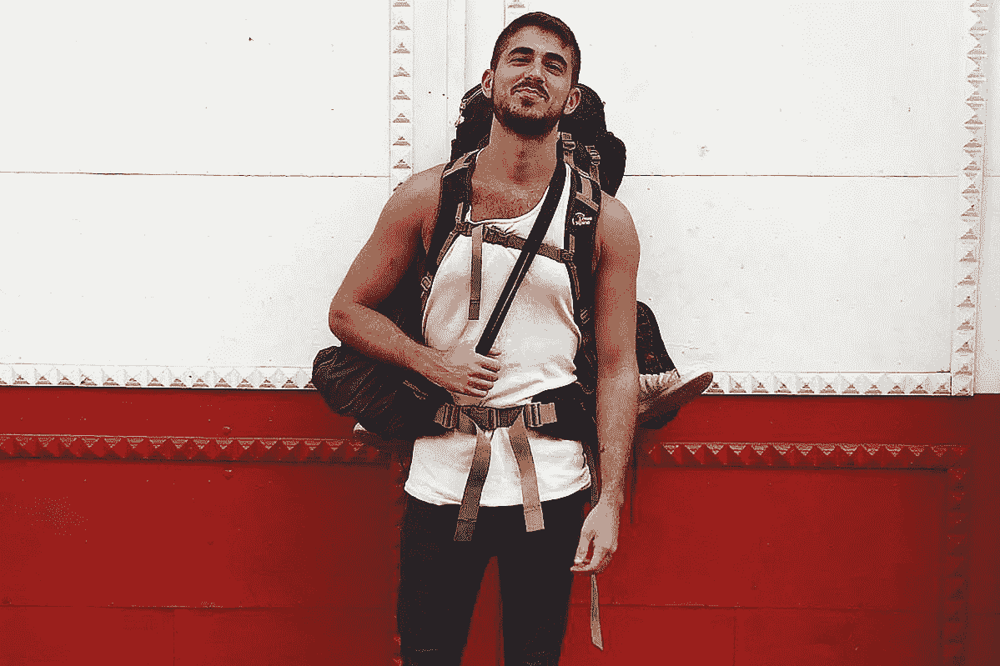

# 展览会

*“不要等来等去。不要老找借口。拿一本世界地图册。开始看每一页，告诉自己可以去那里。你可以住在那里。”* **杰森·加斯佩罗(流浪)**

18 个月前，我开始在欧洲旅行，这最终成为我人生中最大的转变:3 个月变成了 18 个月(在欧洲和美国之间)，可能会持续更多。

在我的旅程中，我遇到了一些不可思议的人，他们已经在世界各地旅行了几个月/几年。我开始从他们的经历中学习，吸收他们提供的所有知识。想想《黑客帝国》中的这个场景:

与 Neo 不同，我并不自称“懂旅行”，但在旅途中的 18 个月，这是一个很好的机会来分享我积累的知识，并为任何有需要的未来旅行者做出一点小小的贡献。这篇文章是写给任何考虑长期旅行或目前正在路上的人，需要一些关于特定主题的见解。

我整理了一个主题列表，请随意跳到你最感兴趣的。这里的一切都面向欧洲、北美、拉丁美洲(目前为止我去过的地方)。

*   灵感
*   为什么要旅行？
*   如何开始？
*   金钱
*   住处
*   食物
*   运输
*   志愿者
*   签证
*   安全
*   健康
*   wifi/数据
*   天气
*   目的地
*   本地化您的体验
*   语言
*   一个人还是和别人一起？
*   发展你自己的风格
*   心态
*   最佳建议

# 灵感

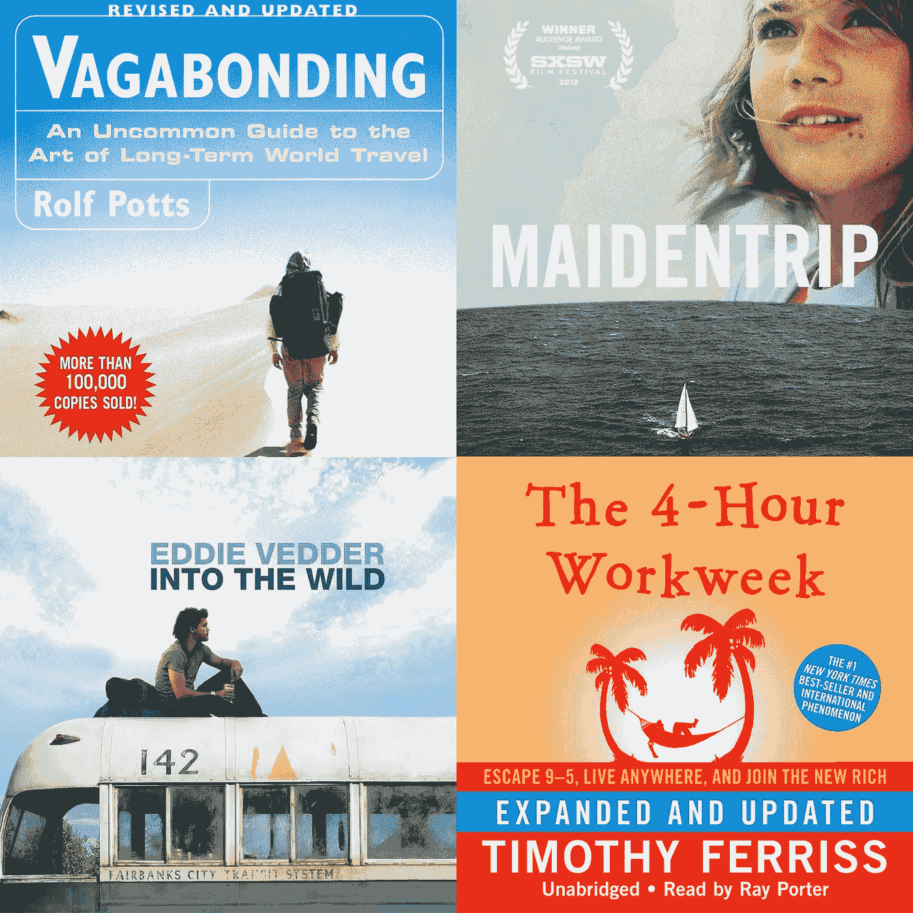

为了开始培养旅行的欲望，我强烈建议用一些灵感充电:书籍、电影、ted 演讲…任何能让你兴奋并开始酝酿一些想法的东西。

## **书籍**

*   *《流浪》*
*   *“每周 4 小时工作制”*

## **电影**

*   《走进荒野》
*   **Maidentrip**
*   **“轮回”**
*   **《希腊人左巴》**

## **会谈**

*   ****罗尔夫·波茨:**[https://youtu.be/MFrhIdwpWx0](https://youtu.be/MFrhIdwpWx0)**
*   **艾德·布林:[https://youtu.be/yIvskLQoE64](https://youtu.be/yIvskLQoE64)**
*   ****皮科伊耶:**https://youtu.be/3m6dV7Xo3Vc**

# **为什么要旅行？**

****

***“有一种压倒一切的社会冲动，要从生活中变得富有，而不是过得富裕”* **罗尔夫·波茨(流浪)****

**如果你目前正经历以下症状，你肯定是长期旅行的候选人:**

1.  **与你所在的城市/环境脱节。**
2.  **你工作/社交生活的停滞。**
3.  **感觉你需要大量的自我工作和时间来反思你的生活。**
4.  **问题的答案**你认为你的大部分时间是什么？**是 4–6**

**你刚刚被诊断出患有甲型流感，是时候尽快上路了！**

# **如何开始？**

****

***“如果你建造了空中楼阁，你的工作就不会白费；那是他们应该在的地方。现在把地基放在它们下面。”* **亨利·大卫·梭罗(流浪)****

**我遇到的许多人都向我咨询如何开始旅行，虽然答案会因护照而异，但你有自己的背景和意图……这条指南可以作为一个通用的出发点:**

*   ****决定**在一个洲(欧洲、亚洲……)和一个时间框架内(通常从 3-6 个月开始)。**
*   ****设计**一个在家“冻结”生活的计划，拿出钱开始旅程。**
*   ****最小化**你的随身物品，开始对长期旅行进行自我教育。*阅读罗尔夫·波茨的《流浪》(T15)。**
*   ****计划**只有第一章，可能是 1-2 周，为你的第一个目的地预订一家旅馆，然后从那里出发。**

**我个人的例子是在里斯本(葡萄牙)预定了一个星期的旅馆，然后在拉各斯(葡萄牙南部)又预定了一个。从那里，我的欧洲之旅在 11 周内有机地发展到了 8 个不同的国家。**

# **金钱**

****

***“长期旅行不是对社会的反叛；这是社会中的常识行为。长期旅行不需要大量的“现金”；它只需要我们以一种更从容的方式走过这个世界。”* **罗尔夫·波茨(流浪)****

****

**旋转旅行的第一个问题是钱！长期旅行需要多少钱？**

1.  **旅行的风格将决定旅行的成本，如果你边工作/做志愿者边旅行，你的钱可以花得很远，如果你只是花钱，你基本上就像一颗等待爆炸的定时炸弹。我遇到过一些人在做了几年志愿者后旅行，总预算为 1-2 万美元，从另一方面来说，我遇到的大多数旅行者在 3-6 个月的时间里花费相同的预算，然后结束他们的旅行。**
2.  **总的来说，我会推荐最低**五千美金**的上路。考虑到你总是有意想不到的花费，根据不同的大陆，回家的机票可能是 1000-1500 美元，我永远不会让银行账户低于 2000 美元。**
3.  **在家节省开支:转租/出租你的公寓，租你的车(如果你有车的话)，尽量不花一分钱在你旅行时不用的东西上。**
4.  **目的地至关重要:在一个欧洲大城市的 3 个月相当于在南美/中美洲的 6-12 个月。极端的比较是，北美的 1 个月和亚洲的 1 年是一样的(当然这取决于地点)。**

## **欧洲**

*   ****北方**(斯堪的纳维亚)最贵(去之前先卖几个肾)。**
*   ****中心**(德国，瑞士)将是第二名，但仍然非常昂贵，尤其是瑞士，它是迄今为止欧洲最贵的地方。**
*   ****西****(葡萄牙，西班牙…)相对实惠，尤其是西班牙和葡萄牙有很多很棒的城市可以去，不会花光你的钱包。****
*   ******东部**(希腊、土耳其、匈牙利)是欧洲最便宜的地区，在那里你的钱会花得最远。****

## ****拉丁美洲****

*   ******中美洲**(墨西哥-巴拿马)与欧洲相比价格适中，但在主要城市仍然昂贵。****
*   ******南美洲**(哥伦比亚-阿根廷)与欧洲相比非常**便宜，只有四个国家除外:乌拉圭、阿根廷、智利和巴西。秘鲁和玻利维亚认为蛋糕是最实惠的(每天 10 美元的预算可以很容易地让你去那里)。*关于乌拉圭的有趣事实:他们喜欢任何使用信用卡的人，如果你使用信用卡，无论你去哪里都会给你打折:)******

# ****住处****

****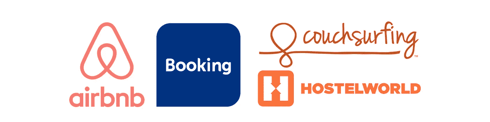****

## ****旅馆(宿舍)****

1.  ****用于查找和预订位置的应用程序:**【旅舍世界】****【预订】**。****
2.  ****在预订之前，试着询问其他旅行者或在特定旅馆住过的当地人，应用程序上的评论非常不可靠，最好的选择是个人偏好。****
3.  ****根据季节的不同，一定要提前预订(旺季提前 2 周),并考虑到城市中会将价格推高的事件。*我不得不离开大城市，因为我对发生的事情一无所知，而且镇上任何一家旅馆都没有低于数百欧元的房间。****

## ****Airbnb(短期公寓)****

1.  ****上路前在应用程序上打开个人资料。****
2.  ******永远**选择有点评的地方。这是没有商量余地的，尤其是在南美这样的大陆。不幸的是，人们有时会打开虚假的个人资料，你出现在一个地方，却没有人在那里。*在这种情况下，请联系 Airbnb，他们会将款项退还给您。****

## ******沙发冲浪**(由当地人主持)****

1.  ****在应用程序上开发个人资料是一项挑战，需要其他旅行者和朋友的推荐才能进行。询问你遇到的其他旅行者是否可以交换推荐信。****
2.  ****总是要求和那些你真的认为你会相处得很好并且很乐意见到的人在一起。当然，只有带评论的个人资料，也要检查评论者的个人资料。****

******我的旅行哲学:**混合你的风格，从几周的旅馆到一些 Airbnb 和一段时间的沙发冲浪。从我的经验来看，宿舍是不可持续的，因为缺乏隐私和像沙丁鱼一样住在宿舍里会耗尽精力。为了认识当地人，并通过生活在这个地方的人的视角来体验这个地方，你必须租一些公寓并接受接待。*随着你经验的增长，你会更好地了解你想结识什么样的人，当你选择旅馆/主人时，你会做出更明智的选择。****

# ****食物****

****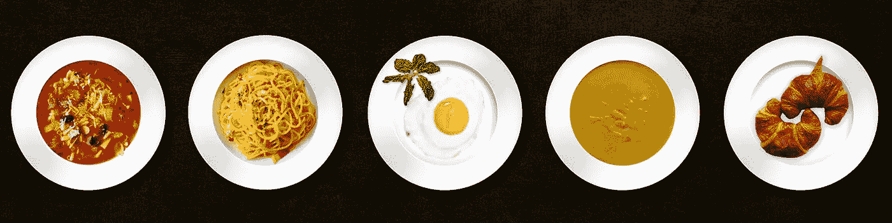****

1.  ****根据目的地的不同，你的货币可以走得很远，让你通过餐馆体验当地的食物。* **秘鲁**在这方面是我目前为止去过的最好的地方:食物的性价比最好。你可以花 2 美元吃一顿 3 道菜的饭**，如果你喜欢美食，在一家很棒的餐馆里，每盘不应该超过 10-15 美元。******
2.  ****总的来说，如果你想长期旅行，学习如何烹饪。在超市买食物总是更便宜，尤其是在南美，那里的当地市场非常实惠。****
3.  ****吃因地而异的食物:如果你在瓦尔帕莱索(智利)或里斯本(葡萄牙)这样的港口城市，去吃海鲜，因为它会很便宜。如果你在阿根廷，去当地的肉店买一周的肉，只要 15 美元。利用这个地方的优势，相应地调整你的饮食。****

******我的旅行哲学:**学习如何做饭！逛当地市场是一种很好的方式，即使你只是路过，也能感觉到你生活在一个地方。在你不知道余弦值的地方，餐馆是很棒的，尤其是在南美，那里的价格很实惠。****

# ****运输****

****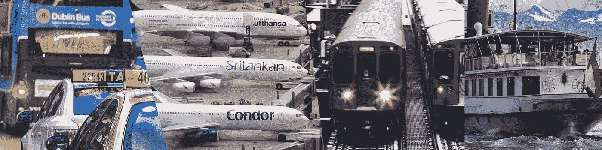****

******罗马 2 里约:**一个很棒的 app，布局了世界上任意两点之间的所有选项，强烈推荐！****

## ******航班******

1.  ****网站:**【Momondo】****【天空扫描仪】**寻找物美价廉的商品。****
2.  ****试着问问当地人，他们是否知道一些你可能没听说过的航空公司有更好的优惠。****
3.  ****如果你有灵活的时间，你可以搜索到附近地点的航班，并从那里乘坐公共汽车/火车到达目的地。例如，你在葡萄牙，想飞往德国，尝试将搜索范围扩大到附近的城市或邻国，并将直飞航班与航班+巴士选项进行比较。在欧洲这样的大陆，这可能非常有用。****
4.  ****飞低成本！最近我从巴塞罗那(西班牙)飞到墨西哥城，花了 40 个小时，我必须经过俄罗斯和纽约，但总价格是 484 欧元。*尽量避免机场食品！出于某种原因，机场认为他们的劣质食物应该定价过高。****

## ****火车/公共汽车****

1.  ****欧洲应用:**“阿尔萨”【美国国家铁路客运公司】**和**“去欧洲”**。欧洲是我去过的探索这些交通方式的最好的大陆:便宜，有组织，比坐飞机更不累。****
2.  ****北美应用:**【灰狗】****【大型巴士】**。****
3.  ****在南美，从邻国乘飞机到坐汽车的差价可能高达数百美元。坐 24-30 小时的公交车可以节省很多钱。****

## ****船(我不是在开玩笑)****

1.  ****乘船/游轮去某个地方可以省钱，试着检查这个选项，尤其是当你有更长的飞行时间时。例如，你在巴西，需要去智利，乘游轮可能比乘飞机更经济。****

## ****汽车共享****

1.  ******“BlaBla Car”**app 在欧洲长途极其有用。当你和别人共乘一辆车时，城市间的旅行可能是 10 欧元的事情。该应用程序目前在 22 个欧洲国家运行。****

## ****短途运输****

1.  ******【优步】**这款应用在全球范围内都可以使用(视地点而定)，为旅行者提供了一个安全又实惠的选择，尤其是在那些打车可能不是最佳选择的南美国家。*在没有此项服务的国家，请尝试使用**“Cabify”**。****

****2.**【谷歌地图】**应用程序是一个不可思议的工具，用于短途旅行导航，输入几英里内的任何目的地，你会收到一些可能路线的详细选项，从公共汽车到自行车/步行，这个应用程序是我路上的“导航神”。*如果你在一个地方呆的时间更长(几周)，最好是购买公共汽车/地铁的订阅票，甚至是自行车租赁。****

## ****驾驶执照****

1.  ****旅行前签发您的国际通行证。****
2.  ****像东欧这样的地方租车非常便宜，而南美根本就不便宜。****

******我的旅行哲学:**不惜一切代价避开机场安检！没有什么比处理航班、延误和行李没有出现更累人和费力的了。欧洲是你乘坐**公共汽车/火车/汽车共享**的终极大陆。去年夏天，我在 11 周内穿越了 8 个国家，没有任何航班，度过了一段美好的时光，每次旅行都遇到了其他人或旅行者，使这些旅行变得迷人。****

# ****志愿者****

****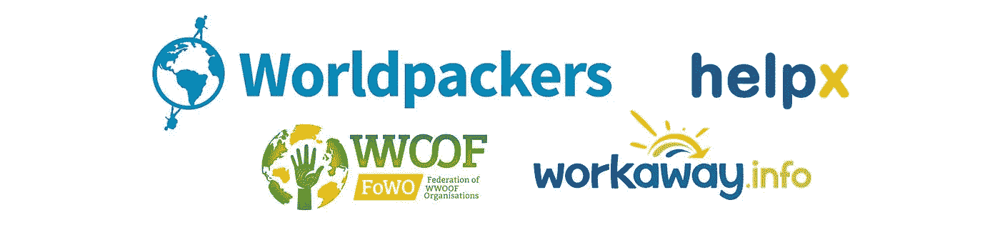****

1.  ****易货网站:**【work way】****【Helpx】【world packer】****【Wwoofing】**。这些网站提供在某个地方(农场、学校、宿舍)做志愿者的机会，以换取住宿和食物，通常的需求是每周 4-5 天，每天 5 小时。****
2.  ****整理过的网站: **"europe.eu"** ， **"Aiesec.org"** ， **"aegee.org"** ， **"goabroad.com"** 。这些网站可以为希望在国外生活的学生或实习生提供长期项目。****

******我的旅行哲学:**志愿服务是一种很棒的旅行方式，同时可以获得有意义的经历，并为他人证明价值。要记住的要点是，找到适合你的地方需要时间，你可能会在一份工作安定下来之前尝试几个地方。*始终通过 skype 与雇主进行面谈，以便对未来的工作有一个清晰的了解。****

# ****签证****

****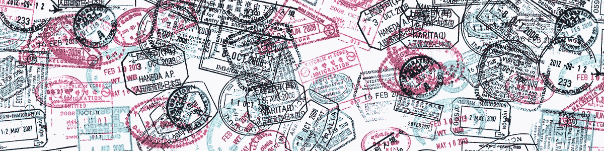****

## ****旅游签证****

1.  ******能入境就先调研**选择目的地！或者你是否需要一个**的退出日期**。我有两次，我的以色列护照要求我有一个国家的出境日期(哥伦比亚和乌拉圭)。总是提前检查这些事情，以避免出现在机场，不得不排队购买高价机票，离开一个你甚至可能不会去的国家。****
2.  ****不要在某个地方逗留过久:尤其是在欧洲或北美，你不会想处于一个被驱逐和被禁止的境地(我听说过许多在那些地方被禁止逗留的故事，在逗留过几个星期后)。*在欧洲，您可以查看申根国家名单:[https://www . schengenvisainfo . com/Schengen-visa-countries-list/](https://www.schengenvisainfo.com/schengen-visa-countries-list/)并采取相应行动。绕过这些限制的一个很酷的方法是离开这些国家，飞到英国呆 3 个月，然后再回来。****

## ****工作假期签证****

****获得一个国家的工作签证是让你融入一个新地方的不可思议的方式，同时让旅行变得非常经济。如果你是**加拿大人**、**澳大利亚人**或**新西兰人**，你很幸运！因为你应该很容易获得欧洲或南美国家的工作签证。****

## ****学生签证****

****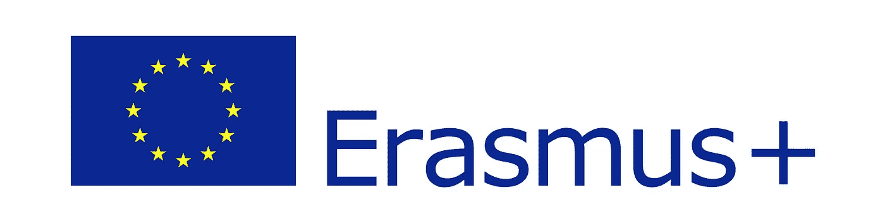****

1.  ****获得一个地方的学生签证可能是进入一个国家的好方法，同时有希望享受一个好的学术经历。欧洲人可以通过欧洲学生交换项目“Erasmus”出国留学。****
2.  ****申请语言学校也是探索国外的一个有趣的选择。试试网站:**“英孚教育留学语言项目”**。****

******我的旅行哲学:**由于我还没有这些类别的个人经验(工作/学习)，我只能从侧面观察并说，如果你正在寻找一种将你融入一个新国家的经历，你应该**而不是**与其他交换生住在一起！并且总是在当地家庭中寻找可以让你在练习语言的同时融入当地文化的寄宿家庭。****

# ****安全****

********

1.  ****记住你的地址:你可能会被抢劫/丢失手机……**永远记住你现在的地址以防万一。******
2.  ******在大车站格外注意:**忽略那些看起来“试图帮你”买票或了解当地交通系统的可疑人物。大型地铁/公交车站是小偷和想利用刚坐了 12 个小时公交车的疲惫/麻木的旅行者的人的天堂。****
3.  ******向当地人咨询:**经常询问你在一个城市中可能遇到的危险，以及如何在新环境中找到自己的路。****
4.  ******挂锁:**随身携带两把锁，在旅馆/健身房使用。****
5.  ******留下你的物品:**避免带任何贵重物品去市场或非常拥挤的地铁等地方。****
6.  ******黄金三连胜:**用生命守护你的**护照**、**信用卡**、**电话**！这是你在路上的三条生命线，任何时候都要非常小心。****
7.  ****护照安全:复印两张护照照片，并随身携带。你在外国，随时准备表明自己的身份。****
8.  ****现金与信用卡:避免随身携带信用卡，随身携带一些你能负担得起的现金。****
9.  ****街上的手机:在任何大都市的公共场所，尽量避免使用手机。尤其是在偷窃和暴力极其普遍的南美。根据我个人的经验，我建议在墨西哥城和麦德林(哥伦比亚)要格外小心。****
10.  ****请记住:人的生命在世界各地受到不同的对待，有些国家**不会**重视你的安全，在那些地方，你是唯一负责你安全的人。****

******我的旅行哲学:**从自己的错误和周围人的错误中吸取教训。如果你宿舍的室友被抢劫了，不要犯同样的错误，在那个地方把手机放在口袋里。相信当地人和他们提供的情报，避开像委内瑞拉或洪都拉斯这样的“热点”国家。****

## ****健康****

********

1.  ******获得**健康保险(不可协商)。*一些旅游公司有价格合理的保险，在你直接去医疗机构之前，请与当地公司核实。****
2.  ******研究**目的地，并据此接种疫苗。****
3.  ****避免没有额外煮熟的街头食品。****
4.  ****向当地人询问自来水的情况。****
5.  ******如果你需要医生，向当地人建议**，如果需要翻译，试着找一个和你一起去。*在智利，当我被一只流浪狗咬伤后，我的 airbnb 房东加入了医院，这个原则救了我(智利西班牙语是不可能理解的！).****

******我的旅行哲学:**避开自来水和街边小吃(尤其是南美)。在大多数地方，你可以在超市买到便宜的瓶装水，当你在哥伦比亚的一个村庄度过食物中毒的一周时，街头小吃就不值得了。注意不同的卫生习惯，例如南美和北美。不要理会那些会告诉你“我在印度喝了 7 个月的自来水，却什么都没发生”的“英雄”，仅仅因为一个人的无知没有得到生病的回报并不意味着你会幸免。****

## ****wifi/数据****

********

****这个话题非常具体:欧洲和南美非常实惠，而北美很贵。****

1.  ****到达新地方时，在机场办理一张 Sim 卡，这将使您的住宿之旅更安全、更顺利。最近的购买:10 美元购买 25 天的数据(墨西哥城)，12 美元购买 30 天的数据(布宜诺斯艾利斯)。****
2.  ****对于欧洲，使用网站**“three . co . uk”**可以购买一个月的 4GB 数据(13 美元)，使用 sim 卡可以在欧洲任何地方工作。****
3.  ****app:**【Wifi 地图】****【maps . me】**如果你没有数据可以帮忙。****
4.  ****如果你担心公共 wifi 网络遭到黑客攻击，就使用这项服务**“nord VPN”**。****

******我的旅行哲学:**尽量随身携带数据，如果没有，在到达之前使用地图应用。当你想在国外安全旅行时，互联网是关键。****

# ****天气****

********

1.  ****最好的天气条件在赤道周围的国家:**厄瓜多**、**哥伦比亚**、**墨西哥**和**巴拿马**。欧洲之星是西班牙，那里的气候是周期性的，但总体来说非常温暖。****
2.  ****冬天出行需要随身携带的装备比较多，不惜一切代价尽量避免:)****

******我的旅行哲学:**去他妈的北美的冬天...****

# ****目的地****

****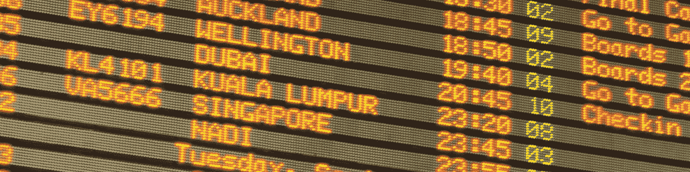****

## ******欧洲******

****如果欧洲是一个女人，我会马上嫁给它，它是我最喜欢的大陆，有几个很大的优势:它是最具流动性的**(周游各国的便捷交通方式)，它有很大的语言多样性和不同风格的文化，如果你想最大限度地实现资金价值，但仍留在西方国家，它是迄今为止最好的目的地。*我最喜欢的地方有**里斯本**(葡萄牙)**布达佩斯**(匈牙利)**巴伦西亚**(西班牙)和**格拉纳达**(西班牙)。这些都是我会考虑居住一段时间的地方。******

## ****北美洲****

****世界的这一部分需要大量的金钱！在某些地方，交通、食物和住宿都很糟糕。最大的优势是语言，这使得与当地人联系和融入你去过的地方变得非常容易。*我最喜欢的地方是蒙特利尔(加拿大)和奥斯汀(得克萨斯)，这两个地方有着非常相似的社区和混合性质(法裔加拿大人和墨西哥裔美国人)。****

## ****中美洲/南美洲****

****如果世界是一份菜单，那么拉丁美洲就是一道很特别的菜，味道很浓，你要么喜欢它，要么不喜欢。这里的优势很多:**非常实惠**，宽松的签证要求，令人难以置信的友好和热情**的人**(在大多数地方)，以及令人惊叹的**食物**！不幸的是，这里也有一些很大的缺点:安全、语言障碍，当然最重要的是……可怕的雷吉顿音乐:(*我最喜欢的地方是**瓦尔帕莱索**(智利)、**圣地亚哥**(智利)和**麦德林**(哥伦比亚)。圣地亚哥因其适宜居住而引人注目，麦德林有着我在其他任何地方都没有体验过的非常独特的感觉(在那里要非常小心)。****

# ****本地化您的体验****

************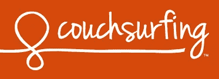************

****为了完全融入一个地方，你必须和当地人一起生活，在那里工作/做志愿者，最好在 T4 学习语言。要和当地人住在一起，你可以住在“沙发冲浪”上，或者租一个“Airbnb”/转租一套公寓。****

## ****社交黑客****

****在旅行中，即使你只是路过几天，也有很多方法可以认识当地人:****

*   ****使用应用程序:**“couch surfing”**、**“Meetup”**和**“hang out”**来查找像语言交流这样的活动，以及连接旅行者和当地人的活动。****
*   ****使用**脸书**寻找城市中正在发生的事件。****

******我的旅行哲学:**接近，接近，再接近！利用你的兴趣结识当地人:瑜伽课、攀岩馆、萨尔萨舞……都是与当地人互动的好机会。*你在旅行！这里没有培养社交角色，在大多数地方你会待上几天/几周，所以把这作为一种武器:在酒吧、网吧、公共汽车/火车和任何你能去的地方。****

# ****语言****

****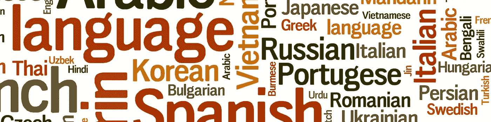****

****学习当地语言可以完全改变你的旅行体验。我强烈建议当你在一个不同的大陆流浪时，学一门新的语言。很快我会发表一篇西班牙文的文章。****

1.  ****选择一种你想探索的文化，并据此选择语言。如果你喜欢法国哲学或者电影，那就去学法语。如果你喜欢西班牙音乐，就选择西班牙语。从我的经验来看，如果你对文化不感兴趣，你将永远无法忍受学习的过程。****
2.  ****学会一门新语言的首要原则是与母语人士共处。我在南美和拉丁室友住了 5 个月，经历了半流利的过程。****
3.  ****去语言交流中心去认识尽可能多的当地人(没有至少一个当地电话号码就不要回家)。****
4.  ****根据你的兴趣来使用这种语言:音乐、电影、文学、播客、YouTube 视频、单口相声……任何能让你了解人们如何使用这种语言的东西。****
5.  ******通过 YouTube 视频和在线文章学习结构**。****

*   ****如果你想避免这个话题，你应该去欧洲北部/中部寻找英语流利的地方，T2、荷兰和 T3 在这方面领先。在拉丁美洲，英语最流利的是 T4 和阿根廷。查看这篇[文章](/world-economic-forum/which-countries-are-best-at-english-as-a-second-language-d4781d077ba6)了解更多信息。****

# ****一个人还是和别人一起？****

*   ****迄今为止，我会向所有 24 岁以上的初学者推荐单人旅行。我写了一篇关于这个话题的文章:“[独自旅行”](https://vagaex.com/solo-traveling-a9fbce3c6f69)****
*   ******和朋友一起旅行**是一个赢大或输更大的案例:)明智地选择你的伴侣！并确保 1 个关键部件始终存在:**单独时间**。无论你走到哪里，大群体都会导致孤立，这不是我通常会建议的。****
*   ****与家人一起旅行比我们想象的要普遍得多。在路上遇到了很多兄弟/姐妹，看起来效果还不错。大提示:在一起旅行 4 个月之前，先在某个地方排练一周。****
*   ******夫妇**——这一类在我个人经历中是最冒险的。作为情侣旅行可能是对关系的一次强化测试。我在旅途中遇到过一些很棒的夫妇，他们设法使婚姻长久，但我想说，这需要在旅行前有一个坚实的经验基础。我会说，在开始一年的冒险之前，先小试一下(几天/几周)。一周 7 天 24 小时都和某人在一起会放大这种动力，给任何联系带来很多压力和重量。****

******我的旅行哲学:**在独自旅行的道路上走了 18 个月后，我可以说这一类别有改变你生活的潜力，并且最容易按需改变。我和其他人在不同的场合旅行了几天/几周，并且总是回到我的起点，那就是独自旅行。我希望这种风格会随着我旅程的继续而发展，但我怎么强调都不为过，我多么相信独自旅行是发展自己的最佳平台。****

# ****发展你自己的风格****

****当你是一个初学旅行的人时，你会发现自己在问下面这些问题:“我应该做什么？，我应该和谁共度时光？，我该志愿吗？我应该去大城市还是小一些的城市？”。对你正在寻找的东西形成清晰的想法是需要时间的，我发现根据我的经验，这些想法一直在变化。****

*   ****尝试很多事情，看看你会被什么吸引。如果你发现自己迷失了，那太好了！这是非常自然的，这个过程是一个独特的调查，它将拓展你做决定和调查你的经历的能力。例如，**旅社**有时会像漩涡一样把你吸进去，很快你就会陷入这样的境地:连续几天和澳大利亚人一起喝酒，却不记得你在哪个城市……或者我个人的“最爱”:在桥上和一些你遇到的女孩自拍，现在你是这一天的自拍指导:(通过这些“错误”，你会对你想参与的人和活动有更多的了解。****
*   ****留意你的需求:如果你想工作，明智地选择旅馆/Airbnb(不要“派对旅馆”)。如果你需要休息，聪明一点，避免拥挤的地方和会让你筋疲力尽的活动，打电话给你的犹太奶奶，要一份好的汤食谱，放松一下。****
*   ******向其他旅行者学习**:关注你听到的故事/经历，并不断汲取灵感。如果你遇到在农场做志愿者的人，听听他们的故事，问一些你感兴趣的相关问题。****

# ****心态****

********

****记住，流浪的特殊优势是不知道接下来会发生什么。你所面临的挑战除了应对之外别无选择。通过这样做，你的生活变得充实。” **艾德·布林(流浪)******

****生活中没有什么比我们的**心态**更有价值的了，在路上它充当了终极资产。所有可能出错的事情**都会**然后一些……**知道**这就是游戏。计划是狗屎，准备是关键，然后你随机应变。你丢了一只鞋，被狗咬了一口，或者食物中毒了……你可以用旅行者的心态快速适应。旅行是一个平台，每天都会为你提供意想不到的挑战，药物的效力在于影响的深度。不是每个旅行者都会体验到这个工具的好处，但是那些体验过的人会知道它，并会觉得有必要相应地发展他们的心态。****

****看看我以前写的关于这个话题的文章:****

****[旅途心态](https://vagaex.com/a-journey-mindset-d4773617ef4e)****

****[移动您的环境](https://vagaex.com/moving-your-environment-eb6014a3fda5)****

****稀缺与富足****

****[阻力](https://vagaex.com/resistance-4a05542f0eb9)****

# ****最佳建议****

*   ******旅行是一种技能:**很多人问“但是你是怎么做到的？”或者“旅游太贵了……”“太复杂或者太恐怖了……”旅行就像生活中的任何其他技能一样，你对它的理解会随着经历而增长，通过向他人学习而进化。每一次我接触到另一种可能性，比如志愿服务或被人接待，我的决定都变得更有教育意义。即使是预订航班和了解交通工具这样“简单”的事情也可以成为一个巨大的突破，让你的钱花得更远。为了长期旅行，你必须像对待其他技能一样对待它，调查和研究其他正在做这件事的人，并开始学习曲线。你可以把它看作一个“新世界”,你正在进入一个白带。如果你倾向于花钱，最好从一个更宽容(从经济角度讲)的大陆开始，比如中美洲或亚洲。你进入新的“世界”并开始发展你的技能，几个月/几年后，你可以探索其他地方并在不同的环境中测试你的技能和理解力。每当你遇到一个有趣的旅行者，通过观察他们，探索他们的视角，尽可能地从他们身上学习。把你一路上遇到的旅行者想象成试图解决和你一样问题的科学家。每次你与他们交流经验/信息时，你就能利用集体知识，推进你的旅程。****
*   ******人是最好的资源，以部落为导向:**我有过无数次陷入困境的经历，而决定因素是一位帮助我解决问题的朋友。你的钱/电话只能让你到此为止，没有当地人的帮助，独自旅行的经历有时会变得令人生畏和不知所措。你可能会遭遇抢劫，被洗劫一空，但如果你和路上遇到的人关系良好，你总会有一个重新振作的起点。我们的生活经历受我们身边的人影响最大，发展你的团队(无论是否在路上)是使这一切都值得的重要组成部分。****

****如果你**喜欢**这篇文章:请按下拍手按钮，这样它就可以接触到更多的人，并检查更新的网站[https://vagaex.com](https://vagaex.com)和 https://www.facebook.com/vagaex/[脸书页面](https://www.facebook.com/vagaex/)以获得新版本的更新。****

****如果你不喜欢这篇文章，这里有一个来自大师级电影《轮回》的精彩片段，这个场景是我能想到的终极抗议:****

**** [## 未来旅行

### 报道新时代的旅行

未来旅行.今天](https://futuretravel.today)****