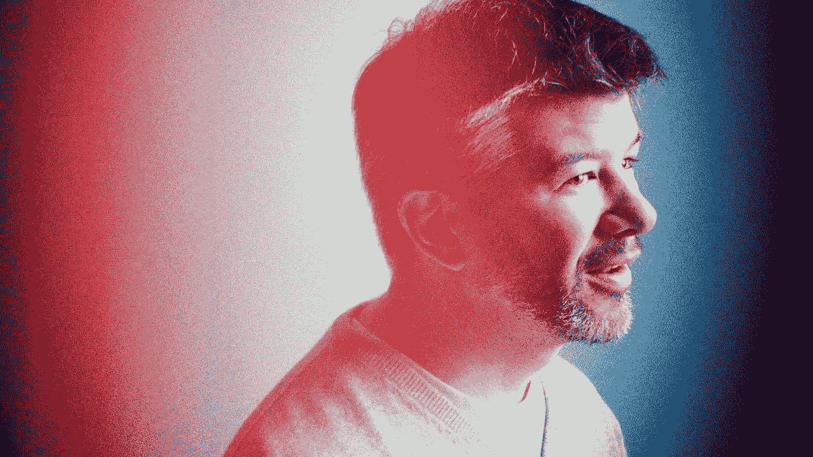
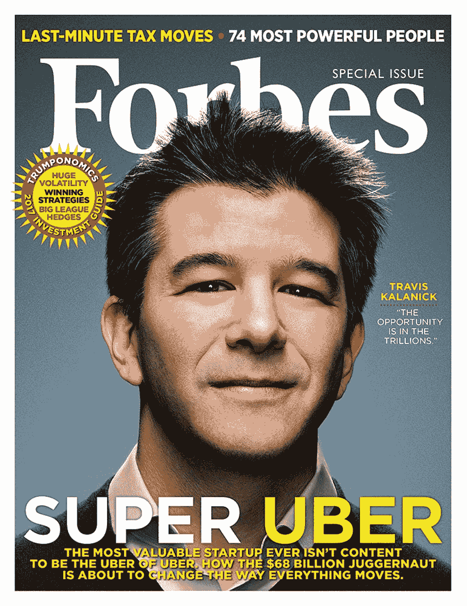

# 特拉维斯·卡兰尼克——今天迷路了，希望能被找到！

> 原文：<https://medium.com/hackernoon/travis-kalanick-lost-today-hoping-to-be-found-fc4a7bad9779>

[https://www.fastcompany.com/3050250/what-makes-uber-run](https://www.fastcompany.com/3050250/what-makes-uber-run)

我不是明星崇拜者，也不支持名人(不管他们来自好莱坞还是硅谷)。我是一个尊重勇气、努力和韧性的人，这意味着我尊重特拉维斯·卡兰尼克，这位被驱逐/即将离任的优步首席执行官兼联合创始人，用他的话说是“首席问题解决者”。

当美国人试图找出为什么希拉里的电子邮件问题在选举期间再次成为热门话题的答案时，我试图找到*“为什么特拉维斯/优步的每一期都必须成为头版或突发新闻”的答案。*

彼得·泰尔(Lyft 的投资者，优步的模仿者)称优步为“[硅谷最受道德挑战的公司，](http://money.cnn.com/2014/11/18/technology/uber-unethical-peter-thiel/)”的头条新闻在科技界流传，而彼得·泰尔本人通过支持和捐赠资金证明了自己受到道德挑战，他也是一个道德挑战的人物(*打破了我在这里递归的道德挑战人物萎靡循环*)并没有像特拉维斯一样打破长期的头条新闻。

与美国的每一个问题都与特朗普(治理这个国家的人)有关不同，优步的每一个问题都与特拉维斯有关，尽管特拉维斯是一个负责任的人，[从不回避回应这些问题](https://www.nytimes.com/2017/03/01/technology/uber-chief-apologizes-after-video-shows-him-arguing-with-driver.html)。(阅读:[在视频中，优步首席执行官与司机争论票价下降——彭博](https://www.bloomberg.com/news/articles/2017-02-28/in-video-uber-ceo-argues-with-driver-over-falling-fares))为什么要进行特别报道？他没有自称是卖了法拉利的和尚！他也没有声称要为总统竞选！

他跑*(可悲的是，过去式)*一个有恃无恐的颠覆性公司；与市政官员斗争，与出租车工会斗争，与模仿竞争对手斗争，与阻碍投资者的创新斗争。他没有要求任何人视他为领袖(让他受到崇拜)。他只是一个雄心勃勃的企业家，已经失败过，但这次还没有准备好。

[Photo credit](http://www.adweek.com/digital/uber-takes-over-new-york-times-homepage-fight-proposed-bill-166050/)

丹尼尔·卡内曼认为我们内心有两个自我，体验自我和记忆自我。媒体用 Travis——傲慢的 CEO——来填充我们的记忆自我，而我们的体验自我却没有认识到，顺利的通勤——按下按钮，搭个便车——体验实际上是因为傲慢的 CEO 做出了令人费解的努力。

作为一个物种，我们对归属有很大的问题。我们很少想到把食物放在我桌子上的农民会忍受怎样的艰辛，更不用说优步首席执行官为了让我们的骑行体验永远顺畅而与所有人对抗。当然，他不是一个共产主义者，也不是一个修女来做他一生的慈善事业。他有一个使命，他朝着它跑去，但他是不是撞倒了什么人？我会说不，绝对的不！他不是那些明显欺骗公民导致 2008 年住房危机的家伙之一，他也不属于任何恐怖组织。但他从来没有被简单地描绘成一个资本家的首席执行官。毫无疑问，媒体日以继夜地报道关于优步的新闻，夸大其词，咄咄逼人！

[Photo credit](https://www.forbes.com/sites/miguelhelft/2016/12/14/how-travis-kalanick-is-building-the-ultimate-transportation-machine/#81d7e6f56abe)

他不可能不犯错误。他有他的一份。但是他的错误总是被放在放大镜下看。他的方法和风格一直受到批评，而这些正是他建立一家官僚和当权者不想要的破坏性公司的主要原因。他不得不为自己无法控制的事情负责。最终，当他的个人生活在失去母亲的痛苦中时，他被驱逐了(啊！不要告诉我他是在阅读[《纽约时报》的文章](https://www.nytimes.com/2017/06/21/technology/uber-ceo-travis-kalanick.html?_r=0)之前辞职的，他热爱并为之献身的职位——不是那个让他看起来像硅谷偶像的棘手职位——而是他推动优步前进的渴望和激情。

[特拉维斯·卡兰尼克](https://www.fastcompany.com/3050250/what-makes-uber-run)，一个[激励我和许多企业家](http://www.businessinsider.in/All-Hail-The-Uber-Man-How-Sharp-Elbowed-Salesman-Travis-Kalanick-Became-Silicon-Valleys-Newest-Star/articleshow/28683781.cms)(我想)的人，今天失踪了，他会被找到吗？我希望他能被找到，就像史蒂夫·乔布斯一样！

> [黑客中午](http://bit.ly/Hackernoon)是黑客如何开始他们的下午。我们是 [@AMI](http://bit.ly/atAMIatAMI) 家庭的一员。我们现在[接受投稿](http://bit.ly/hackernoonsubmission)并乐意[讨论广告&赞助](mailto:partners@amipublications.com)机会。
> 
> 如果你喜欢这个故事，我们推荐你阅读我们的[最新科技故事](http://bit.ly/hackernoonlatestt)和[趋势科技故事](https://hackernoon.com/trending)。直到下一次，不要把世界的现实想当然！

