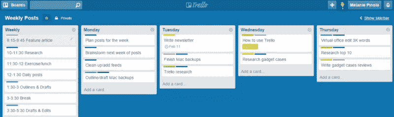
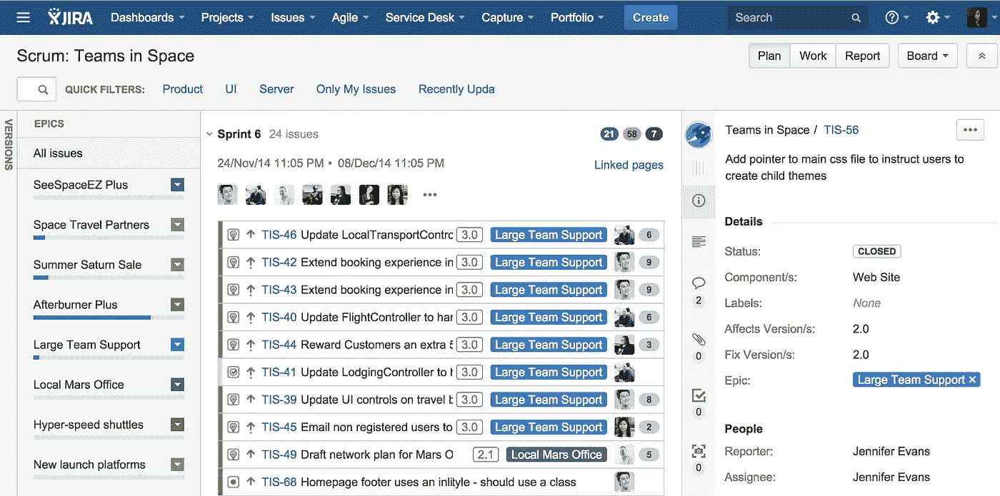

# 特雷罗，“吉拉烂透了”，和工具功能障碍

> 原文：<https://medium.com/hackernoon/trello-jira-sucks-and-tool-dysfunction-e80c8000a431>

我喜欢特雷罗，因为你很少会把事情搞砸。你根本不用 Trello 来处理“更复杂”的工作流，因为它失败得很惨(感谢上帝)。它简单、快速、没有虚饰，帮助你专注于与其他人合作并完成工作。这没关系。我很高兴[收购了 Trello。](https://medium.com/u/5aa6b9976187#.mem6innxb)

> 但是约翰，吉拉糟透了！也许特雷罗精灵粉会沾到吉拉身上…

我认为这是一个巨大的过度简化，对 Atlassian 面临的挑战(以及 Trello 团队享有的优势)表现出很少的同情。问题不在吉拉。

问题是，我们不可避免地会讨厌我们使用的每个问题跟踪产品。我们讨厌它们，因为我们(用户)出于好意过载/定制了它们，然后我们的需求改变了。最后，因为企业将这些工具视为某种必要的邪恶:一种管理工具，而不是推动更好的客户成果和激励持续改进的催化剂。如果一线团队能够将他们对上述工具的使用与更好的个人和客户结果联系起来，他们会喜欢这些工具。

很好的例子。我的朋友宣称“我讨厌特雷罗！”原来他开始在一家公司工作，这家公司为了“管理”一个令人难以置信的臃肿的流程，已经把它搞得面目全非。只需要一次食物中毒。而且……我们倾向于将团队功能失调移植到我们使用的工具上。如果我们在使用吉拉时总是感到沮丧，我们会把它与吉拉联系起来！在吉拉实施的一个复杂的过程仍然复杂。

## 阻碍持续改进

工具倾向于迫使过程过早收敛，然后使改变过程变得极其不方便。工具在运行团队，而不是相反。应该鼓励团队不断改进他们的工作方式。两周的短跑是太长了，还是太短了？我们能澄清我们的工作协议吗？团队正在推动新的价值流吗？我们需要改变事情来解决瓶颈吗？我们应该标记配对的物品吗？暴徒？向票证层次结构添加新层？团队应该能够相应地适应。

## 被遗忘

让问题变得复杂的是，你越是试图定制工具来让每个人开心(并让他们现在的工作更容易)，用户体验就变得越臃肿和不灵活。这种神奇的高管级别的仪表板现在已经成为现实，但代价是让团队反思和适应他们的工作方式(并可能让他们承担非面向客户的管理工作，也就是可怕的“更新您的票证，每个人！”).

在许多情况下，您看到的是业务仍然处于瀑布思维模式，我们的工具定制有很大一部分是围绕翻译层进行的。

## 利益

你必须问…团队*如何真正从使用产品中获益*？该工具是否能帮助他们向客户交付*更多价值*？当我问这个问题时，我会**经常听到**关于跟踪、责任、可见性、评估、管理依赖、状态检查、通知、执行汇总和报告等好处。我**很少听到**关于改进的协作、更好的洞察力、改进的质量、更有效的回顾，以及增加的团队动力/所有权感/明确的使命。我**几乎从未听说过**关于最终客户成果的改善。

问一个工程师或 UXD“什么工具帮助你构建更好更有用的软件”他们会有答案。它不会是票务/工作流产品。

## 嗯嗯

总之。这就是我今天的想法。是工具在管理团队，而不是相反？您的工具是否向客户交付了更好的结果，或者只是让每个人在内部感觉更好？所有这些定制层真的能增加价值吗？

此外，当我们试图在一个工具中混合工作流、持续改进工作和票证协作时，我们是否总是失败？我总是建议团队与实体董事会合作，反思和调整他们的工作方式。然后选择一个工具。相反，团队认为他们将“做敏捷”，认为每个人都严格遵守规则，并购买工具来执行所述过程。很少有好结果。

> [黑客中午](http://bit.ly/Hackernoon)是黑客如何开始他们的下午。我们是阿妹家庭的一员。我们现在[接受投稿](http://bit.ly/hackernoonsubmission)并乐意[讨论广告&赞助](mailto:partners@amipublications.com)机会。
> 
> 如果你喜欢这个故事，我们推荐你阅读我们的[最新科技故事](http://bit.ly/hackernoonlatestt)和[趋势科技故事](https://hackernoon.com/trending)。直到下一次，不要把世界的现实想当然！

