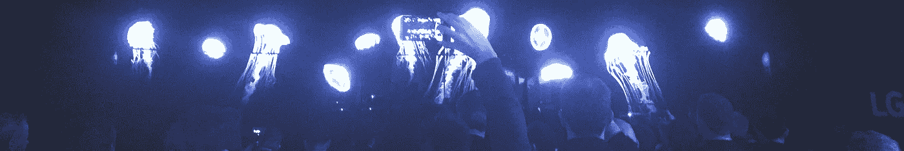
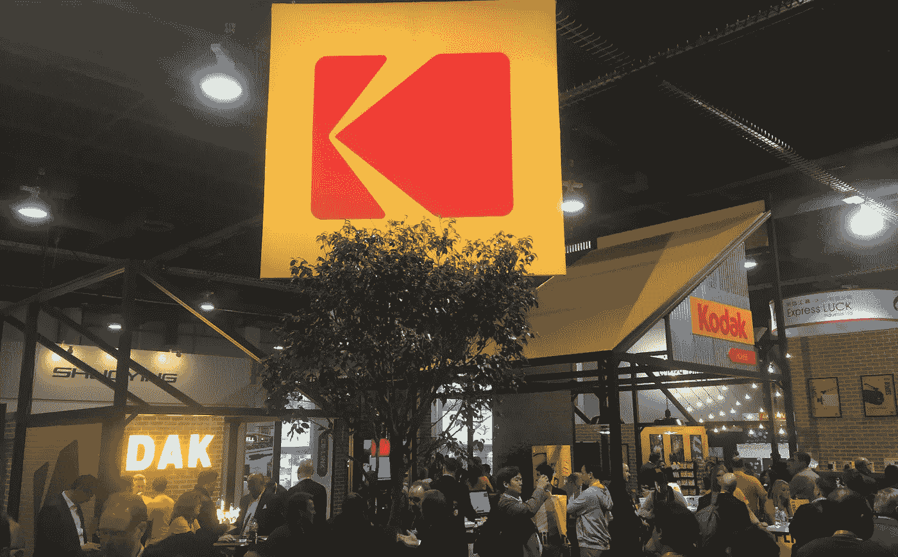
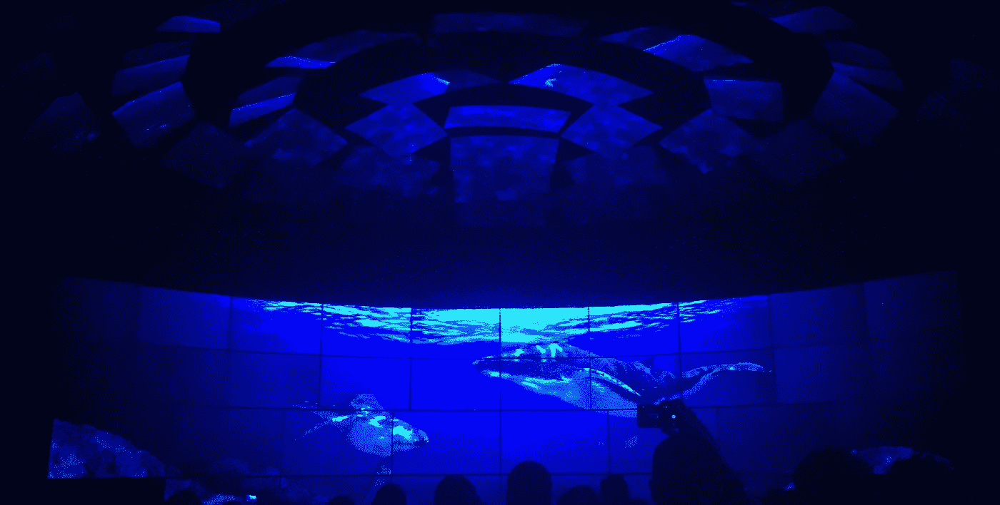

# CES 2016 的趋势和轨迹

> 原文：<https://medium.com/hackernoon/trends-and-trajectories-from-ces-2016-bb57d566f345>

## 将塑造消费者行为和技术的 10 个主题

## **1。世界正在整合成一个单一的产业——技术**

尽管我带着刚从世界上最大的[技术](https://hackernoon.com/tagged/technology)展示中脱颖而出的巨大偏见这么说，但一些相当深刻的事情正在所有企业中发生。它已经来了很多年，现在显现得更快了。本质上，如果你有一个企业，你就是在技术行业。在 CES 2016 上，安德玛、宝马、NBC 环球和联合医疗保健等公司自豪地展示了技术是如何成为其业务的核心。技术不再是世界上最受赞赏的企业中的一个部门，而是企业。

## **2。期待 2016 年充电**

在过去的几年里，我们已经看到我们的设备在电池性能方面有了微小的改善，ces 展会上的大部分内容仍然致力于提供卓越的电池充电、紧急备份和最终更换。股票提示:第一个在电池领域取得重大突破的创新者将是一个很好的市场赌注。如果 2016 年消费电子展有什么启示的话，那么解决这一困境对于几乎所有消费产品类别来说都将是一次壮举。

## **3。迈向未来的步伐变化**

又是数百台 3D 打印机，又是数千个蓝牙扬声器，又是形状和大小各异的无人机。这可能感觉有点多余，但在 2016 年，一些类别朝着[未来](https://hackernoon.com/tagged/future)迈出了一些重大步伐。一个例子是[虚拟现实空间](http://time.com/4172998/virtual-reality-oculus-rift-htc-vive-ces/)——HTC 在这里展示了他们的 Vive 虚拟现实耳机，它具有一个巧妙的功能，可以检测现实世界中的物体，并可以将它们叠加到虚拟世界中。再也不会不小心撞到墙了。作为一个行业，我们每年都期待 iPhone 级别的产品发布，但在大多数 12 个月的周期中，你必须欣赏这些小胜利。

## **4。苹果的幽灵赫然出现**

苹果每年都与 CES 保持一定距离，但在过去十年中，CES 越来越多地代表了苹果的技术主导地位，它提供了一系列基于其产品范围的配件和服务，特别是在移动领域。在 CES 2016 上有许多公司推广他们与[苹果的 HomeKit](http://www.apple.com/ios/homekit/) 平台的集成(例如 [Netatmo](https://www.netatmo.com/) )。苹果的生态系统在拉斯维加斯生机勃勃。

## **5。保护展厅**

物联网预示着一个更智能、更便捷、更直观的互联世界。这也给我们的个人安全和隐私带来了风险。在 CES 2016 展会上，主展厅外有一小块区域专门展示技术安全解决方案，包括家庭、设备和数据。我预测这部分节目在未来几年会呈指数增长。随着连通性成为我们购买的所有产品的一部分——从运动器材到婴儿监视器——一切都将变得内在可追踪(例如[伟易达违规](http://bits.blogs.nytimes.com/2015/12/15/man-arrested-in-vtech-breach-of-childrens-data/?_r=0))。消费者将要求这些互联体验的安全性和更好的控制。

## **6。走向伟大的未知(品牌)**

2016 年国际消费电子展延续了大部分西方消费者从未见过的亚洲制造商和品牌大规模曝光的趋势。普通美国消费者可能会想起 4-5 家主要的电视制造商和 2-3 家平板电脑制造商。这只是电子产品的冰山一角，CES 展示了其余部分。走在展厅里，很容易被冗余的产品淹没——每个人都试图通过价格、功能或展位赠品找到自己的位置。竞争非常激烈，像乐视和创维这样的品牌看起来相当强大。

## **7。复出的孩子们**

2016 年，知名品牌正在以新的方式利用它们的资产。柯达公司有一个朴素而辉煌的展台，展示他们消费产品的回归。聪明的是，柯达已经将他们的品牌授权给外部制造商，用于 LED 照明和 360 度相机等项目——这个品牌立即回到了消费者手中。他们还带回了他们标志性的 [Super 8 胶片相机](http://www.kodak.com/ek/us/en/Consumer/Products/Super8/default.htm)，配有新的数字取景器。消费者拍摄胶片，将其运送到柯达，柯达进行处理，在 4K 进行扫描，然后上传给客户。在另一个怀旧的例子中，松下复兴了 Technics 品牌，并推出了新的 SL-1200 转盘，这是 DJ 和音响发烧友梦寐以求的。

Kodak reentering the consumer market at CES 2016

## **8。模拟和数字的混合**

除了柯达的 Super 8 之外，还有其他许多明显非科技产品进行数字大修的例子(例如 [Sleep Number 的“it”床](http://itbed.sleepnumber.com/it))，但在回家的飞机上让我念念不忘的是乐高教育部门的产品。乐高发布了一个名为 [WeDo](https://education.lego.com/en-us/lesi/elementary/wedo-2) 的综合机器人套件，允许学生使用现有的最喜爱的玩具来进一步探索他们的 STEM(科学、技术、工程和数学)技能。他们的展台展示了由手机和平板电脑控制的多个乐高车辆和机器人。

## **9。便利是关键**

走过 CES 上的一大排产品时，经常会停下来想，“等等，他们为什么要做那个东西？”你经常意识到你被数百种很快就会失败的产品包围着。在众多新奇事物中，那些给消费者带来更大便利的想法似乎最有吸引力。在很大程度上，消费者并不寻求全新的行为——他们希望日常事物变得更好。有一件产品我起初犹豫不决，但后来，作为一个小孩子的父亲，我很快意识到我想要的是 [TempTraq 温度计](https://www.temptraq.com/)。不需要在半夜叫醒生病的孩子，医生命令给他们量体温，这是真正有见地的便利。另一方面，一些产品可能不会占据消费市场(例如 [Oombrella](http://www.wezzoo.com/oombrella) )。

## **10。飞蛾依然向着光飞去**

最亮的灯只是在 CES 上受到关注，对于大多数消费者，尤其是美国消费者来说，这些灯仍然代表着最新最棒的电视。每年，制造商都试图找到一种独特的功能或技术，以便在竞争中领先推广和展示。除了处于原型阶段的 [LG 全柔性有机发光二极管显示屏](http://www.engadget.com/2014/07/09/lg-roll-up-tvs-flexible-oled/)之外，2016 年在去年的基础上进行了小幅改进。微曲面电视、8K 电视、智能电视——去年我们都看到了。但与 2015 年不同的是，2016 年将提供越来越多的 4K 内容，不是来自广播网络或有线电视提供商，而是来自点播 IPTV。

LG video mosaic at CES 2016

*@grantowens，CSO @CriticalMass*