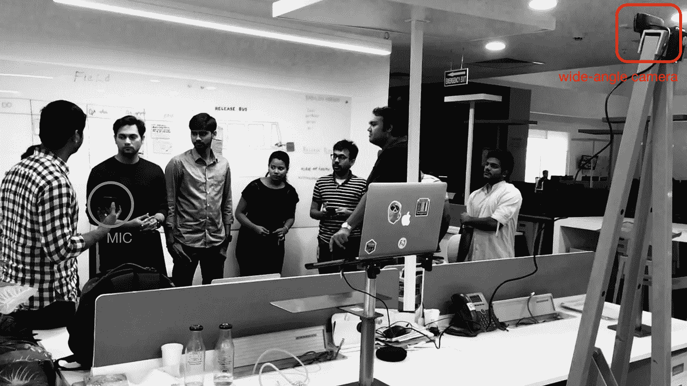

# 修剪团队噪音— 1。组织会议室

> 原文：<https://medium.com/hackernoon/trim-team-noise-1-organize-meeting-rooms-c57a47c76b50>

## 虽然我们举行会议的方式可以节省很多时间，但组织会议室是一个良好的开端。

我的一个团队成员问我，*“为什么我在会议室里如此关注小细节？”*

我告诉他，这相当于团队里多了一个人。

他笑着问，*“怎么样？”*

我让他选择大楼里的任何一个会议室。我们都走到他指的一个会议室。我给他看了一个干净的板子，那套物品一直保持着准备好的状态，如下图。我让他随便选一支笔写下来。它写得很好。

我开始向他解释，当我一年前加入公司并每天参加会议时，我观察到以下情况:

*   木板不干净，抹布不见了。
*   许多记号笔都不写了。
*   [便利贴](https://en.wikipedia.org/wiki/Post-it_note)，笔记本、钢笔、铅笔等记笔记的工具不见了。
*   HDMI 线缆丢失或无法工作。
*   远程团队成员很难听到和看到我们。
*   成员不知道会议结束时间。

> 数学:
> (以小时为单位固定上述列表所用时间总和*每次会议总人数总和*每天会议总次数*每年工作日数)*额外压力和分心系数=每年非生产性小时总数。

我可以让他相信，上述非生产性工作时间可以等同于一份好工作。

**我们的持续改进实践:**

*   我们和一家公司有维修合同。我创建了一个 excel 清单，里面有一个重新填充和清洁项目的列表。我们的维修人员每天都会在上面签名。任何新的观察结果都被附加到表格上。
*   远程团队成员和在家工作的人很难听到和看到我们。我们现在有如下图所示的立式豆荚。它有一个[广角网络摄像头](https://www.amazon.com/Logitech-960-000972-C930e-Webcam/dp/B00CES5A60/)以便更好地观看，还有一个方便的[蓝牙扬声器和麦克风](https://www.amazon.com/Jabra-Wireless-Bluetooth-Softphone-Packaging/dp/B00AQUO5RI/)。只有拿着麦克风的人才能说话，这改善了一次一个对话的效果。

Standup Pod

*   我参加的大多数会议都使用手机上的计时器。有时在第一个 30 分钟后，我会问小组我们是否可以再延长 10 分钟。为了模拟同样的情况，我们计划在每个会议室安装大计时器，它会在 30 分钟后发出哔哔声。另一个想法是将会议室的预订限制在 30 分钟以内。
*   会后，我们养成了关灯的习惯。除了节能之外，看到一个免费的会议室并选择一个也很简单。

> 虽然我们举行会议的方式可以节省很多时间，但会议室的设计和组织是一个良好的开端。