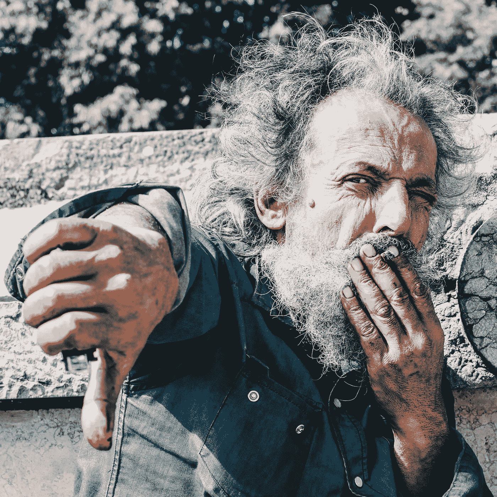

# 巨魔是你勇气的证明。

> 原文：<https://medium.com/hackernoon/trolls-are-confirmation-of-your-courage-4be4e5b28140>

Photo Credit: [Daniel Páscoa](https://unsplash.com/@dpascoa)

在我的高中，我们以唱国歌的第一段也是最著名的一段开始了各种体育赛事。

我的几个朋友做了这项荣誉，但他们平淡无奇的表演我已经忘记了。很自然地，我扭曲的大脑只能回忆起一首最激动人心的歌曲。

场景:科普斯科姆高中体育馆。你可以听到外面人行道上一千次谈话的嗡嗡声。在大厅里，更多的感觉:爆米花不容置疑的热油香味，闷热但不令人不快的热量，可触摸的、冒泡的运动兴奋感。

体育馆本身仍然有木制看台，在大多数比赛中，当一些助手按响蜂鸣器时，这个地方已经挤满了人，只有站立的空间。

国歌在鸣笛前响起。我不太记得那个歌手了，这对她来说是一种怜悯。

她的名字可能是林恩。林恩双手捧着麦克风，开始讲话。她的声音既不是最好的也不是最差的。她熬过了第一行，第二行，第三行:

> “哦，你能看见吗，在黎明的曙光中，
> 
> 在黄昏的最后一抹微光中，我们多么自豪地欢呼，
> 
> 谁的宽条纹和明亮的星星穿过危险的战斗……”

然后，她跳到倒数第三行:

> “整夜证明我们的旗帜还在”

问题是，这种势头是通过最后两条线形成的:

> “哦，星条旗还在飘扬吗
> 
> 在自由的土地上，勇敢者的家园上？"

我们可怜的歌手意识到这个高潮来得太快了。或者林恩意识到她还没有唱出她练习过的高音:

> "而火箭的红色*耀眼*……"

一个施展爱国魔法的歌手闭上眼睛的幸福已经一去不复返了。她脸上先是露出困惑的神色，然后是恍然大悟，接着是恐惧。

就在那时，人群意识到发生了什么。

其余的歌词已经消失了。噗。

林恩向后爬，试图找到一个发声的立足点，将唤起她的记忆。她再也没有康复。在重复了一两次即兴表演后，她唱完了最后两句，然后失败地匆匆离开了舞台。

至少人们没有开始笑。我可以对科普斯科姆运动队的球迷说。一些爸爸可能会大声咳嗽，以此暗示我们*真的*需要*礼貌地*忽略刚刚发生的事情。帮帮这个可怜的女孩，继续表演吧。

如果你曾经在舞台上，无论是字面上还是隐喻上，在公众面前，在周一你不得不面对的人面前，让自己尴尬过，那么你会情不自禁地感受到表演者的羞辱。

那些失误会留下精神创伤。下一次有人递给你一个麦克风或挥手让你上台时，你的胃会翻个身。情绪会产生反响。

我不必告诉你，互联网对拙劣的表演并不比现实世界更仁慈——我要说，没那么仁慈。

与物理现实有一点距离的东西允许人们变得不文明、不公平、固执地吹毛求疵和寻找错误。

一种特殊的自以为是的热情占据了上风。给一个 11 岁的男孩一个放大镜、强烈的阳光和一群蚂蚁，他就会产生毁灭的冲动。

给一个 20 多岁的兄弟免费 Wifi，Youtube 和评论区，然后肆虐的冲动就开始了。

我们可以花几个小时来剖析钓鱼的心理。为什么*人们会攻击一个上传了吸食牛腩视频的陌生人？为什么他们把时间浪费在讽刺、淫秽和嘲笑他的母亲上？*

音频失真，灯光不好？谁他妈的在乎！

关于购买抵消吸烟者的建议没有击中要害？那又怎样？

为什么不取消订阅，取消关注，或者以其他方式远离他最恶劣的山核桃熏劣迹？

网络报复文化在时间分配上很奇怪。为了证明某人有多误入歧途，你必须给他或她*更多你的时间和目的。*

表达异议的更有效方式是减少关注，而不是增加关注。注意力就是货币。把你的花在别处。

好吧。我知道这种简单化的解决方案忽略了所有愤怒和焦虑的根源。许多人都有不为人知的愤怒，这种愤怒根植于他们生活中的命运，由系统性错误和当权者持续的冷酷无情所滋养。

也许我们成为巨魔是因为我们需要将所有压抑的愤怒和沮丧发泄在某人身上。我们渴望宣泄，而那个无知的 noob，化名 BBQ Junkie XL，印第安纳州韦恩堡市民，提供了最方便的压力释放阀。

我要带着这个去哪里？

我有一些坏消息要告诉你，也有一些好消息。

坏消息是人类不会改变。我们将永远有巨魔。好消息是，历史会记住创造者，忘记批评家。让我重复一遍:历史会忘记批评家。

你可能害怕写作或设计或画画或唱歌，因为你可能无法给出完美的表演。如果你让自己难堪了怎么办？

如果你像一条流血的鱼一样扑腾着，鲨鱼出现了怎么办？

会发生的。你会产生糟糕的艺术，从统计学上来说，这是不可避免的。你的一些丑陋的事情将会在公共场合发生。评论家会批评你的表演。巨魔会对即将到来的混战垂涎三尺。

每个人都会津津乐道你的失败，但他们不会，因为巨魔们根本不关心你，你的错误，或者你的艺术。

那个拿着放大镜的男孩关心死蚂蚁吗？

不，这两者都是对一些原始需求的回应，即施加压力并在世界上留下印记。巨魔像我们一样渴望意义，但他们试图用摧毁的虚假力量来满足这种欲望。

他们把宝贵的时间浪费在拆迁上，但拆迁并不能像创意一样喂养你的灵魂。它让你更加饥饿，因为你没有什么可以展示你的时间和精力。

愤怒不能像爱一样滋养。

作为一名艺术家，你无法避免糟糕的表演。你也无法避开巨魔。一旦你有勇气创作并公开你的作品，巨魔就会出现。

然而，当批评家把你打倒时，你可以重新站起来。你可以回到纯粹的热爱中去创造。

历史会记住重新站起来的人。

我真希望林恩又唱了国歌。她有勇气走出球场。

除了不适，勇气的练习比错过的音符更重要。所以，把下一个拿着大锤出现的巨魔当作你勇气的证明。你真的做了一些事。对你有好处。

## 需要一些帮助来表达你的想法吗？

我有一门 7 节课的免费课程，名为“写博客的提示不要太糟糕”

[点击此链接分享你的姓名和邮箱](https://app.convertkit.com/landing_pages/314997?v=6)，我给你发第一课。你会非常喜欢我策划的问题和想法。