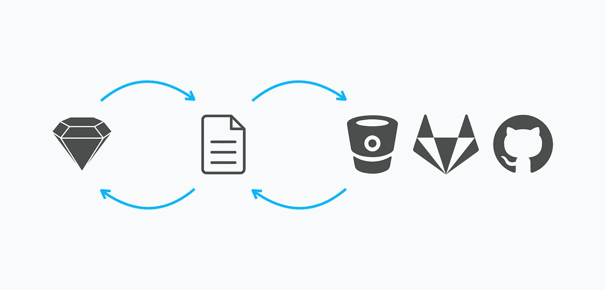
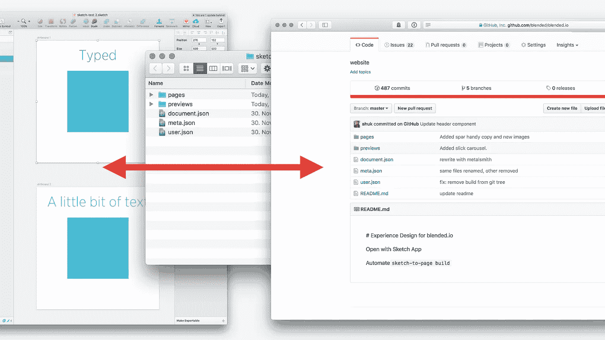
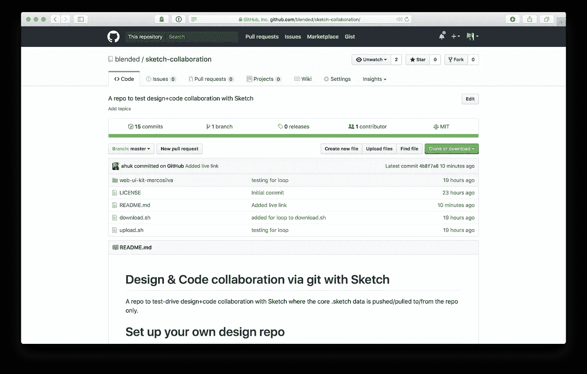
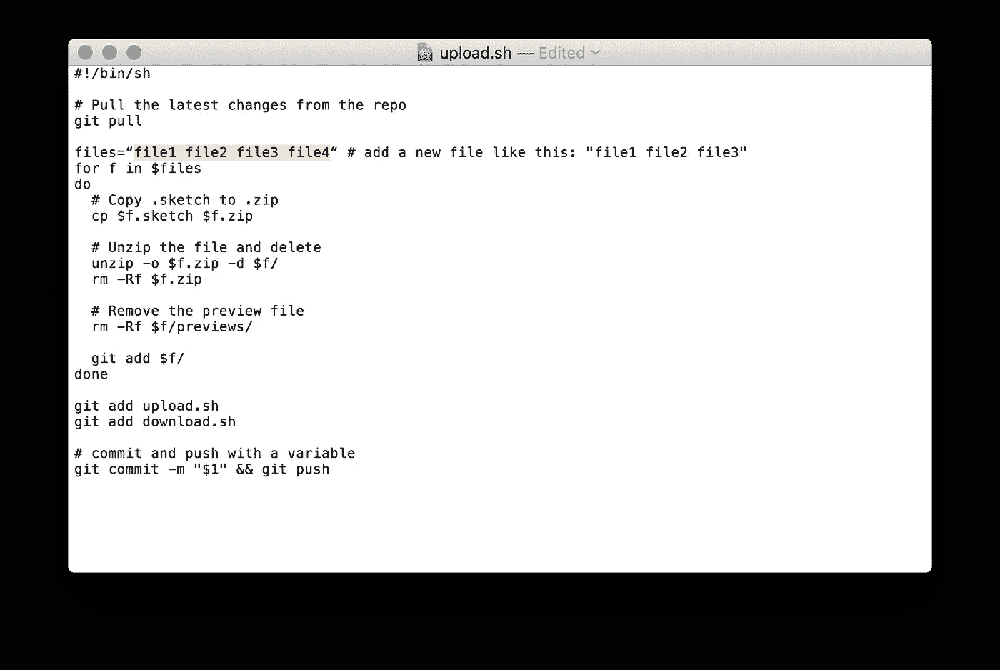
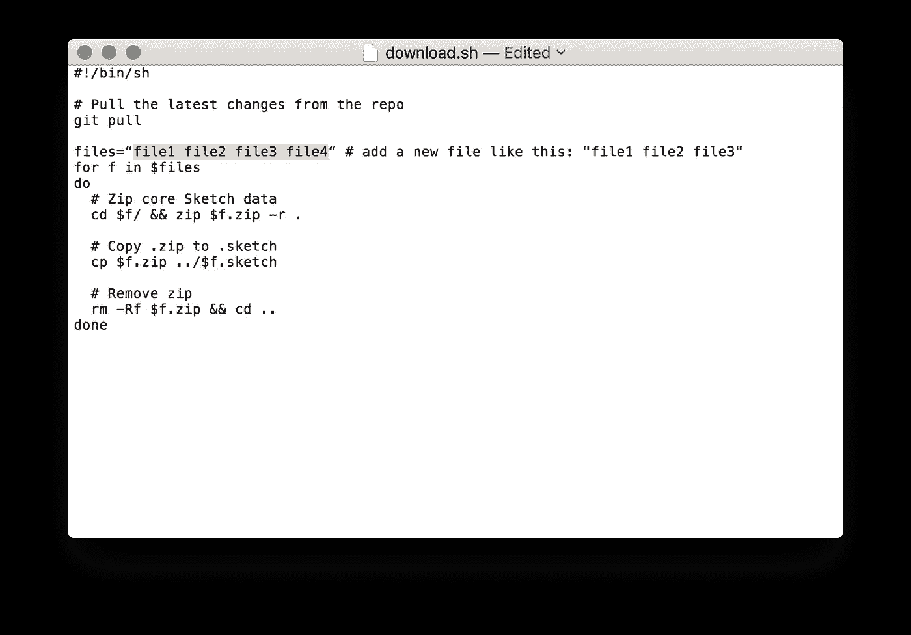

# 真正的草图设计版本控制和协作终于来了

> 原文：<https://medium.com/hackernoon/true-collaboration-via-git-and-sketch-a3ef60225ee3>

通过 Dropbox、box、iCloud、Sync 分享文件已经是过去式了。

就在 Sketch 43 推出的前一天，我发表了文章[设计即代码，代码即设计](https://blog.blended.io/with-sketch-43-design-is-code-code-is-design/)。这篇文章涵盖了开放格式对设计职业的意义和暗示。自从写了这篇文章，我一直在思考团队在将开放格式作为他们设计工作流程的一部分时会面临的挑战。

最让我感兴趣的是现在**的开放格式有多实用。**

( **Pssst:** blended.io 将推出两个工作坊:[版本控制草图给有技巧的设计师&设计团队](http://blended.io/sketch-workshop.html?ref=medium)和 [Git 给了不起的设计师](http://blended.io/git-workshop.html?ref=medium))

# **总结**

*   有了 Sketch，真正的设计文件版本化终于成为可能
*   在。草图文件及其核心数据可以很容易地自动化
*   为了找到最小公分母，我们决定使用脚本来推和拉数据
*   您不需要了解太多关于 Git 的知识来应用工作流
*   如果你偶尔使用 Mac 的终端，工作流程会很顺畅

# 我们的目标

将 Sketch 集成到基于 Git 的版本化工作流中，同时让非技术人员尽可能简单地使用它(在这里阅读好处)。

*   步骤 1:了解新的草图文件格式
*   步骤 2:使用 Git 平台跨草图文件进行协作

让我们来看看细节。

***第一步:*** *了解新草图文件格式*

如最初的[设计是代码&代码是设计文章](https://blog.blended.io/with-sketch-43-design-is-code-code-is-design/)中所述，草图现在允许获取视觉效果背后的数据。我们得到了什么:拉开拉链。草图文件包含所有布局的小预览图像和 JSON 数据(以及一些用户和文档相关数据)。pages 文件夹为每个页面包含一个 JSON 文件。这些 JSON 文件包含 Sketch 中设计的每个元素的数据。此外。草图文件包含所有图像资源的原始大小的图像。

关于提取或创建. sketch 文件，有几点需要注意

*   不需要预览文件夹和预览图像。素描到工作
*   为了拉链。为了工作，必须确保只压缩文件本身，而不压缩它的父文件夹(听起来很明显，是的，我被困过几次)

***第二步:*** *使用 git 平台与草图协作*

(正确)通过 Github 或 Gitlab 的协作要求数据是人类可读的(也称为文本文件),而不是二进制格式。矢量数据以 JSON 的形式出现，这有利于版本控制。所有的二进制图像也包括在内，这对版本控制不是很好。明确地说，版本控制也适用于二进制文件。不同之处在于，在版本化的二进制文件中，整个文件将与每个版本一起存储。对文本文件应用版本控制时，只会记录差异更改。这种机制保持回购规模较小，并保持速度。

尽管在存储库中存储二进制文件并不好，但是存储原始图像也不是那么糟糕:当添加图像时，存储库中会记录第一次“更改”,当删除图像时(最多。两个记录的)。其间的所有更改都只是对原始源文件的引用，因此源文件不会被一次又一次地存储。预览图像确实不断变化，因此，我们决定删除它。

# 触及本质

让我们使用 Github 作为我们想象中的设计师(和开发人员)团队的协作平台。

我们首先有两个问题:

*   我们必须把数据从。先素描，然后才能存到 Github 上。
*   从 Sketch 中的 CMD+S 到上传到 Github 的整个过程并不简单(截至目前)。我们必须自动化这些步骤，以便为设计师启动或增加基于回购的工作流的采用。

概念性的工作流程如下

*   设计师对草图文件进行修改，执行 CMD+S(保存)并将草图数据上传到 Github。
*   然后，任何其他设计人员下载最新状态，打开草图文件并继续他们的工作。

基于 Sketch 现在为我们提供的功能，实际的基础骨骼工作流程如下所示:

*   设计人员对草图文件进行更改，执行 CMD+S(保存)并执行终端命令`$ sh upload.sh "message"`(从 repo 中)，以便将更改提交并推送到 Github。
*   任何其他设计者执行终端命令`$ sh download.sh`(从 repo 中)，以便下载最新状态并继续她的工作。

# 如何共享草图文件

上传脚本从文件中提取核心草图数据。绘制草图，然后只上传(提交和推送)核心数据(加上第一次推送时脚本)。核心数据是在 Github 上发布的，因此，我们不需要原始数据。草图文件。这只会阻碍回购，降低速度。

下载脚本从 repo 中提取所有新数据，然后创建草图文件。可以使用 Sketch.app 打开的草图。

您可以像这样执行脚本:

*   打开 Terminal.app (CMD+Space >键入“终端”)
*   在终端中键入 cd，然后将 repo 文件夹从 Finder 拖放到终端窗口中。现在文件路径将出现在 cd 后面，中间有一个空格。点击回车键，你将直接进入存储库文件夹。
*   键入`sh upload.sh "message"`或`sh download.sh`。必须添加一条消息，否则`$1`将被用作(提交)消息文本。

# 如何建立新的设计储存库

*   从 Github 下载(或克隆)repo (直接下载)
*   提取回购 zip 并删除所有。草图文件和文件夹，添加您的。草图文件
*   在文本编辑(或任何其他文本编辑器)中打开脚本`upload.sh`和`download.sh`，将不带扩展名`.sketch`的文件名添加到`""`中，就像这样`files="filename1 filename1"`。保存两个脚本。
*   请参阅上面关于如何执行脚本的内容

How to add Sketch files into the file upload.sh script.

How to add Sketch files into the file download.sh script.

为了让你测试一下这个工作流程，你会在[Github.com](https://github.com/blended/sketch-collaboration)上找到整个回购以及两个脚本， [upload.sh](https://github.com/blended/sketch-collaboration/blob/master/upload.sh) 和 [download.sh](https://github.com/blended/sketch-collaboration/blob/master/download.sh) 。

**优点**

*   能够将你在 Sketch 中看到的每一个视觉核心的数据版本化是非常棒的！
*   设计师不太了解 Git 和终端，无法使用工作流
*   像 Github 或 Gitlab 这样的协作平台已经被广泛传播和使用
*   设计人员和开发人员使用相同的平台(设计人员将了解更多关于 Git 和代码工作流的知识)
*   可以安全地托管数据，而不需要使用过多的存储系统，这些系统本来就不是为设计协作而设计的
*   脚本处理主文件夹中的 1 个以上草图文件
*   设计师终于可以摆脱像`file1.sketch1, file2.sketch, …, file12.sketch, file12-final2.sketch etc`这样的命名惯例了

**缺点**

*   这个过程还不容易使用，我的意思是，真的不容易使用
*   必须使用终端或者点击运行的完整可执行文件(访问我们的朋友 [@tower](https://twitter.com/gittower) 的[终端 101](https://www.git-tower.com/learn/git/ebook/en/command-line/appendix/command-line-101)
*   草图文件名必须手动添加到脚本中
*   当有人从 Github 下载最新的修改时。草图文件将被覆盖。因此，建议在下载之前关闭 Sketch 中的文件
*   草图文件名不得包含空格，因为这会破坏脚本

# 要改进什么

我知道我们可以使用 Githooks，一个 NodeJS 文件监视器或一个 Sketch 插件来简化上面的实际过程(我很高兴听到你的反馈和建议)。我确实选择构建一个脚本，因为它允许我们测试最小公分母。简单的工作流程对于非技术人员使用 repos 进行设计工作至关重要。在终端中使用脚本并不是自切片面包以来最伟大的事情，因此这个过程和工作流程需要改进一点来简化。此外，应该禁用自动保存，因为它可能会覆盖新提取的数据。

我非常确信上述的基本原则是正确的。现在，我们必须想出进一步简化工作流程的方法。请联系我们，讨论如何实现这一目标。

特别感谢 [Kristina @kriesse](https://twitter.com/kriesse) 阅读了这篇文章的草稿。

**感谢阅读。**我们在 [blended.io](https://www.blended.io/?ref=medium) 对 fintech、investtech 和 industry 4.0 中软件设计和工程的潜在创新飞跃感到无比兴奋和热情。[取得联系！](http://www.blended.io/contact.html?ref=medium)

## 保持在边缘

[获取关于创新、体验设计或工程的实用文章](https://confirmsubscription.com/h/t/3BFD03FDC169B5FE)！没有垃圾邮件和有价值的内容**只有**。

**更新:**参见[这篇文章和 Mac 版的伟大工具](/kactus-io/unlocking-true-collaboration-around-design-f844527220cb)了解我在终端中描述的细节。

( **Pssst:** blended.io 将推出两个工作坊:[版本控制的熟练设计师草图&设计团队](http://blended.io/sketch-workshop.html?ref=medium)和 [Git 给了不起的设计师](http://blended.io/git-workshop.html?ref=medium)

*原载于 2017 年 6 月 15 日*[*blog . blended . io*](https://blog.blended.io/how-to-use-sketch-with-git-the-right-way/)*。*

> [黑客中午](http://bit.ly/Hackernoon)是黑客如何开始他们的下午。我们是阿妹家庭的一员。我们现在[接受投稿](http://bit.ly/hackernoonsubmission)并乐意[讨论广告&赞助](mailto:partners@amipublications.com)的机会。
> 
> 如果你喜欢这个故事，我们推荐你阅读我们的[最新科技故事](http://bit.ly/hackernoonlatestt)和[趋势科技故事](https://hackernoon.com/trending)。直到下一次，不要把世界的现实想当然！

