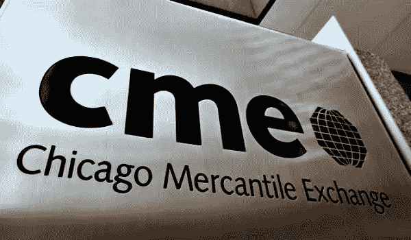

# 真正的投资者采用:芝加哥商业交易所集团将于 12 月开始比特币期货交易

> 原文：<https://medium.com/hackernoon/true-investor-adoption-cme-group-to-begin-bitcoin-futures-trading-by-december-44266f8ac79c>

大新闻:比特币可能很快会进入衍生品市场。

今天早些时候在美国消费者新闻与商业频道，CME 集团董事长兼首席执行官特里·达夫(Terry Duff)表示，最近宣布的比特币期货产品可能在下个月内开始交易。事实上，他表示，正式交易最早可能在 12 月的第二周开始。

> “我想在 12 月第二周的某个时候，你会看到我们的合同上市，”他告诉网络。

去年 10 月宣布的这条标题在比特币社区引起了轩然大波，当时它透露，芝加哥商业交易所集团(CME group)正在寻求监管批准，以在今年某个时候上市其首款比特币相关产品。事实上，这一乐观消息在当时引起了比特币价格的大幅上涨，使其价值从 6000 美元飙升至 10 月 31 日的 7000 多美元。

在采访中，达菲还就 CME 将如何应对比特币价格的大幅波动提出了见解。在他的评论中，他建议 CME 可以在价格大幅波动的情况下停止交易，并在价格大幅下跌的情况下采取具体措施。

> “听着，当有人对我说，‘价格趋于零，你打算怎么办？’“我不会让它归零，”他解释道我要实现一些东西。如果市场急剧下跌，我们将停止交易，如果我们认为一个产品正在消失，我们有多头，我们有空头，我们将匹配他们的价格，这就是我们今天的规则。"

**结论**

感谢你花时间阅读这篇文章，我希望你真的喜欢它。如果您发现这很有价值，请不要忘记点击👏按钮！也可以随时分享我的内容！

在所有社交媒体平台上关注@ TheCoinEconomy，了解加密货币市场和区块链科技发展的最新动态。( [TradingView](https://www.tradingview.com/u/thecoineconomy/) ， [Twitter](https://twitter.com/thecoineconomy) ， [Instagram](https://www.instagram.com/thecoineconomy/) ，[脸书](https://www.facebook.com/Thecoineconomy-353316841786257/)，[stock wit](https://stocktwits.com/TheCoinEconomy)s .)