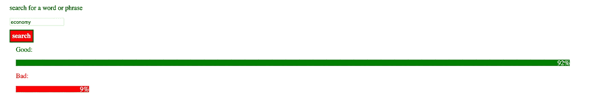
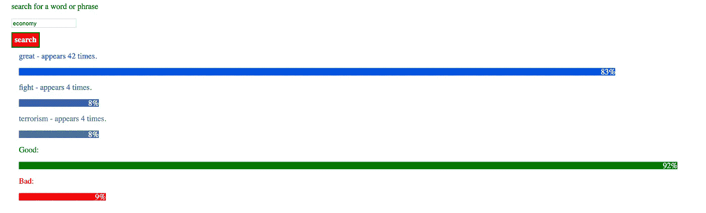

# 特朗普说什么？！？！(解析和搜索 JSON 数据)

> 原文：<https://medium.com/hackernoon/trump-said-what-parsing-and-searching-json-data-529634020e61>


不管您处于哪个行业，解析和搜索 JSON 数据的能力都非常强大。在下面的例子中，我将回顾以下与 JSON 数据相关的概念:

1.  创建一个 JSON 文件。
2.  在 Mongo 数据库中在线保存 JSON 文件。
3.  通过 fetch API 调用检索数据。
4.  搜索数据以查找与特定搜索词匹配的项目。
5.  返回匹配数据。
6.  基于返回的数据创建简单的数据可视化。

我们想要做的是，给定一个文档集合，我们想要对它们进行排序，并找出某个字符是否出现在任何文档中。如果它确实出现在文档中，我们希望搜索该文档，计算它出现的次数，并返回计数。

这是一个如此有用的工具的原因是，想象一下，如果你有一个政治家的演讲集。你可以快速地对它们进行分类，看看它们说某些单词的频率。或者更好的是，我们可以同时对多个单词进行排序，看看哪些单词出现得最频繁。

我们可以对我们想要的任何类型的文档或文档集合做同样的事情，并且可以成为非常有用和强大的工具。好吧，那我们开始吧。在这个例子中，只是为了解释这些概念，我将使用我整理的一些 JSON 数据，以及唐纳德·特朗普最近的几次演讲。然后我们可以搜索一下，发现某些话题在他的演讲中出现的频率。

我已经完成了一个工作原型，你可以看看我的基本最终目标是什么。你可以在这里查看:

[https://trumpspeechdata.herokuapp.com/](https://trumpspeechdata.herokuapp.com/)

步骤 1:获取干净的 JSON 数据。

下面是干净的 JSON 数据的链接。如果您愿意，可以下载它，也可以在您自己的 JavaScript 项目中使用它。但是在接下来的步骤中，我将展示如何通过 Mlabs 将它联机到 Mongo 数据库。如果您更愿意在本地处理文件，那么就跳过下面的步骤。

[](https://www.dropbox.com/s/u4vuwazx609uvvw/trumpspeeches.json?dl=0) [## trumpspeeches.json

### Dropbox 是一项免费服务，可以让你将照片、文档和视频带到任何地方，并轻松分享。从不发电子邮件…

www.dropbox.com](https://www.dropbox.com/s/u4vuwazx609uvvw/trumpspeeches.json?dl=0) 

第二步:建立一个 MLABS 账户。

1.  在这里设置你的账户:[https://mlab.com/login/](https://mlab.com/login/)
2.  创建新的数据库。
3.  创建新收藏。
4.  向数据库添加用户。
5.  使用以下命令将文件导入集合:`mongoimport -h ds<database-number>.mlab.com:<database-number> -d signatures -c <collection> -u <user> -p <password> --file <input file>`

一旦你设置好你的账户，你会在“工具”标签下看到更多关于这个步骤的详细说明。

步骤 3:开始一个新的 HTML/JAVASCRIPT 项目。

我们的 HTML 将非常简单。我们需要的只是一个输入字段、一个提交按钮和一个显示结果的 div。这是我的样子:

```
<!DOCTYPE html>
<html><head>
  <meta charset="utf-8">
  <title>The Talk Maker</title>
  <link rel="stylesheet" href="/login.css">
  <link href="[https://fonts.googleapis.com/css?family=Volkhov](https://fonts.googleapis.com/css?family=Volkhov)" rel="stylesheet">
  <script src="[https://ajax.googleapis.com/ajax/libs/jquery/3.2.1/jquery.min.js](https://ajax.googleapis.com/ajax/libs/jquery/3.2.1/jquery.min.js)"></script>
</head><body><label>search for a word or phrase</label>
<input id="input" />
<buton id="button">search</button><div id="results"></div></body></html>
```

我包含了一个 jquery 的链接，因为我们可能会在其中加入一些内容。这里最重要的是、 

第四步:JAVASCRIPT

最佳实践是在我们的程序中有一个单独的 JS 文件。如果你愿意，你也可以把它放在头部的一个

```
let input = document.getElementById('input');
let button = document.getElementById('button');
button.onclick = searchAPI;
```

searchAPI 将是我们调用 fetch 的函数的名字。看起来会像这样:

```
function searchAPI() {fetch('https://api.mlab.com/api/1/databases?apiKey=myAPIKey[').then(function(response)](https://api.mlab.com/api/1/databases/trumpsays/collections/trumpspeeches?&l=41000&apiKey=_ehmfqV-bs1PDWki2WNFVMsGmXGQuk77').then(function(response)) {
          if (response.status != 200) {
            window.alert("Sorry, looks like there's been an error" + response.status);
            return;
          }response.json().then(function(data) {let api = data;
          })
        })
      }
```

由于我们上传了将要使用的文件到 Mlab，现在我们需要检索这些数据。因为它都在我们导入的一个文件中，在一个集合中，我们的获取 url 看起来与上面类似，但是集合和文件名特定于您的特定数据库。如果你的 URL 不能正常工作，你可以在这里找到检索数据的 mLab 文档:【http://docs.mlab.com/data-api/#base-url 

现在，我已经启动了 fetch 之后的函数，我们将开始解析我们的数据。我已经将变量 api 设置为等于数据。接下来，我们需要开始访问我们想要的数据。现在，我想做几件事。

1.  我想搜索一个单词，并计算它在文档中出现的次数。比如，在特朗普的这些演讲中，我可能想搜索任何标题中带有“经济”的演讲，然后在那些演讲中，统计他提到“中产阶级”的次数。
2.  其次，我将创建一个可以在任何文档中跟踪的常用单词数组。例如，我的数组可能包含:

```
["middle class", "poverty", "economy", "taxes", "deficit"]
```

我想对这个数组做的是(我们可以把它做得尽可能长，尽可能复杂),假设我们正在搜索关于经济的演讲，我们想量化，不仅仅是我们搜索的单词，还可以用数组中的任何单词来测试那个演讲。这样，它不仅会计算搜索单词的出现次数，还会计算每个单词的出现次数，这样我们就可以知道每个演讲中哪些主题是最重要的。

这是另一种方法，可能也很有用。我们可以有两个数组。一个类似这样的数组:

```
["good", "happy", "prosperity"]
```

第二个数组对应的词是:

```
["sad", "bad", "poverty"]
```

有了这两个数组，我们可以浏览每篇演讲，看看每个数组中的哪些单词出现得最频繁。这将让我们知道这些演讲的前景是积极的还是消极的。

为了完成所有这些，我将在 fetch 之后执行一个 for 循环。然后我将在我的 for 循环中有一系列的数组来测试。一个数组用于我想测试它们出现频率的单词，第二个数组用于“好”单词，第三个数组用于“坏”单词。然后，在 for 循环之外，我将有几个空数组，稍后我将把匹配的数据推送到这些数组中，这样我以后就可以使用它们了。现在我们清楚了我们想要做什么，让我们写伪代码，然后把它分解成可管理的块。下面是我的伪代码的样子:

```
function searchAPI() {fetch('https://api.mlab.com/api/1/databases?apiKey=myAPIKey[').then(function(response)](https://api.mlab.com/api/1/databases/trumpsays/collections/trumpspeeches?&l=41000&apiKey=_ehmfqV-bs1PDWki2WNFVMsGmXGQuk77').then(function(response)) {
          if (response.status != 200) {
            window.alert("Sorry, looks like there's been an error" + response.status);
            return;
          }response.json().then(function(data) {let api = data;array A = [empty array to hold matched words pushed from for loop];
array B = [empty array to hold "good" words pushed from for loop];
array C = [empty array to hold "bad" words pushed from for loop];**for ( for loop to map through api) {**array 1 = [array that holds the words we want to find]
array 2 = [array to hold good words to test for]
array 3 = [array that holds bad words to test for]//--We'll need to create some "if" statements hereif(the document contains the word we searched for){search the document for additional words from array 1 
push matching words to array Asearch the document for words in array 2
push matching words to array B
search the document for words in array 3
push matching words to array C}**function A = function that compares the results of an array and give us a count**run array A through function A.
run array B through function A.
run array C through function A.compare results of array B and C, and see which one is bigger.see results from array A, and see which word appears most.} })
        })
      }
```

好了，现在我们在伪代码上有了一个好的开始，让我们开始把它放到一些实际的代码中。以下是我所做的，但你可能会提出更好的解决方案。

```
let matchedFrequentWords = [];
            let totalBadWords = [];
            let totalGoodWords = []; for (var i = 0; i < api.length; i++) { **let inputValue = input.value; 
//we'll include this in our initial if statement.** let frequentWords = [ "america", "great", "republican", "democrat", "fight", "wall", "terrorism"];              let goodWords = ["good", "happy", "great", "happiness", "love", "win", "success"]; let badWords = ["bad", "sad", "terrible", "sadness", "hate", "fail", "unsuccessful"]; }
```

在 for 循环中，我将从一个函数开始，比较文档中的单词和坏数组中的单词，然后是好数组。我的想法是，我需要一个 if 语句，来检查并查看文档是否包含我要搜索的内容。然后，在 if 语句中，我将执行两个 for 循环，一个嵌套在另一个中。第一个循环遍历整个文档，第二个循环遍历“good”数组，任何匹配的元素，我都将从 for 循环的开头推入“totalGoodWords”数组。为此，由于演讲的文本是一个很长的字符串，我想把它分解成单个的单词，然后把每个单词放入一个数组中，这样我就可以更容易地循环。我可以用“分割”的方法，用一个空格作为分割。这基本上会将字符串转换为逗号分隔的值，单词之间的每个空格都用逗号替换。然后，我将遍历该数组，而不是遍历原始文本。然后，如果有匹配，我们按什么？我们的 JSON 数据包括演讲标题、演讲日期、演讲地点以及演讲文本。如果有匹配，我们将把 JSON 数据的每个元素放入我们的数组，这样以后我们不仅可以比较一个单词出现的频率，还可以比较某些主题在某些地点或某些日期是否更常见。请记住，这只是一个小测试，有 4 个演讲，如果我们使用更多的数据，我们的结果会更好，更准确。这是我想到的:

```
if(api[i].text.indexOf(**inputValue**) > -1) {
                    let stringX = api[i].text.split(" ");
              for (var j = 0; j < badWords.length; j++) {
                for (var k = 0; k < stringX.length; k++) {
                  if (badWords[j] == stringX[k]) {
                    totalBadWords.push([
                      api[i].speechtitle,
                      api[i].speechdate,
                      api[i].speechlocation, ])
                            }
                          }
                        }
                      }
```

让我们回顾一下这里发生了什么。我们将在 HTML 中搜索一个术语。例如，我们可能会搜索“经济”。然后，我们用[i]遍历 API 中的所有文档。如果[i]包含字符串“economy”，我们将把整个文本拆分成一个单词数组，然后循环遍历数组[k]，再循环遍历 badWords [j]，找到所有匹配的单词。如果有匹配，我们将回到最初的循环，[i]，并推送演讲标题、演讲日期和演讲地点。记住，我们要找的是“情绪”。演讲的情绪是积极还是消极。因为我们有日期、标题和地点信息，我们应该能够说出演讲的情绪，然后看到在哪些日期这些演讲的“语气”是好是坏，以及在哪些地点有更积极或否定的语气。我们将对我们的“现在好的阵列:

```
if(api[i].text.indexOf(**inputValue**) > -1) {
                    let stringX = api[i].text.split(" ");
              for (var j = 0; j < goodWords.length; j++) {
                for (var k = 0; k < stringX.length; k++) {
                  if (goodWords[j] == stringX[k]) {
                    totalGoodWords.push([
                      api[i].speechtitle,
                      api[i].speechdate,
                      api[i].speechlocation,])
                            }
                          }
                        }
                      }
```

现在，因为我们还想测试 for 循环中第一个数组中的所有单词，所以我们基本上再次使用相同的代码，但是是针对我们的 frequentWords 数组。然而，我们不会推送标题日期和位置，而是只会推送匹配到的频繁单词，因为我们真正想知道的是哪个单词出现得最频繁。

```
if(api[i].text.indexOf(inputValue) > -1) {
let stringX = api[i].text.split(" ");
   for (var j = 0; j < frequentWords.length; j++) {
     for (var k = 0; k < stringX.length; k++) {
        if (frequentWords[j] == stringX[k]) {
            matchedFrequentWords.push([
                 frequentWords[j]
                    ])
                   }
                 }
               }
             }
```

所有这些函数都在我们原来的 for 循环中。现在，我们出去，在 for 循环下面，创建一个函数。我们要做的是创建一个比较所有条目的东西，并返回条目，以及它在数组中的出现频率，或者它出现的频率。我在 StackOverflow 上发现了一个很棒的函数，它就是这么做的。下面是:

```
Array.prototype.byCount= function(){
              var itm, a= [], L= this.length, o= {};
              for(var i= 0; i<L; i++){
                itm= this[i];
                if(!itm) continue;
                if(o[itm]== undefined) o[itm]= 1;
                else ++o[itm];
              }
        for(var p in o) a[a.length]= {item: p, frequency: o[p]};
              return a.sort(function(a, b){
                return o[b.item]-o[a.item];
              });
            }
```

现在，我们想通过这个函数来传递我们放入的数组，从而得到一个结果。我们将结果存储为一个变量，以便以后可以访问它。我们会这样做:

```
let frequentWordCount = matchedFrequentWords.byCount();let badWordCount = totalBadWords.byCount();let goodWordCount = totalGoodWords.byCount();
```

此时，甚至更早，在控制台日志中不断检查我们的输出是一个好主意，以确保我们得到了我们期望的结果。

在我的搜索中，我正在测试它，搜索任何包含“经济”一词的演讲。

如果一切正常，并且您拥有与我使用的相同的数组和数据，那么 frequentWordCount 的输出应该如下所示:

1.  0:{item:“太棒了”，频率:42}
2.  1:{item:“战斗”，频率:4}
3.  2:{item:“恐怖主义”，频率:4}
4.  3:{item:“墙”，频率:1}

这告诉我们，在所有的演讲中，“伟大”出现了 42 次，“战斗”出现了 4 次，“恐怖主义”出现了 4 次，“墙”出现了 1 次。我们搜索的其他项目根本没有出现。

badWordCount 的输出应该如下所示:

1.  0:{item:“特朗普总统于 2017 年 2 月 28 日在国会参众两院联席会议上的讲话”，频率:3}
2.  1:{item:“特朗普总统关于税收改革的言论，2017 年 9 月 5 日，密苏里州斯普林菲尔德”，频率:2}
3.  2:{item:“特朗普总统谈巴黎气候协议，2017 年 6 月 1 日，玫瑰园”，频率:2}

这告诉我们，在第一次演讲中，在我们使用的所有坏词中，它们只出现了 3 次，在另外两次演讲中各出现了 2 次。让我们将其与 goodWordCount 的输出进行比较，它应该类似于:

1.  0:{item:“特朗普总统在税改活动上的讲话，2017 年 9 月 28 日，印第安纳州农业局大楼”，频率:26}
2.  1:{item:“特朗普总统 2017 年 2 月 28 日在国会参众两院联席会议上的讲话”，频率:25}
3.  2:{item:“特朗普总统关于税收改革的言论，2017 年 9 月 5 日，密苏里州斯普林菲尔德”，频率:14}
4.  3:{item:“特朗普总统谈巴黎气候协议，2017 年 6 月 1 日，玫瑰园”，频率:12}

这让我们看到，至少这四篇演讲的“基调”或“情绪”似乎是积极的多于消极的。同样，显然，如果我们有更多的演讲，我们的数据会更好，但这只是一个简单的测试。

现在，我要努力找出好词和坏词的百分比，这样我就可以比较一下，看看这些演讲是更积极还是更消极。我将把数组中的频率值放入一个数组中以获得总和，然后将好的总和与总和进行比较，将差的总和与总和进行比较。我是这样做的:

```
let goodNumbers = [];
    for (var i = 0; i < goodWordCount.length; i++) {
      goodNumbers.push(goodWordCount[i].frequency);
    }let badNumbers = [];
    for (var i = 0; i < badWordCount.length; i++) {
      badNumbers.push(badWordCount[i].frequency);
    }function getSum(total, num) {
    return total + num;
    }let goodSum = goodNumbers.reduce(getSum);
    let badSum = badNumbers.reduce(getSum);
    let totalSum = goodSum + badSum;let goodPercent = (Math.ceil((goodSum / totalSum) * 100));
let badPercent = (Math.ceil((badSum / totalSum) * 100));
```

我们现在应该知道好词的百分比和坏词的百分比。我的输出是这样的:

良好百分比= 92%

bad percent = 9%；

(我用的是 Math.ceil，所以他们四舍五入到最接近的整数，因为原因)。

同样，更多的数据会有所帮助，但由于我们最初搜索的是经济，我们可以说，“关于涵盖经济的演讲，特朗普大约 92%乐观。”如果我们有大量的演讲，这可能会非常有用，我们可以搜索“平等”、“女权”、“堕胎”等，看看他的乐观情绪是否改变，或者演讲的情绪在某些主题上是好是坏。现在，我们可以做的另一件很酷的事情是用条形图表示数据。为此，我们将使用反斜线创建一个变量，然后将其插入到 innerHTML 结果 ID div 中。

基本上，我们要做的是创建一个新的 div 元素。我们将使用内联样式，因为这个元素是在 JavaScript 中动态创建的。我们将定义它的颜色和高度。然后，我们将通过变量“goodPercent”定义宽度，这将为我们刚刚解析的数据创建一个漂亮的可视化表示。这在 JavaScript 中是这样的:

```
let goodBarGraph = `
        <div class="dataSubLabel" style="color:green">Good:</div>
        <div style="padding-left:50px;background-color:green;color:white;display:flex;flex-direction: row;justify-content:flex-end;align-items:center;height:15px;width:${goodPercent}%;">${goodPercent}% </div>
    `;
    let badBarGraph = `
        <div class="dataSubLabel" style="color:red">Bad:</div>
        <div style="padding-left:50px;background-color:red;color:white;display:flex;flex-direction: row;justify-content:flex-end;align-items:center;height:15px;width:${badPercent}%;">${badPercent}% </div>
    `
    document.getElementById('results').innerHTML += goodBarGraph;
    document.getElementById('results').innerHTML += badBarGraph;
```

我们的整个 goodBarGraph 变量都用反斜线括起来，除了两件事。我们已经在${}中隔离了 witdth 值，并在第二个 div 中隔离了相同的变量。我们对 badBarGraph 做了同样的事情，然后将这些变量放在我们的“results”div 的 innerHTML 中。如果我们做得正确，我们可以看到类似这样的内容:



看到这一点，我们可以做同样的事情，但按演讲或按年份或按地点来划分。根据我们的 JSON 对象的复杂程度，我们可以粗略地计算出“好”或“坏”，并以许多有趣的方式将其分解。很酷吧？好吧，现在我们退一步。我们有很好的数据告诉我们某些词的使用频率。让我们用这些数据做一些有趣的事情。这个原理和我们已经做的差不多，但是同样，我们可以得到一些真正令人兴奋的结果，我们给我们的函数提供的数据越多。为了让我们的可视化工作，我们还需要将数据转换成百分比，这样我们就可以更准确地显示它。我们可以这样做:

```
function getSum(total, num) {
    return total + num;
    }let frequentWordTotal = [];
    for (var i = 0; i < frequentWordCount.length; i++) {
      frequentWordTotal.push(frequentWordCount[i].frequency);
    }let frequentSum = frequentWordTotal.reduce(getSum);let word1Percent = (Math.ceil((frequentWordCount[0].frequency / frequentSum) * 100));
    let word2Percent = (Math.ceil((frequentWordCount[1].frequency / frequentSum) * 100));
    let word3Percent = (Math.ceil((frequentWordCount[2].frequency / frequentSum) * 100));
```

现在，如果一切正常，我们的单词 1 百分比将是大约 83%，单词 2 百分比应该是大约 8%，我们知道这是大致准确的，给定我们之前检索的数据，因为我们知道单词 1，“great”出现了 42 次，单词 2，“fight”出现了 4 次。因此，我们也可以用另一个简单的条形图来显示这些数据。这在 JavaScript 中可能是这样的:

```
let wordGraph = `
    <div class="dataSubLabel" style="color:#0056e0">${frequentWordCount[0].item} - appears  ${frequentWordCount[0].frequency} times.</div>
    <div style="padding-left:50px;background-color:#0056e0;color:white;display:flex;flex-direction: row;justify-content:flex-end;align-items:center;height:15px;width:${word1Percent}%;">${word1Percent}% </div><div class="dataSubLabel" style="color:#3460a8">${frequentWordCount[1].item} - appears  ${frequentWordCount[1].frequency} times.</div>
    <div style="padding-left:50px;background-color:#3460a8;color:white;display:flex;flex-direction: row;justify-content:flex-end;align-items:center;height:15px;width:${word2Percent}%;">${word2Percent}% </div><div class="dataSubLabel" style="color:#5874a3">${frequentWordCount[2].item} - appears  ${frequentWordCount[2].frequency} times.</div>
    <div style="padding-left:50px;background-color:#5874a3;color:white;display:flex;flex-direction: row;justify-content:flex-end;align-items:center;height:15px;width:${word3Percent}%;">${word3Percent}% </div>
    `document.getElementById('results').innerHTML += wordGraph;
```

这里，和前面一样，我们用前面定义的百分比变量来定义条形图的宽度。然后，我们还使用包含在我们的 wordFrequency 对象中的其他变量，不仅显示百分比，还显示实际的单词和单词计数。这是它在我们的 HTML 中的样子。



现在，一个我们没有经常使用的数据是我们实际上正在搜索的单词。使用这种格式，我们现在可以返回，计算它在 for 循环中出现的次数，然后将演讲标题放入一个数组中。然后，我们可以看到类似的数据，显示总统在何时何地最常谈到这个特定的话题。在任何情况下，这都是一个非常简单的项目，但是解析数据并看到您可能没有想到的模式会很有趣。如果您有任何问题或意见，请随时联系我们。谢谢！

[](https://www.upwork.com/freelancers/~01d8efb8f4de6e3911) [## 伊桑·贾雷尔

### 我的背景是平面设计，在过去的 10 年里，我一直在为一家公司做数码和印刷设计

www.upwork.com](https://www.upwork.com/freelancers/~01d8efb8f4de6e3911)