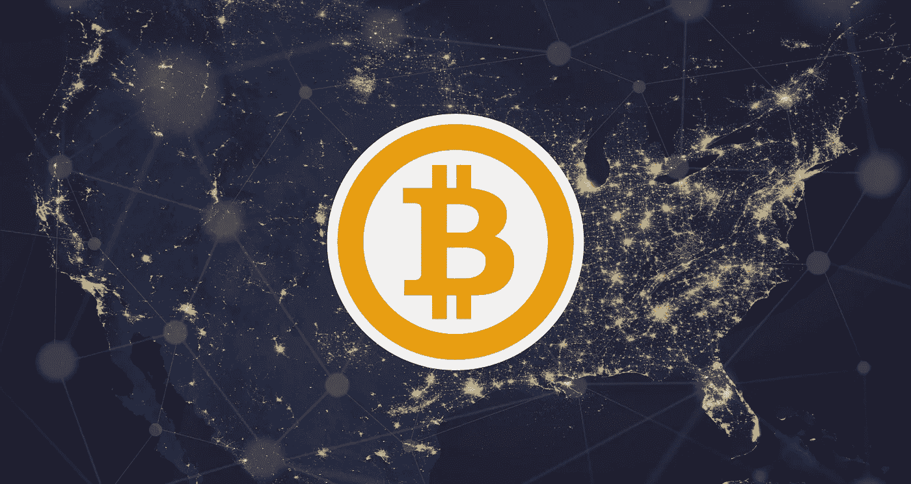
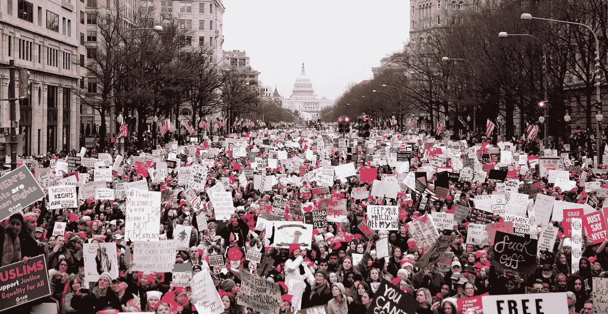

# 特朗普不会杀死美国，比特币会

> 原文：<https://medium.com/hackernoon/trump-wont-kill-america-bitcoin-will-a2be67247969>

## 我们所知的民族国家将不再存在，不是因为谁，而是因为什么——它已经存在了

*更新:基于对这篇文章的接受，我在底部嵌入的视频中详细阐述了这里探讨的一些想法和我收到的对它们的回应。看一看，分享一下你的看法。*

# **放错地方的钱**

我在 2013 年买了几个[比特币](https://hackernoon.com/tagged/bitcoins)。我是通过比特币交易所购买的，现在找不到交易记录。我搜索了旧邮件和笔记文件，想不起交易所的名字了。我担心的是现已倒闭的 Mt. Gox，它在欺诈-黑客攻击-破产三连击中“丢失”了 75 万个客户比特币。因此，我不知道如何找到这些比特币，也不知道最终发现我在哪里购买和保存它们是否值得。那时候，我每枚比特币支付大约 100 美元。当我写这篇文章时，比特币的价格接近 2400 美元，这是真金白银。我找不到真正的钱。而且，他们不会有一天突然出现。我不会在搬烘干机的时候发现它们。尽管人们都在谈论比特币的永恒性和不变性，但你很少听到有人谈论虚拟存在的事物是如何以自己的方式消失的。但是，他们有。

# **比特币是什么？**

比特币是一种货币，具体来说是一种加密货币(还有许多其他货币，其中一种或多种最终可能会比比特币得到更广泛的采用——这是早期阶段)，这意味着它是一种数字交易媒介。像美元一样，比特币既是财富的储存手段，也是促进服务和产品交易的手段。你可以使用比特币直接从印度的商店购买产品。按下一个按钮，嘣，你可以通过把比特币从你自己的钱包(电子的，而不是物理的)转移到接收者的账户来支付产品或服务。没有中间人——没有值得信任的中介——只需相对短暂的等待就能完成转账，交易费用也处于历史低位。然而，比特币之所以如此有趣，是因为它没有中央银行或政府的支持。比特币只是存在于世界上，人们赋予它们价值，一个显著增加的价值(顺便说一句，只是为了让事情变得混乱，当你提到比特币的总体协议时，比特币是大写的“B”，当你提到实际货币时，比特币是小写的“B”)。

# 关于区块链技术

比特币是由一个或一群化名为中本聪的个人创造的。它建立在一项名为[区块链](https://hackernoon.com/tagged/blockchain)的创新和颠覆性技术之上。区块链本质上是一个公共的、受密码保护的、分布在成千上万台计算机网络上的分类账。这个“数据库”包含了发生在它上面的每一笔交易的记录，并且它在不断地自我调整。这样，实际上就不可能破坏已发生的交易，因为如果有人试图改变交易记录，整个系统就会失去平衡，并立即发现不一致之处。

关于区块链技术的一大堆正面形容词包括:

*   **不可改变的**
*   **透明**
*   **经久耐用**
*   **可靠**
*   **快速**
*   **授权**

比特币是建立在区块链技术上的协议，我们所指的货币比特币是该协议的第一个应用。

# **是什么让美元变得有价值？**

你可能想知道，如果没有人和任何东西支持比特币，为什么比特币会有价值。这是一个很好的问题，你可能会首先把你引向你手中的美元。过去，美元的价值与黄金挂钩。从 1867 年到 1933 年，美国人可以用 20.67 美元兑换一盎司黄金，这直接将美元的价值与有形资产挂钩。富兰克林·罗斯福(Franklin Roosevelt)总统让美国脱离了金本位制，最终推动了《1934 年黄金储备法案》(Gold Reserve Act of 1934)，该法案允许政府用美元而非黄金支付债务。

在整个 40 年代、50 年代和 60 年代，继布雷顿森林协议之后，美国一直保持着经过修改的金本位制，布雷顿森林协议再次将美元与黄金挂钩，只是这次是每盎司 35 美元。与此同时，其他参与国的货币与黄金脱钩，并与美元挂钩。

1971 年 8 月 15 日，理查德·尼克松打破了 35 美元抵得上一盎司黄金的一贯承诺，彻底断绝了美元与黄金的联系。通过这样做，他踩下了积极货币政策的踏板，这听起来像是说他给了美联储印刷美元的全权委托。今天，美元之所以有价值，仅仅是因为理论上它们得到了美国政府的充分信任和信用的支持。我说“理论上”，是因为有理由质疑我们政府的“完全信任和信誉”有多可靠，它的支持是否有意义。美国的资产负债表已经资不抵债。我们有 3.5 万亿美元的资产，大约 23 万亿美元的负债。应用旧的数学，新的数学或者不应用数学——情况很明显，而且并不好。根据美国政府问责局(u . s . government account ability office)今年早些时候向国会提交的一份 49 页的报告，我们面临着“由收入和支出之间的结构性失衡导致的不可持续的长期财政路径”。迄今为止，我们解决财政失衡的方法一直是印刷更多的美元。到目前为止，这种方法很有效。而且，它将继续工作，直到它不工作。在那之前，美元将会有价值，因为人们认为并表现出他们有价值。

# **是什么让比特币有价值？**

像美元一样，比特币有价值，因为人们认为它们有价值。然而，与美元不同，比特币的供应量是固定的。或者更恰当地说，比特币的总数量是固定的。流通中的比特币永远不会超过 2100 万枚(目前大约有 1650 万枚)。最后一枚比特币预计在 2140 年左右进入流通。比特币不是由银行或央行铸造的，而是被开采出来的。比特币的开采是由一个预设的、可验证的、不变的算法决定的。这意味着比特币和其他类似的加密货币不受单个中央实体的控制。由于没有管理机构，比特币消除了不停开动印钞机的无处不在的诱惑，创造了货币来“解决”问题。相对于现有的法定货币，这是一个游戏规则的改变者，所有这些货币都面临着不计后果的印刷和通货膨胀的风险。

黄金作为一种有形资产，不能自由印钞，这就使它成为一种巨大的财富储存手段。然而，黄金不容易交易。你不能点击一下鼠标就把黄金转移到印度的商店。但是，你可以用比特币做到这一点。

尽管比特币最近出现波动，但它作为合法财富储存手段的全球认可、其易于交易的性质以及其固定供应可以消除法定货币的多种严重风险的事实，所有这些特征结合在一起，使比特币成为世界上第一种全球货币。

# 比特币对社会的长期影响

What does Bitcoin mean for our future?

占据全球第一全球货币的头衔，令人印象深刻。但是，比特币的遗产将仅仅是它在消除中介和降低货币兑换交易成本方面的作用吗？我认为这里还有更多。多得多。我认为，全球货币的存在为全球治理结构的彻底转变增加了一块蛋糕。人类的故事是一部不断寻求更大个人自由的故事。美国是一个在自由和民主方面惊人成功的实验。也就是说，我们没有那么自由。我们相当自由。我们没有那么民主。事实上，在很多方面，我们看起来更像一个共和国。选举团每四年选举一次总统的原因是因为国父们没有真正信任人民。我说的“人民”是指当时拥有土地的白人。开国元勋们想要一种机制来推翻地主贵族的“错误”决定。女性和非裔美国人甚至没有权利做出“错误”的决定。显然，我们开始的时候甚至没有今天这样自由和民主。回顾过去几百年的历程，记录美国人民一路赢得的自由:

*   **结束奴隶制**
*   **选举权(妇女和非裔美国人)**
*   **女性生育权**
*   **异族通婚的自由**
*   **离婚自由**
*   **同性婚姻**

当我放眼未来 100 年时，我知道我们会比今天拥有更多的自由。这些新的自由将采取什么形式？我上面提到的所有自由都是我们在自己的国土上赢得的。

> 然而，我认为我们要求地理移动的自由和成为除我们出生的国家之外的其他国家的公民的普遍自由只是时间问题。

我相信，在 100 年内，我们将看到非种子民族国家成为政治组织的主导形式。我相信比特币是朝着这个目标迈出的又一步。早期的举措包括印刷机，它释放了言论自由(具有讽刺意味的是，它在推动民族国家发展的过程中发挥了重要作用)；飞机，让我们可以在全球范围内移动；互联网促进了信息和知识的自由流动，为每个人提供了一个表达意见的平台和一种不受地域限制的创收手段。

# **民族国家的历史和核心功能**

一个民族国家是一个主权国家，有一个强大的政府，政治边界和由共同的语言，文化或其他一些共同的依恋形式团结起来的公民。民族国家目前是世界事务中最强大的参与者。

民族国家是一种现代政治现象，产生于中世纪的封建主义废墟。在封建时代，国王没有很大的权力。大部分权力被分散到封建领主、贵族阶级手中。当地人忠于当地贵族，以换取保护。随着时间的推移，国王巩固了他们的权力，最终削弱了贵族阶级的权力，并与新兴的商业阶级结盟。

随着更大的领土和不同的分布式权力模式，人们只忠于当地保护的旧备用交易所变得不那么明显，也不那么引人注目。因此，统治者出于其他原因鼓励人们忠于这个新建立的国家。因此，民族主义兴起——对自己国家的忠诚和奉献高于他人。在一个虚拟化的世界里，托马斯·弗里德曼(Thomas Friedman)的名言是“扁平的”，我觉得奇怪的是，边界定义了我们这么多的经历。国界是一条有实际后果的假想线，一条任意界定内部群体和外部群体的线。唐纳德·特朗普当选的一个主要原因是基于他的承诺，即在美国保留工作岗位——让工作岗位远离我们边境另一边的人。总的来说，我认为民族主义在这个世界上弊大于利。它强调差异，而不是强调共同点。我相信，随着时间的推移，边界将变得越来越无关紧要。原因有两个。首先，尽管展望未来可能具有挑战性，但你可以指望它提供比我们今天更大的个人自由。其次，国界的独特好处正在迅速减少，而其成本却在增加。

# **民族国家霸权的衰落**

> 政治理论家普遍认为，民族国家在历史上存在有四个主要原因——枪支、金钱、土地和部落。

倒过来看这些原因，因为它们与美国有关，在一个快速移动的虚拟世界中，部落越来越不重要。展望未来，人们在网上建立的联系很可能至少和面对面建立的联系一样牢固。打我！Hello Pal、Wakie 和 Airtripp 等应用的价值定位是连接陌生人，尤其是生活在不同国家的陌生人。美国早就不再是一个由小社区组成的国家了。75%的美国人口生活在城市地区。自 1820 年以来，这一比例一直在攀升。纽约市有 850 万居民，人口大约是邓巴的 56667 倍。越来越多，我们生活在密集的匿名。

作为一个国家，我们是如此的分散，在政治和文化上也是如此的分裂，以至于美国作为一个部落的想法是可笑的。当然，我们每四年都会集体为美国女子足球队加油，尽管我们之间的纽带一天比一天松。世界各地的情况都一样。

至于土地，已经不那么国家的事情了。首先，人们正在离开美国，他们移民并选择在其他国家生活。在过去的十年中，生活在国外的美国出生人口的比例显著增加。与此同时，放弃美国国籍的人数激增。2008 年，227 名公民放弃了他们的公民身份。2016 年，5409 名公民这样做了(最后一个季度有 2364 人弃船，也许特朗普会杀了美国！).虽然这些数字相对较小，但趋势是强劲而明显的。与此同时，我们越来越多的土地被外国人占据和拥有。外国出生的美国人口比例一直在上升，从 1980 年到 2010 年翻了一番。本届政府正试图降低这一比例，尽管它们不太可能产生重大的长期影响。而且，他们不会努力阻止外国人购买美国房地产。美国有动机允许外国购买美国资产，因为这代表着财富转移到我们的边境。几十年来，这种趋势一直很强劲。诚然，土地不仅仅是在我国境内提供土地。事实上，美国提供了强制执行所有权利益的法律规则，以及一种系统化的授予所有权和记录不动产利益的方法。对于这个角色，我们也不再需要山姆大叔了。格鲁吉亚共和国最近成为第一个通过区块链登记土地所有权的政府，这项任务非常适合这项技术。关于这一里程碑的更多信息，请查看福布斯文章。

这就把我们带到了民族国家的第三个核心功能——货币。作为世界上第一种全球数字货币，比特币预示着全球贸易的新时代。一个不需要中央银行和民族国家政府的未来，这是合适的，因为它们长期以来一直滥用它们作为我们纸币的管理者的角色。

诚然，比特币在今天是一个小玩家。但是，它正在崛起。日本最近刚刚通过了一项法律，承认比特币是一种合法的支付方式，预计俄罗斯也将很快采取同样的行动。比特币的市值(以美元计算的流通比特币总价值)在过去一年翻了两番，达到 420 亿美元，证明消费者和投资者对加密货币的兴趣越来越大。

# **美国的下一步是什么？**

在 1961 年 1 月的就职典礼上，肯尼迪总统提出了一个著名的建议:“不要问你的国家能为你做些什么——问问你能为你的国家做些什么。”2017 年，更贴切的口号将是“不要问你的国家能为你做什么——问问你的国家能为你做什么，而你自己做不到的。”随着比特币和其他加密货币的混合，答案归结为一件事——防御。很快有一天，国防也将是一个时代错误——我们认为我们需要从老大哥那里得到的东西，而另一件我们设法转移到其他有能力、不那么专制的手中的东西。诚然，我不知道这种转变将如何发生，尽管我知道它会发生——自由的前进是无情的。

*更新:感谢您阅读这篇文章。基于对这个故事的积极接受，我制作了一个后续视频，如果你喜欢这篇文章，你可能会感兴趣。看一看并加入对话。*

# 你的下一步是什么？

我在互联网时代作为风险投资人的经历和 20 多年的商业律师经历让这个变革性的行业吸引了我。我为区块链领域的众多客户提供过法律顾问，也理解在一个不确定的监管黑暗空间中引导一个新兴行业的初创公司所面临的挑战。

*如果你想了解更多我对商业和商业法律的看法，请查看我的* [*德州商业律师事务所*](http://www.businessattorneyinaustin.com) *。我喜欢听到我的读者正在做的创新和有趣的事情，所以不要犹豫，请联系我的* [*律师事务所网站*](http://businessattorneyinaustin.com) *或拨打电话 512.829.3779。*