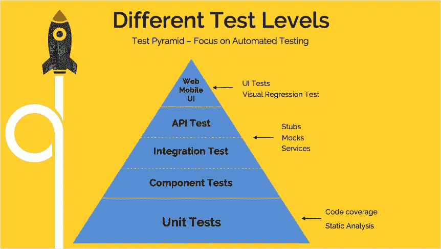
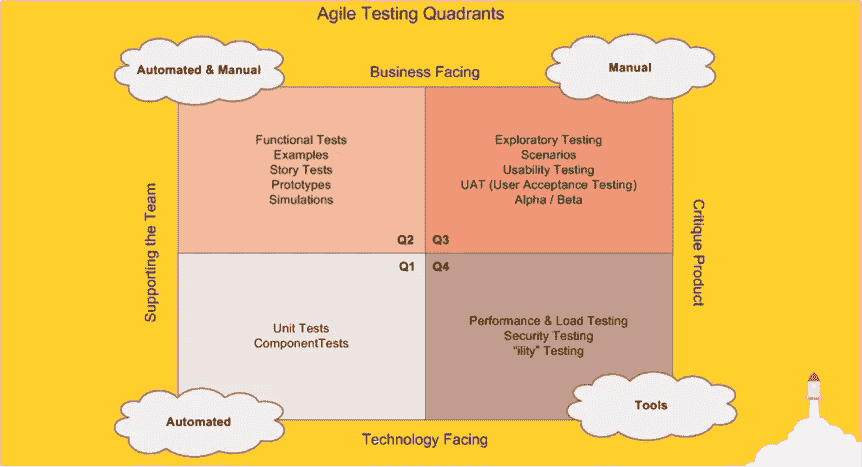
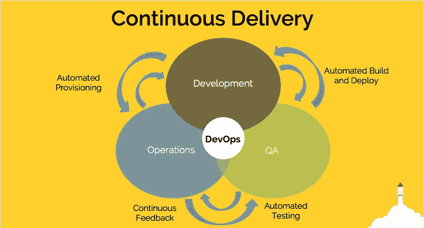
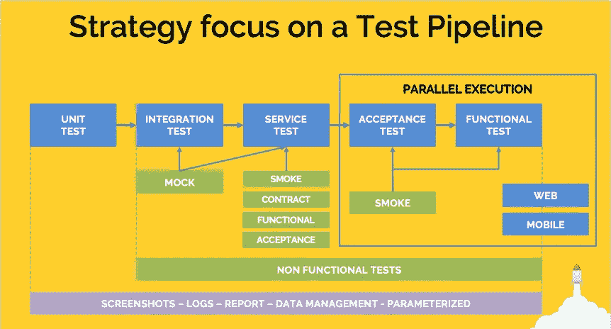
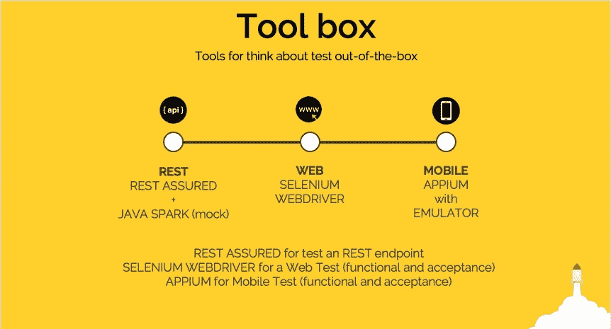
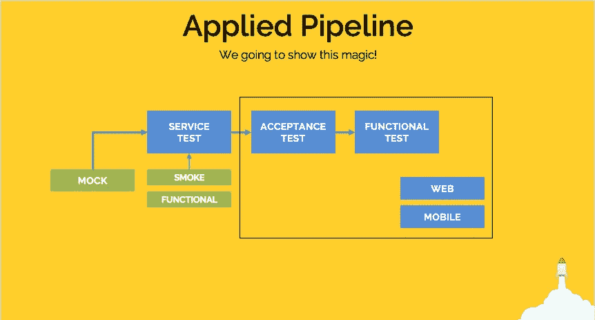

# 信任您的管道:自动测试端到端 Java 应用程序

> 原文：<https://medium.com/hackernoon/trust-your-pipeline-automatically-testing-an-end-to-end-java-application-4a33232180c3>

> **免责声明**
> 
> 这篇文章是我和 [Bruno Souza](https://www.linkedin.com/in/brjavaman/) 在 2017 年 JavaOne 大会上发表的同一篇演讲的一部分。

尽管极其重要，我们在这里并不谈论单元测试和集成测试，假设你已经知道它是什么并且已经应用了它，作为一个关心你的代码质量的开发者。

# **测试自动化金字塔和敏捷测试象限**

创建测试是测试您的应用程序并确保如果出现任何 bug，您将在客户之前发现它的最简单快捷的方法。

目前，我们不能在不谈论测试自动化的情况下谈论测试。测试自动化的应用给团队一个快速的反馈，并持续保持 [*回归测试*](https://en.wikipedia.org/wiki/Regression_testing) 的执行。

我们可以用来加快测试自动化、执行和快速反馈速度的方法是应用 [*测试金字塔*](https://martinfowler.com/bliki/TestPyramid.html) ，它是至少三个层次自动化应用的指南:**单元**、**服务**和 **ui** (用户界面)。

服务层被分成三个部分:*组件测试*、*集成*测试和 *API 测试*。

**单元测试层**是我们应用程序中最重要的一层，因为我们将为我们正在开发的代码创建测试，并保证其按预期工作，即使在未来的维护之后(推荐使用*TDD——测试驱动开发*)。在这一层，我们可以应用*代码覆盖*分析和*静态分析*实践，以加强对可能出现的缺陷的快速反馈。

**服务层** ( *组件*、*集成*和 *API* )如今极其重要，主要关注 API 测试。这里我们应用*模拟*、*存根*和*假货*来提高微服务测试的执行速度。我们还需要独立的测试环境服务器，这可能是最接近生产环境的。

**UI** (用户界面)层也很重要，尤其是从移动测试的角度来看，当客户在应用中遇到错误时，通常会将其删除。这里最重要的技术是 UI 自动化测试和*视觉回归测试*。在 web 部分，我们需要浏览器在不同的浏览器(如 Chrome、Firefox、Safari)中执行相同的测试。我们需要同样的*移动自动化测试* : iOS 和 Android 设备，以确保我们的应用程序在这两个平台上的兼容性。

**敏捷测试象限**，由 [Brian Marick](http://www.exampler.com/old-blog/2003/08/22/#agile-testing-project-2) 创建，由 Lisa Crispin 和 Janet Gregory 在他的书*[*敏捷测试——测试人员和敏捷团队实用指南*](https://www.amazon.com/Agile-Testing-Practical-Guide-Testers/dp/0321534468)*中广泛传播，是一些可以在以活动为中心的测试开发中应用的实践。象限是一个指南:没有必要执行其中所有现有的实践，您可以根据您的环境选择一个或多个。**

# ****连续输送和测试管道****

****

**没有谈到 [***连续交付***](https://continuousdelivery.com/) (CD)就谈不上*DevOps*……没有它，我们甚至谈不上 devo PS 文化。**

**在连续交付中，基础之一是 [*连续测试*](https://continuousdelivery.com/foundations/test-automation/) ，在这里我们必须测试我们开发的所有阶段(流水线),并且将最初的建议应用于单元测试和自动化验收。**

**持续交付支持开发、QA 和运营之间的联合角色。这些角色的循证协作的一个例子是:**

*   **开发+ QA:在不同级别构建、部署和测试自动化**
*   **QA +操作:测试自动化和通过测试执行的持续反馈，以及健全性测试执行**
*   **操作+开发:自动提供任何级别测试所需的机器/容器。**

****

**现在，我们继续关注于测试的管道，测试可以全部或部分应用，即:**

## **单元测试和集成测试**

**我们可以创建 mock/fakes/stub 来移除依赖关系并加速测试执行**

## **ServiceTest:在服务层上(SOAP，REST)**

*   ****Smoke** :小执行子集，保证所有 API 都工作(至少返回不同于 HTTP 404 或 HTTP 500 的状态)**
*   ****契约**:客户(消费者)和 [API](https://hackernoon.com/tagged/api) 之间的协议(测试)集合**
*   ****功能性**:测试想要保证不同业务规则下的操作(快乐路径、悲伤路径和可选流)**
*   ****验收**:评估系统对业务需求的符合性，评估是否可以交付**

## **验收:验收测试**

**侧重于用户视角和端到端测试(e2e)的测试。模拟用户在应用程序上的旅程很重要。**

*   ****冒烟**:主测试套件什么会保证你的业务运行**

## **功能:功能测试**

**根据不同的业务规则(快乐路径、悲伤/消极路径和替代流程)保证操作的测试**

*   **Smoke:快乐路径、悲伤路径和可选流程的主要测试套件**

## ****非功能测试****

**从*集成*到*功能测试*(流水线的末端)我们不得不担心非功能测试。测试的例子是功能性的:性能、负载、安全性等…**

**创建一个完整的自动化测试架构来支持连续的、自动化的、尽可能少维护的运行是非常必要的:**

*   **截图证明每个测试的执行，或者当错误发生时的证据**
*   **用于分析和查看发生的任何错误的日志**
*   **显示关于测试执行的反馈的报告**
*   **测试脚本中敏感数据的数据管理**
*   **参数化经常更改的数据，如 URL、端点等…**

# ****自动化 API、Web 和移动测试工具箱****

****

**为了自动化一个 API、一个网页和一个移动前端，有一些开源的[工具](https://hackernoon.com/tagged/tools)可以帮助你快速方便地构建和运行测试。**

## ****放心****

**[https://github.com/rest-assured/rest-assured](https://github.com/rest-assured/rest-assured)**

**为 API (REST 和 XML)创建自动化测试的工具。使用基于 [*小黄瓜*](https://github.com/cucumber/cucumber/wiki/Gherkin)(*Given-When-Then*)的简单易懂的 DSL。**

**在下面的例子中，可以通过一个本地端点(模拟生产环境)和一个用 Java Spark 创建的模拟端点来查看 API。通过开发 API 固定数据返回来创建模拟 API，可以在执行和验证保护微服务测试的不同方面时提供更高的速度，尤其是关于契约测试。**

**RestAssured test script**

## ****Selenium WebDriver****

**[http://seleniumhq.org](http://seleniumhq.org)**

**它是最著名的网页自动化工具。它还有一个简单的 DSL，并基于自动化的四个步骤:**

*   **导航:访问网页、前进、后退和刷新等操作**
*   **询问:通过 id、名称、CSS 选择器和其他定位器来查找 web 元素的方法**
*   **操作:一种与元素交互的方式，如点击、填充(sendKeys)、清除和获取文本**
*   **同步:等待一些异步动作的方法，比如几秒钟后出现一个元素**

**它是一个 W3C 标准，在模拟真实浏览器的网络浏览器中执行动作。为此，有必要使用[浏览器驱动](http://www.seleniumhq.org/download/)。**

## ****Appium****

**[http://appium.io](http://appium.io)**

**它是一个开源工具，具有相同的 Selenium DSL，但用于 iOS 或 Android 的本地或混合移动设备应用程序的自动化。**

**它支持在仿真器、真实设备或测试实验室(云)上执行，并且与 Selenium Grid 一起，提供了创建内部设备网格的可能性。**

# ****应用管道和 GitHub Repo****

****

**所有项目的代码都可以在资源库中找到:**

** [## eliasnogueira/测试自动化-javaone-2017

### 测试自动化-javaone-2017 -专注于 API 和 UI(移动和 web)测试的管道完整示例。

github.com](https://github.com/eliasnogueira/test-automation-javaone-2017) 

每个管道步骤都有测试套件。**